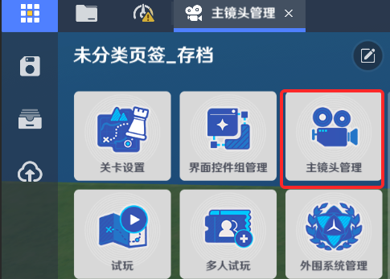
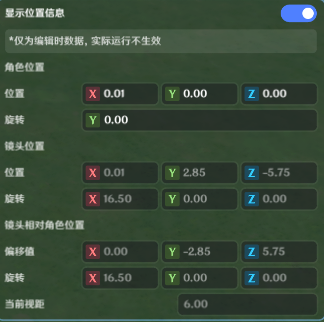
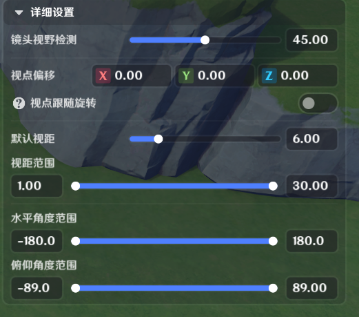

# 主镜头

**URL**: https://act.mihoyo.com/ys/ugc/tutorial/detail/mhfua005zpeg

**爬取时间**: 2026-01-04 08:23:48

---

## 主镜头

**镜头*是游戏中用于呈现玩家视角的工具。它决定了玩家在游戏中看到的画面。

在超限模式中支持创作者(奇匠)通过定义镜头模板的方式来定义镜头的规则，每一个镜头模板都对应一种镜头状态。

# 一、镜头模板的定义

在游玩过程中可以提供给玩家使用的*镜头模板*，都需要在主镜头管理中进行编辑，入口如下图所示：

在游戏运行过程中，每个玩家都会有一个唯一生效的镜头模板：

不同玩家之间生效的镜头模板可能不同，例如联机时玩家A生效模板为“模板1”，同时玩家B生效模板为“模板2”。

运行时可以通过节点图切换某一个具体玩家实体的生效镜头模板，但无法动态修改模板内的参数。

# 二、镜头模板编辑

进入主镜头编辑后，可以看到以下界面，主要分为三个部分：

* 当前预览镜头模板的参数配置
* 场景内镜头位置和人物位置关系预览
* 实际游戏运行时游戏画面预览

# 三、镜头模板参数配置

## 1.模板名称

模板名称：该镜头模板的命名，用于备注该模板在玩法中的定位，同时也被作为节点图操作玩家单位主镜头模板时的引用

## 2.位置信息

镜头与角色的相对位置信息：编辑时的参数，默认折叠，用于显示当前预览界面下，镜头和角色相对位置关系的详细参数，作为编辑时的参考

## 3.镜头基础配置

移动模式：当前版本仅支持镜头跟随单位为角色实体，后续会拓展为支持其他实体单位，例如载具等

模式：区分镜头模板类型的重要参数，模式决定了镜头的主要镜头规则，每种模式下的镜头可微调参数也会有所区别

默认生效目标：镜头模板作为玩家身上的参数，在运行时可以直接修改对应玩家的镜头模板，但初始化时必须依赖玩家的职业进行赋予，该字段可以设置该模板初始应用于哪些职业

## 4.镜头详细设置

根据上述的模式不同，在模板的详细设置里暴露的可调整参数也会有所区别

### (1)经典镜头

经典镜头是和经典模式一致的镜头模板类型，参数置灰，只支持预览并不支持修改，因此不做赘述

### (2)3D背镜头

3D背镜头是一种越肩镜头，镜头位置位于角色的右后方，参考表现如下：

详细设置如下图：

镜头视野检测：视场角，即视锥范围，如下图，修改FOV时会改变白色视锥的范围

视点偏移：镜头看向目标后，在世界坐标系下额外叠加的位置偏移，下图红框内即为看点

视点跟随旋转：镜头是否跟随角色旋转而旋转

默认视距：初始化时，镜头距离看点的距离

视距范围：通过玩家的操作输入可以调整的视距范围

水平角度范围：玩家通过操作输入左右移动镜头时，镜头可被左右旋转的范围，单位为角度

俯仰角度范围：玩家通过操作输入上下移动镜头时，镜头可被上下旋转的范围，单位为角度

### (3)2.5D镜头

用于传统2.5D游戏的镜头，参考表现如下：

详细设置如下图：

忽略镜头碰撞：为“否”时，镜头可能会被场景内的实体碰撞所推挤，产生卡顿或镜头突变等问题。为“是”时，镜头将会忽略其他碰撞，但与之相对的，镜头位置可能会移动到模型的内部，导致表现不佳，因此需要创作者(奇匠)根据实际的玩法场景进行定制

其他属性：在前文已有说明，不再赘述

### (4)第一人称镜头

镜头位于角色的眼睛位置，模仿第一人称观察场景的表现，参考表现如下：

详细设置如下图：

### (5)第三人称镜头

和经典模式的镜头近似，区别在于详细设置支持用户进行修改：

详细设置如下图：

# 四、镜头模板切换

可以使用节点图在运行时动态切换镜头模板，目标单位为*玩家实体的列表*

