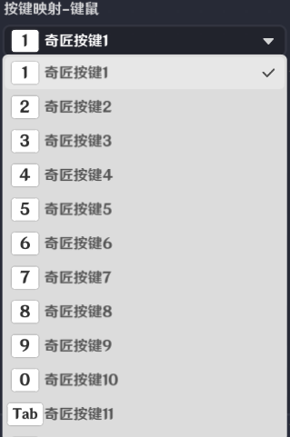

# 一、交互按钮的功能

关卡运行中，点击和外接设备输入，都可以触发该界面控件的交互。

支持玩家进行交互，在选择类型为“交互事件”时，交互后会向节点图发送*界面控件组触发时*事件

# **二、交互按钮的编辑**

*按键映射-键鼠*

提供PC按键供选择，作为输入交互项。选择后会显示在编辑窗口按键下方

*按键映射-手柄*

提供手柄按键供选择，作为输入交互项。选择后会显示在编辑窗口按键下方

16b8-ea84-466c-adb5-62f31e24d220.pdc-0a8cf13a657c.png)85661e4c0f.pngs/31fd0633-9b62-43b1-a213-3f22343d9ff6.png)19e-4a00-9043-6ed90dd0f0fc.png)7328309.png)

*大小*

可以修改交互按钮的大小，大的为64\*64，小的为40.96\*40.96

*类型-10df54eeb763.png)95-3a56-4904-ba14-5484cdeeec3c.png)]()

* 按钮技能

需指定一个技能，对应的图标详情可见角色技能编辑。[技能](./技能_mho81frl.md)

* 交互事件

代表触发后会向节点图发送事件

*按钮图标*

通过操作可以配置按钮的显示图形，并同步显示在编辑窗口。

*按钮冷却时间*

每次使用技能后，需要间隔该配置时间才能再次使用。并且在此期间，该按键图形会置灰

*按钮次数限制*

若开启，则激活显示使用次数的配置及功能

*无次数时隐藏*

若开启，则当配置的玩家自定义变量数值为0时，按键隐藏

*次数*

* 次数限制开启才开放配置。
* 根据不同的玩家，可以配置不同的使用次数，该次数只能读取对应玩家的自定义变量。
* 配置后的默认次数显示在编辑窗口内的按键上。
* 若需要次数变化，需要在节点图中编辑玩家的自定义变量使用情况。当配置的自定义变量变化时，按钮次数显示会同步变化。

* 使用道具

*选择变量*

可以选择玩家自身实体的变量

*无道具时表现*

分为图标置灰、不显示图标、隐藏按钮三种情况

# 三、通过节点图管理交互按钮

**界面控件组触发时**

在关卡运行中，通过按钮界面控件制作的界面控件组，被执行交互操作会发送节点图事件”界面控件组触发时“，此事件只有触发交互的*玩家*节点图可以获取

