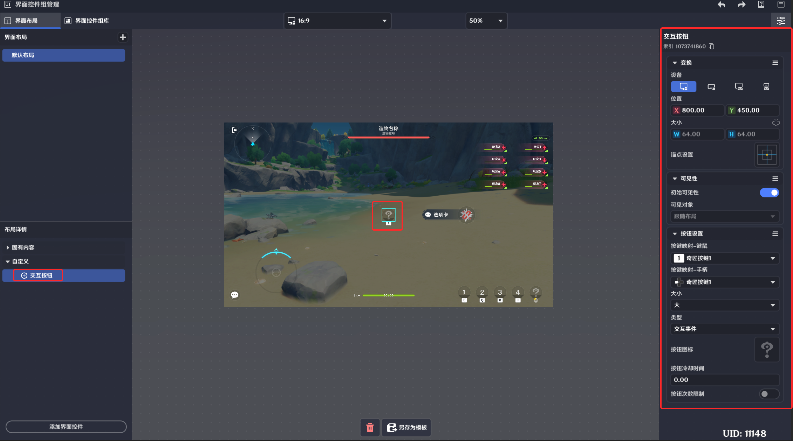
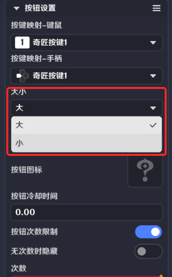
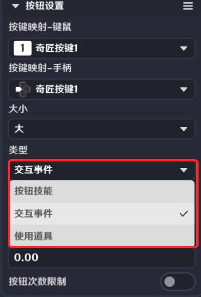
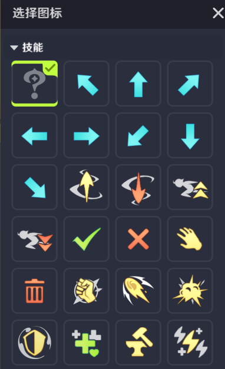
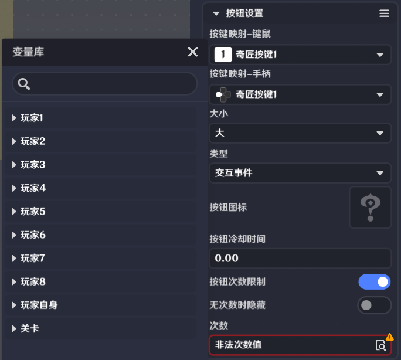
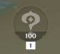
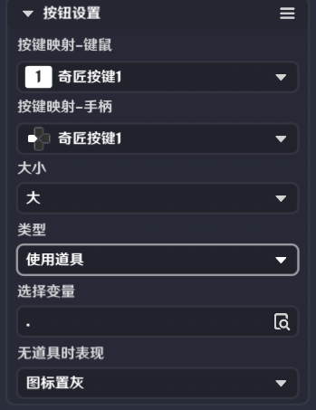
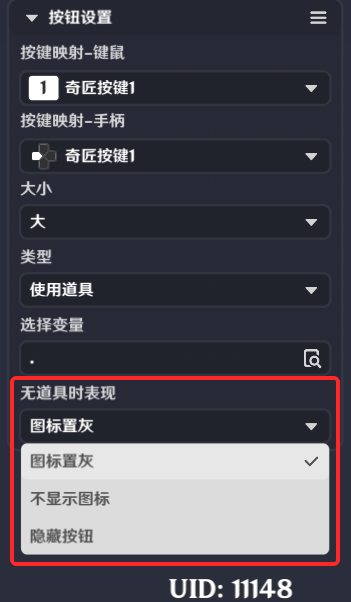

# 交互按钮界面控件

**URL**: https://act.mihoyo.com/ys/ugc/tutorial/detail/mhwkfsitckrw

**爬取时间**: 2026-01-04 08:20:09

---

## 交互按钮界面控件

# 一、交互按钮的功能

关卡运行中，点击和外接设备输入，都可以触发该界面控件的交互。

支持玩家进行交互，在选择类型为“交互事件”时，交互后会向节点图发送*界面控件组触发时*事件

# **二、交互按钮的编辑**

按键映射-键鼠

提供PC按键供选择，作为输入交互项。选择后会显示在编辑窗口按键下方

按键映射-手柄

提供手柄按键供选择，作为输入交互项。选择后会显示在编辑窗口按键下方

大小

可以修改交互按钮的大小，大的为64\*64，小的为40.96\*40.96

类型

* 按钮技能

需指定一个技能，对应的图标和功能编辑详情可见角色技能编辑。技能

* 交互事件

代表触发后会向节点图发送事件

按钮图标

通过操作可以配置按钮的显示图形，并同步显示在编辑窗口。

按钮冷却时间

每次使用技能后，需要间隔该配置时间才能再次使用。并且在此期间，该按键图形会置灰

按钮次数限制* *

若开启，则激活显示使用次数的配置及功能

无次数时隐藏

若开启，则当配置的玩家自定义变量数值为0时，按键隐藏

次数 

* 次数限制开启才开放配置。
* 根据不同的玩家，可以配置不同的使用次数，该次数只能读取对应玩家的自定义变量。
* 配置后的默认次数显示在编辑窗口内的按键上。
* 若需要次数变化，需要在节点图中编辑玩家的自定义变量使用情况。当配置的自定义变量变化时，按钮次数显示会同步变化。

* 使用道具

选择变量

可以选择玩家自身实体的变量

无道具时表现

分为图标置灰、不显示图标、隐藏按钮三种情况

# 三、通过节点图管理交互按钮

**界面控件组触发时**

在关卡运行中，通过按钮界面控件制作的界面控件组，被执行交互操作会发送节点图事件”界面控件组触发时“，此事件只有触发交互的*玩家*节点图可以获取

