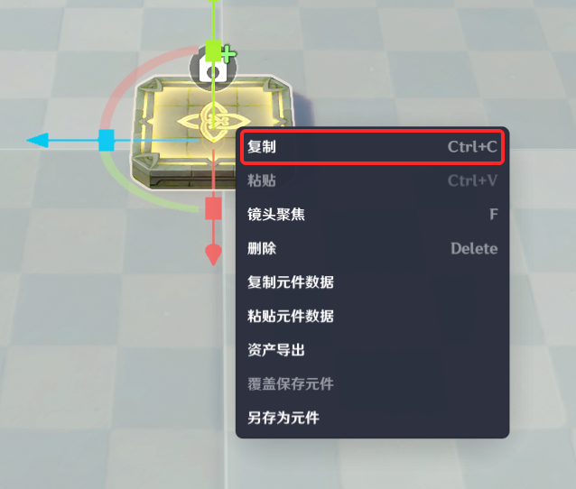
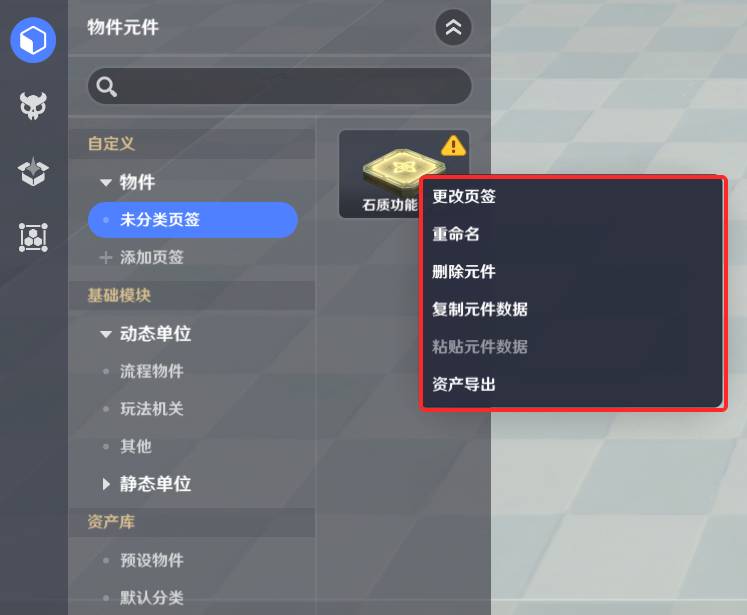
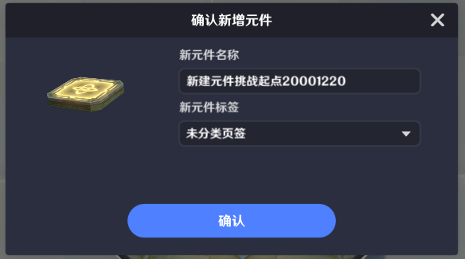
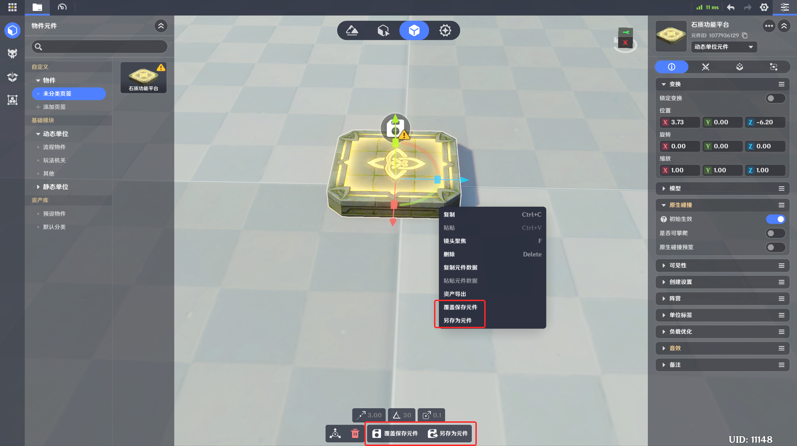
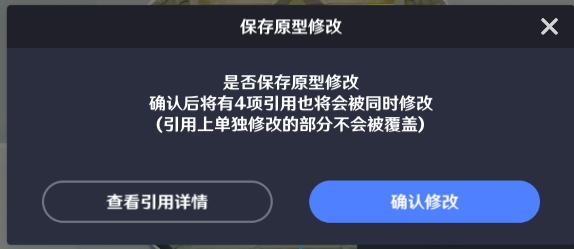
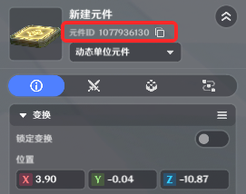
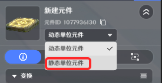

# 元件库

**URL**: https://act.mihoyo.com/ys/ugc/tutorial/detail/mhwp5h9d4h3e

**爬取时间**: 2026-01-04 08:02:05

---

## 元件库

**

# 一、元件库入口

顶部页签栏第三个图标，点击后切换至元件库

# 二、元件库界面样式

* 左侧为元件库资产栏

# 三、资产栏详情

## 1.自定义元件

* 默认包含一个未分类页签
* 点击添加页签可新增自定义页签

## 2.基础模块元件（预制元件）

* 包含动态元件与静态元件
* 动态元件包含：流程物件、玩法机关和其他
* 静态元件包含：树木、植被、地貌等

## 3.资产库

* 根据本地资产显示可导入元件

# 四、元件库使用方式

## 1.创建元件

### (1)资产栏-基础模块页签创建新元件

* 单击资产图标可直接在镜头中央创建元件
* 拖拽资产图标可在鼠标指定位置创建元件

### (2)自定义元件右键菜单复制-粘贴创建新元件

* 右键菜单中复制已创建的自定义元件
* 在空白处右键选择粘贴

### (3)新建的未保存元件样式

* 物件上会挂有一个绿色加号的UI标识

## 2.编辑元件

* 点击需要编辑的元件，右侧打开元件详情页，在详情页内可编辑元件相关的属性、组件、节点图及战斗内容，具体编辑方式同物件编辑
* 资产栏元件右键菜单

* 详情页元件图标菜单

* 修改未保存的元件样式
* 当元件存在新增或内容修改时，对应功能模块的标题上会显示黄色高亮文字，保存后高亮消失

* 当自定义元件存在新增或内容修改时，物件上会挂有一个黄色感叹号的标识，并且左侧资产栏中对应图标也会标记黄色感叹号

* 预制元件有修改时依旧显示为绿色加号

## 3.保存元件

* 新建未保存元件
* 点击底部菜单或右键菜单中的【保存】或【另存为元件】可进行元件保存
* 保存时可进行重命名和页签选择

* 有修改的自定义元件
* 点击底部菜单或右键菜单中的【另存为元件】可进行元件保存
* 点击【另存为元件】可存为一个新元件
* 点击【覆盖保存元件】会在原元件上完成保存
* 注意：覆盖保存时，会对当前物件在实体摆放页签中引用该元件的所有实体进行覆写，在实体摆放页签中实体有额外修改的部分不会被覆写

## 4.使用元件

* 局内使用
* 在资产栏中进行点击或拖出即可根据元件创建对应物件
* 局外使用
* 对于需要使用元件ID的功能，可在详情页的顶部，直接进行元件ID的复制

## 5.元件切换

* 元件编辑中可以实现动态和静态的切换
* 切换时会给出弹窗提示

**