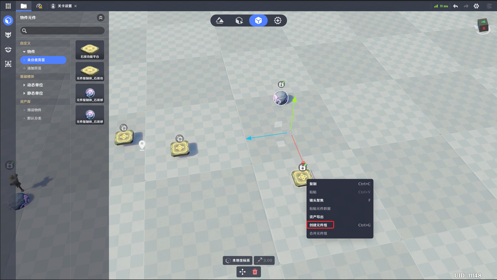

# 一、元件组的功能

元件组可以引用多个元件，其中包含各元件的位置、旋转（相对于元件组中心）等信息。

元件组可以直接创建，也可以在关卡运行中通过节点图创建，效果等同于同时创建多个元件。

元件组可以比较方便的对实体进行布设，改动元件组的位置信息，其内部包含的元件会随之移动

# 二、元件组的编辑

## 1.元件库编辑

在元件库同时选中多个元件，右键即可创建元件组（或合并元件组），元件组中心位置会自动计算确定。

2.实体布设场景编辑

体也可以同时选中多个，右键创建元件组（或合并元件组），元件组中心位置会自动计算确定。

# 三、修改元件组信息

选中元件组后可以调整其中每一个元件相对元件组中心的位置和旋转

如图为包含两个元件的元件组

# 四、节点图创建元件组

通过节点直接创建元件组，效果等同于分别创建其中的元件，

