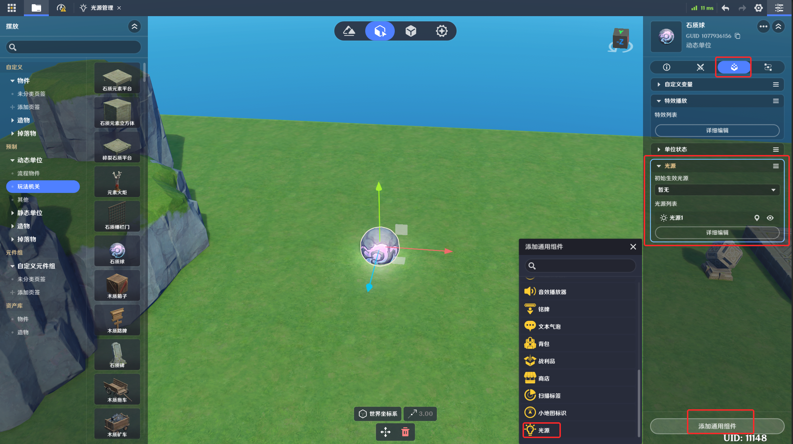
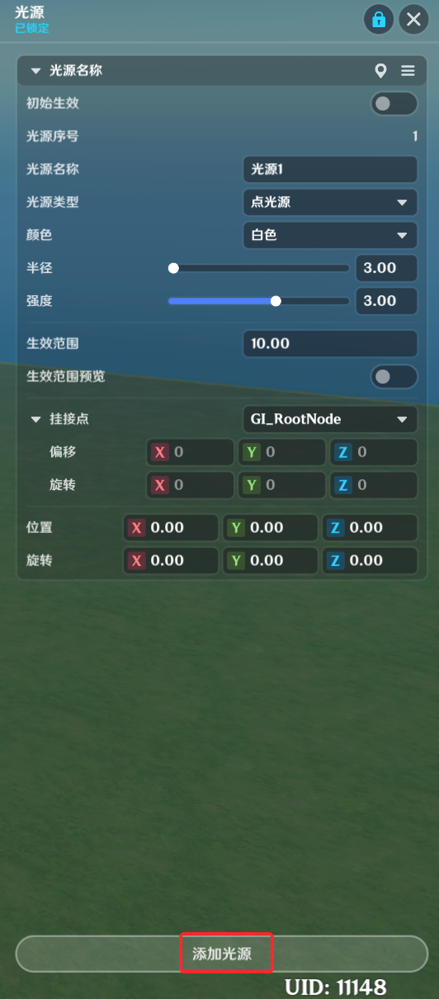
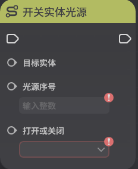

# 光源

**URL**: https://act.mihoyo.com/ys/ugc/tutorial/detail/mhgkan9wgil6

**爬取时间**: 2026-01-04 08:18:00

---

## 光源

# 一、光源组件的功能

光源组件为创作者(奇匠)提供了在实体上挂载光源的功能

光源可以提供最基础的照明功能，也可以利用光源来改变环境

光源组件上同时可生效多个光源

# 二、光源组件的编辑

## **1.添加光源**组件

(1)在实体/元件编辑界面中，打开组件编辑页签

(2)点击下方的“添加通用组件”，选择并点击“光源”，成功添加

(3)点击“详细编辑”，展开编辑页

## **2.光源**组件的设置

每个光源的可配置参数如下：

初始生效：开启后，实体创建时该光源配置也会一同生效

光源序号：用来区分实体上该光源与其它光源，不可修改

光源名称：可自定义修改，用来做备注

光源类型：目前可选点光源、聚光灯两种。

颜色：照射在其他模型上时，模型显现的颜色变化

半径：照射的半径

强度：被照射的模型上，颜色或亮度变化的程度

生效范围：角色进入该范围时，光源才会被加载，可用于性能优化。

生效范围预览：开启时可以在编辑界面预览该光源的生效范围

挂接点：指定该光源跟随的挂接点，默认为根节点

位置、旋转：控制其相对于挂接点的位置、旋转

点击【添加光源】可以添加一个新的光源

# 三、节点图相关

开关实体光源

