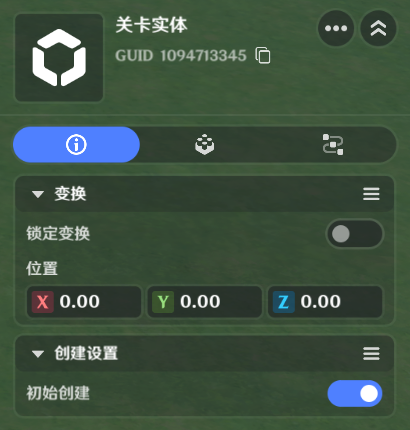
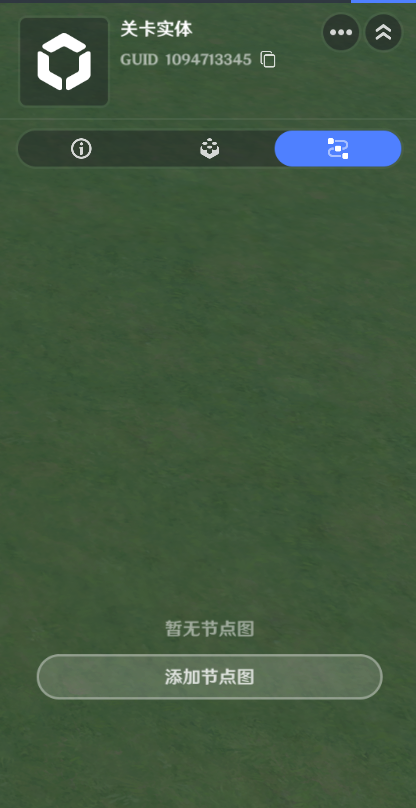

# 关卡

**URL**: https://act.mihoyo.com/ys/ugc/tutorial/detail/mh3pgiraqkiu

**爬取时间**: 2026-01-04 08:06:39

---

## 关卡

**关卡*是一种特殊的实体，被推荐用于承载关卡逻辑

# 一、创建关卡实体

关卡实体在新建一个关卡后会自动创建在场景当中，并且在场景中会用一个特殊图标进行表示

# 二、编辑关卡实体

切换到实体编辑页签

关卡实体的编辑和其他类型的实体类似，但实际可配置的*基础信息*和*组件*会有所区别

## 1.基础信息

基础信息页签，可配置关卡实体的所有可用属性

## 2.通用组件

通用组件页签，可给关卡实体添加通用组件配置

关卡实体的可用组件概览：

[自定义变量](自定义变量_mhso1b9wjica.md)

[全局计时器](全局计时器_mhawd6rl5kpy.md)

## 3.节点图

节点图配置页签，可给关卡实体添加节点图或查看已添加的节点图

# 三、关卡的特性

区别于其他的实体类型，关卡实体拥有以下特性

## **1.可接收特殊事件**

部分特殊事件只有关卡类型的实体可以接收，其中包括：

*物件*和*造物*类型的实体在移除/销毁时，实体本身无法收到对应事件，事件会转发到关卡实体上，

并由关卡实体处理后续的逻辑

## **2.无物理实体**

关卡实体是一个纯逻辑实体

## **3.布设信息不全**

关卡实体只有*位置信息*，没有*旋转、缩放信息*

## **4.生命周期**

关卡实体的生命周期随关卡初始化创建，随关卡销毁而销毁
