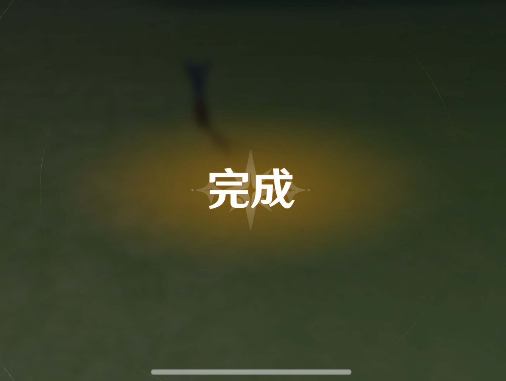
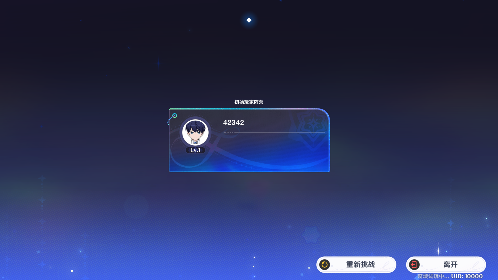
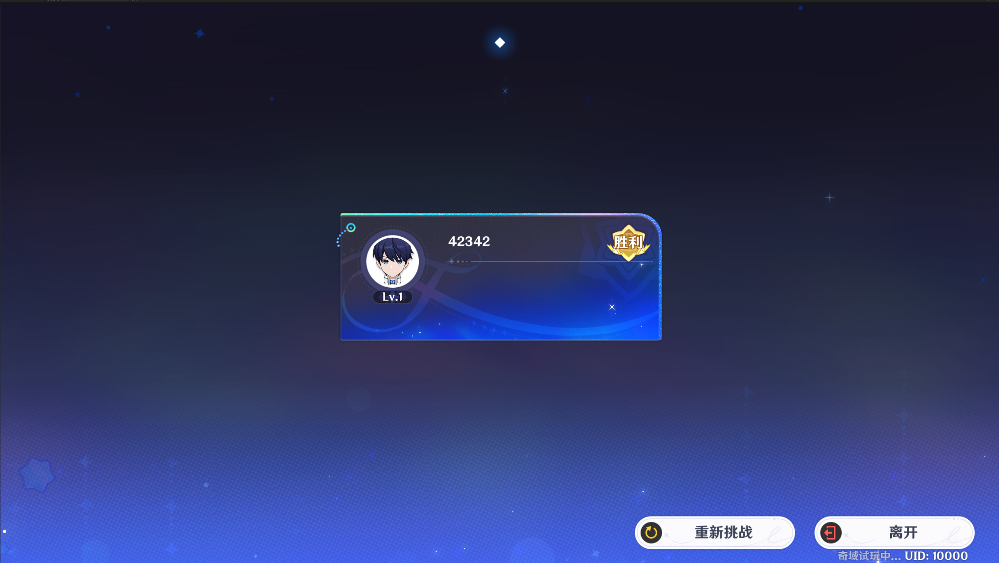
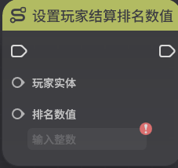
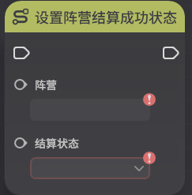

# 关卡结算

**URL**: https://act.mihoyo.com/ys/ugc/tutorial/detail/mhx1du08nhwo

**爬取时间**: 2026-01-04 08:24:46

---

## 关卡结算

# 一、关卡结算的定义

关卡结算是由节点图触发的行为，触发结算后整个关卡将会结束，关卡结算结果将会被传递到外围系统来更新排行榜、竞技段位相关的数据

# 二、关卡结算状态

关卡结算状态需要在游玩过程中动态修改，在调用结算关卡节点后，会按各玩家当前的结算状态进行结算

关卡结算状态是每个玩家的属性，由两个字段构成

逃跑合法性：当逃跑合法性为“否”时，玩家的结算状态都为“逃跑状态”

结算状态：仅当逃跑合法性为“是”，该字段才有意义，有“胜利”，“失败”，“未定”三种状态，作为加段位分的判据

胜利：以该状态结算关卡时，获得对应计分模板的胜利分数

*失败*：以该状态结算关卡时，获得对应计分模板的失败分数

*未定*：玩家默认处于的状态，以该状态结算关卡时，获得对应计分模板的未定分数

# 三、关卡结算表现

关卡结算表现决定了对局会以何种形式进行结算，仅在对局内进行展示，并不会影响到外围系统

从系统菜单点击【关卡设置】，可进入关卡设置界面

在关卡设置界面的结算页签，即可进行关卡结算相关的设置

结算界面类型：决定了关卡结算时的界面显示样式，分为阵营结算和个人结算两种

阵营结算：以阵营为单位进行结算

个人结算：以个人为单位进行结算

启用游戏内排名：启用后，将可以使用排名设置节点，对结算阶段个人/阵营的展示顺序进行编辑

排名数值比较顺序：决定了排名数值映射到实际显示顺序的规则，分为由小到大和由大到小两种

由小到大：排名数值小的显示在上方

由大到小：排名数值大的显示在上方

# 四、以节点图管理关卡结算

* 结算关卡

* 设置玩家结算排名数值

* 设置阵营结算排名数值

* 设置玩家结算成功状态

* 设置阵营结算成功状态

