# 关卡设置

**URL**: https://act.mihoyo.com/ys/ugc/tutorial/detail/mhn9vpia00qc

**爬取时间**: 2026-01-04 08:02:44

---

## 关卡设置

# 一、入口所在位置

点击左上角系统菜单按钮可打开菜单界面

点击【关卡设置】即可进入关卡设置界面，可以用来做一些关卡的整体设置

# 二、具体功能介绍

## 1.基础

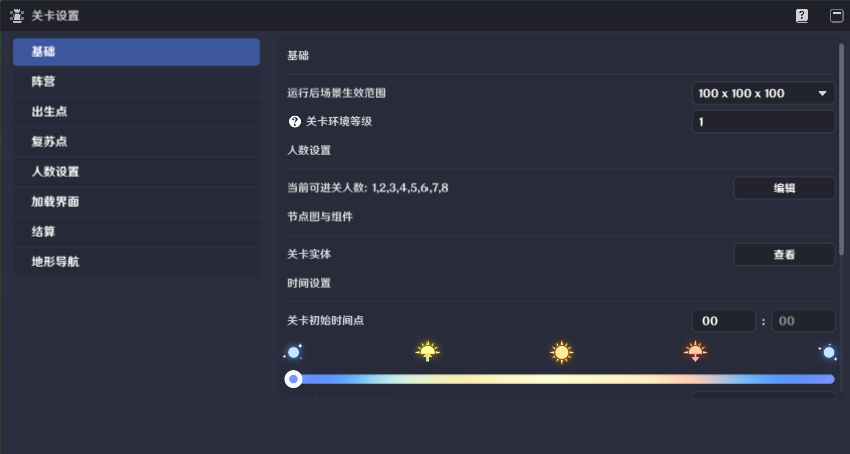

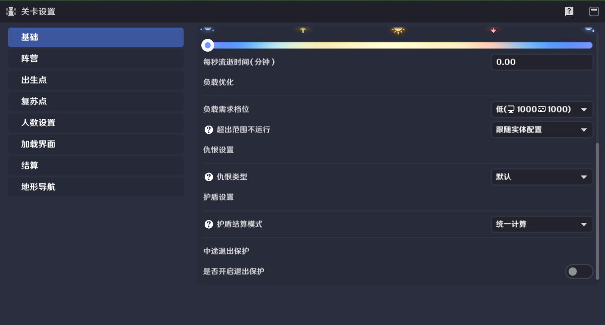

【基础】界面的选项可以用来对关卡做一些基础的设置

### (1)运行后场景生效范围

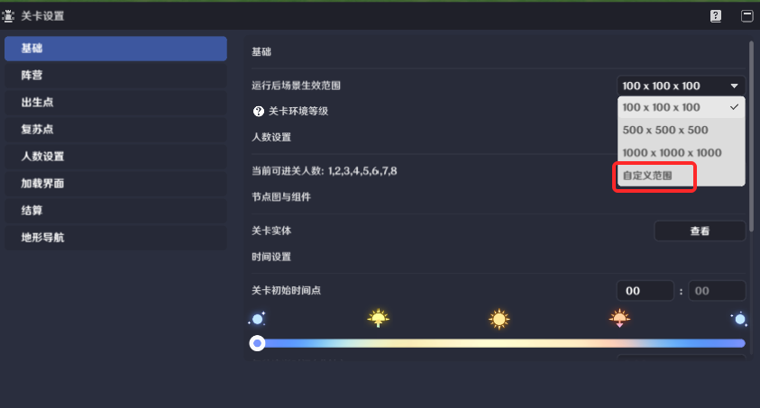

a.可编辑关卡的有效范围，范围外的内容将不会生效

b.在选项中点击自定义范围可自行编辑关卡的生效范围

### (2)关卡环境等级

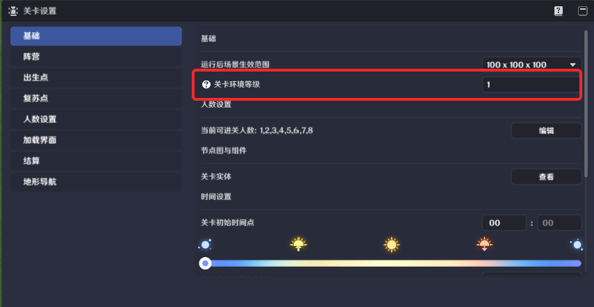

a.环境等级将影响非角色产生的草/雷元素反应的伤害系数，等级越高系数越大

b.相关元素反应包括超载、超导、感电、燃烧、绽放、超绽放、烈绽放、超激化、蔓激化

c.可配置1-120，推荐环境等级与角色等级和造物等级持平

### (3)人数

可跳转至人数设置中，对能够进入该关卡的人数范围进行设置

### (4)关卡实体

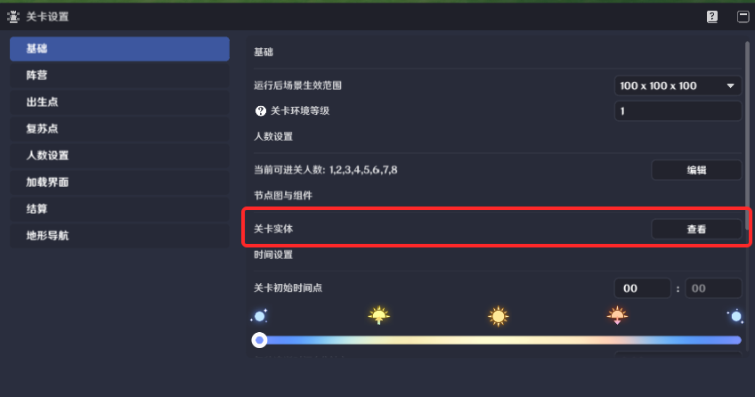

a.关卡创建时一同创建的物件，无法添加或删除，唯一可以监听倒下信息的物件

b.点击【查看】可跳转至场景中关卡实体所在位置，可对关卡实体进行编辑

### (5)时间设置

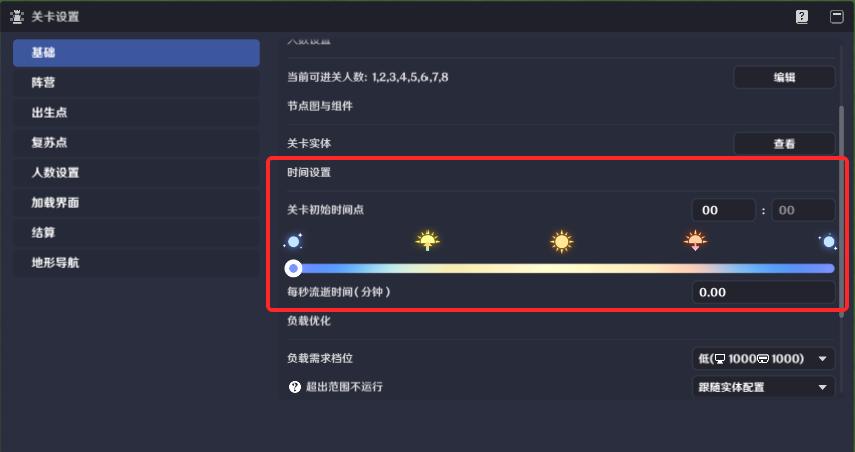

用于设置当前关卡启动运行时的初始时间以及时间的流逝比例，时间会影响环境

流逝比例最大为1秒=60分钟

### (6)负载优化

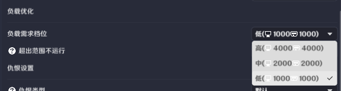

用于决定该存档的负载需求：高负载可能会导致部分设备无法正常游玩

### (7)超出范围不运行

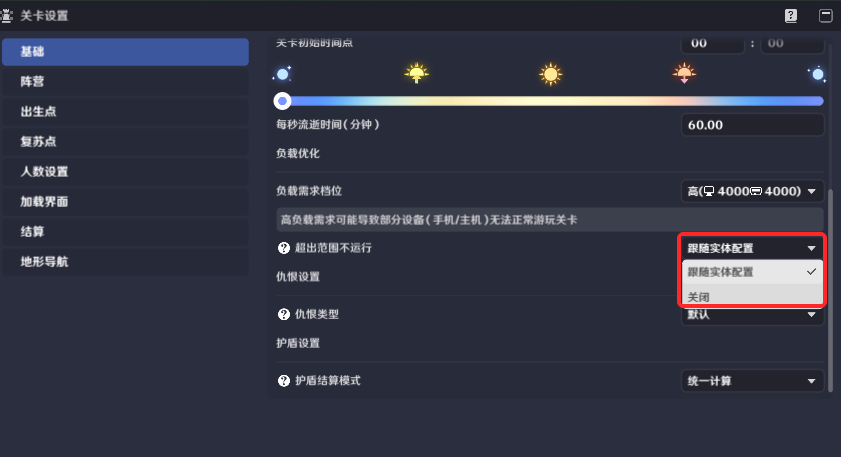

a.关卡运行时，开启【负载优化】的实体超出角色一定范围将不在该角色所属玩家的客户端运行

b.可以在【物件编辑】-【负载优化】中单独控制某个物件是否受其影响

c.详细规则见 负载优化

### (8)仇恨类型

a.默认：遵循经典模式仇恨规则，不可使用节点查询/修改仇恨相关参数

b.自定义：可进行物件、造物、职业、能力单元的仇恨相关设置，可使用节点查询/修改仇恨相关参数

### (9)护盾设置

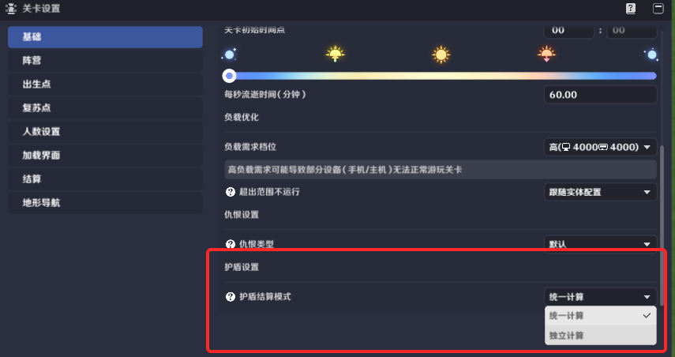

统一计算：伤害将被每个单位状态吸收

独立计算：伤害会由每个单位状态各自计算一次，取吸收最多的一个生效

### (10)中途退出保护

可根据玩法需求配置对应的退出保护

可填入0-60秒，仅在正式游玩中生效

退出保护实际生效时间以关卡生成时间为准

## 2.阵营

用于设置玩家当前所属的阵营，详细规则见 阵营

## 3.出生点

用于设置玩家出生的位置

### (1)是否共享出生点

开启后，准许不同的玩家使用同一个出生点

### (2)出生点名称

该出生点的名称，可自定义修改以便于区分多个出生点

### (3)应用至角色模版

可选择能够使用该出生点的玩家模版

### (4)选择点位

选择在关卡中预设好的预设点，将该点位设置为出生点。预设点相关内容可查看预设点

### (5)添加出生点

可额外添加出生点，新的出生点功能与默认就有的出生点1完全相同

## 4.复苏点

用于设置玩家复苏的位置。复苏点界面默认没有内容，点击【添加复苏点】可以添加一个复苏点1

(1)优先级：优先级高的复苏点会被优先使用，数字越大优先级越高

(2)选择点位：选择在关卡中预设好的预置点，将该点位设置为复苏点

## 5.人数设置

分组的作用：

* 在匹配时，玩家的队伍人数如果超出分组的最大人数上限，则不能进行该关卡的匹配
* 在房间中，玩家必须要达到必要分组的人数才能够开启游戏

一键应用当前阵营数据：点击应用后，将按照阵营的玩家人数划分创建分组

人数类型：决定该分组的玩家数量类型

* *固定人数：分组的人数固定*
* *自定义人数：分组的人数可以浮动*

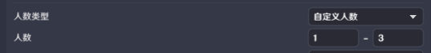

人数：该分组的人数

包含的玩家：配置该分组中的对应ID的玩家

是否为必要分组：关闭后，没有该分组时也能够开始游戏

## 6.加载界面

用于编辑进关时的加载界面的显示内容  
选择加载背景图：可上传一张图片，作为加载界面的背景图

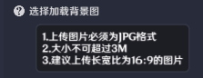

标题与简介：用于加载界面上的文本显示

## 7.结算

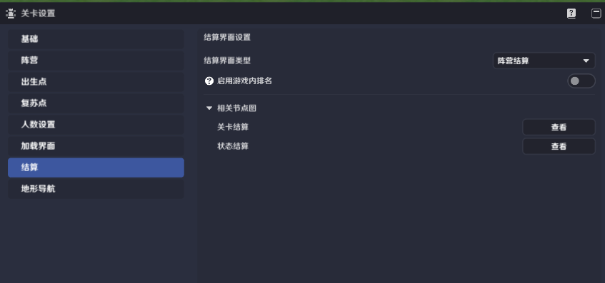

用于设置结算界面的展示

结算界面类型：

* 个人结算：结算界面将以个人成绩展示的排版进行结算
* 阵营结算：结算界面将以阵营成绩展示的排版进行结算

启用游戏内排名：用于显示玩家以个人/阵营结算时，显示的顺序，需要通过节点进行排名数值的设置

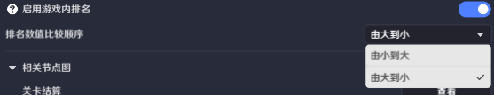

相关节点图：当有节点图配置了和结算相关的节点时，可以通过此处进行快速跳转

## 8.地形导航

寻路网格体影响造物的寻路功能，建议每次修改地形或静态物件摆放后，重新烘焙寻路网格体

若没有造物寻路需求，可以关闭上传开关
