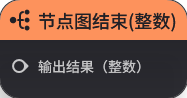

# 其它节点

**URL**: https://act.mihoyo.com/ys/ugc/tutorial/detail/mhor3u09y7u0

**爬取时间**: 2026-01-04 08:38:01

---

## 其它节点

**

## **1.节点图开始**

**节点功能**

技能节点图的开始事件

自定义技能的逻辑，在该节点后进行编辑，会依照节点图执行顺序执行后续节点

**节点参数**

|  |  |  |  |
| --- | --- | --- | --- |
| **参数类型** | **参数名** | **类型** | **说明** |
|  |  |  |  |

## **2.节点图结束(布尔型)**

**节点功能**  
布尔型本地过滤器的结束节点

以布尔型的True或者False作为最终结果，作用于引用的业务

**节点参数**

|  |  |  |  |
| --- | --- | --- | --- |
| **参数类型** | **参数名** | **类型** | **说明** |
| 入参 | 输出结果（布尔型） | 布尔型 |  |

## **3.节点图结束(整数)**

**节点功能**  
整数型本地过滤器的结束节点

以整数数值作为最终结果，作用于引用的业务

**节点参数**

|  |  |  |  |
| --- | --- | --- | --- |
| **参数类型** | **参数名** | **类型** | **说明** |
| 入参 | 输出结果（整型） | 整数 |  |

## 

**