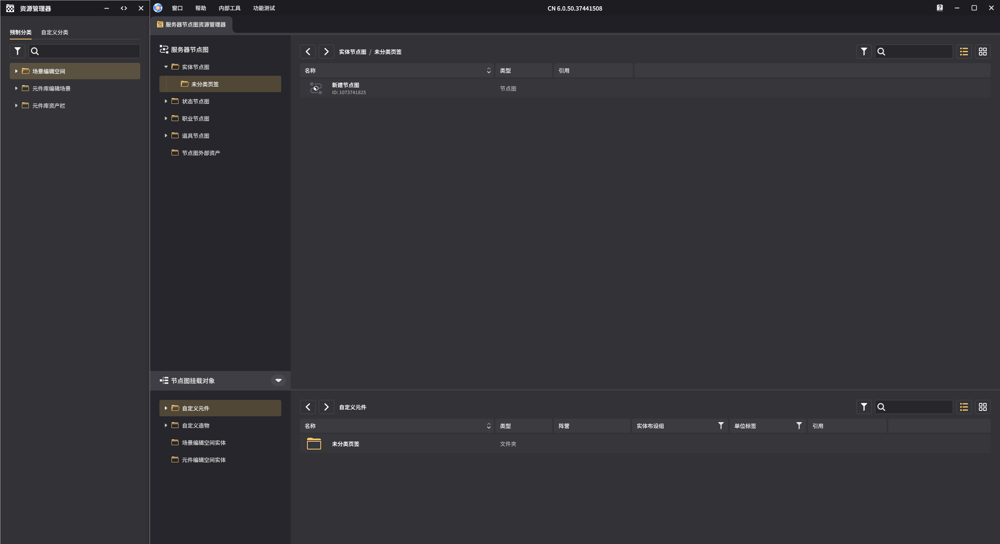
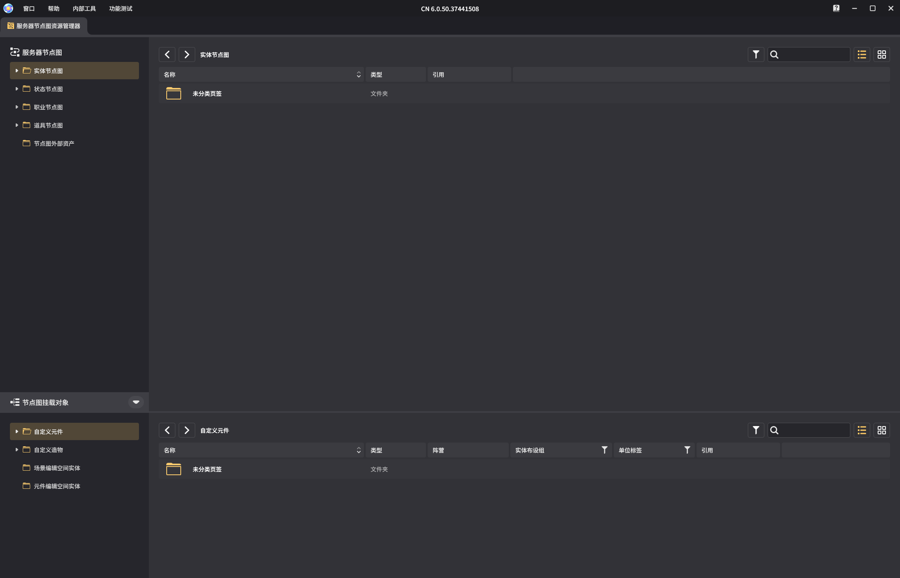
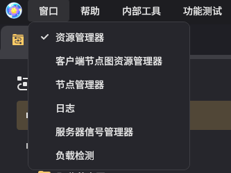
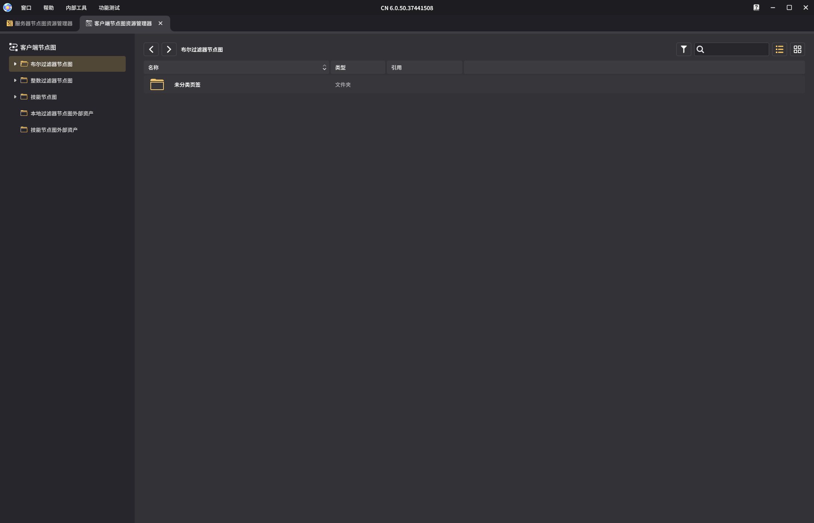
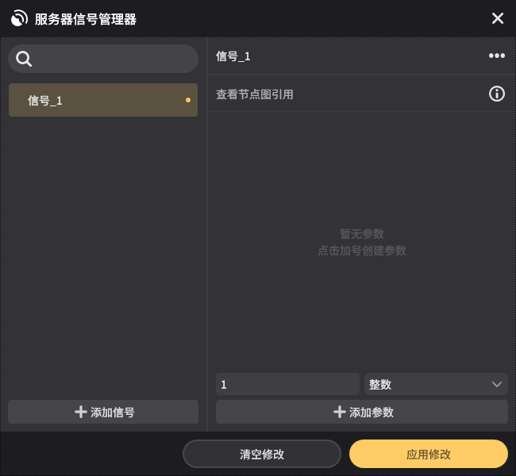

# 千星沙箱

**URL**: https://act.mihoyo.com/ys/ugc/tutorial/detail/mho777i0ga90

**爬取时间**: 2026-01-04 08:03:49

---

## 千星沙箱

**

# 一、千星沙箱入口

* 进入编辑时自动开启
* 手动关闭后可从系统菜单左下方打开千星沙箱

# 二、千星沙箱界面样式

* 左侧独立小窗为资源管理器
* 右侧独立大窗为节点图资源管理器
* 其中，多个页签存在时，可拖拽更换顺序或拉出创建子窗口

# 三、资源管理器

* 用于展示当前局内已存在的实体、元件等资源

# 四、服务器节点图资源管理器

* 千星沙箱开启时默认打开服务器节点图资源管理器
* 上半部分展示当前已创建的所有服务器节点图
* 下半部分展示当前可挂载服务器节点图的资源对象
* 服务器节点图管理器主要功能：
* 创建并管理实体节点图、状态节点图、职业节点图和道具节点图
* 可通过节点图外部资产进行服务器节点图的导入

* 顶部菜单栏中可通过【窗口】子菜单打开：
* 资源管理器
* 客户端节点图资源管理器
* 节点管理器
* 日志
* 服务器信号管理器
* 负载检测

# 五、客户端节点图资源管理器

* 客户端节点图管理器主要功能：
* 创建并管理本地过滤器节点图和技能节点图
* 本地过滤器包含布尔过滤器和整数过滤器两种类型
* 可通过节点图外部资产进行客户端节点图的导入

# 六、节点管理器

* 节点管理器主要功能：
* 查看当前所有的节点分类及节点详情
* 创建并管理复合节点
* 可通过节点外部资产进行复合节点的导入

# 七、日志

* 日志主要功能：
* 可选取指定的节点图，在关卡运行时实时记录该节点图的运行信息

# 八、服务器信号管理器

* 服务器信号主要功能：
* 可自定义信号参数，后续可使用对应的信号节点来实现信号的发送功能

# 九、负载检测

* 负载检测主要功能：
* 可以检测并记录节点图在运行时产生的负载数据

**