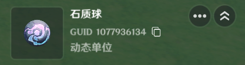
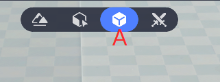
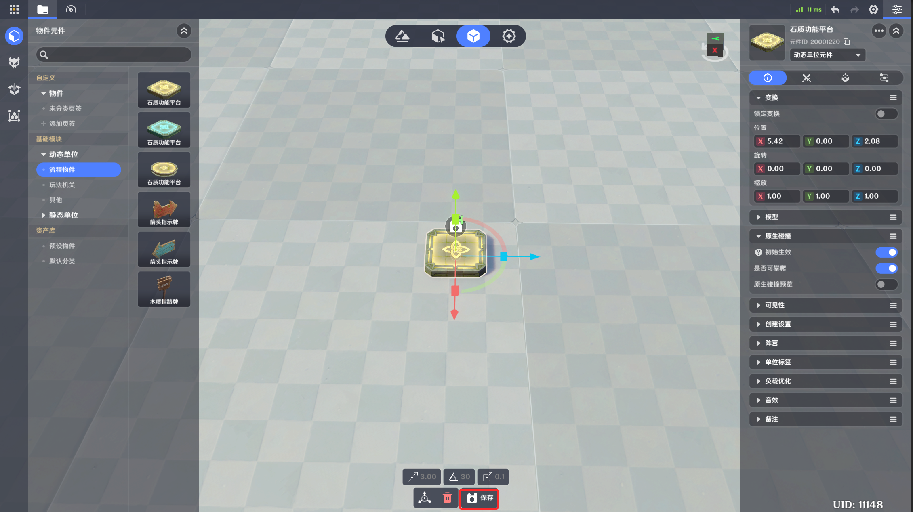
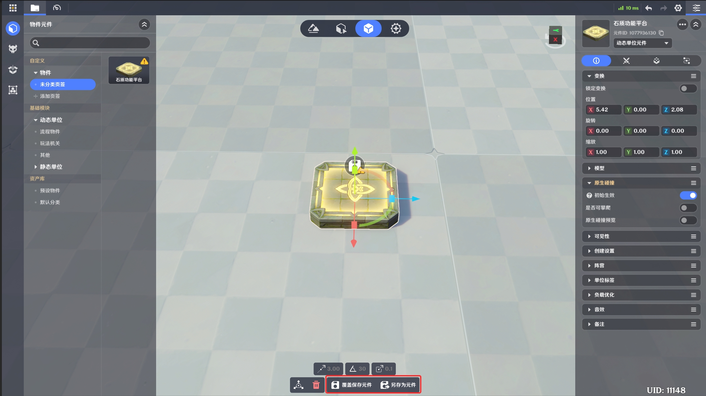

# 单位

**URL**: https://act.mihoyo.com/ys/ugc/tutorial/detail/mh2xoxrop0la

**爬取时间**: 2026-01-04 08:05:08

---

## 单位

**单位*是编辑过程中与关卡运行中集成了数据的个体。

单位在游戏中具象化的体现称为*实体*。

能够承载关卡运行中复杂的逻辑的实体称为*动态实体*，具有更多的*属性*与*组件*，并可以使用*节点图*。只能进行模型布设与设置是否在场的实体则称为*静态实体*。

每个实体必须基于一份已编辑的基础数据进行创建，该基础数据称为*元件*。动态实体与静态实体分别由对应类型的元件所构成。

# 一、基本概念

所有实体都来自一份对应的元件数据，可以直接在编辑阶段创建出明确的实体数据，也可以在运行过程中基于指定*元件*即时创建*实体*。

在实体摆放页签下，将资产栏中的*元件*拖入场景即可创建*可编辑实体*

## 1.实体

实体的本质是一种集成了数据的个体，是单位在游戏中具象化的体现，是承载功能的最小集合在游戏运行时，实体可以作为*变量类型*，进行记录与传递

除*静态实体*外，实体可以编辑额外的特化配置、通用组件与节点图功能

## 2.实体GUID

对于每一个在编辑场景下的可编辑实体(即使是由同一个元件所创建出的)，都有唯一的GUID

GUID是全局唯一标识符，保证了该实体可以通过GUID被精确地标识到

## 3.元件

元件的本质是预设的实体数据

所有可编辑的实体都是由元件创建的

## **4.预制元件与自定义元件**

我们提供了一系列预制的动态、静态与敌人元件

此外，玩家可以基于预制元件进行修改，将其另存为自定义元件

## 5.元件ID

元件均具有全局唯一的元件ID，但仅有动态元件与敌人元件可通过节点图节点来生成运行时实体

# **二、单位的类**型

单位有以下六种类型，更详细的介绍可以点击链接查看

[玩家](玩家_mhctmgi51lpo.md)

[角色](角色_mh3ecor1x5cm.md)

[造物](造物_mhufqo0c0tqw.md)

[物件](物件_mhlh4n9m4i56.md)

[本地投射物](本地投射物_mhciimiw86jg.md)

[关卡](关卡_mh3pgiraqkiu.md)

# 三、实体的编辑与布设

## 1.可编辑实体的命名与标识

在实体摆放的页签可编辑实体具有全局唯一的实体名称与GUID

## **2.运行时实体**的命名与标识

关卡运行时，可以根据可编辑实体的数据生成运行时实体  
或使用节点图通过预设的元件来生成运行时实体

## **3.实体**的编辑

进入实体摆放页签（A）后，侧边栏会展示当前存档中所有的自定义元件（B）与预制元件（C）

* 可以直接从预制元件中拖出元件来创建实体，进行编辑与关卡搭建
* 也可以先行在元件库中制作自定义元件，再将自己制作的自定义元件拖出并创建实体，再进行编辑与关卡搭建

你可以从动态、静态和敌人页签下拖动预制元件/自定义元件到场景进行编辑

但是你不可以通过实体面板切换实体的动静态类型

在点击可编辑实体时，右侧会出现以下页签，其中，静态实体仅可以编辑基础信息面板，想切换到其他面板则会提示无法编辑

## 4.基础信息面板

这里提供了该类型实体所具有的一系列不可删除的基础属性，不同类型的实体所具有的属性信息可能不尽相同，你仅可以在这里对该类型实体所具有的属性进行修改

## 5.特化配置面板

提供了基础战斗属性、仇恨配置、受击盒设置、战斗设置、能力单元等内容，为实体添加战斗相关逻辑

## 6.通用组件面板

[通用组件](通用组件_mhei6orvcbkm.md)是为实体添加功能的重要方法，你可以在此对实体添加、删除与编辑组件来使运行中的实体具有更多功能

部分类型的实体会默认在通用组件面板挂载一些组件，你可以自由的添加、删除与编辑它们

## 7.节点图面板

节点图是一类由创作者(奇匠)自行编写的自定义逻辑，你可以在此面板为实体添加、删除与编辑节点图来使运行中的实体具有更多功能

# 四、元件**的编**辑

选中（A），便可以进入元件库界面  
在元件库里，可以制作自定义元件来协助关卡搭建

进入元件库（A）后，点击状态栏的物件图标（B）进入物件元件面板；点击造物图标（C）进入造物元件面板；点击掉落物图标（D）进入掉落物面板；点击元件组图标（E）进入元件组面板你可以依照自身习惯建立管理页签，以便于对制作的元件进行管理

你可以从动态、静态页签（F）下拖动预制元件到场景进行编辑

## 1.命名与标识

元件在试图保存时，需要具有全局唯一的元件名称（A）

元件在被保存后，会生成全局唯一的元件ID（B）

可以通过下拉菜单来修改元件为动态元件或静态元件（C）

元件提供了四个页签来添加功能（D），从左至右依次为

## 2.基础信息面板

这里提供了该类型元件所具有的一系列不可删除的属性信息，不同类型的元件所具有的属性信息可能不尽相同，你仅可以在这里对该类型元件所具有的属性进行修改

## 3.特化配置面板

通过提供基础战斗属性、仇恨配置、受击盒设置、战斗设置、能力单元等内容，为元件添加战斗相关逻辑

## 4.通用组件面板

[通用组件](通用组件_mhei6orvcbkm.md)是为元件添加功能的重要方法，你可以在此对元件添加、删除与编辑组件来使元件具有更多功能

部分类型的元件会默认在通用组件面板挂载一些组件，你可以自由的添加、删除与编辑它们

## 5.节点图面板

节点图是一类由创作者(奇匠)自行编写的自定义逻辑，你可以在此面板为元件添加、删除与编辑节点图来使元件具有更多功能

## 6.保存元件

在完成对预制元件的修改后，可以点击屏幕底部的保存按钮来将元件存储为自定义元件并放入指定的页签下

如果修改的是自定义元件，则可以点击覆盖保存元件来更新原本的自定义元件，或通过点击另存为元件来保存为一个新的自定义元件

* 元件均可以在实体摆放页签下，通过拖动到场景的方式来创建可编辑实体
* 通过节点图节点【创建元件】。可以在运行时创建动态实体或敌人实体

动态元件与静态元件均可以在实体摆放页签拖入场景成为可编辑实体，之后在运行时创建运行时实体

特别地，动态物件元件与造物元件可以通过节点图节点【创建元件】，直接在运行时由元件创建运行时实体

在大多数情况下，在摆放在场景中可编辑的对象被称作可编辑实体  
他们是通过拖动元件到实体摆放页签下的场景的方式，由元件创建的

* 在将元件拖入场景，并成功由元件创建实体后，对实体的改动将完全与创建其的元件无关

# 五、临时实体的创建

通过节点图节点【创建元件】，直接在运行时由元件创建运行时实体  
这样的实体称为临时实体，临时实体没有基于编辑时的GUID，此外与普通实体一样

# 六、静态实体的概念与布设

*静态实体*是一种无法编辑额外的属性、组件与节点图功能的实体，它无法供玩家在运行时获取，仅仅用于装饰与场景布设

静态实体无法通过节点图节点【创建元件】来创建临时的静态实体，仅仅可通过制作静态元件后，通过拖动元件到实体摆放页签下的场景的方式，由元件创建
