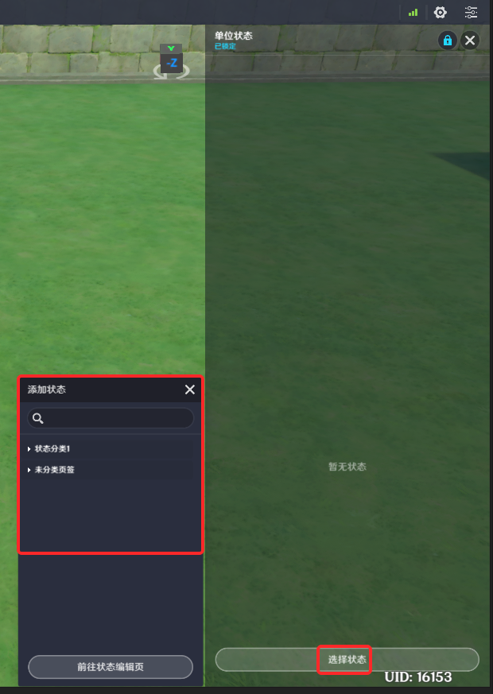

# 一、单位状态组件的功能

单位状态组件是一个用于配置实体创建时，默认携带[单位状态](./单位状态_mh6rh59i.md)的组件

例如：在角色实体上配置默认的【移动速度提高】单位状态，可以使角色在创建后即提高移动速度；在某个机关上配置默认的【挂载特效】单位状态，可以使这个机关在创建后就带着某个持续特效

单位状态组件上同时可生效多个单位状态

# 二、单位状态组件的编辑

**步骤1**：添加单位状态组件

1、切换到实体或元件的组件页签

2、找到或新增一个单位状态组件

单位状态组件是所有单位的默认挂载组件（即实体创建时会默认挂载），因此对于新建的实体或元件，可以在组件页签直接找到单位状态组件

如果不存在，可以通过添加通用组件按钮新增一个单位状态组件

**步骤2**：新增单位状态

在单位状态的详情页面，可以点击【选择状态】来新增一个单位状态配置

309.png)

在弹出的页签中，可以查询到一些预制的单位状态，以及创作者(奇匠)自己配置的单位状态

**步骤3**：配置默认单位状态

选择特定状态后，可以配置默认的单位状态，并为其配置*初始层数*

