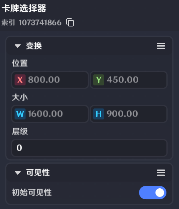
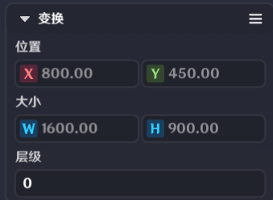
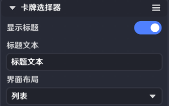
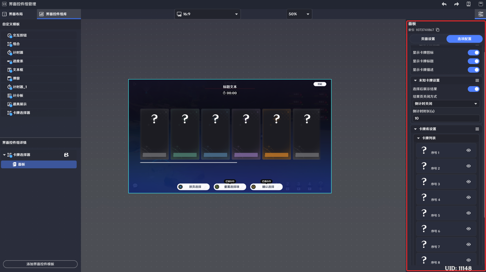
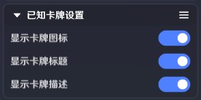
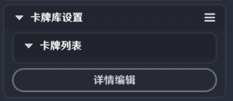
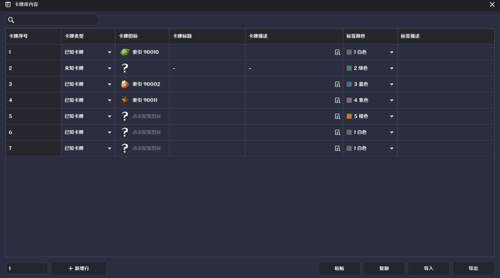
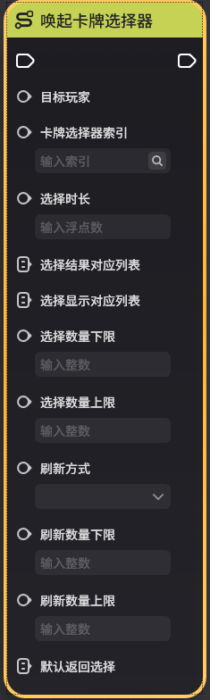
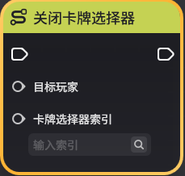
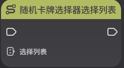

# 卡牌选择器界面控件

**URL**: https://act.mihoyo.com/ys/ugc/tutorial/detail/mh2teu0bmfbc

**爬取时间**: 2026-01-04 08:22:07

---

## 卡牌选择器界面控件

*卡牌选择器提供编辑简单的决策交互界面功能

支持对可决策内容进行编辑，包括决策时间、决策项的表现、决策的交互方式等

# **一、卡牌选择器**的功能

关卡运行中，可通过默认配置/节点图唤起卡牌选择器

支持玩家进行交互，并在超时/交互后向节点图发送*决策弹窗完成事件*

# **二、卡牌选择器的编**辑

## **1.添加卡牌选择器**

* *在**界面控件组编辑窗口**，添加界面控件模板-卡牌选择器*
* 卡牌选择器默认为一个界面控件组

## **2.界面配**置 - 卡牌选择器

是卡牌选择器的整体外显和使用规则配置处，支持玩家定义卡牌选择器的外显风格

### (1)可见性

|  |  |
| --- | --- |
| 配置参数 | 说明 |
| 索引 | 用于唤起卡牌选择器节点的入参 |
| 初始可见 | 若不勾选，则界面控件激活后不可见  支持通过节点图-*修改界面控件组状态*调整该参数 |

### (2)变换

|  |  |
| --- | --- |
| 配置参数 | 说明 |
| 位置 | 支持手写输入界面控件位置  也支持通过编辑界面拖动该界面控件，进行调整 |
| \大小 | 不支持配置 |
| 层级 | 数字越大显示层级越高 |

## **3.界面配**置 - 决策面板

### (1)页面设置

#### a.可见性

#### b.卡牌选择器

|  |  |  |
| --- | --- | --- |
| 配置参数 | | 说明 |
| 显示标题 | | 勾选则当前卡牌选择器有最上方标题，并且可编辑 |
| 标题文本 | | 支持编辑显示标题 |
| 界面布局 | 枚举两种样式供选择 | |
| 列表 |  |
| 网格 |  |

#### **c.显示已选择数量**

|  |  |
| --- | --- |
| 配置参数 | 说明 |
| 显示已选择数量 | 是否在卡牌选择器界面上显示当前已经选择个数 |

#### **d.显示可重置次数**

|  |  |
| --- | --- |
| 配置参数 | 说明 |
| 显示可重置次数 | 是否在卡牌选择器界面上显示选择项可重置的下限和上限个数 |

#### **e.时间显示**

|  |  |
| --- | --- |
| 配置参数 | 说明 |
| 显示剩余时间(s) | 若勾选，则倒计时时间结束时，自动关闭卡牌选择器，无需手动关闭  若倒计时时间结束前，玩家已完成交互，则后续界面是否留存遵从决策完成样式和决策完成样式停留时长 |
| 结束前预警时间(s) | 倒计时剩余时间达到配置时间时，会在时间显示界面空间上，做红色闪烁提示表现 |

#### **f.其他设**置

|  |  |
| --- | --- |
| 配置参数 | 说明 |
| 单人游玩时暂停游戏 | 若勾选则当关卡为单人关卡时，进行选择的时候会暂停游戏 |
| 控件可收起 | 若勾选，则卡牌选择器支持主动缩起  可选择暂不处理，后续处理或直到超时 |
| 可放弃选择 | 若勾选，则卡牌选择器支持主动关闭，卡牌选择器会增加关闭界面控件并支持交互  若选择关闭，则触发节点图的 决策完成-主动关闭事件 |

### (2)选项配置

#### **a.已知卡牌设置**

|  |  |
| --- | --- |
| 配置参数 | 说明 |
| 显示卡牌图标 | 外显卡牌是否包含图标，若包含，则支持指定设置中配置其图标 |
| 显示卡牌标题 | 外显卡牌是否显示标题，若包含，则支持指定设置中配置其标题 |
| 显示卡牌描述 | 外显卡牌是否显示描述，若包含，则支持指定设置中配置其描述 |

#### **b.未知卡牌设置**

|  |  |  |
| --- | --- | --- |
| 配置参数 | 说明 | |
| 选择后展示结果 | 在决策完成后，是否将选定决策项播放动效，切换显示其实际返回值 | |
| 结果页关闭方式 | 倒计时关闭 | 需要额外配置**倒计时时长(s)** |
| 手动关闭 | 需要主动关闭弹窗作为结束 |
| 倒计时时长(s) | 决策完成后，经过配置时间以后，卡牌选择器会主动关闭 | |

#### **c.卡牌库设置**

通过详情编辑，配置卡牌显示

|  |  |  |
| --- | --- | --- |
| 配置参数 | 说明 | |
| 卡牌序号 | 用于在节点图唤起卡牌选择器时，作为卡牌显示调用  从1开始按顺序递增，不可修改 | |
| 卡牌类型 | 已知卡牌 | 提供明确可配置图标 |
| 未知卡牌 | 仅提供问号图标，推荐搭配**选择后展示结果**及**倒计时关闭**一同使用 |
| 卡牌图标 | 综合设置中开启图标配置，才会有该配置 | |
| 卡牌标题 | 文本配置 | |
| 卡牌描述 | 文本配置 | |
| 标签颜色 | 文本颜色 | |
| 标签描述 | 仅创作者(奇匠)自己可见的记录性质文本 | |

# **三、通过节点图管理卡牌选择器**

* **唤起卡牌选择器**

* **关闭卡牌选择器**

* **卡牌选择器完成时**

* **随机卡牌选择器选择列表**

