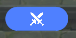

# 一、受击盒是什么

*受击盒组件*是一种用来执行攻击命中检测的*组件*，它可以

* 在组件内定义的*触发区域*碰到其他实体的攻击时，向节点图发送受击事件

受击盒组件一般的用法是作为攻击事件的接收方，通过受击盒组件来判定攻击的命中，并在受攻击方的节点图中处理命中后执行的事件（例如：造成伤害、播放特效等）

# 二、受击盒的编辑

在*实体/元件*的特化配置页签

默认具有一个不可删除的受击盒组件

点击详情进入编辑

在受击盒设置下允许存在多个受击触发器，创作者(奇匠)可以点击A来添加受击触发器的数量

|  |  |
| --- | --- |
| **参数** | **功能** |
| *初始生效* | 组件通用参数，用于设置组件初始是否生效 |

对于每一个独立的受击触发器，创作者(奇匠)可以配置其初始是否生效，可以通过点击B来为该受击触发器添加受击触发区域

* 多个受击触发区之间会以并集相互组合

创作者(奇匠)可以配置*触发区形状*，对于不同形状的触发区域，可配置的参数也不尽相同

* 长方体：可配置中心偏移、旋转偏移与绝对缩放
* 球体：可配置中心
* 胶囊体：可配置中心偏移、旋转偏移、胶囊半径与高度

# 三、受击盒组件的运行

**【节点图节点】受到攻击时**

