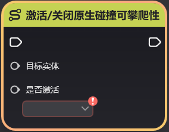

# 变换原生碰撞可见性和创建设置

**URL**: https://act.mihoyo.com/ys/ugc/tutorial/detail/mhuqbn9yn5bu

**爬取时间**: 2026-01-04 08:07:17

---

## 变换原生碰撞可见性和创建设置

# 一、变换

## 1.变换的含义

描述单位在场景中的几何信息，一般包含位置、旋转与缩放

位置：在世界坐标系下的位置

旋转：在世界坐标系下的旋转

缩放：物件被放大的倍率

锁定变换：编辑时属性，如果该属性为“开启”则无法修改实体的变换信息

## 2.节点图相关

可通过节点图查询获取位置信息

# 二、原生碰撞

## 1.原生碰撞的含义

原生碰撞指物件的基础碰撞，相比于额外碰撞组件所添加的碰撞，更加精细贴合模型。

相对的，原生碰撞作为*基础信息*，其形状无法被修改，玩家仅能控制碰撞的初始生效和是否可攀爬开关。

初始生效：单位被初始化时，原生碰撞是否生效

是否可攀爬：原生碰撞是否可以被角色攀爬，同时要求角色本身必须具有攀爬能力

原生碰撞预览：编辑时的功能，如果勾选即可在编辑界面预览到碰撞的外形，见上图

## 2.节点图相关

修改碰撞开关

修改碰撞可攀爬性

# 三、可见性

## 1.可见性的含义

该*基础信息*描述了运行时*实体*的模型是否对玩家可见。仅影响模型，不影响碰撞，触发器，节点图等其他逻辑

推荐制作一些隐藏实体相关的功能

## 2.节点图相关

# 四、创建设置

## 1.创建设置的含义

指当*实体*被布设在场上后，关卡初始化时，是否创建。如果该开关为“关闭”，则需要后续通过节点图动态创建。

## 2.节点图相关

当实体被销毁或移除后，也可以使用该节点再次创建

