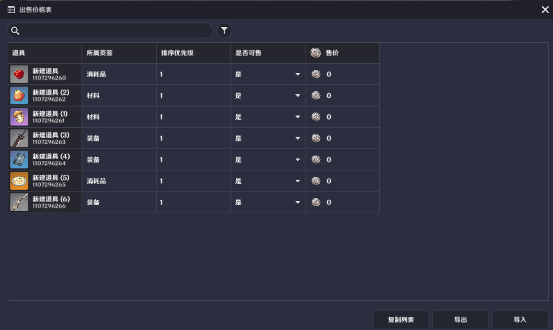
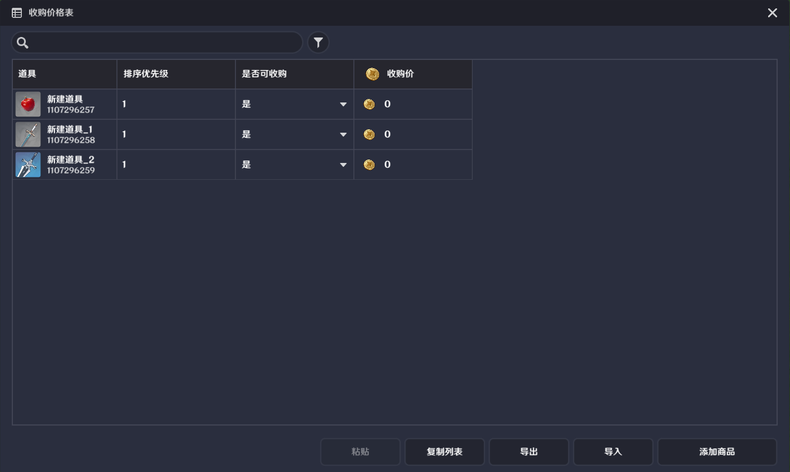

# 商店

**URL**: https://act.mihoyo.com/ys/ugc/tutorial/detail/mhi9s7isvp50

**爬取时间**: 2026-01-04 08:26:28

---

## 商店

# 一、商店的定义

商店是一种提供虚拟物品交易的模块，以组件的形式挂接在实体上。

创作者(奇匠)可以自定义一个商店可交易的虚拟物品品类（支持道具、装备、货币），并配置对应的出售和购入价格，在游戏运行时，玩家可以通过交互商店界面进行实际的买入卖出行为

# 二、商店的类型

商店分为两种基础类型：

自定义商品商店：该类商店可以脱离商店持有者的背包信息，自由配置一份商店模板，购买者将与模板数据进行交易。不会影响到商店持有者背包的实际数据

自身背包商店：发生购买行为时购买者和商店持有者会实际进行背包内虚拟物品的交换，商店内无法出售持有者未拥有的虚拟物品

# 三、商店的编辑

商店模板是一份完整的商店信息配置，打开系统菜单，在下图位置点击【商店模板管理】即可打开商店模板编辑界面

## 1.基础设置

打开商店配置界面，点击“新建商店模板”即可添加并编辑模板

商店名称：创作者(奇匠)编辑时定义的商店名称，运行时无意义

配置ID：商店模板的唯一标识，被商店组件进行引用

## 2.显示设置

该部分定义了商店界面的外显信息

开启商店时同时打开背包：功能开启时，当玩家打开商店界面时，会同时打开背包界面商品页签类型：决定该商店的页签分类方式

无页签：没有页签配置，所有虚拟物品都在一个页签下

默认页签：会按道具的预制类型进行默认分类

自定义页签：由创作者(奇匠)自行进行页签分类的配置

新增页签：点击即可新增一个自定义页签，如果使用自定义页签，则可在后续配置商店出售表时，重定义物品的页签

## 3.出售设置

商品来源：即上文描述的商店类型，分为自身背包和自定义列表

自身背包：即出售的虚拟物品都来自于商店持有者的背包，只可重新定义每类道具的售价，不允许出售背包内没有的虚拟物品

出售范围：分为全部道具和部分道具，其决定了出售设置表初始化时，是否会默认添加创作者(奇匠)定义的全部的道具

自定义列表：可以自由定义出售商品类型和数量，其作为一个数据模板存在，并不会对商店持有者的背包数据产生影响

售价设置：定义该商店模板的出售价格表

当商品来源为为自身背包时，表结构如下图所示：

道具：所有可被出售的道具列表

所属页签：该道具在商店购买界面里会被归类到哪个页签下，在使用自定义页签时，创作者(奇匠)可以自己配置每个道具所属的页签

排序优先级：定义了商品在商店界面内的排序，优先级越高的商品越靠前

是否可售：为"是"该道具才会出现在交易界面内，可在运行时动态修改以达到解禁新商品的效果

售价：在进行交易行为时，买方购买一个该道具需要的货币量

为自定义商品时，表结构如下图所示：

大部分字段和背包商品出售表一致，这里介绍有差异的部分

商品序号：在用节点图动态修改出售表时，序号用于识别要修改的具体条目，因为在模板商店内，可能出现多个相同道具的情况，此时可以根据它们不同的商品序号来定位到具体要修改的条目

是否限量：若为“否”，则可以无限购买。若为“是”，则可以定义该商店内总共可出售的该道具数量

## 4.收购设置

收购设置定义了交易过程中，玩家可以卖给商店的道具种类和价格

收购范围：定义了商店可收购的道具种类

不收购：无法进行卖出，收购表为空

全部道具：收购表内包含创作者(奇匠)全局定义的所有道具类型

部分道具：创作者(奇匠)在收购表里自定义可收购哪些道具

收购价格设置：点击编辑按钮即可进入价格表编辑

道具：所有可被收购的道具列表排序优先级：定义了商品在商店界面内的排序，优先级越高的商品越靠前

是否可收购：为"是"该道具才可以卖给商店，可在游戏运行时动态修改

收购价：在进行交易行为时，商店收购一个该道具会返还的货币量

# 四、商店的运行时实例

在游戏运行时，商店模板被[商店组件](商店组件_mho6gviqhsqs.md)引用并实例化

