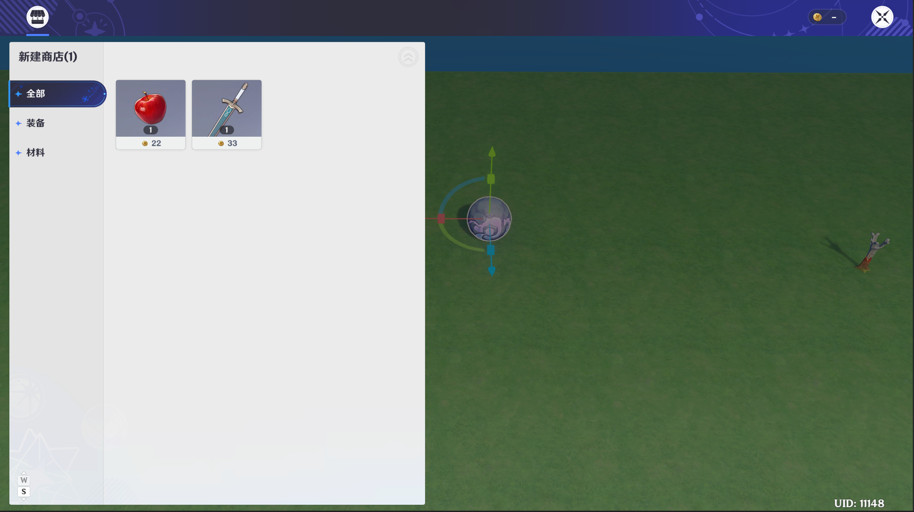
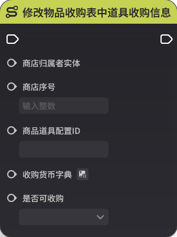
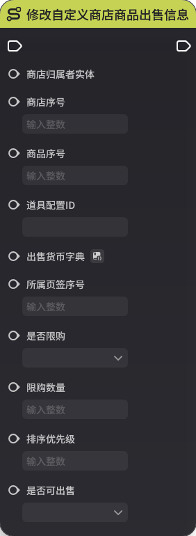
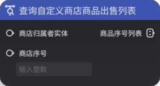

# 商店组件

**URL**: https://act.mihoyo.com/ys/ugc/tutorial/detail/mho6gviqhsqs

**爬取时间**: 2026-01-04 08:16:53

---

## 商店组件

# 一、商店组件的功能

[商店](商店_mhi9s7isvp50.md)内的模板配置由商店组件进行引用，并在运行时实例化

商店组件支持同时配置多个商店

# 二、商店组件的编辑

## 1.添加组件

(1)在实体或元件编辑界面中，打开组件编辑页签

(2)点击下方的“添加通用组件”，选择并点击“商店”，成功添加

(3)点击“详细编辑”，展开编辑页

## 2.基础概念

商店序号：一个商店组件可以同时定义多个商店，商店之间的配置数据相互独立

商店名称：商店的命名

商店模板：引用一个全局定义的商店模板

预览商店样式：点击可以预览当前配置在运行时实际展示的商店样式

添加商店：可以添加一个新的商店

# 三、商店的运行时实例

# 四、节点图相关操作

## 1.商店相关执行节点

* 从背包商店出售表中移除商品

* 从物品收购表中移除物品

* 从自定义商店出售表中移除商品

* 打开商店

* 关闭商店

* 向背包商店出售表中新增商品

* 向物品收购表中新增物品

* 向自定义商店出售表中新增商品

* 修改背包商店商品出售信息

* 修改物品收购表中道具收购信息

* 修改自定义商店商品出售信息

## 2.商店相关事件节点

* 商店出售背包物品时

* 商店出售自定义商品时

* 商店收购道具时

## 3.商店相关查询节点

* 查询背包商店商品出售信息

* 查询背包商店物品出售列表

* 查询商店收购物品列表

* 查询商店物品收购信息

* 查询自定义商店商品出售列表

* 查询自定义商店商品出售信息

