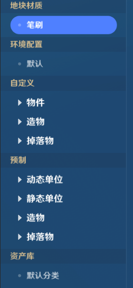
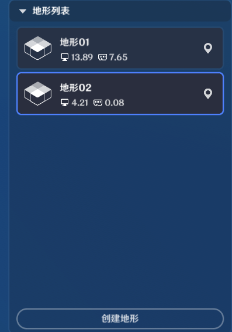
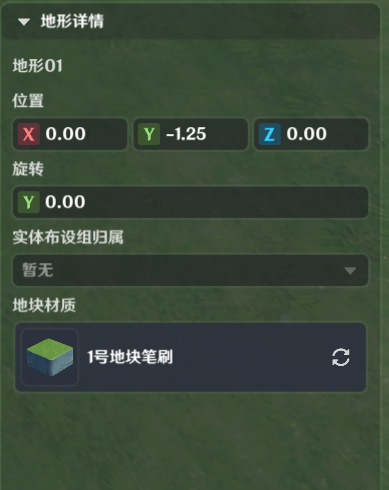
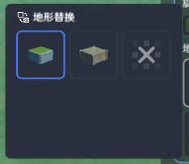
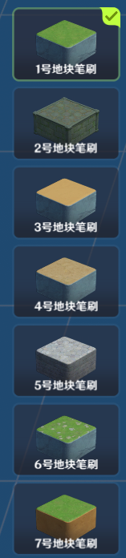
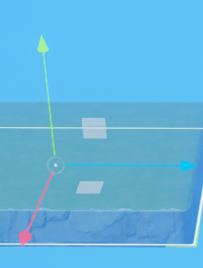
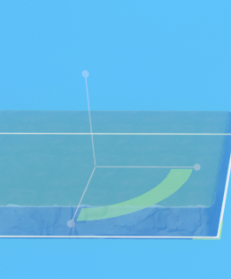
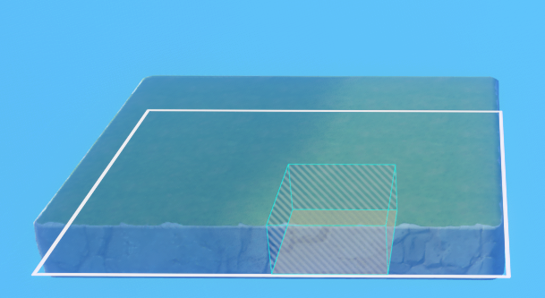
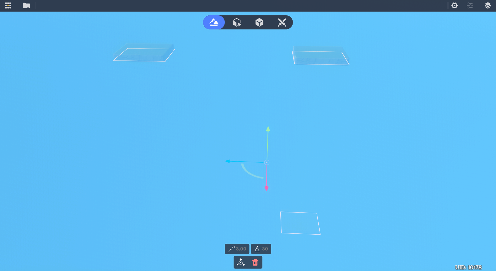
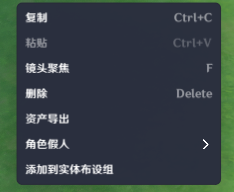

# 地形编辑

**URL**: https://act.mihoyo.com/ys/ugc/tutorial/detail/mhwe1n94b1x6

**爬取时间**: 2026-01-04 08:01:11

---

## 地形编辑

*地形编辑可用于关卡内场景效果的制作。

# 一、地形编辑

## 1.入口

地形编辑的入口位于顶部页签栏第一个按钮，可通过点击进行切换。

## 2.初始创生

关卡存档创建时，会自动在世界坐标（0，0，0）的位置创建一个大小为100 x 100的地形。

## 3.操作单位

地形编辑中，最小可操作单位为单层地块，大小：5 x 5，层高：2.5。

## 4.主界面

### (1)资产栏

打开方式：通过左侧上方按钮打开和关闭。

功能：用于选择希望创建的资产内容。

资产列表

* 地块材质（点击后根据所选材质进入[地形编辑-四、地形修改 - 自由编辑](地形编辑-四地形修改_-_自由编辑_mhwe1n94b1x6#NPvJ8GZc-Cm4qoP_c5auWx.md)）
* 环境配置
* 自定义元件（点击后创建）
* 预制元件（点击后创建）
* 资产库

### (2)详情栏

打开方式：通过右侧上方按钮打开和关闭。

功能：用于管理关卡内的地形。

地形列表：

功能点

* 修改名称（双击名称开启） - 修改选中地形的名称
* 聚焦（点击按钮开启）- 将镜头定位至地形处
* 创建地形（点击按钮进入） - 进入[地形编辑-二、地形创建](地形编辑-二地形创建_mhwe1n94b1x6#NdXA7wklhb_3QyKepWV9Iv.md)

地形详情：

开启条件：通过指针或地形列表选中任意地形（多选时无效）。

功能点

* 修改地形位置（输入） - X值、Y值、Z值
* 修改地形旋转（输入） - Y值
* 地块材质（点击按钮打开替换面板） - 将地形内所选材质替换成其他材质或去除该材质。注：点击按钮，可清除该材质所有地块。

### (3)指针

打开方式：未处于任何编辑模式中。

功能：用于选中一个或多个内容（逻辑与物件选中相同），根据选中内容出现对应不同工具栏.

可选内容及选中功能

* 地形（功能详见下：[地形编辑-三、地形修改 - 指针操作](地形编辑-三地形修改_-_指针操作_mhwe1n94b1x6#NIultN3j483fmMOl0jO1L1.md)）
* 静态物件、动态物件、造物（功能：修改位置信息或前往编辑）

# 二、地形创建

## 1.开启方式

* 左侧资产栏

进入地形编辑-四、地形修改 - 自由编辑后，点击右下角【基于格线创建】按钮。

* 右侧详情栏

处于主界面中，点击详情栏 - 地形列表 - 创建地形按钮。

## 2.创建模式

## 3.创建逻辑

根据素材栏所选材质，右侧高度标尺选定的画布高度，底部工具栏选定的笔刷模式，在指针/笔刷所处的位置涂抹创建地块，点击右上角X结束绘制，根据创建内容生成地形。

## 4.可用功能

### (1)素材栏

功能

* 切换笔刷材质：点击后，选择笔刷所创建的地块材质（共计7种）

### (2)高度标尺

功能：控制画布（地形创建用）的高度；

* 移动滑块改变画布高度。
* 单击输入框输入改变画布高度。
* 聚焦于画布所在高度。
* 增加/减少画布高度20。

### (3)底部工具栏

功能：切换笔刷模式

* 地块操作

笔刷层数：调整单次笔刷的层数值。

创建：所选地块增高x层（注：地块被操作后，整栋地块都会根据笔刷材质变成统一的材质）。

删除：所选地块降低x层。

抹平：将所选地块变成指定高度。

* 斜坡操作

使用条件：笔刷仅可选中已经创建的地块

设置斜坡方向：正向/向左/向右

斜坡材质：按照地块材质不同，所创建的斜坡材质将不同。

创建斜坡：所选地块的顶部，按照设置的斜坡方向，以箭头方向为斜坡高处，增加一层斜坡。

删除斜坡：删除所选斜坡。

* 水体操作

使用条件：笔刷仅可选中已经创建的地块/水体。

创建水体：所选地块的顶部一层变为水体。

删除水体：所选地块的顶部一层的水体变为地块。

* 路径操作

使用条件：笔刷仅可选中已经创建的地块。

创建路径：所选地块的顶部表面创建路径。

删除路径：删除所选地块的顶部表面路径。

### (4)笔刷操作

* 点按：在所处位置单次生成所设定的笔刷效果
* 拖移：鼠标所经过的可生成位置都产生一次所设定的笔刷效果。

### (5)结束绘制

功能：根据本次在画布中创建的内容，创建地形。

地形生成逻辑：所有相连的地块会形成一块地形，当一次创建中存在不相连地块时，会创建成多个地形。

# 三、地形修改 - 指针操作

## 1.开启方式

未进入任意编辑模式（地形编辑主界面）中。

## 2.可用功能

点击内容后选中，根据选中内容的不同，出现对应底部工具栏。

### (1)单选地形

* 变换处理工具

移动：用于改变地形的移动（X，Y，Z值）的工具。

旋转：用于改变地形的旋转（Y值）的工具。

切换方式：快捷键空格进行切换（切换项：移动变换处理工具，旋转变换处理工具，混合变换处理工具）。

* 层数调整

抬高一层：点击后，将所选地形内所有地块增高一层。

下沉一层：点击后，将所选地形内的所有地块降低一层。

* 地块选择

操作逻辑：点击后，进入对该地形的“精准编辑”模式，通过指针选择地块，按住Shift，左键点击地块，加入本次选择。

抬升：点击后，本次所选地块增高一层

下沉：点击后，本次所选地块降低一层;

分割：点击后，将选中的所有地块从该地形分割出去，根据分割内容，生成一个/多个新的地形；

* 精准编辑

进入选中地形的精准编辑模式地形编辑-五、地形修改 - 精准编辑。

* 删除地形

删除所有选中地形。

### (2)多选地形

操作逻辑：同时操作所有选中地形。

可用功能

* 变换处理工具

* 删除

### (3)右键菜单

* 复制、粘贴、镜头聚焦、删除、资产导出、角色假人、添加到实体布设组

# 四、地形修改 - 自由编辑

## 1.开启方式

处于地形编辑主界面（未进入任意地形编辑模式）时，点击素材栏任意材质按钮。

## 2.操作逻辑

****
*****

重播

***

00:00
/
00:00*****2X*快进中**

播放

00:00
/
00:19
直播

进入全屏

60

1x

* 2x
* 1.5x
* 1x
* 0.75x
* 0.5x
****处于自由编辑状态时，鼠标会先处于指针状态进行地形选择，点击后会选中地形，随后鼠标进入笔刷状态，根据素材栏所选材质，底部工具栏选定的笔刷模式，在指针/笔刷所处的位置涂抹创建地块，点击其他地形时结束该地形的绘制，根据创建内容生成地形，生成结束后切换地形选择

## 3.可用功能

除高度标尺外，与场景创建的可用功能一致。

### (1)素材栏

功能：更换笔刷材质，替换地形材质。

### (2)底部功能区

功能：地块操作，水体操作，路径操作。

# 五、地形修改 - 精准编辑

## 1.开启方式

处于指针操作时，选择地形后，通过底部工具栏进入选中地形的精准编辑模式。

## 2.操作逻辑

****
*****

重播

***

00:00
/
00:00*****2X*快进中**

播放

00:00
/
00:21
直播

进入全屏

60

1x

* 2x
* 1.5x
* 1x
* 0.75x
* 0.5x
****处于精准编辑状态时，仅可对进入状态前选择的地形进行编辑，鼠标进入笔刷状态，根据素材栏所选材质，底部工具栏选定的笔刷模式，在指针/笔刷所处的位置涂抹创建地块，点击结束绘制按钮，根据创建内容生成地形。

## 3.可用功能

除高度标尺外，与场景创建的可用功能一致。

### (1)素材栏

功能：更换笔刷材质，替换地形材质。

### (2)底部功能区

功能：地块操作，水体操作，路径操作。

# 六、快捷操作

## 1.开启条件

处于任意编辑模式中或工具栏处于地块操作模式中。

* [地形编辑-二、地形创建](地形编辑-二地形创建_mhwe1n94b1x6#NdXA7wklhb_3QyKepWV9Iv.md)
* [地形编辑-四、地形修改 - 自由编辑](地形编辑-四地形修改_-_自由编辑_mhwe1n94b1x6#NPvJ8GZc-Cm4qoP_c5auWx.md)
* [地形编辑-五、地形修改 - 精准编辑](地形编辑-五地形修改_-_精准编辑_mhwe1n94b1x6#N2fYcEPsH6pb1jPSSY2sQO.md)

## 2.统一高度

功能：按住Alt键后，点击的第一次会获取地块的层数，后续每次点击在可生成位置时，会按照获取地块的层数，修改笔刷所接触的地块为同一高度。

****
*****

重播

***

00:00
/
00:00*****2X*快进中**

播放

00:00
/
00:17
直播

进入全屏

60

1x

* 2x
* 1.5x
* 1x
* 0.75x
* 0.5x
****

## 3.快捷生成

功能：按住Shift键后不松开，点击在网格对应位置生成起点地块，悬停预览终点效果，点击终点后生成地形。

****
*****

重播

***

00:00
/
00:00*****2X*快进中**

播放

00:00
/
00:21
直播

进入全屏

60

1x

* 2x
* 1.5x
* 1x
* 0.75x
* 0.5x
*****