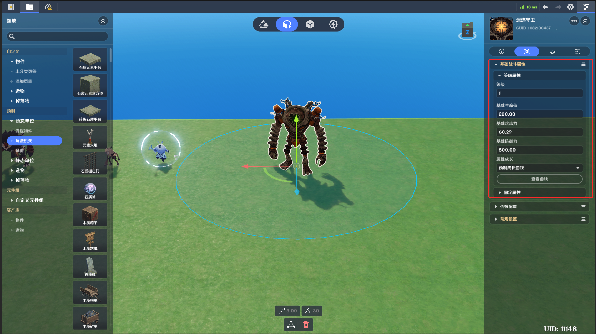
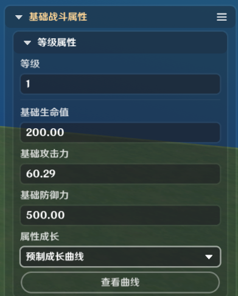

描述了攻击力/防御力/生命值等战斗校验所需要的*属性*，不同类型的实体该属性的定义也会有所区别

# 一、物件基础战斗属性

*等级*：*元件*/*实体*上配置的物件默认等级，在使用节点图创建物件时，也可以重新指定等级

*基础生命值*：物件的生命值，当受到攻击导致生命值为0时，实体会被击倒，并触发销毁和移除对应事件

*基础攻击力*：物件的基础攻击力

*基础防御力*：物件的基础防御力

# 二、造物基础战斗属性

与物件的区别在于，从等级属性和固定属性两方面，支持创作者(奇匠)对造物进行参数的调整、成长曲线的规划

04f93661a9006d69c02dc55_1818194431287328309.png)

## 1.等级属性

|  |  |
| --- | --- |
| 配置参数 | 说明 |
| *等级* | 造物创建时的等级 |
| *基础生命值* | 造物的基础生命值，实际生命值是根据*属性成长*提供的倍率做乘法计算后的结果 |
| *基础攻击力* | 造物的基础攻击力，实际攻击力是根据属性成长提供的倍率做乘法计算后的结果 |
| *基础防御力* | 造物的基础防御力，实际防御力是根据属性成长提供的倍率做乘法计算后的结果 |
| *属性成长* | 以等级为基础的数值曲线，是为生命值和攻击力提供倍率的属性曲线  提供*无成长*、*预制成长曲线*、*自定义成长曲线*三种模板 |

### (1)属性成长配置

属性成长曲线枚举说明

无成长——倍率参数皆为1，基础属性不会随着等级的变化而变化

预制成长曲线——该曲线为预制数值曲线，可以在查看曲线界面查看具体的*成长倍率*，

自定义成长曲线——使用创作者(奇匠)自己定制的成长曲线，可以点击编辑曲线进行手动修改，也支持曲线属性的导入/导出

属性成长曲线计算说明

* s/31e153b3-624b-4366-a72f-56d639eaf2a0.png)算为例。等级配置1，基础生命值改为200，选择预制成长曲线。

* 选择“查看曲线”，得知等级为1时，*生命值倍率*等于5.938，则该造物运行时实际生命值应该为200\*5.3938=1078.76

右上角选择*\*预览结果数值*，可看到实际生命值为76，符合计算结果

其余参数计算同理。

### (2)属性成长规则

*实际生命值*=当前等级对应行的生命值倍率\*基础生命值

*实际攻击s/748599c4-6286-45eb-9eef-3a21a8989710.png)等级对应行的攻击力倍率\*基础攻击力

其中基础生命值与基础攻击力为创作者(奇匠)在基础战斗属性中所配置的值

实际生命值与实际攻击力为游戏运行中实际生效的值，可能由于装备、单位状态等其他功能而产生变动

## 2.等级属性

以下固定属性参数，支持进行覆写，会在关卡运行时，对该造物生效

每种参数的可配置范围不同，下面用表格进行说明

|  |  |  |
| --- | --- | --- |
| 配置参数 | 支持配置下限 | 支持配置上限 |
| *元素精通* | 0 | 3000 |
| *各种抗性* | 0 | 3 |

# 三、节点图

可以使用节点图来查询造物或者物件的基础战斗属性

#