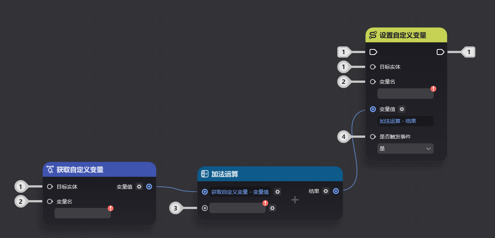
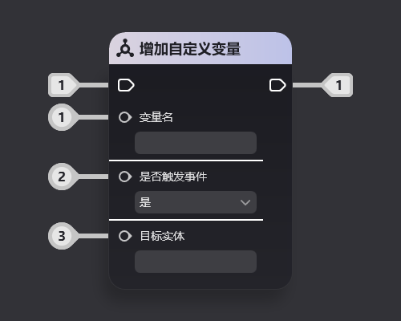

# 一、复合节点是什么

## 1.节点图中的功能复用

在节点图的制作过程中，你应该碰到了许多可复用逻辑的情形：

以下图为例，该节点图实现了一个持续计分装置，这个装置的规则如下：

* 受到攻击时使实体上的【受击计分】自定义变量增加3
* 并在之后的1、3、5秒时，为【受击计分】自定义变量加1

从图中可以看到，为自定义变量增加分数部分的逻辑存在多次重复。这样的重复会导致许多迭代时的问题

例如：

* 你发现加分不能完全满足你的需求，你决定将其改为扣分，因此需要批量将节点图中的加法操作替换为减法操作
* 你需要换一个计分的自定义变量名，在上图中需要修改四个节点内的填值。在节点图较为复杂的情况下很容易漏改

## 2.复合节点的定义

复合节点就是用来解决上述问题的功能。

复合节点是一种创作者(奇匠)可以自定义节点结构的节点类型。创作者(奇匠)可以将部分节点图实现的功能封装在复合节点内部，并自行决定对外暴露的参数和逻辑引脚

在外部节点图中，复合节点可以当作一种常规的节点使用，遵循通用的节点图连线规则

使用复合节点优化上述节点图后结果如下。可以看到节点图的功能更加清晰，也可以更好地支持复杂的迭代

# 二、复合节点的结构

## 1.对外部节点图

复合节点对外可以当作一个通用的节点使用，而不用关心其内部实现

其所有引脚均遵循通用的节点连接规 2.复合节点内部

复合节点内部是一张*子节点图*，这张子节点图特定的功能（例如下图的为自定义变量增加值）

在复合节点图内部，可以指定将哪些引脚对外暴露（即下图框出的引脚图中连接在这些引脚上的称为*虚拟引9.png)c7-5c3cb874f65a.png).png)a-483a-a032-22028e35d230.png)e85c0e0535a.png)相当于这个复合节点对外连接的入引脚或出引脚

引脚，可以在外部节点图中当作正常的引脚使用，如下图所示。虚拟引脚上的序号数字与节点图编辑内的引脚序号数字是相同的

其7864afa.png)体】、【变量名】、【是否触发事件】就b-4fd2-a7ba-a9d64edf624d.png)设置自定义变量ges/b0aa1c44-876b-4bc4-ff-bb664516png)5af4834es/673f5dae-e696-4df7-a21d-6609a65857fa.png)png)ges/c6c8750e-9de8-467a-8334-eb2bf248c1b1.png)ng)引出的

# 三、复合节点的编辑

## 1.复合节点的创建

* **通过节点图创建**

在节点图中，框选需要封入复合节点的所有节点

在任意框选的节点上点击右键菜单中的【生成复合节点】

即可创建一个新的复合节点

* **通过节点管理器创建**

从左上角窗口菜单中，打开节点管理器界面

在左侧复合节点分页中，可以新增复合节点页签

在复合节点管理页面中，点击右键-创建复合节点，即可创建一个新的复合节点

## 2.复合节点编辑

通过在节点图内双击复合节点或从节点管理器中双击复合节点，均可以进入复合节点编辑界面

该界面分为两部分

左侧是【复合节点节点图编辑】界面，与其他节点图的使用方式基本一致

右侧是【复合节点编辑预览】界面，可以预览当前正在编辑的复合节点对外暴露的样式，并调整节点名、引脚名等样式

* **复合节点节点图**

复合节点节点图的功能与其他节点图基本一致，主要的区别是，复合节点节点图中存在这样的虚拟引脚

这些虚拟引脚代表了哪些引脚与复合节点外部相连，可以在复合节点编辑预览页面修改引脚的配置

在引脚上点击右键，可以选择将该引脚作为复合节点引脚对外暴露

* **复合节点样式编辑**

在复合节点样式编辑页面，可以设置复合节点对外暴露的表现

* **复合节点重命名**

双击复合节点名即可修改复合节点名

* **引脚详情编辑**

支持以下编辑：

修改引脚名

修改外部使用时的参数框提示内容

* **引脚操作**

右键点击引脚，可以进行一些引脚操作，例如：上下移动、取消在复合节点上显示等

* **引脚合并**

当复合节点上存在两个类型相同的引脚时，可以将他们合并

合并后的引脚相当于同时连接在两个引脚上

如下图所示，1号和4号虚拟引脚分别连接在【设置自定义变量】和【获取自定义变量】的第一个入参引脚上

合并后，复合节点的样式如下图所示

可以看到复合节点的【目标实体】引脚现在同时连接在了【设置自定义变量】和【获取自定义变量】的第一个入参引脚上

## 3.在外部节点图中使用复合节点

外部节点图中，可以在【复合节点】分类中找到已经制作的复合节点

节点图中的复合节点与其他节点的规则完全一致，可以将其当作任意一种节点类型使用。如下图所示，这两张图的功能是完全相同的

