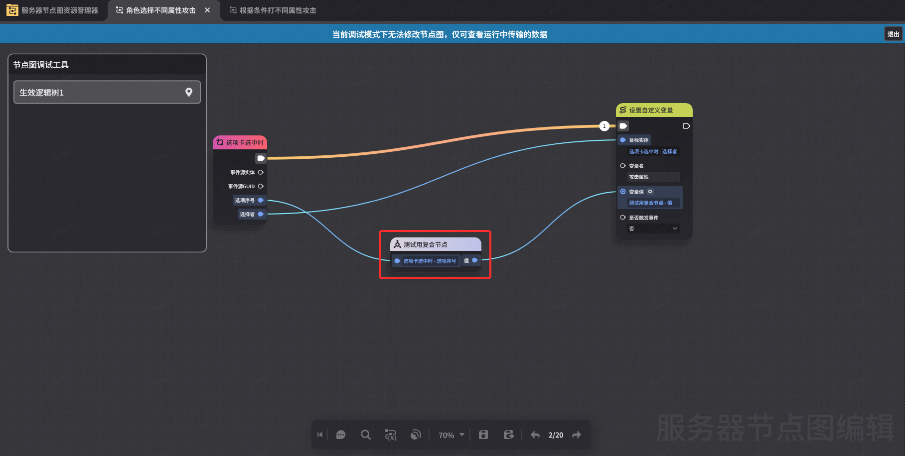

# 复合节点图日志

**URL**: https://act.mihoyo.com/ys/ugc/tutorial/detail/mhip8yit341o

**爬取时间**: 2026-01-04 08:42:29

---

## 复合节点图日志

**

# 一、功能简介

复合节点图日志功能用于查看复合节点的相关调试（查看复合节点输入输出值；展示复合节点内运行信息）

# 二、调试流程

## 1.选取目标复合节点

在任意[节点图日志](节点图日志_mhu951iz7wz8.md)的调试模式中，可点击选取逻辑树中已运行的复合节点

复合节点无法独立选取，仅可查看于节点图日志的筛选内选择的节点图所包含的复合节点。即：如希望查看复合节点信息，需监听复合节点位于的节点图本身。

## 2.复合节点运行信息

处于节点图调试模式中时，悬停于想要查看的已运行复合节点，可查看该复合节点输入输出值。

双击复合节点后，可以打开对应复合节点的调试模式（见下）。

## 3.复合节点调试模式

查看输入输出值：悬停于节点查看输入输出值。

页签逻辑：每个生效逻辑树内的每个运行过的复合节点，打开调试模式时都会视作一个独立窗口。

**