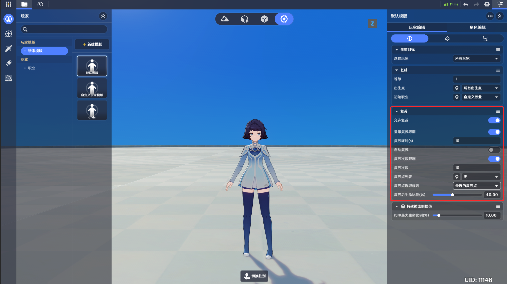
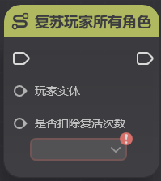
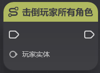
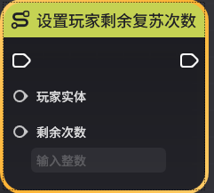
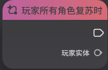
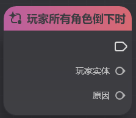
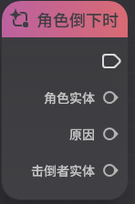

# 一、角色的击倒与复苏概念

在游玩过程中，当*玩家*的所有*角色实体*被*击倒*时（称为*玩家所有角色倒下*状态），会进入复苏相关流程

对于玩家实体和角色实体，有以下的复苏与倒下相关概念

*角色倒下*：角色因生命值降为0或被强制击倒。在超限模式中这同样意味着玩家所有角色倒下（因为玩家仅有一个角色）

*角色复苏*：角色解除倒下状态。当玩家所有角色均处于倒下状态时，任一角色的复苏都会导致该玩家解除倒下状态

*玩家所有角色倒下*：玩家实体自身不可被击倒，但存在玩家所有角色倒下的概念。在超限模式中，玩家所有角色倒下与角色倒下是相同的时点（同上，还是因为玩家只有一个角色）

同理，因为玩家实体不可被击倒，所以也不存在复苏玩家实体的概念。

# 二、角色的复苏流程

一个超限模式下典型的复苏流程如下所示

1、角色因生命值降为0等原因被击倒，角色倒下。此时进入所有角色倒下状态

2、复苏界面

界面上的功能如下：

【放弃挑战】：点击后退出本关卡

【（）秒后复苏】/【复苏】：当复苏配置中配置了*复苏时间*时，在等待复苏时间的秒数后，可以点击【复苏】按键，使角色在*复苏点*复苏

006d69c02dc55_1818194431287328309.png)

3、点击【复苏】按键、自动端节点图强制复苏后，在复苏点复苏

此时生命值为复苏配置中配置的*复苏后生命比例（%）*

# 三、复苏相关配置

## 1.复苏相关配置入口

需要注意的是，复苏相关配置是在【玩家模板】上的，而玩家实体又是由玩家模板生成的，这意味着不同玩家可以有着不同的复苏配置

例如：1号玩家有3次复苏的次数限制，而2号玩家没有复苏次数限制，但每次复苏需要等待30秒的时间

## 2.复苏相关配置项

|  |  |
| --- | --- |
| **配置项** | **说明** |
| *允许复苏* | 当配置为【否】时，该玩家无法复苏  可以通过服务端节点图的【允许/禁止玩家复苏】来动态开关 |
| *显示复苏界面* | 当配置为【否】时，该玩家倒下后不会弹出复苏界面  注意！这意味着这名玩家无法通过游戏的内置逻辑进行复苏，需要为其制作自定义逻辑进行复苏（例如：其他角色协助其复苏等），否则将无法复苏、只能退出当前关卡 |
| *复苏耗时（s）* | 玩家的复苏时间。玩家倒下后必须等待复苏时间配置的时间后，才可以复苏  当配置为【自动复苏】时，会在经过复苏时间的等待后立刻复苏  可以通过节点图【设置玩家复苏时间】来调整下一次复苏的时间 |
| *自动复苏* | 在倒下后，等待【复苏时间】配置的时间后，自动复苏，不需要玩家点击【复苏】按钮 |
| *复苏次数限制* | 这名玩家的复苏次数限制。当复苏的次数超过复苏次数限制后，无法复苏  可以通过节点图【设置玩家剩余复苏次数】节点来调整剩余的复苏次数 |
| *复苏点列表* | 这名玩家默认的合法复苏点列表。复苏时，会按照【复苏点选取规则】从复苏点列表中选取合法的复苏点进行复苏  可以通过节点图【激活复苏点】和【注销复苏点】节点动态调整玩家的合法复苏点列表 |
| *复苏点选取规则* | 决定了从当前【复苏点列表】中选取复苏点的规则  有以下可选项：  最近的复苏点：选取距离倒下位置空间距离上最近的合法复苏点  最新激活的复苏点：时间上最新激活的复苏点。可以通过经激活的复苏点来刷新复苏点的激活时间  优先级最高的复苏点：当前合法复苏点列表中优先级最高的复苏点。复苏点优先级可以在复苏点上配置。存在多个同优先级的复苏点时会随机选取一个进行复苏  随机复苏点：从当前的合法复苏点列表中随机选取一个作为复苏点进行复苏 |
| *复苏后生命比例（%）* | 复苏后角色生命值百分比，该值不可为0 |
| *特殊被击倒损伤-扣除最大生命比例（%）* |入深渊后扣除的生命值百分比，此类复苏不是常规的复苏流程，也不会扣除复苏次数 |

# 四、复苏相关功能节点

**复苏角色**

**节点类型**：执行

**节点功能**

* 复苏一个指定角色
* 在超限模式中，与【复苏玩家所有角色】功能相似，会复苏玩家的角色、并解除玩家的所有角色倒下状态。这次复苏不会扣除玩家的复苏次数

**节点参数**

|  |  |  |  |
| --- | --- | --- | --- |
| **参数类型** | **参数名** | **类型** 明** |
| 入参 | 角色实体 | 实体 | 需要复苏的指定角色实体 |

**复苏玩家所有角色**

**节点类型**：执行

**节点功能**

* 复苏玩家的所有角色
* 在超限模式中，与【复苏角色】功能相似，会复苏玩家的角色并解除所有角色倒下状态，否扣除玩家的复苏次数

**节点参数**

|  |  |  |  |
| --- | --- | --- | --- |
| **参数类型** | **参数名** | **类型** | **说明** |
| 入参 | 玩家实体 | 实体 | 需要所有角色复苏的玩家实体 |
| 入参 | 是否扣除复苏次数 | 布尔值 | 如果为【是】，则复苏时扣除1次复苏次数。如果复苏次数不足1次，则执行 |

**击倒玩家所有角色**

**节点类型**：执行

**节点功能**

* 击倒玩家的所有角色，会使玩家进入所有角色倒下状态

**节点参数**

|  |  |  |  |
| --- | --- | --- | --- |
| **参数类型** | **参数名** | **类型** | **说明** |
| 入参 | | 实体 | 目标玩家实体 |

**设置玩家复苏耗时**

**节点类型**：执行

**节点功能**

* 修改指定玩家的**下次复苏**耗时
* 如果玩家当前处于复苏计时中，不会修改当前的复苏耗时

**节点参数**

|  |  |  |  |
| --- | --- | --- | -- **参数类型** | **参数名** | **类型** | **说明** |
| 入参 | 玩家实体 | 实体 | 目标玩家实体 |
| 入参 | 时长 | 浮点数 | 设置的复苏时间，以秒为单位 |

**设置玩家剩余复苏次数**

**节点类型**：执行

**节点功能**

* 修改指定玩家剩余的复苏次数
* 设置为0会使这名玩家无法复苏

**节点参数**

|  |  |  |  |
| --- | ---- | --- |
| **参数类型** | **参数名** | **类型** | **说明** |
| 入参 | 玩家实体 | 实体 | 目标玩家实体 |
| 入参 | 剩余次数 | 整数 | 设置的剩余复苏次数 |

**允许/禁止玩家复苏**

**节点类型**：执行

**节点功能**

* 修改指定玩家是否允许复苏

**节点参数**

|  |  |  |  |
| --- | --- | --- | --- |
| **参数类型** | **参数名** | **类 **说明** |
| 入参 | 玩家实体 | 实体 | 目标玩家实体 |
| 入参 | 是否允许 | 布尔值 | 设置是否允许复苏 |

**玩家所有角色复苏时**

**节点类型**：事件

**节点功能**

* 当玩家所有角色解除倒下状态、复苏时触发。注意，因为角的玩家解除倒下状态不会触发这个事件
* 由于玩家解除倒下状态并复苏也会导致角色解除倒下状态并复苏，因此也会在这个事件后触发【角色复苏时】事件

**节点参数**

|  |  |  |  |
| --- | --- | --- | --- |
| **参数类型** | **参数名** | **类型** | **说明** |
| 出参 | 玩家实体 | 实体 | 被复苏的玩家实体 |

**玩家所有角色倒下时**

**节点类型**：事件

**节点功能**

* 玩家进入所有角色倒下状态时触发

**节点参数**

|  |  |  |  |
| --- | --- | --- | --- |
| **参数类 **参数名** | **类型** | **说明** |
| 出参 | 玩家实体 | 实体 | 所有角色倒下的玩家实体 |
| 出参 | 原因 | 枚举 | 玩家所有角色倒下的原因  包含以下几个原因  -节点图导致：被节点图中的节点击倒  -正常击倒：因所有角色生命值降为0所有角色倒下  -非正常击倒：因为坠落深渊、溺水等原因被击倒 |

**玩家异常倒下并复苏时**

**节点类型**：事件

**节点功能**

* 玩家因坠落深渊、溺水等原因被击倒并复苏时

**节点参数**

|  |  |  |  |
| --- | --- | --- | -- **参数类型** | **参数名** | **类型** | **说明** |
| 出参 | 玩家实体 | 实体 | 因溺水、坠落深渊等原因被击倒的玩家实体 |

**角色倒下时**

**节点类型**：事件

**节点功能**

* 角色倒下时触发的事件
* 在当前模式中，因为玩家只有一名角色，因续触发【玩家所有角色倒下时】

**节点参数**

|  |  |  |  |
| --- | --- | --- | --- |
| **参数类型** | **参数名** | **类型** | **说明** |
| 出参 | 角色实体 | 实体 | 因溺水、坠落深渊等原因被击倒的角色实体 |
| 出参 | 原因 | 枚举 | 角色倒下的原因  包含以下几个原因  -节点图导致：被节点图中的节点击倒  -正常击倒：因玩家队伍内所有角色生命值降为0所有角色倒下  -非正常击倒：因为坠落深渊、溺水等原因被击倒 |
| 出参 | 击倒者实体 | 实体 | 击倒该角色的实体 |

**角色复苏时**

**节点类型**：事件

**节点功能**

* 角色复苏时触发的事件

**节点参数**

|  |  |  |  |
| --- | --- | --- | --- |
| **参数类型** | **参数名** | **类型** | **说明** |
| 出参 | 角色实体 | 实体 | 复苏的角色实体 |

**查询玩家角色是否全部倒下**

**节点类型**：查询

**节点功能**

* 查询玩家的所有角色是否已全部倒下

**节点参数**

|  |  |  |  |
| --- | --- | --- | --- |
| **参数类型** | **参数名** | **类型** | **说明** |
| 入参 | 玩家实体 | 实体 | 查询的目标玩家实体 |
| 出参 | 结果 | 布尔值 | 是否已全部倒下 |

**获取玩家复苏耗时**

**节点类型**：查询

**节点功能**

* 获取指定玩家的复苏耗时

**节点参数**

|  |  |  |  |
| --- | --- | --- | --- |
| **参数类型** | **参数名** | **类型** | **说明** |
| 入参 | 玩家实体 | 实体 | 查询的目标玩家实体 |
| 出参 | 时长 | 浮点数 | 获取的复苏耗时 |

**获取玩家剩余复苏次数**

**节点类型**：查询

**节点功能**

* 查询玩家的剩余复苏次数

**节点参数**

|  |  |  |  |
| --- | --- | --- | --- |
| **参数类型** | **参数名** | **类型** | **说明** |
| 入参 | 玩家实体 | 实体 | 查询的目标玩家实体 |
| 出参 | 剩余次数 | 整数 | 获取的剩余复苏次数 |