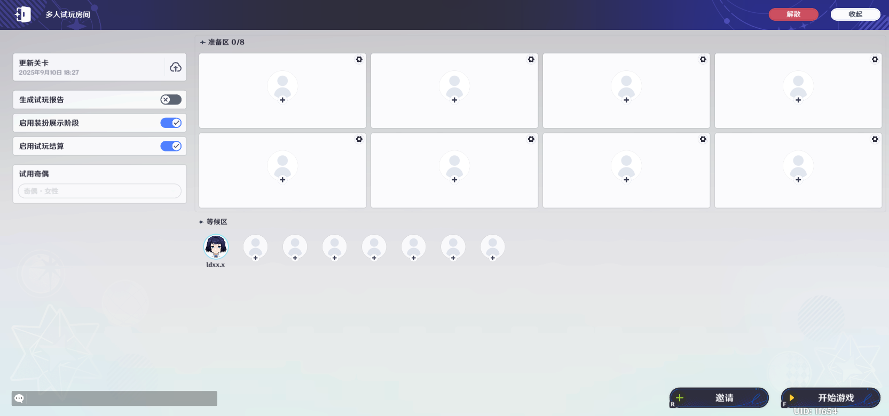
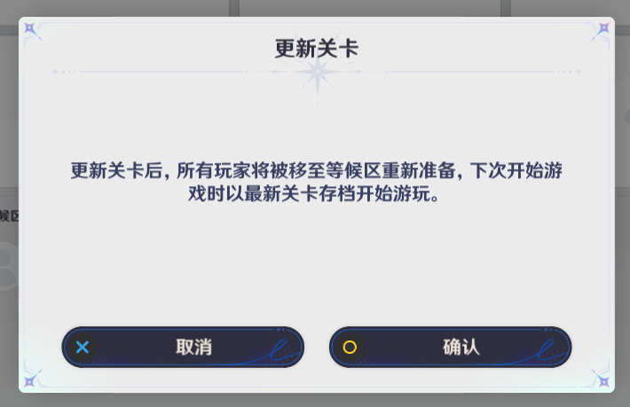

# 一、功能简介

该功能可用于对已编辑关卡中模拟多人游玩情景的测试，以达到快速验证关卡的效果。

# 二、功能入口

系统菜单——多人试玩

# 三、多人试玩房间

点击【多人试玩】按钮后（上图）将执行多人试玩开启流程（必要校验和上传关卡），流程完毕后即进入多人试玩房间界面。

注：每次多人试玩将读取最后一次上传的存档，如对关卡进行编辑后，需手动进行更新关卡后方可游玩最新编辑内容。

## 1.房间功能

### (1)等候区

刚加入试玩房间的玩家会被分配至等候区的首个剩余席位，处于等将不会加入后续开启的试玩中。处于等候区的玩家，可通过点击【等候区】或【准备区】席位，切换自身所处区域及席位。

**受邀玩家**
ges/0494a7f0-da5e-486b-b8bf-ce4679240971s/f61bd11f-d386-45c3-2da2d605d-4a80-8dbbc91b6983.png)png))-3e62-4ea8-8361-4cf228d7726b.png)可通过下列两种方式进行席位的切换

* 点击【加入准备区】按钮后，直接加入准备区的剩余席位。
* 点击空席位进行切换。

### (2)准备区

准备区用于承参与到试玩的玩家，受邀玩家可在该区域完成关卡的下载并准备试玩。

准备区：读取【关卡设置】——【人数设置】相关的设置内容（人数，分组）。

**受邀玩家**

![]家处于准备区时，可通过点击右下角底部的【2-44e4-a292-f8614a00ac41.png)53848d19.png)来表示自己准备参与关卡的游玩

受邀玩后，会开始关卡下载流程，下载完成后会进入准备状态。

注：当房主开启游戏时，所有处于准备区但未进入准备状态的玩家将被移动至等候区。

### (3)

房主点击【邀请】按钮后，界面右邀请玩家】面板，共分为【、【今日邀请列表】和【好友】三部分。

* **搜索邀请**

!
可通过输入U21e-4b50-9839-dda9463f6bee.png)进行玩家s/8dafed81-4c04-a8a4-004460607c48.png))，查询后，可通过【邀请】按钮发送试玩邀约，玩家响应后会加入试玩房间。

* **今日邀请列表**

切换至本页签后，可查看当日已邀请试表，通过邀请按钮，可再次邀请玩家进行试玩。

* **好友**

该页签可查看账号内的好友列表，点击好友对应的邀请按钮即发送试玩邀请。

**受邀玩家**

玩家受到多人试玩邀请后，有15秒的响应时间，超过响应时间后，将自动拒绝邀请。

**邀请限制**
日最多可共计邀请16名玩家参与试玩，每日零点清除【今日邀请列表】。玩家：当受邀者处于关卡、地城、编辑中等情形时，无法受到试玩邀约。

### (4)开启试玩

房主可通过右下角【开始游戏】按钮开启试玩。试玩开始后，所有准备区席位转为不可加入和不可点击状态，房间中进入试玩的玩家转为游戏中状态，开启装扮展示阶段。

注：房主即便不处于准备区，在满足关卡开启必要条件（人数，分组等）的情况下，多人试玩也可被开启。即房主可不参与多人试玩。

当有受邀玩家处于准备区且未完成准备状态时，房主点击【开始游戏】将收到提示，确认继续试玩后，会将所有未进入准备状态的玩家移动至等候区。

## 2.试玩设置

### (1)更新关卡

点击可将最后编辑的关卡上传至多人试玩房间，执行此操作会将所有玩家移至等候区并需要重新进行准备。

### (2)生成试玩报告

开启后，所有参与试玩的玩家将在试玩结束后本地自动生成一份用于查看[负载计算功能](./负载计算功能_mho2hirg.md)的报告，创作者(奇匠)可通过导入报告的方式查看对应玩家本次试玩的动态负载情况。

储存路径：C:\Users\%USERPROFILE%\AppData\LocalLow\miHoYo\原神\BeyondLocal\（此处为玩家UID）\Beyond\_Performance\_Report

### (3)角色展示设置

开启后，玩家进入关卡时，将进行装扮展示阶段阶段，流程结束后进入加载界面。

### (4)启用结算

为了加快测试效率以及减少试玩测试中的流程，创作者(奇匠)可通过【多人试玩】中【启用试玩结算】关闭结算相关流程。

### (5)试用奇偶

创作者(奇匠)在进入试玩前，可通过【试玩选项】内【试用奇偶】调整试玩中使用的奇偶体型。

### (6)试玩数据设置

在试玩开始前，通过席位右上角的【设置】按钮，房主可对席位进行相关的数据设置。

注：该数据设置将与席位进行绑定，即无论任何玩家处于该席位，都会运用相同的设置。

### (7)试玩成员管理

多人试玩中，房主可通过右上角按钮对于受邀玩家进行请离和移至等候区的管理行为。

* **请离玩家**

房主可将玩家请离于试玩房间，请离成功后，玩家将回到加入试玩前的位置。

请离限制：如果玩家处于试玩状态中，将在玩家结束试玩后请离玩家。

* **移动至等候区**

房主通过【移至等候区】可将玩家移动至等候区的空余席位。

### (8)房间解散

房主可通过【解散】按钮将多人试玩房间解散，解散后，所有玩家将回到加入试玩房间前的位置。

### (9)房间收起

房主可通过右上角【收起】按钮，将界面收起至顶部菜单栏并回到编辑界面。注：此时多人试玩房间并未解散，受邀玩家仍处于房间内。

# 四、多人试玩局内控制

房主可进行行为：重新挑战，终止试玩。

受邀玩家可进行行为：终止试玩。

## 1.退出按钮

处于试玩中，可通过左上角按钮或Esc快捷键打开【试玩控制】面板。

## 2.试玩控制

### (1)重新挑战

点击【重新挑战】按钮后，将重新执行从装扮展示阶段开始的所有启动流程，流程执行完后即重新开始新一局试玩。  
注1：如触发异常情况导致试玩无法直接重新开始，请退出试玩后重新开启试玩流程。

注2：多人试玩中，如果有玩家提前退出当前试玩，将无法执行重新挑战。

注3：多人试玩过程中，仅房主拥有重新挑战的试玩控制功能。

### (2)中断挑战

点击该按钮后，将立即结束本次试玩流程，触发对应的非正常结算结果。

# 五、多人试玩结算

试玩结束时，将根据关卡对于结算的相关设置，执行结算流程并展示结算结果。

创作者(奇匠)可通过【关卡设置】中【结算】页签进行相关设置。

