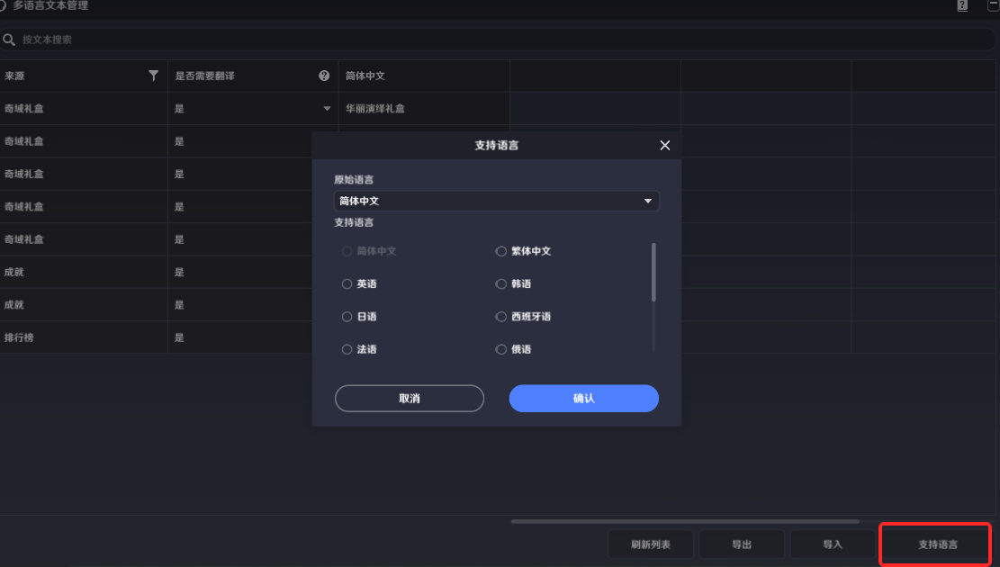

# 多语言文本

**URL**: https://act.mihoyo.com/ys/ugc/tutorial/detail/mhk59aiqtwyk

**爬取时间**: 2026-01-04 08:29:11

---

## 多语言文本

# 一、多语言文本的功能

提供给创作者(奇匠)适配多语言的方式，让外显的文本都能有对应的多语言翻译，帮助创作者(奇匠)扩宽关卡的用户群

# 二、多语言文本的编辑

## 1.入口

点击左上角系统菜单按钮可打开菜单界面

点击【多语言文本管理】即可进入多语言文本管理界面，用于为游戏配置不同的语言包，适配更多的语言

## 2.具体介绍

搜索：用于搜索对应的文本，搜索内容为原始语言对应的文本

来源：用于展示该文本的来源，展示其使用的位置，可进行筛选

是否需要翻译：用于标识该文本是否需要翻译

是：该文本的每一种支持的语言都需要翻译，存在未翻译内容时会导致上传失败

否：该文本被标记为无需翻译

后续列中展示内容为该存档原始语言+支持语言，点击右下方【支持语言】可选择该存档可支持的多语言

刷新列表：再次提取存档中的文本内容

导出导入：可将该列表导出为CSV文本，在外部进行编辑，然后再导入到该列表中

导入时检验规则：

表头要完全相同

行数不校验，只识别相同的原始语言文本进行填入

是否翻译列不校验，自动填入表内内容
