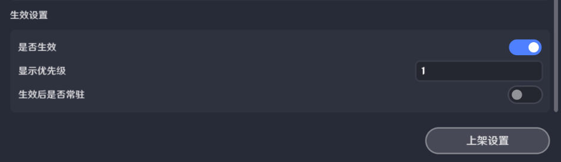

# 一、入口所在位置

点击左上角系统菜单按钮可打开菜单界面

点击【奇域礼盒管理】即可进入奇域礼盒编辑界面，可以用来制作投放给玩家的额外游戏内容

# 二、具体功能介绍

## 1.创建礼盒

点击创建礼盒，新建一个礼盒

adc7e.png)ges/30ed0806a04f93661a9006d69c02dc55_1818194431287328309.png)

每个关卡中能够存在的礼盒数量上限为20个

## 2.基础属性

*礼盒索引*：礼盒的唯一标识，不能重(奇匠)在上-9577-3828cf996fd8.png)4-f0f71ffbf208.png)s/58bfdaf9-c971-4c76-b889-0b48e90285bf.png)当前存档中礼盒索引必须与线上版本的礼盒索引为包含关系上传

*选择图标*：用于为该礼盒选择一个图标，其中包含预先提供的图标；也可以通过添加自定义图标从本地上传一个图标

*稀有度*：用于表示该礼盒的品质

*获取条件类型*：用于决定该礼盒的获取条件的类型：包59851f1.png)竞技段位和极致成就
f-4e57-b27a-f0c98f2a3f4d.png)004-46fa-a326-dc538b2bd941.png))

* 在选择排行榜时，需要先选择使用多个排行榜中的哪一个排行榜数据作为条件，再选择排行榜达成特定排名的要求

* 在选择竞技段位时，需要选择达成的段位要求

* 在选择极致成就时，无需做额外编辑

*赛季更新后能否再次获取*：开启后，当赛季更新时，玩家能够再次获取该礼盒

*持有有效期*：关闭时，该礼盒的有效期为永久生效；开启后可设置该礼盒在玩家身上生效的赛季数

*持有后的有效赛季数*：该礼盒在玩家身上生效的赛季数

*描述内容*：用于描述该礼盒的功能

## 3.生效设置

用于控制该礼盒能够生效的赛季

*是否生效*：关闭时，该礼盒在任何情况下都不会上架，开启后可在对应配置的赛季中上架

*显示优先级*：该礼盒在商区中的显示顺序，越大越靠前

*生效后是否常驻*：关闭时，该礼盒的生效赛季需要通过上架设置进行设置，选择对应的上架赛季；开启时，需要填写该礼盒的初始生效赛季，此后该礼盒将持续处于上架状态

## 4.上架设置

用于控制每个赛季上架的礼盒

*选择赛季*：可选择赛季来编辑该赛季想要上架的礼盒

*添加*：可在当前选择的赛季中添加想要上架的礼盒

点击左上角或取消勾选可将该礼盒从该赛季中去除，常驻礼盒无法在上架设置中进行下架

# 三、以节点图管理奇域礼盒

* 消耗礼盒

* 查询对应礼盒数量

* 查询对应礼盒消耗数量

