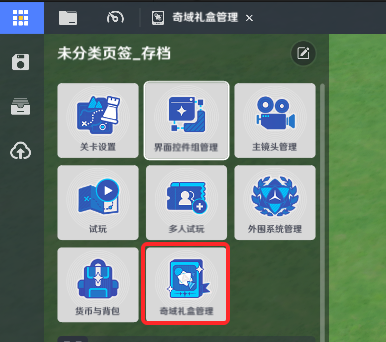
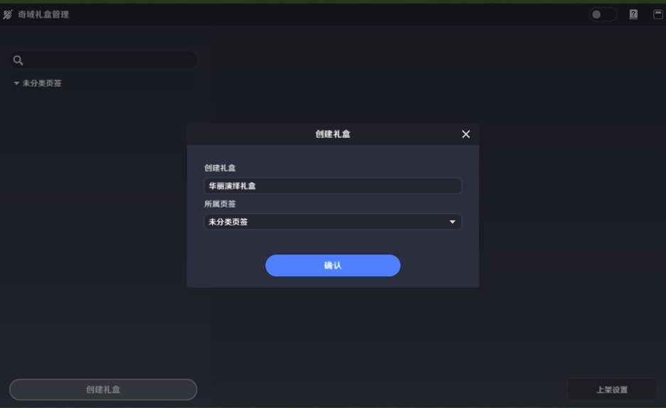
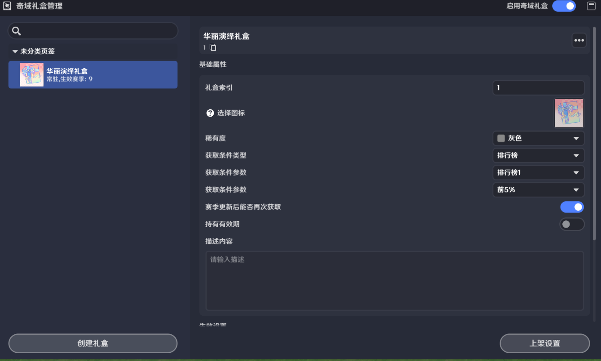
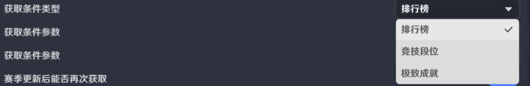
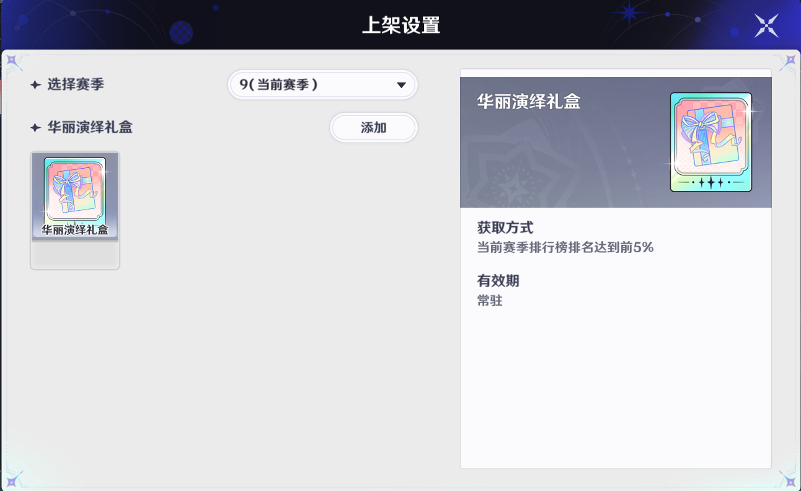
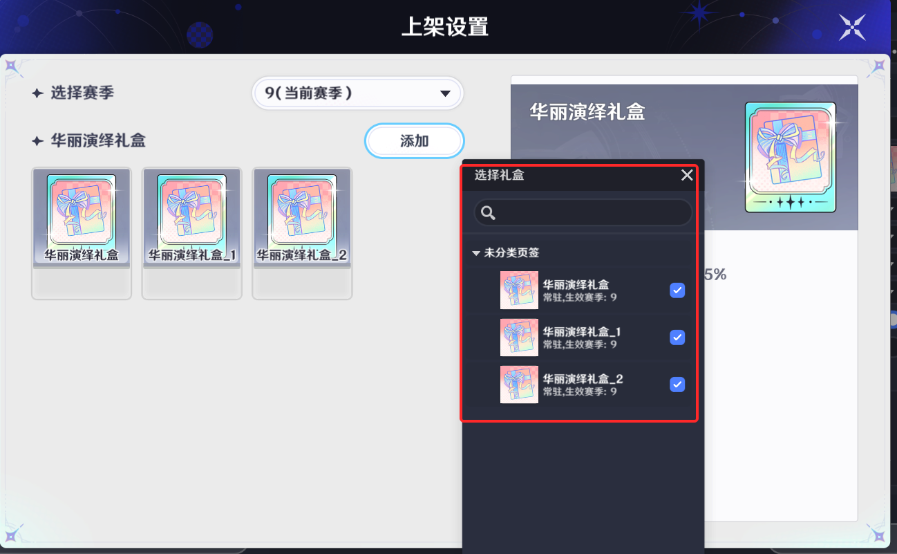
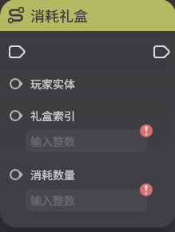

# 奇域礼盒

**URL**: https://act.mihoyo.com/ys/ugc/tutorial/detail/mhjdhpi4sd10

**爬取时间**: 2026-01-04 08:25:04

---

## 奇域礼盒

# 一、入口所在位置

点击左上角系统菜单按钮可打开菜单界面

点击【奇域礼盒管理】即可进入奇域礼盒编辑界面，可以用来制作投放给玩家的额外游戏内容

# 二、具体功能介绍

## 1.创建礼盒

点击创建礼盒，新建一个礼盒

每个关卡中能够存在的礼盒数量上限为20个

## 2.基础属性

礼盒索引：礼盒的唯一标识，不能重复，创作者(奇匠)在上传存档时，当前存档中礼盒索引必须与线上版本的礼盒索引为包含关系才能够正常上传

选择图标：用于为该礼盒选择一个图标，其中包含预先提供的图标；也可以通过添加自定义图标从本地上传一个图标

稀有度：用于表示该礼盒的品质

获取条件类型：用于决定该礼盒的获取条件的类型：包含排行榜、竞技段位和极致成就

* 在选择排行榜时，需要先选择使用多个排行榜中的哪一个排行榜数据作为条件，再选择排行榜达成特定排名的要求

* 在选择竞技段位时，需要选择达成的段位要求

* 在选择极致成就时，无需做额外编辑

赛季更新后能否再次获取：开启后，当赛季更新时，玩家能够再次获取该礼盒

持有有效期：关闭时，该礼盒的有效期为永久生效；开启后可设置该礼盒在玩家身上生效的赛季数

持有后的有效赛季数：该礼盒在玩家身上生效的赛季数

描述内容：用于描述该礼盒的功能

## 3.生效设置

用于控制该礼盒能够生效的赛季

是否生效：关闭时，该礼盒在任何情况下都不会上架，开启后可在对应配置的赛季中上架

显示优先级：该礼盒在商区中的显示顺序，越大越靠前

生效后是否常驻：关闭时，该礼盒的生效赛季需要通过上架设置进行设置，选择对应的上架赛季；开启时，需要填写该礼盒的初始生效赛季，此后该礼盒将持续处于上架状态

## 4.上架设置

用于控制每个赛季上架的礼盒

选择赛季：可选择赛季来编辑该赛季想要上架的礼盒

添加：可在当前选择的赛季中添加想要上架的礼盒

点击左上角或取消勾选可将该礼盒从该赛季中去除，常驻礼盒无法在上架设置中进行下架

# 三、以节点图管理奇域礼盒

* 消耗礼盒

* 查询对应礼盒数量

* 查询对应礼盒消耗数量

