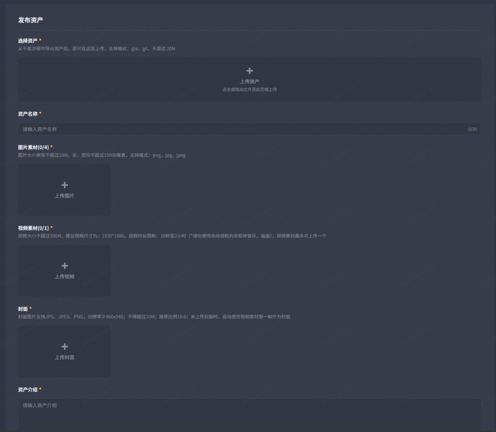

# 一、功能入口

打开编辑界面系统菜单，点击图中左下角标记的按钮可跳转打开资产中心网址。

# 二、主界面介绍

## 1.标题栏

标题栏包含如下功能：

* 搜索框：支持搜索资产名称或作者信息

*从左至右分别为：
* 个人主页
* 收藏夹通知
* 上传资产
* 使)801-d9e96836fd9a.png)-a99b-f5d-4be7-a3de-78d70c88cbdc.png)39623.png)19ac-47ee-9f1c-eb9b70269d96.png)ges/f339cf6c-8aeb-4ee1-a9c4-fe674554f667.png)b6-4faa-8c0b-cff4fc984f-4578-8c44-a274cafe20d1.png).png)含《奇》与使用说明）

## 2.筛选栏

筛选栏包含如下功能：

* 筛选：点击筛选按钮打开标签浮窗，点击浮窗内选项进行资产筛选。点击重置可清空当前已选标签

* 反馈：点击反馈按钮打开反馈弹窗，若当前标签无法满足筛选需求，可以在此进行反馈。后续会根据反馈情况对可选标签进行更迭

* 发布时间与排序方式

## 3.资产卡片

资产卡片包含如下功能：

* 左上角按钮点击可直接复制该资产的详情页链接
* 右上角按钮分别为：下载、收藏
* 点击资产卡片主体可跳转进入资产详情页

# 三、详情页面介绍

详情页包含如下功能：

* 下载资产
* 点赞资产
* 收藏资产
* 复制资产详情页链接
* 更多按钮：（访问者）举报资产、（创作者）下架资产、编辑资产

# 四、上传资产页面介绍

上传页面包含如下功能：（具体上传条件限制可进入资产中心查看）

* 选择资产：gia、gil文件，文件获取方式详见[资产导入导出](./资产导入导出_mhxbd59u.md)
* 资产名称
* 图片素材
* 视频素材
* 封面
* 资产介绍
* 资产标签：若当前可选标签不满足需求，也可通过反馈按钮进行反馈

# 五、个人主页介绍

## 1.个人信息栏

个人信息栏包含如下功能：

* 基础信息：千星奇域头像、玩家名称、UID、奇匠等级、签名
* 资产中心信息：账号获得的总下载量、收藏量和点赞量

## 2.个人资产详情栏

个人资产信息栏包含如下功能：

* 我的资产：包含当前已发布、正在审核中或已下架的资产
* 收藏夹
* 下载历史
* 消息中心