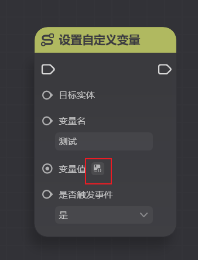
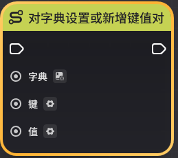
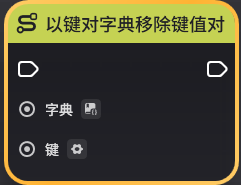
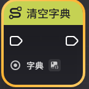
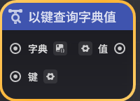
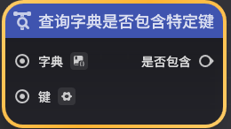
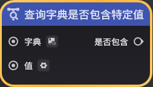
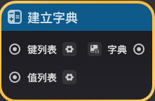
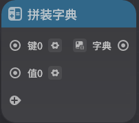

# 字典

**URL**: https://act.mihoyo.com/ys/ugc/tutorial/detail/mhubgk9yy8gy

**爬取时间**: 2026-01-04 08:43:03

---

## 字典

# 一、字典是什么

字典是一个用于描述一组映射关系的数据结构

例如：在某个玩法中，希望在关卡实体上存储场上所有玩家的分数

如果不使用字典，只能在关卡实体上使用多个自定义变量，每个自定义变量存储每个玩家的分数（在超限模式中最多需要8个自定义变量）

这样的方案在解决需要存储更多实体的分数（例如一个与造物进行竞速的玩法中，每一个造物都需要额外的一个自定义变量记录分数）时会较为麻烦

而使用字典则可以有效解决这个问题：

你可以在关卡实体上定义一个实体到整数的字典，这个字典中每一组映射都包含了一个实体类型的数据和一个整数类型的数据。实体类型的数据可以用来存储玩家实体，而整数类型的数据则可以用来记录分数

你可以使用字典操作的节点很轻松的调整字典中的数据元素，例如新增元素、删除元素等

也可以将【玩家分数】这样一个数据结构作为一个字典类型的数据打包传递、使用

## 1.字典的定义

字典是一种可在服务端节点图中使用的数据结构

每个字典都描述了一种数据类型A到数据类型B的映射关系。

其中数据类型A称为键，B称为值，每一组键+值称为一个键值对。字典就是若干键值对的集合

一个常见的字典的数据结构如下。这是一个字符串到浮点数映射的字典

|  |  |
| --- | --- |
| **键** | **值** |
| ABC | 1.3 |
| DEF | 1.8 |
| GHI | 20.5 |

## 2.字典相关功能要点

* **字典的类型确定**

如[基础概念](基础概念_mhk23ora1wom.md)中所述，节点图是一种强类型语言，字典的类型由其键+值的类型唯一确定。

因此一个【字符串-浮点数】类型的字典是无法与【字符串-整数】类型的字典连线的

* **字典键的唯一性**

字典的键不可以重复，字典中每个键都是唯一的

因此字典相关的操作均是围绕键展开的，例如按键修改值、根据键查询值等

* **字典的引用传递**

与列表相似，字典在节点图中也是以引用的方式进行传递的。因此字典相关的修改节点会直接作用于自定义变量、节点图变量内的字典数据，具体见自定义变量

同理，自定义变量变化时事件中不会传出【变化前值】和【变化后值】字段，需要使用获取自定义变量来获取变化后的值

* **字典的乱序储存**

字典中的键值对不是按照顺序进行排列的，在使用时不能对键值对的排列顺序存在预期，应当将其视为乱序排列

* **字典的数据可用类型**

字典的键可用类型包括：

|  |
| --- |
| **数据类型** |
| 实体 |
| GUID |
| 整数 |
| 字符串 |
| 阵营 |
| 元件ID |
| 配置ID |

字典的值可用类型包括：

|  |  |
| --- | --- |
| **数据类型** | **列表数据类型** |
| 实体 | 实体列表 |
| GUID | GUID列表 |
| 整数 | 整数列表 |
| 布尔值 | 布尔值列表 |
| 浮点数 | 浮点数列表 |
| 字符串 | 字符串列表 |
| 阵营 | 阵营列表 |
| 三维向量 | 三维向量列表 |
| 元件ID | 元件ID列表 |
| 配置ID | 配置ID列表 |
| 自定义结构体 | 自定义结构体列表 |

# 二、在泛型中使用字典

在服务端节点图中，字典是一种较为特殊的泛型引脚。需要在泛型配置中选为【字典】后，再选择其对应的键和值的类型，才能唯一确定一个字典的类型

在可以使用字典的泛型引脚上，可以在泛型的展开菜单中找到【字典】选项

点击后，可以观察到【变量值】旁的泛型按钮发生了变化，这代表着目前变量值这个引脚是一个泛型字典引脚

再次点击泛型按钮，可以为这个泛型字典确定键和值的类型

如上文所述，在完全确定了一个泛型字典的键和值类型后，这个泛型字典的类型才可以完全确定

# 三、字典相关节点

## 1.执行节点

**对字典设置或新增键值对**

**以键对字典移除键值对**

**清空字典**

**对字典按键排序**

**对字典按值排序**

## 2.查询节点

**查询字典长度**

**以键查询字典值**

**获取字典中键组成的列表**

**获取字典中值组成的列表**

**查询字典是否包含特定键**

**查询字典是否包含特定值**

## 3.运算节点

**建立字典**

**拼装字典**

