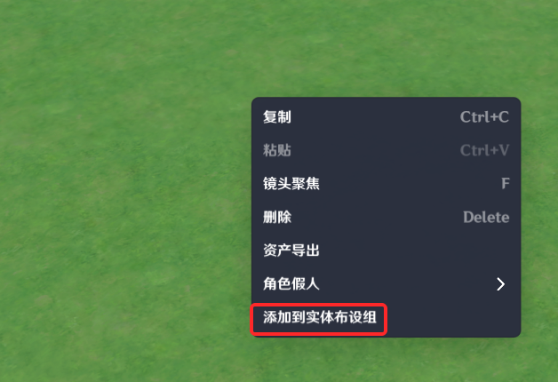
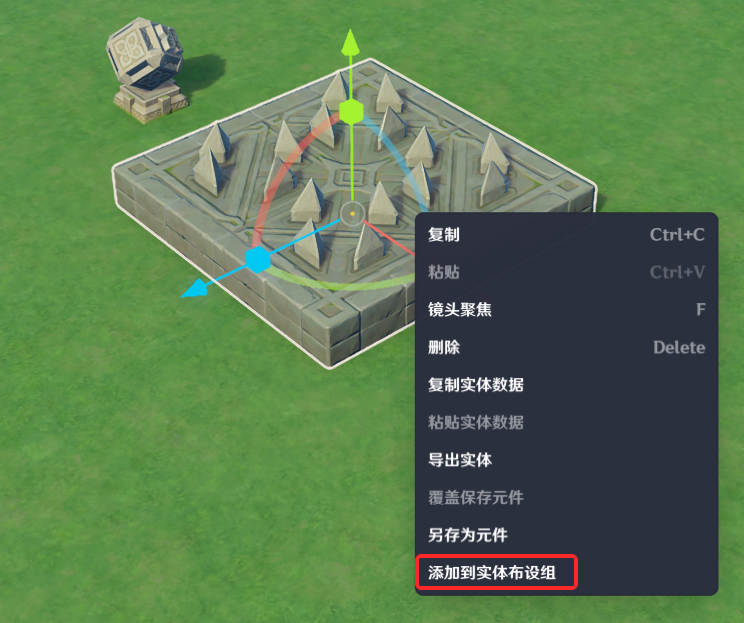
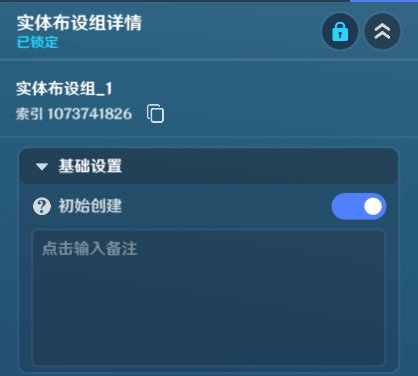
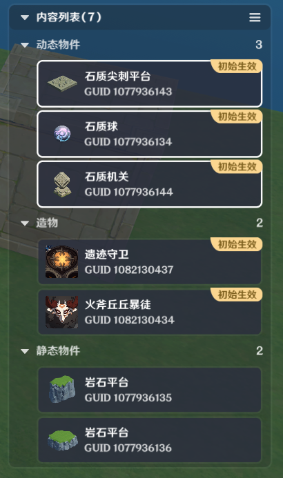
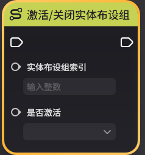

# 实体布设组

**URL**: https://act.mihoyo.com/ys/ugc/tutorial/detail/mhqmrlr6h58e

**爬取时间**: 2026-01-04 08:08:18

---

## 实体布设组

# 一、实体布设组的功能

实体布设组可用于批量管理布设实体，并可以通过相关节点实现实体的批量创建和销毁。

可以使用实体布设组快速定位到所有属于该实体布设组的单位。

所有在场景内拥有物理实体的单位类型都可以将其归属于某个实体布设组，包括：造物、角色、物件

除此之外，地形也可以归属于某个实体布设组

同一个实体可以归属于多个实体布设组。

# 二、实体布设组的全局定义

在使用实体布设组之前，需要预先在实体布设组管理工具中对其内进行全局定义

在系统菜单中点击【实体布设组管理】，打开实体布设组管理工具。

左侧为实体布设组管理栏，可浏览已有的实体布设组，或点击【添加实体布设组】来增加一个新的实体布设组。

选中某个实体布设组后，可在右侧详情栏对其做一些设置，也可以看到该实体布设组的内容列表

实体布设组管理栏可以新建页签，以及将实体布设组按页签分类

# 三、管理实体布设组

## 1.将实体加入实体布设组

* 在地形编辑页签，右键点击地形可在弹出菜单中将其添加至实体布设组。

* 在实体摆放页签，右键点击实体（多选可先通过按住shift+左键点击选中多个实体）可在弹出菜单中将其添加至实体布设组。

* 在实体布设组详情界面点击右下角【场景中选中】进入选中模式，可通过左键框选或点击的方式快速添加实体至当前组。

## 2.实体布设组详情界面设置

实体布设组名称：可自定义，用于区分不同的实体布设组

索引：该实体布设组的唯一标识，用于在节点图内修改实体布设组数据时进行标识

初始创建：决定该布设组内的地形和静态物件是否随关卡一同创建，对于其他实体单位则取决于其实体上的配置【是否初始创建】

内容列表：枚举了该实体布设组内包含的所有单位

可以右键选中其中某个单位将其移出该组或更换其所属组

# 四、节点图管理实体布设组

* 查询当前激活的实体布设组列表

* 激活/关闭实体布设组

