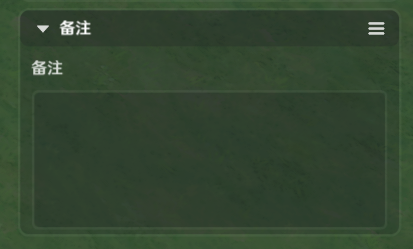

# 一、功能简介

用于创建和摆放关卡中所需的实体，并编辑实体数据的编辑界面，与地形编辑共用一个场景

# 二、功能入口

顶部页签栏第二个图标，点击后切换至实体摆放

部分功能仅可在实体摆放页签使用

# 三、摆放流程

## 1.从资产栏创建物件实体

从资产栏左键长按拖拽物件进入场景后松手，或者左键单击资产栏中的图标直接在屏幕中心创建

(1)预制页签下的动态单位页签创建出来为动态实体，可以添加组件和节点图，更费性能，一般为玩法相关物件

(2)预制页签下的静态单位页签创建出来的则为静态实体，不可添加组件和节点图，不可被节点图控制，但省性能，一般为布景物件

(3)自定义页签中，则根据玩家自定义元件的类型决定创建出来为动态还是静态

注：动态实体会有GUID，可以通过节点图进行操作，静态实体无GUID

## 2.ges/14fb45dc-dafe-41f2-80bd-153cdf4c5e9d.png)作

### (1)单选

鼠标左体，被选中的实体有高亮描边，并出现变换处理工具和工具栏，右侧会展开详情面板

### (2)多选

按住鼠标左键并拖拽以进行框选，按住左shift+鼠9-4226ad7c6bb8.png)ges/1413b9ad-5016-433b-b254-c8b849ef9b07.png)ges/db78dcfd-bf58-43f1-a845-0f8c2e2a93f8.png)5fc.png)ng)ng)点击进行多选

变换处理工具会出现在所有被选中实体的位置中心

注：部分实体不可被同时选中（例如实体模型和实体运动器组件内的路点模型）

### (3)取消选择

点击无实体的空白处可取消选择

### (4)移动、旋转、缩放

通过变换处理工具移动、旋转、缩放实体，按空格键切换变换处理工具类型（三合一、移动、旋转、缩放）

* 三合一变换处理工具：包含移动、旋转、缩放的部分功能，只能给予相对坐标变换

* 移动变105a7e0106d.png)：用于改变实体的位置，可以标/实体相对g)12e-4aa217d5411f.png)024179550e0e.png)304fbb44.png)9b19b3071.png).png)b82-b1dd2dc421fa.png)).png)

* 旋转变换处理工具：用于改变实体的旋转，可以按照世界坐标/实体相对坐标变换

* 缩放变换处理工具：可以改变实体的缩放，只能按照实体相对坐标变换

可以通过每个变换处理工具带有的步进功能进行精准操作（移动步进、旋转步进、缩放步进）

### (5)删除实体

按delete键或点击删除实体

### (6)复制、粘贴实体

ctrl+c、ctrl+v进行隔空复制，新实体出现在鼠标对应的场景位置

按住alt+拖拽变换处理工具移动轴，进行原地复制，新实体出现在被复制实体的场景位置（单次复制数量可以在右上角快捷设置-其他设置-alt复制数量中修改）

### (7)复制、粘贴实体数据

不会创建新的实体

功能入口在选中物件的右键菜单中

粘贴实体数据后，将被复制的实体数据直接覆盖在选，同时修改元件的引用源，实体的GUID不会变化

物件、造物间禁止相互粘贴实体数# (8)撤销操作

ctrl+z可以撤销上一步操作

部分情况下不可用

### (9)快速保存

ctrl+s可以保存当前关卡内的所有数据，未保存的数据不会记入存档（请经常保存）

部分情

## 3.详情编辑

功能入口在右侧详情面板-基础属性页签（左侧第一个）中

c77f60ef2.png)

### (1)变换

可以精细调整位置、旋转、缩放

开启锁定变换后，则不可再通过变换处理工具修改被锁定实体的位置、旋转、缩放，防止误触

### (2)模型

可以替换主物件模型、查看挂接点、添加装饰物

### (3)原生碰撞

*初始生效*：开启后物件的原生碰撞盒会开启

*是否可攀爬*：开启后实体可攀爬

### (4)可见性

模型可见性仅影响模型显示，不影响实体上的其他逻辑

### (5)创建设置

关闭初始创建后，实体不会初始创建，可通过节点图动态创建

### (6)阵营

可以设置实体的阵营

### (7)单位标签

可以添加标签，可以在节点图内查询带有标签的实体

### (8)实体布设组

可以管理实体所属的布设组

### (9)负载优化

影响物件在距离角色过远时，是否在该角色所属玩家的客户端运行

### (10)音效

决定该实体是否播放自身携带的音效

### (11)引用源

可以查看实体所属的元件

### (12)备注

可以填写备注文本

## 4.便捷摆放功能

可以在顶部栏的快捷设置（齿轮图标）中开关相关功能设置

### (1)镜头设置

可以调整镜头的水平速度和垂直速度，可以点击重置按钮回退到默认设置

水平锁开启后，仅可通过EQ改变镜头的高度

### (2)贴地摆放

开启贴地摆放后，拖拽变换处理工具中心点可以进行贴地

### (3)表面吸附

根据实体包围盒的6面进行吸附

### (4)吸附后转正

用于纠正表面吸附后的角度，适用于想让实体方方正正贴在一起的情况

会将两个实体间的夹角转到0,90,180,270中的一个

### (5)中心对齐

方便两个实体的中心进行对齐

### (6)移动时显示距离

在移动变换处理工具拖拽时，可以显示当前移动的距离

### (7)显示设置

可以开关显示造物入战范围、预设点、空物件、路径点的常驻显示

### (8)Alt复制数量

影响Alt复制时的实体数量

### (9)环境设置

可以更改编辑时预览的环境

### (10)编辑快捷键

可以查看编辑界面的快捷键

# 四、实体、元件、覆写

## 1.实体和元件

在物件摆放面板拖出的物件都是实体，可以通过【详情面板-物件属性页签-引用源】查看对应的元件

实体的数据会引用元件数据，在实体上单独修改会覆写引用数据

删除元件后，所有实体会一同被删除

## 2.实体上覆写元件数据

未被覆写的数据，会接收来自元件推送的数据修改（元件在点击覆盖保存后）

被覆写的数据，不会接收推送的数据修改（此部分数据在详情面板中会标蓝）

## 3.修改元件

元件可以直接在【元件库】[元件库](./元件库_mhwp5h9d.md)中进行编辑

实体摆放面板的实体可以通过右键菜单的【覆盖保存元件】，反向推送数据到元件，对元件数据进行覆盖

【另存为元件】，则会创建一个对应的新元件

## 4.将实体还原到元件数据

### (1)整体还原

点击顶部栏的物件图标呼出更多功能菜单，点击还原为元件数据，可以将实体除移动、旋转以外的数据，回退为与元件相同的状态

### (2)部分还原

每个属性卡支持单独的还原操作

