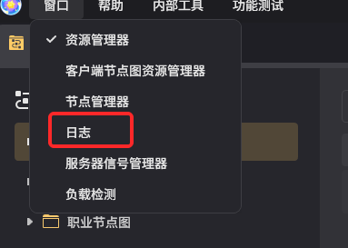
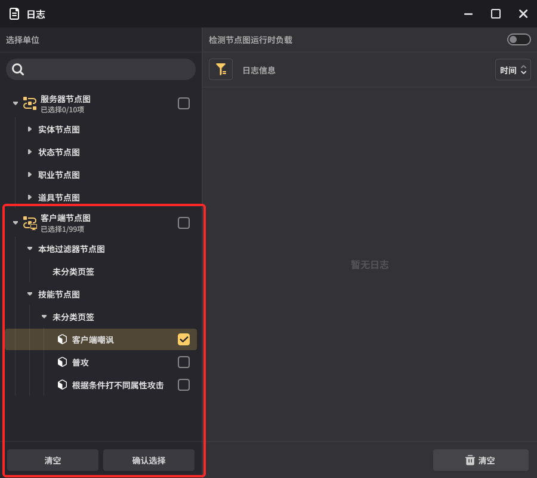

# 一、功能简介

该功能用于调试客户端节点图（显示节点图的运行流程；展示节点图内各节点的输入输出值）。

# 二、局限性与功能规划

## 1.局限性

不同于原有节点图日志系统，由于客户端节点图的运行逻辑，当前本功能仅能展示使用日志功能的客户端所运行的相关日志，即无法查看其他玩家的客户端节点图相关日志。

## 2.功能规划

后续版本将提供功能，用于显示其他参与试玩的玩家客户端节点图日志相关日志。

# 三、功能入口

从千星沙箱——窗口——日志，点击后即可打开【日志系统】

# 四、调试流程

## 1.选取目标节点图

在发起试玩前，玩家需要在筛选面板勾选所有希望获取日志信息的客户端节点图。

图中框出部分的内容用于客户端节点图的目标日志选取，客户端节点图筛选上限：99（服务器节点图上限保持为10）

注：仅勾选的目标节点图会返回日志信息。

png)

本次新增功能：勾选所有该类型节点图。

## 2.节点图日志查看

在游戏运行过程中，勾选的客户端节点会生成日志信息

日志信息包含以下内容：

* 节点图名称，生效时间，挂载对象；

双击生效的客户端节点图，可以打开对应节点图的调试模式（见下）；

## 3.节点图调试模式

位于客户端节点图调试模式中时，所有生效的节点及对应执行流程将被高亮，将鼠标悬停在节点上，可以看到这个节点当前的输入输出参数值。

