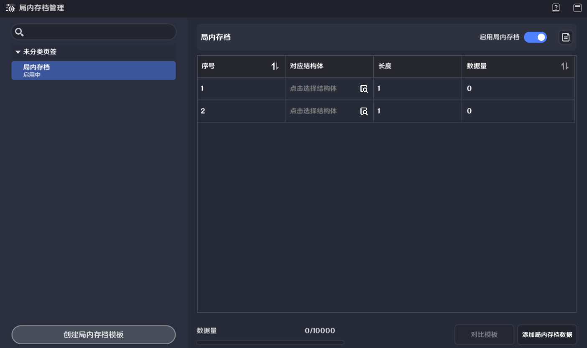
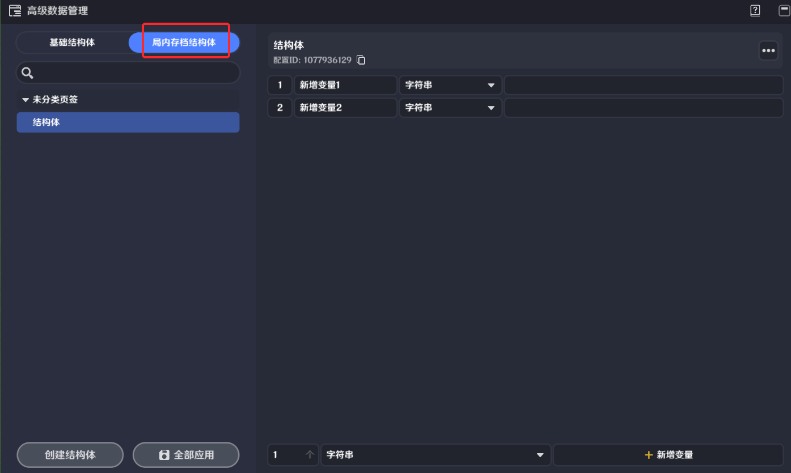
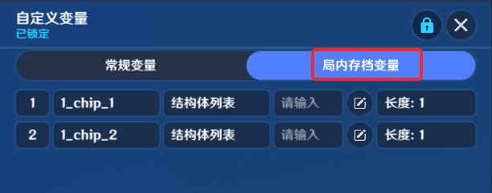
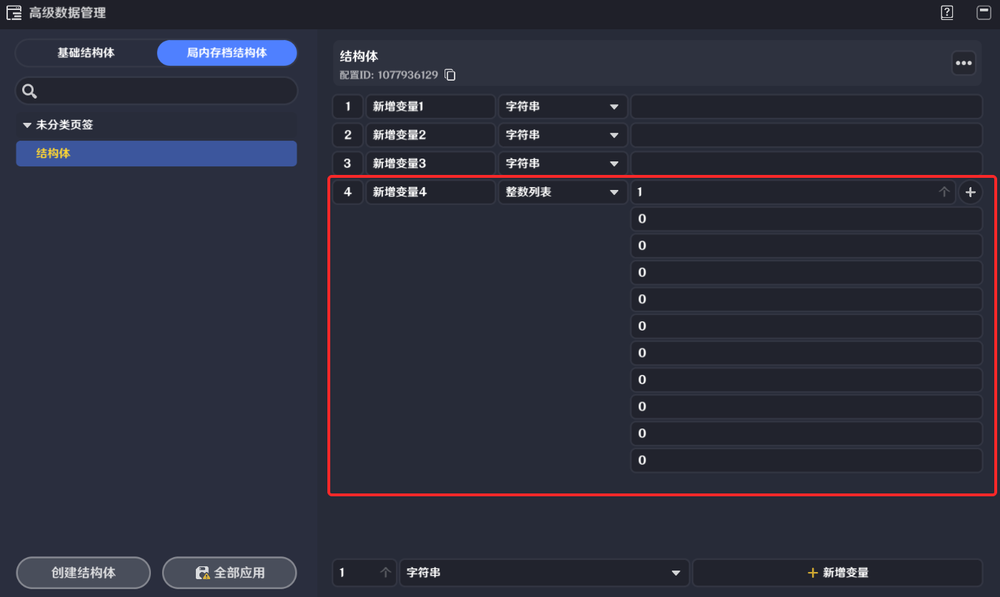
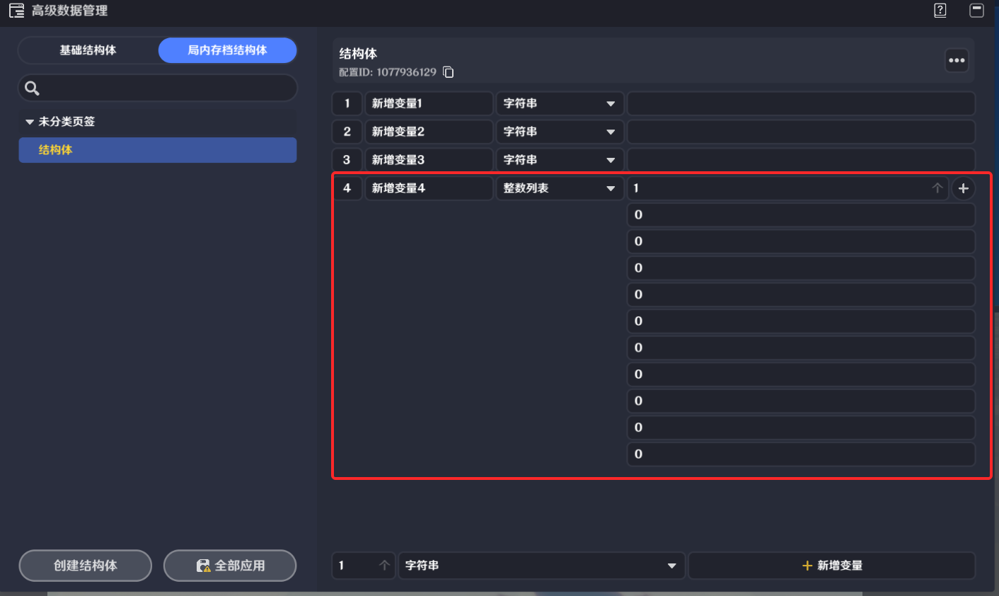
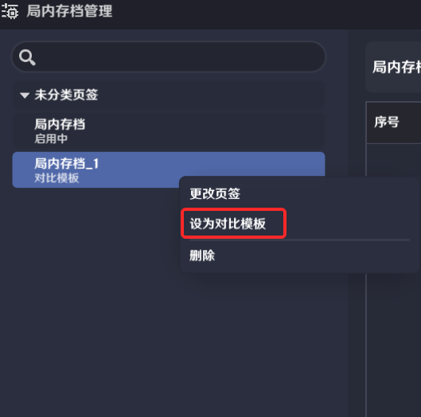

# 一、局内存档的定义

局内存档是一种保存了玩家在特定关卡内产生的数据的结构。这些数据即使玩家离开了关卡，也会持续保存，且在每次进入关卡时，都会将这些数据一起带入。

例如：可以将玩家在关卡中获取到的道具列表保存为一个局内存档。玩家可以在关卡中持续游玩，并在每次重新进入关卡时，都可以带入上次获取的道具

局内存档的读写需要使用[结构体](./结构体_mh3fmi0t.md)以及[自定义变量](./自定义变量_mhso1b9w.md)

# 二、局内存档相关功能

## 1.局内存档的数据结构

每个关卡中，创作者(奇匠)可以配置多个**局内存档模板**，但每次只能启用一个局内存档模板作为当前关卡使用的局内存档模板

一个局内存档模板中，包含了多个局内存档结构体，每个局内存档都是一个定长的自定义结构体列表

以下为局内存档结构体以及局内存档模板的配置界面

*局内存档**结构体*与基础结构体的使用方式基本一致，但不支持部分数据类型

以下是局内存档结构体支持的数据类型：（实体、实体列表、所有类型的字典以及结构体不支持在局内存档结构体中使用）

|  |  |
| --- | --- |
| **数据类型** | **列表数据类型** |
| GUID | GUID列表 |
| 整数 | 整数列表 |
| 布尔值 | 布尔值列表 |
| 浮点数 | 浮点数列表 |
| 字符串 | 字符串列表 |
| 阵营 | 阵营列表 |
| 三维向量 | 三维向量列表 |
| 元件ID | 元件ID列表 |
| 配置ID | 配置ID列表 |

以下为局内存档结构体的配置界面，与基础结构体的配置方式基本一致

## 2.局内存档的写入和读取

局内存档依赖自定义变量进行写入和读取。在定义并启用局内存档模板后，模板中每个局内存档结构体都会在每个玩家实体上生成一个同名的自定义变量（称为*局内存档变量*）

**局内存档变量与常规自定义变量的用，使用自定义变量相关节点进行读写**

由于局内存档变量与局内存档的定义一一对应，所以无法直接修改玩家上的局内存档变量

在玩家进入关卡时，会根据其携带的局内存档数据，将局内存档数据写入玩家实体上的局内存档变量。这个步骤称为*读档*

注：将局内存档数据写入局内存档变量的过程会发生在实体创建前，因此玩家实体上的实体创建时事件中可以正确查询到玩家实体上的局内存档变量

玩家离开关卡时，会将局内存档变量的数据写入局内存档，并随玩家带离关卡。这个步骤称为*存档*

## 3.局内存档数据量限制

每个关卡可用的局内存档数据量是有限的，由构成局内存档的结构体的成员类型决定。通常来说字符串类型以及列表类型会产生较高的数据量

如果关卡内的总数据量超过限制，则无法进入试玩或发布，需要优化局内存档的数据结构。

### 列表类型长度限制

因为存在局内存档数据量的整体限制，局内存档中所有列表类型的数据都有着最大长度的限制（与自定义变量不同）

在运行时，局内存档变量中的列表数据可以超出最大长度限制存储，但在存档时，超出长度限制的列表数据会被截取到最大长度限制后存档（即保留前若干个元素，超出长度限制的元素会被丢弃）

这可能数据无法被局内存档存入，建议在写入局内存档变量时对列表类型数据的长度做好校验

以下图为例，在局内存档结构体定义时，使用的所有列表类型数据都需要定义其长度（下图的词缀id列表长度为10，即最多存放10个整数）

此外每个局内存档模板作为一个结构体列表，自身也有长度限制。超出长度的部分在存档时同样会被截断

## 4.局内存档升级

局内存档中可以存放玩家在游玩过程中产生的持久性数据，因此对于一个已发布的关卡，创作者(奇匠)需要小心处理局内存档相关数据，以免出现玩家的数据丢失

对于一个已发布的关卡，允许以以下的方式对局内存档进行升级

* 在已发布的局内存档模板中新增局内存档结构体。新增的局内存档数据在玩家进入关卡时会以局内存档结构体中定义的默认值进行读档。
* 在已发布的局内存档结构体中新增成员。新增的成员在玩家进入关卡时会以结构体中定义的默认值进行读档。

不推荐以下的局内存档操作

* 删除一个已发布的局内存档模板，或一个与之前局内存档模板结构完全不同的新的局内存档模板。
* 缩减内)最大长度。
* 从已发布的局内存档模板中修改局内存档引用的结构体类型或删除已有的局内存档。
* 对已发布的局内存档结构体的成员数据类型进行修改或删除成员。

以上操作都会造成新的局内存档结构与玩家已产生的局内存档数据无法读档失败后玩家局内存档数据重置

# 三、局内存档相关功能的编辑入口

## 1.局内存档结构体的配置

局内存档结构体与基础结构体有着相似的配置方式（基础结构体配置方式见[结构体]6-5c85e7894140.png)ugc/tutorial//detail/mh3fmi0t99ns)）

主要的区别是局内存档结构体中使用的列表类型成员需要确定其长度。需要以增加元素的方式为其确定长度

## 2.局内存档以及局内存档模板的配置

从系统菜单内可以找到【局内存档管理】

### (1)局内存档编辑

左侧为已创建的所有局内存档模板。创作者(奇匠)可以创建多个模板，但最终使用的只能有一个模板，可以通过打开启用局内存档开关来启用当前的模板

右侧为该局内存档模板的详细配置，如前文所述，每个模板里包含多条局内存档数据。每条局内存档数据可以选择需要使用的局内存档结构体，并为其定义最大长度

### (2)对比模板功能

可以使用对比模板功能将两个模板的差异进行对比。这通常用于局内存档模板的升级（升级要求升级后的模板相对升级前的模板是纯增量或完全相同，不能产生数据结构的删除或修改）

需要使用对比功能，需要先将要对比的局内存档模板设为对比模板。右键点击后，选择【设为对比模板】

然后在当前使用的模板，点击对比模板

如果当前模板不是对比模板的正确升级（局内存档结构完全相同，且结构体成员为增量），则会弹出以下提示

