# 常规设置

**URL**: https://act.mihoyo.com/ys/ugc/tutorial/detail/mh3rgo0c16c8

**爬取时间**: 2026-01-04 08:10:47

---

## 常规设置

# 一、常规设置的定义

造物的专有特化配置，分为行为模式、未入战行为、入战区域

# 二、常规设置的编辑

## 1.行为模式

支持造物实体选择行为模式，会在运行时按照行为模式的配置，自主进行运动、入战、脱战等行为

造物行为模式全量枚举详情：[造物行为模式图鉴](造物行为模式图鉴_mhyg4i0inazs.md)

* 造物实体支持配置的行为模式，可以通过选择枚举进行切换

|  |  |
| --- | --- |
| 配置参数 | 说明 |
| 行为模式 | 可从枚举项中选择，枚举项为预先提供的行为模式池  每种行为模式对未入战、入战都提供不同的可选行为，会使造物自主做出不同的表现。 |

## 2.未入战行为

* *选择行为模式后，可对未入战行为做选择。*

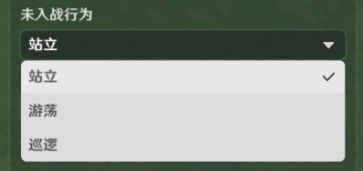

|  |  |
| --- | --- |
| 配置参数 | 说明 |
| 未入战行为 | 当造物未进入战斗状态时，造物应遵循的规则。  不同的行为模式，包含不同的未入战行为池 |

## 3.入战区域

* *选择行为模式后，可对**入战区域**做选择。*

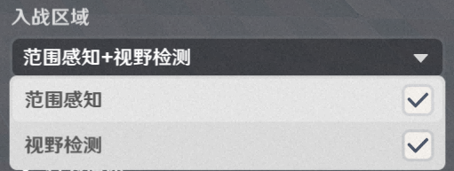

|  |  |
| --- | --- |
| 配置参数 | 说明 |
| 入战区域 | 造物自主检测敌对实体的方式，检测成功后以对应实体为目标入战  所有行为模式，都包含*范围感知*、*视野检测*两种规则 |
| 预览入战区域 | 开启可以观测入战区域的水平范围 |
| \行为描述  | 行为模式的介绍说明 |

## 4.详情编辑

* 通过“详情编辑”，可以对未入战行为、战斗行为进行更多参数的调整配置。

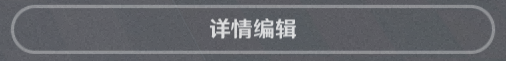

### (1)详情编辑-未入战

造物实体运行时，还未进入战斗状态时应遵循的规则

所有未入战行为请查看 [敌人行为模式的未入战行为](敌人行为模式的未入战行为_mhpsmb91keka.md)

部分未入战行为支持编辑，包括游荡*、*巡逻

#### a.游荡

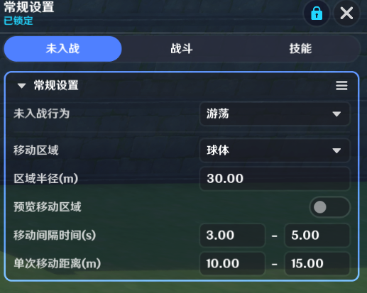

是一种所有造物都支持的未入战行为

关卡运行时，造物未入战时，将在*领地*范围内随机选点运动

|  |  |
| --- | --- |
| 配置参数 | 说明 |
| 移动区域 | 以造物创建坐标为中心的范围  运行时造物会在领地符合该范围的区域内，随机选点运动  仅支持球体形状的配置 |
| 区域半径(m) | 运动区域球体的范围半径 |
| 预览运动区域  | 开启后，可在编辑窗口内，查看配置的游荡区域范围 |
| 移动间隔时间(s) | 按照配置时间区间进行随机，每次运动后停留该时间才会再次运动 |
| 单次移动距离(m) | 按照配置距离区间进行随机，每次运动对应距离 |

#### b.巡逻

部分造物在未入战行为中，支持配置巡逻行为

|  |  |
| --- | --- |
| 配置参数 | 说明 |
| 初始生效巡逻模板 | 下拉菜单提供该造物的巡逻模板枚举  通过修改后面的勾选框，可以修改生效情况，修改后生效状态会同步到巡逻模板详情编辑页内 |
| \巡逻模板列表 | 枚举该造物配置的所有巡逻模板 |

*打开详情编辑，可以创建新的巡逻模板，或对已有巡逻模板进行编辑

**添加巡逻模板**

* 通过点击，添加巡逻模板。

添加的巡逻模板初始生效默认不开启。

* *模板X，X为序号，作为节点输入项可以进行巡逻模板的切换*

|  |  |  |
| --- | --- | --- |
| 配置参数 | 说明 | |
| 初始生效 | 若开启，则造物创生时，该巡逻模板生效  同一造物同时最多生效一个巡逻模板 | |
| 循环类型 |  | |
| 单程 | 造物沿着路径移动到最后一个路点后，停止巡逻行为 |
| 往返 | 造物沿着路径移动到最后一个路点后，反向原路返回；到达第一个路点时同理 |
| 循环 | 造物沿着路径移动到最后一个路点后，接着前往第一个路点 |
| 巡逻起始位置 | 造物在执行巡逻时，以哪一个路点作为巡逻起点开始行为 | |
| 最近点 | 配置的巡逻模板上最近的路点 |
| 起点 | 配置的巡逻模板上的第一个路点 |

***巡逻路径配置**

* 选择[路径](路径_mh333vim2h44.md)中配置好的路径进行引用

**编辑巡逻路径模板**

|  |  |  |
| --- | --- | --- |
| 配置参数 | 说明 | |
| 巡逻路径 | 可选择路径管理工具中配置好的路径 | |
| \打开路径管理工具 | 可以跳转至路径管理工具 | |

***巡逻路径的路点信息配置**

|  |  |  |
| --- | --- | --- |
| 配置参数 | 说明 | |
| \路点 | 路点X，X作为节点入参可以获取路点的位置/旋转信息，也可以用作到达点位的信息对比 | |
| 前往速度 | 提供**走、跑**移动速度枚举可供选择 | |
| 抵达判定半径(m) | 造物距离该路点小于等于配置半径时，视为抵达该路点 | |
| 停留时间(s) | 造物到达路点后，原地停留时长配置 | |
| 到达路点后转向 | 若开启则读取路点的旋转信息并进行转向 | |
| 到达时通知节点图 | 若开启，则造物到达该路点后，会向自身挂载的节点图发送【造物抵达巡逻路点事件】 | |
| \显示路点信息 | 若开启，则可以查看该路点的位置和旋转信息，不可修改 | |

### (2)详情编辑-战斗

造物实体运行时，以角色实体为目标，准备/已经进入战斗状态时应遵循的规则

不同行为模式下，支持配置的基本一致，在此将所有出现过的参数做说明。

#### **a.入战设置**

造物实体运行时，检测敌对实体的方式、距离、关联关系等规则的配置

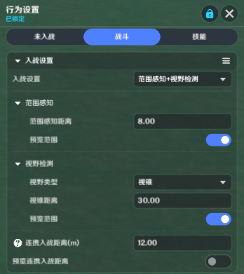

* **感知范围**

|  |  |
| --- | --- |
| 配置参数 | 说明 |
| 范围感知距离 | 敌对实体处于该范围内，造物可获取对应实体信息，并以对应实体为目标进入战斗 |
| \预览范围 | 开启后，可在编辑窗口处，查看编辑中造物实体的感知范围 |

* **视野检测**

|  |  |
| --- | --- |
| 配置参数 | 说明 |
| 视野类型 | 提供全视野和视锥枚举，选择后其形状编辑参数也会一同变化 |

*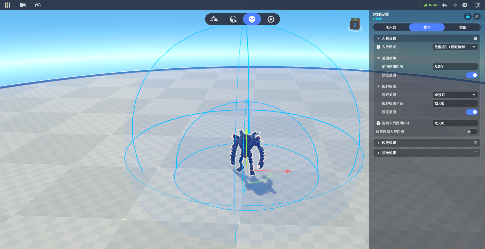

|  |  |
| --- | --- |
| 配置参数 | 说明 |
| 视锥-视锥距离 | 配置视锥的半径距离 |
| 全视野-视野检测半径 | 配置球体的半径 |
| \预览范围 | 开启后，可在编辑窗口处，查看编辑中造物实体的视野检测范围 |
| 连携入战距离(m) | 造物实体入战时，处于该范围内未入战的造物实体也会一同入战 |

#### **b.脱战设置**

造物实体运行，且对敌对实体进入战斗状态后，造物自主脱战的规则设置

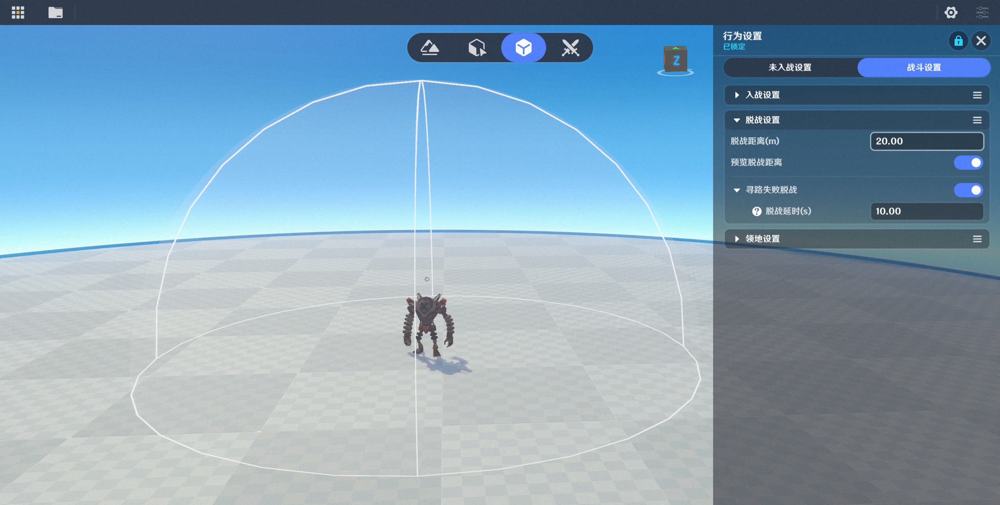

|  |  |
| --- | --- |
| 配置参数 | 说明 |
| 脱战距离(m) | 当处于战斗中的造物，和战斗目标实体之间的距离大于配置距离，造物会脱战 |
| \预览脱战距离 | 开启后，可查看配置距离 |
| 寻路失败脱战 | 当处于战斗中的造物，和战斗目标实体之间没有合法路径时，造物会脱战 |
| 脱战延时(s) | 当处于战斗中的造物，和战斗目标实体之间没有合法路径时，造物会在脱战延时后脱战 |

#### **c.领地设置**

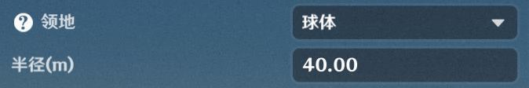

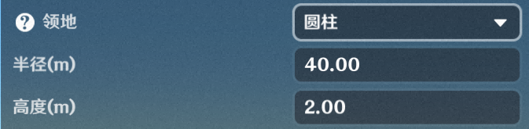

|  |  |
| --- | --- |
| 配置参数 | 说明 |
| 领地 | 支持配置无、球体、圆柱体，需要配置尺寸参数  领地以造物的创建坐标为中心，不会随造物的运动改变位置  造物的运动范围，被限制在领地内 |
| \预览领地范围 | 开启后，可查看配置的领地范围 |
| 玩家离开区域后脱战 | 开启后，战斗目标实体离开该范围，造物会触发脱战行为 |
| 脱战延时(s) | 作为战斗目标的实体离开领地范围后，造物会在脱战延时后脱战 |

### (3)详情编辑-技能

* **基础设置**

部分造物的自身逻辑参数，支持创作者(奇匠)配置，从而调节造物运行时的表现和逻辑

如图以【深渊法师】举例，提供了元素护罩强效参数，可通过修改该参数调整造物护罩的元素数值含量

* **技能设置**

枚举造物的部分技能，支持对技能的释放冷却时间做一定程度的调整。

|  |  |
| --- | --- |
| 配置参数 | 说明 |
| \技能名称 | 目前提供部分近战技能、远程技能和特殊技能的编辑 |
| 启用该技能 | 开启后，造物行为模式若包含该技能，则会进行使用；否则不会使用该技能 |
| 初始冷却区间（s） | 配置区间内随机某一时间，作为生效冷却时间  造物创生后，经过生效冷却时间之后，才会开始使用该技能 |
| 默认冷却区间（s） | 配置区间内随机某一时间，作为实际冷却时间  造物使用该技能后，在实际冷却时间内，不可以使用该技能 |

*造物技能说明全量枚举详情：[造物技能说明](造物技能说明_mhzys1ic5eok.md)

# 三、通过节点图管理造物巡逻

### **1.造物抵达巡逻路点时**

若在巡逻模板编辑中，勾选了指定路点的**到达发送节点图事件**选项，则会在满足条件时，收到该节点图事件

该节点图事件只能造物的节点图收到

|  |  |  |
| --- | --- | --- |
| 配置参数 | 数据类型 | 说明 |
| **造物实体** | 实体 | 运行时的造物实体 |
| **造物GUID** | GUID | 造物的GUID，若非初始布设的造物，则输出为空 |
| **当前巡逻模板序号** | 整型 | 造物当前生效的巡逻模板序号 |
| **当前路径索引** | 整型 | 造物当前生效的巡逻模板引用的路径索引 |
| **当前抵达路点序号** | 整型 | 造物当前抵达的路点序号 |
| **即将前往路点序号** | 整型 | 造物即将前往的路点序号 |

### **2.切换造物巡逻模板**

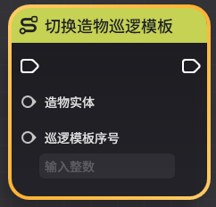

|  |  |  |
| --- | --- | --- |
| 配置参数 | 数据类型 | 说明 |
| **造物实体** | 实体 | 运行时的造物实体 |
| **巡逻模板序号** | 整型 | 造物已配置的巡逻模板序号，若入参序号的模板不存在则不会生效 |

### **3.获取当前造物的巡逻模板**

|  |  |  |
| --- | --- | --- |
| 配置参数 | 数据类型 | 说明 |
| **造物实体** | 实体 | 运行时的造物实体 |
| **巡逻模板序号** | 整型 | 造物当前生效的巡逻模板序号 |
| **路径索引** | 整型 | 造物当前生效的巡逻模板引用的全路径索引 |
| **目标路点序号** | 整型 | 造物即将前往的路点序号 |

### **4.获取默认模式的造物仇恨列**表

仅仇恨配置为【默认类型】时，该节点才会有正确的输出列表

|  |  |  |
| --- | --- | --- |
| 配置参数 | 数据类型 | 说明 |
| 造物实体 | 实体 | 运行时的造物实体 |
| 仇恨列表 | 实体列表 | 造物当前对哪些实体有仇恨，该列表是无序的 |

### **5.获取造物当前目标**

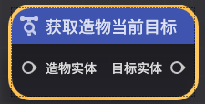

根据造物当前行为的不同，目标实体也不尽相同。

例如当造物在攻击敌方时，造物的目标为敌方指定实体。

例如当造物在对友方进行治疗时，造物的目标为友方指定实体。

|  |  |  |
| --- | --- | --- |
| 配置参数 | 数据类型 | 说明 |
| 造物实体 | 实体 | 运行时的造物实体 |
| 目标实体 | 实体 | 造物当前的智能选取目标实体 |

**