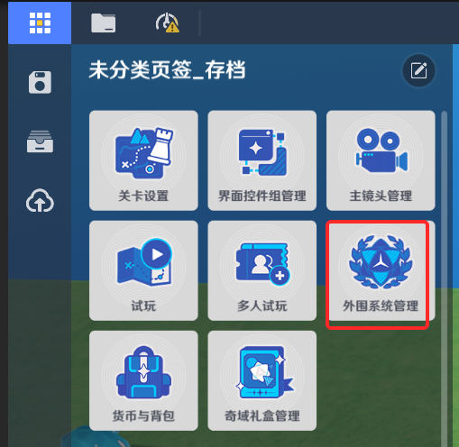

# 一、成就的功能

*成就*用于记录玩家在游戏中达成的特定目标或里程碑

其特点在于成就的累积进度可以被跨对局继承，玩家重复游玩同一个关卡时，可以不断累积成就进度，以解锁不同的成就。

关卡中的成就数量和达成条件可以由创作者(奇匠)通过成就模块自行定义

# 二、成就的编辑

从系统菜单点击【外围系统管理】，可进入外围系统设置界面

在外围系统设置界面的成就页签，即可进行成就相关的设置

一个关卡支持配置多个*普通成就*和一个*极致成就*，极致成就会在所有普通成就完成后自动达成，同时极致成就只有在至少设置了五个普通成就，并完成名称，图片配置后才可生效

*成就设置*：成就功能整体逻辑的开关和有效性设置

*是否开启成就*：是否开启成就功能a7.png)房间内游玩结算成就*：当玩家通过房间组队而非匹配来游玩本关卡时，是否允许节点图进行成就进度的设置

成就

*极致成就*：极致成就相关设置，点击右侧编辑按钮，可进入详情编辑界面

*成就名称*：成就的名称，作为展示用，可在下方的成就名称中修改

*序号*：该成就的标识方式，用于在节点图内修改成就数据时进行标识

*成就图标*：可以上传一张本地的图片作为成就的图标

## 2.普通成就

*普通成就*：点击右下方的新建成932-42cb-ad4b-cd513e367ebc.png)d8c-4aa5-9aee-1fa5d6bc165a.png)可新增一个普通成就，点击编辑按钮进行详情编辑

*成就名称*：成就的名称，作为展示用，可在下方的成就名称中修改

*序号*：该成就的标识方式，用于在节点图内修改成就数据时进行标识

*稀有度*：创作者(奇匠)可自定义该成就的稀有度，分为*耀金*、*星银*、*辉铜*

*成就计数*：可配置一个数值，每个玩家在游玩时，该成就的计数初始值为0，在游玩过程中经过节点图触发逻辑逐渐累加到此字段的配置值时，即视为完成了该成就

*成就描述*：该成就的显示描述

# 三、节点图管理成就数据

* 设置成就进度计数

* 变更成就进度计数

* 查询成就是否完成

