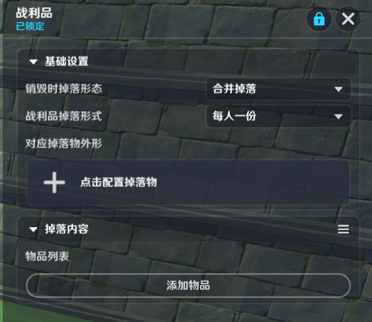

# 战利品

**URL**: https://act.mihoyo.com/ys/ugc/tutorial/detail/mh63ox06afy8

**爬取时间**: 2026-01-04 08:16:29

---

## 战利品

# 一、战利品组件的功能

战利品组件支持创作者(奇匠)配置一份固定的战利品集合模板数据，在组件的持有者被击倒时根据此份数据模板创建战利品

在设计上被推荐用于战利品相关的概念实现

战利品组件仅支持配置一份战利品模板数据

# 二、战利品组件的编辑

## 1.添加组件

(1)在实体或元件编辑界面中，打开组件编辑页签

(2)点击下方的“添加通用组件”，选择并点击“战利品”，成功添加

(3)点击“详细编辑”，展开编辑页

## 2.基础概念

### (1)基础设置

掉落表现以及掉落方式相关的配置

销毁时掉落形态：当组件的归属者被击倒时，掉落配置内的数据处理方式

分离掉落：掉落内容中的虚拟物品每一条转化成对应的掉落物进行掉落

合并掉落：掉落内容中的虚拟物品转化为一个掉落物进行掉落

战利品掉落形式：分为全员一份和每人一份

全员一份：所有玩家共享同一份掉落物，当一名玩家拾取时，其他玩家无法再次拾取

每人一份：每一个玩家的客户端会独立掉落一份该道具，玩家之间的拾取行为互不干预

对应掉落物外形：配置一个掉落物元件，掉落物是一个有物理实体的元件，当虚拟道具被创建在场景上，会以关联掉落物的模型进行展示。此处仅当选择合并掉落时生效，如果选择分离掉落，则每一个掉落物会使用道具或货币模板自身配置的关联掉落物

### (2)掉落内容

掉落的虚拟道具数据配置，点击添加物品即可配置一个虚拟物品列表

物品列表：可以选取所有已定义的道具、货币模板及数量

# 三、战利品拾取实例

# 四、节点图操作战利品组件

### 战利品组件相关执行节点

* 触发战利品掉落

* 设置战利品掉落内容

