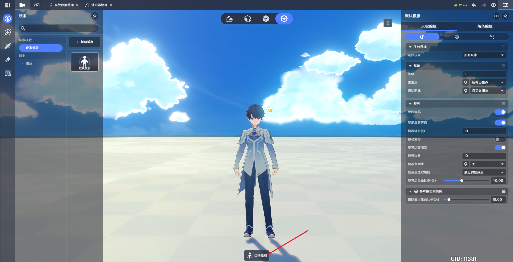
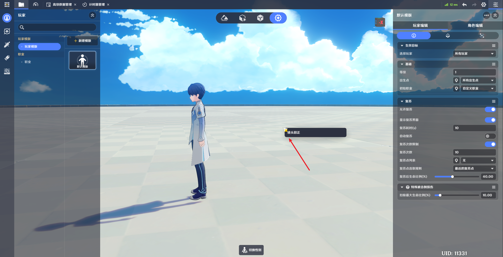

# 战斗预设

**URL**: https://act.mihoyo.com/ys/ugc/tutorial/detail/mhexhcr1qjh2

**爬取时间**: 2026-01-04 08:02:15

---

## 战斗预设

**

# 一、编辑模块切换

通过左侧边栏可切换编辑模块，从上至下分别是包含：

* 玩家与职业编辑：[玩家](玩家_mhctmgi51lpo.md)[角色](角色_mh3ecor1x5cm.md)[职业](职业_mhodlcrpht3q.md)
* 单位状态编辑：[单位状态](单位状态_mh6rh59iil2i.md)
* 技能编辑：[技能](技能_mho81frl33im.md)
* 本地投射物编辑：[本地投射物](本地投射物_mhciimiw86jg.md)
* 道具编辑：[道具](道具_mhbgx0rspbqu.md)

# 二、新建与保存

通过资产栏的新建按钮可新建当前选中编辑模块对应内容。

角色与职业编辑模块的内容修改后会自动保存，而单位状态、技能、本地投射物和道具的内容修改后需要手动进行保存。资产栏内对应内容出现黄色感叹号标识（如图所示）代表当前内容有未保存内容，可通过底部的保存按钮（如图所示）进行保存或另存为新内容。

# 三、切换性别

底部的切换性别按钮可切换模特模型的性别。

# 四、镜头回正

在战斗预设模块，右键场景空白处可呼出镜头回正选项，选择后镜头会恢复至初始状态

**