# 一、角色技能

## **1.遍历实体列表**

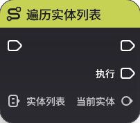

**节点功能**

遍历输入实体列表中的每个实体

**节点参数**

|  |  |  |  |
| --- | --- | --- | --- |
| **参数类型** | **参数名** | **类型** | **说明** |
| 入参 | 实体列表 | 实体列表 |  |
| 出参 | 当前实体 | 实体 |  |

## **2.播放限时特效**

**节点功能**

在指定的世界坐标位置播放限时特效

**节点参数**

|  |  |  |  |
| --- | --- | --- | --- |
| **参数类型** | **参数名** | **类型** | **说明** |
| 入参 | 特效资产配置ID | 配置ID |  |
| 入参 | 位置 | 三维向量 |  |
| 入参 | 旋转 | 三维向量 |  |
| 入参 | 缩放倍率 | 浮点数 |  |
| 入参 | 是否播放默认音效 | 布尔值 |  |

## **3.定点发射投射物**

**节点功能**

在世界坐标系的指定位置发射本地投射物

**节点参数**

|  |  |  |  |
| --- | --- | --- | --- |
| **参数类型** | **参数名** | **类型** | **说明** |
| 入参 | 投射物的元件ID | 元件ID |  |
| 入参 | 创建位置 | 三维向量 |  |
| 入参 | 创建旋转 | 三维向量 | 入参 | 追踪目标 | 实体 |  |
| 入参 | 投射物阵营 | 阵营 |  |

## **4.定点位移**

**节点功能**

定点位移，从当前位置向目标位置位移

可配置位移时长与位移速度，当这二者都比较小时，可能无法位移到目标位置

**节点参数**

|  |  |  |  |
| --- | --- | --- | --- |
| **参数类型** | **参数名** | **类型** | **说明** |
| 入参 | 位移时长 | 浮点数 |  |
| 位移衰减时长 | 浮点数 |  |
| 入参 | 位移速度 | 浮点数 |  |
| 入参 | 位移目标位置 | 三维向量 |  |
| 入参 | 碰撞是否终止位移 | 布尔值 |  |

## **5.恢复生命值**

**节点功能**

为目标实体发起一次恢复生命值

**节点参数**

|  |  |  |  |
| --- | --- | --- | --- |
| **参数类型** | **参数名** | 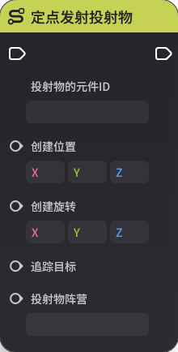* | **说明** |
| 入参 | 目标实体 | 实体 |  |
| 入参 | 恢复量 | 浮点数 |  |
| 入参 | 是否忽略恢复调整效果 | 布尔值 |  |
| 入参 | 本次治疗的仇恨倍率 | 浮点数 |  |
| 入参 | 本次治疗的仇恨增量 | 整数 |  |

## **6.镜头朝向检测数据**

**节点功能**

镜头朝向检测数据，从镜头向出射位置打射线，返回路线上合法目标的旋转与位置

**节点参数**

|  |  |  |  |
| --- | ---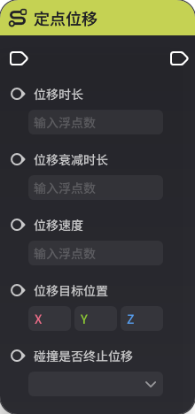- | --- |
| **参数类型** | **参数名** | **类型** | **说明** |
| 入参 | 目标类型 | 枚举 |  |
| 入参 | 出射位置 | 三维向量 |  |
| 入参 | 最近距离  |  |
| 入参 | 最远距离 | 浮点数 |  |
| 出参 | 目标旋转 | 三维向量 |  |
| 出参 | 目标位置 | 三维向量 |  |

## **7.强制退出瞄准状态**

**节点功能**

当角色处于瞄准状态是，会强制退出瞄准状态

*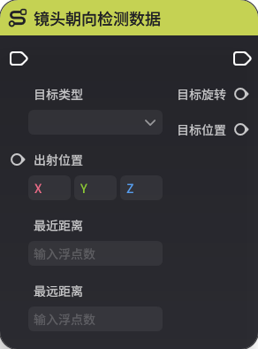**

|  |  |  |  |
| --- | --- | --- | --- |
| **参数类型** | **参数名** | **类型** | **说明** |
|  |  |  |  |

## **8.设置自身攻击目标**

**节点功能**

将目标实体设置为自身的攻击目标

**节点参数**

|  |  |  |  |
| --- | --- | --- | --- |
| **参数类型** | **参数名** | **类型** | **说明** |
| 入参 | 目标实体 | 实体 |  |
| 入参 | 是否立即转向 | 布尔值 |  |

## **9.特定位置打攻击盒**

**节点功能**

在世界坐标系的指定位置发起一次攻击盒攻击，可以设置该次攻击的各种参数

**节点参数**

|  |  |  |  |
| --- | --- | --- | --- |
| **参数类型** | **参数名** | **类型** | **说明** |
| 入参 | 目标阵营筛选 | 枚举 |  |
| 入参 | 位置 | 三维向量 |  |
| 入参 | 旋转 | 三维向量 |  |
| 入参 | 伤害系数 | 浮点数 |  |
| 入参 | 伤害增量 | 浮点数 |  |
| 入参 | 攻击盒实体类型筛选列表 | 阵营列表 |  |
| 入参 | 触发类型 | 枚举 |  |
| 入参 | 命中场景特效 | 整数 |  |
| 入参 | 攻击盒类型 | 枚举 |  |
| 入参 | 攻击盒为长方体时的缩放 | 枚举 |  |
| 入参 | 攻击盒为球体时的半径 | 布尔值 |  |
| 入参 | 攻击盒为扇形时的高度 | 浮点数 |  |
| 入参 | 攻击盒为扇形时的扇角度 | 浮点数 |  |
| 入参 | 攻击盒为扇形时的扇半径 | 浮点数 |  |
| 入参 | 攻击盒为扇形时的内半径 | 浮点数 |  |
| 入参 | 攻击盒为扇形时的检测方向 | 枚举 |  |
| 入参 | 攻击层筛选 | 枚举 |  |
| 入参 | 攻击标签列表 | 字符串列表 |  |
| 入参 | 元素类型 | 枚举 |  |
| 入参 | 元素攻击强效 | 浮点数 |  |
| 入参 | 打击类型 | 枚举 |  |
| 入参 | 攻击类型 | 枚举 |  |
| 入参 | 打断值 | 浮点数 |  |
| 入参 | 是否是绝对伤害 | 布尔值 |  |
| 入参 | 命中特效 |  |
| 入参 | 受击击退朝向 | 枚举 |  |
| 入参 | 是否屏蔽伤害跳字 | 布尔值 |  |
| 入参 | 命中场景特效偏移 | 三维向量 |  |
| 入参 | 命中场景特效旋转 | 三维向量 |  |
| 入参 | 命中场景特效缩放 | 浮点数 |  |
| 入参 | 命中特效偏移 | 三维向量 |  |
| 命中特效旋转 | 三维向量 |  |
| 入参 | 命中特效缩放 | 浮点数 |  |
| 入参 | 本次攻击的仇恨倍率 | 浮点数 |  |
| 入参 | 本次攻击的仇恨增量 | 整数 |  |
| 入参 | 受击等级 | 枚举 |  |
| 入参 | 命中水平冲量 | 浮点数 |  |
| 入参 | 命中垂直冲量 | 浮点数 |  |

## **10.添加单位状态**

**节点功能*加目标添加配置ID对应的单位状态

**节点参数**

|  |  |  |  |
| --- | --- | --- | --- |
| **参数类型** | **参数名** | **类型** | **说明** |
| 入参 | 施加目标 | 实体 |  |
| 入参 | 层数 | 整数 |  |
| 单位状态配置ID | 配置ID |  |

## **11.通知服务器节点图**

**节点功能**

通知服务器节点图，支持携带三个字符串参数

该节点运行时可以将逻辑传到服务器节点图上，在服务器节发【技能节点调用时】事件

**节点参数**

|  |  |  |  |
| --- | --- | --- | --- |
| **参数类型** | **参数名** | **类型** | **说明** |
| 入参 | 字符串1 | 字符串 |  |
| 入参 | 字符串2 | 字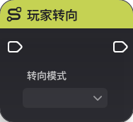 |
| 入参 | 字符串3 | 字符串 |  |

## **12.玩家转向**

**节点功能**

可以让玩家按照配置的转向模式转向

**节点参数**

|  |  |  |  |
| --- | --- | --- | --- |
| **参数类型** | **参数名**类型** | **说明** |
| 入参 | 转向模式 | 枚举 | 分为先目标后输入、输入朝向、目标朝向、先目标后镜头、镜头朝向、先输入后目标 |

## **13.玩家转向指定朝向**

**节点功能**

玩家转向三维向量配置的方向
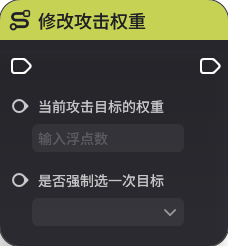参数**

|  |  |  |  |
| --- | --- | --- | --- |
| **参数类型** | **参数名** | **类型** | **说明** |
| 入参 | 朝向 | 三维向量 |  |

## **14.修改攻击权重**

**节点功能**

可以修改当前攻击目标的权重

**节点参数**

|  |  |  |  |
| --- | --- | --- | --- |
| **参数类型** | **参数名** | **类型** | **说明** |
| 入参 | 当前攻击目标的权重 | 浮点数 |  |
| 入参 | 是否强制选一次目标 | 布尔值 |  |

## **15.移除单位状态**

**节点功能**

移除目标实体上指定配置ID对应的单位状态

**节点参数**

|  |  |  |  |
| --- | --- | --- | --- |
| **参数类型** | **参数名** | **类型** | **说明** |
| 入参 | 移除目标 | 实体 |  |
| 入参 | 单位状态配置ID | 配置ID |  |

## **16.移除指定角色扰动装置**

**节点功能**

移除指定类型的角色扰动装置

**节点参数**

|  |  |  |  |
| --- | --- | --- | --- |
| **参数类型** | **参数名** | **类型** | **说明** |
| 入参 | 扰动装置类型 | 枚举 | 分为力场器、弹射器、牵引器 |

## **17.指定挂接点打攻击盒**

**节点功能**

对指定挂接点发起一次攻击盒攻击，可以设置该次攻击的各种参数

**节点参数**

|  |  |  |  |
| --- | --- | --- | --- |
| **参数类型** | **参数名** | **类型** | **说明** |
| 入参 | 目标阵营筛选 | 枚举 |  |
| 入参 | 挂接点名称 | 字符串 |  |
| 入参 | 挂接点偏移 | 三维向量 |  |
| 入参 | 挂接点旋转 | 三维向量 |  |
| 入参 | 伤害系数 | 浮点数 |  |
| 入参 | 伤害增量 | 浮点数 |  |
| 入参 | 攻击盒实体类型筛选列表 | 阵营列表 |  |
| 入参 | 触发类型 | 枚举 |  |
| 入参 | 命中场景特效 | 整数 |  |
| 入参 | 攻击盒类型 | 枚举 |  |
| 入参 | 攻击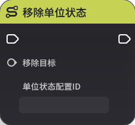时的缩放 | 枚举 |  |
| 入参 | 攻击盒为球体时的半径 | 布尔值 |  |
| 入参 | 攻击盒为扇形时的高度 | 浮点数 |  |
| 入参 | 攻击盒为扇形时的扇角度 | 浮点数 |  |
| 入参 | 攻击盒为扇形时的扇半径 |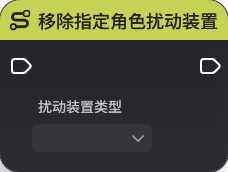|  |
| 入参 | 攻击盒为扇形时的内半径 | 浮点数 |  |
| 入参 | 攻击盒为扇形时的检测方向 | 枚举 |  |
| 入参 | 攻击层筛选 | 枚举 |  |
| 入参 | 攻击标签列表 | 字符串列表 |  |
| 入参 | 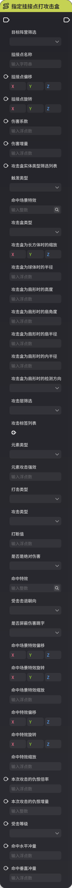| 枚举 |  |
| 入参 | 元素攻击强效 | 浮点数 |  |
| 入参 | 打击类型 | 枚举 |  |
| 入参 | 攻击类型 | 枚举 |  |
| 入参 | 打断值 | 浮点数 |  |
| 入参 | 是否是绝对伤害 | 布 |
| 入参 | 命中特效 | 整数 |  |
| 入参 | 受击击退朝向 | 枚举 |  |
| 入参 | 是否屏蔽伤害跳字 | 布尔值 |  |
| 入参 | 命中场景特效偏移 | 三维向量 |  |
| 入参 | 命中场景特效旋转 | 三维向量 |  |
| 入参 | 命中场景特效缩放 | 浮点数 |  |
| 入参 | 命中特效偏移 | 三维向量 |  |
| 入参 | 命中特效旋转 | 三维向量 |  |
| 入参 | 命中特效缩放 | 浮点数 |  |
| 入参 | 本次攻击的仇恨倍率 | 浮点数 |  |
| 入参 | 本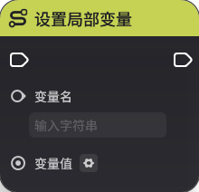恨增量 | 整数 |  |
| 入参 | 受击等级 | 枚举 |  |
| 入参 | 命中水平冲量 | 浮点数 |  |
| 入参 | 命中垂直冲量 | 浮点数 |  |

## **18.重置技能目标**

**节点功能**

重置技能目标，重新运行一次技能选取逻辑，选择一个新的目标

**节点参数**

|  |  |  |  |
| --- | ---  | --- |
| **参数类型** | **参数名** | **类型** | **说明** |
|  |  |  |  |

# 二、通用

## **1.设置局部变量**

**节点功能**

设置局部变量的值

**节点参数**

|  |  |  |  |
| --- | --- | --- | --- |
| **参数类型** | **参数名** | **类型** | **说明** |
| 变量名 | 字符串 |  |
| 入参 | 变量值 | 泛型 |  |

## **2.跳出循环**

**节点功能**

从有限循环中跳出。出引脚需要与节点【有限循环】的【跳出循环】入参相连

**节点参数**

|  |  |  |  |
| --- | --- | --- | 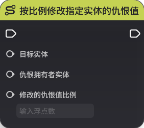
| **参数类型** | **参数名** | **类型** | **说明** |
|  |  |  |  |

## **3.有限循环**

**节点功能**

从【循环起始值】开始到【循环终止值】结束，会遍历其中的循环值，每次整数加一。每次循环会执行一次【循环体】后连接的节点逻辑。完成一次完整遍历后，会执行【循环完成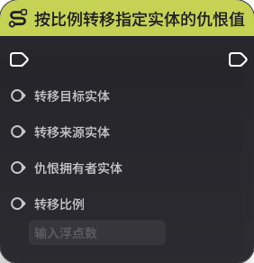节点逻辑。

可以使用【跳出循环】来提前结束该循环值遍历

**节点参数**

|  |  |  |  |
| --- | --- | --- | --- |
| **参数类型** | **参数名** | **类型** | **说明** |
| 入参 | 循环起始值 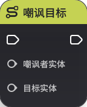|  |
| 入参 | 循环终止值 | 整数 |  |
| 出参 | 当前循环值 | 整数 |  |

# 三、自定义仇恨

## **1.按比例修改指定实体的仇恨值**

**节点功能**

仅自定义仇恨模式可用

按比例修改目标实体在指定仇恨拥有者上的仇恨值

**节点参数**

|  |  |  |  |
| --- | ---  | --- |
| **参数类型** | **参数名** | **类型** | **说明** |
| 入参 | 目标实体 | 实体 |  |
| 入参 | 仇恨拥有者实体 | 实体 |  |
| 入参 | 修改的仇恨值比例 | 浮点数 |  |

## **2.按比例转移指定实体的仇恨值**

**节点功能**

仅自定义仇恨模式可用

将仇恨拥有者上对转一定比例的仇恨转移到转移目标实体上

**节点参数**

|  |  |  |  |
| --- | --- | --- | --- |
| **参数类型** | **参数名** | **类型** | **说明** |
| 入参 | 转移目标实体 | 实体 |  |
| 入参 | 转移来源实体 | 实体 |  |
| 入参 | 仇恨拥有者实体 | 实体 |  |
| 入参 | 转移比例 | 浮点数 |  |

## **3.嘲讽目标**

**节点功能**

仅自定义仇恨模式可用

嘲讽者实体嘲讽指定目标实体

**节点参数**

|  |  |  |  |
| --- | --- | --- | --- |
| **参数类型** | **参数名** | **类型** | **说明** |
| 入参 | 嘲讽者实体 | 实体 |  |
| 入参 | 目标实体 | 实体 |  |

## **4.将目标实体移除出仇恨列表**

**节点功能**

仅自定义仇恨模式可用

将目标实体移出仇恨拥有者实体的仇恨列表，这可能导致目标实体脱战

**节点参数**

|  |  |  |  |
| --- | --- | --- | --- |
| **参数类型** | **参数名** | **类型** | **说明** |
| 入参 | 目标实体 | 实体 |  |
| 入参 | 仇恨拥有者实体 | 实体 |  |

## **5.清空指定实体的仇恨列表**

**节点功能**

仅自定义仇恨模式可用

清空指定实体的仇恨列表，这通常会导致该目标脱战

**节点参数**

|  |  |  |  |
| --- | --- | --- | --- |
| **参数类型** | **参数名** | **类型** | **说明** |
| 入参 | 目标实体 | 实体 |  |

## **6.设置指定实体的仇恨值**

**节点功能**

仅自定义仇恨模式可用

设置指定实体在仇恨拥有者实体上的仇恨值

**节点参数**

|  |  |  |  |
| --- | --- | --- | --- |
| **参数类型** | **参数名** | **类型** | **说明** |
| 入参 | 目标实体 | 实体 |  |
| 入参 | 仇恨拥有者实体 | 实体 |  |
| 入参 | 仇恨值 | 整数 |  |

## **7.修改指定实体的仇恨值**

**节点功能**

仅自定义仇恨模式可用

修改指定实体在仇恨拥有者实体上的仇恨值

**节点参数**

|  |  |  |  |
| --- | --- | --- | --- |
| **参数类型** | **参数名** | **类型** | **说明** |
| 入参 | 目标实体 | 实体 |  |
| 入参 | 仇恨拥有者实体 | 实体 |  |
| 入参 | 仇恨值增量 | 整数 |  |

# 四、信号

## **1.向服务器节点图发送信号**

**节点功能**

在技能节点图中，可以向服务器节点图发送信号，所有服务器节点图都可以监听到该信号

**节点参数**

|  |  |  |  |
| --- | --- | --- | --- |
| **参数类型** | **参数名** | **类型** | **说明** |
| 入参 | 信号名 | 字符串 |  |