# 一、通用节点

## 1.打印字符串

**节点功能**

可以在日志中输出一条字符串，一般用于逻辑检测和调试

在日志中，无论是否勾选了该节点图，逻辑成功运行时该字符串都会打印

**节点参数**

|  |  |  |  |
| --- | --- | --- | --- |
| **参数类型** | **参数名** | **类型** | **说明** |
| 入参 | 字符串 | 字符串 | 所要打印的字符串 |

## **2.设置局部变**量

**节点功能**

与查询节点【获取局部变量】连接后可以覆写该局部变量的值

**节点参数**

|  |  |  |  |
| --- | --- | --- | --- |
| **参数类型** | **参数名** | **类型** | **说明** |
| 入参 | 局部变量 | 局部变量 | 存储数据的载体 |
| 入参 | 值 | 泛型 | 所要覆写该局部变量的值 |

## **3.跳出循环**

**节点功能**

从有限循环中跳出。出引脚需要与节点【有限循环】的【跳出循环】入参相连

**节点参数**

|  |  |  |  |
| --- | --- | --- | --- |
| **参 | **参数名** | **类型** | **说明** |
|  |  |  |  |

## **4.有限循环**

**节点功能**

从【循环起始值】开始到【循环终止值】结束，会遍历其中的循环值，每次整数加一。每次循环会执行一次【循环体】后连接的节点逻辑。完成一次完整遍历后，会执行【循环完成】后连接的节点逻辑

可以使用【跳出循环】来提前结束该循环值遍历，跳出循环后也会执行【循环完成】后连接的节点逻辑

**节点参数**

|  |  |  |  |
| --- | --- | --- | --- |
| **参数类型** | **参数名** | **类型** | **说明| 入参 | 循环起始值 | 整数 | 遍历开始的整数值 |
| 入参 | 循环终止值 | 整数 | 遍历结束的整数值 |
| 出参 | 当前循环值 | 整数 | 当次执行逻辑的整数值 |

## **5.转发事件**

**节点功能**

向指定目标实体转发此节点所在的执行流的源头事件。被转发的目标实体上的同名事件会被触发

**节点参数**

|  |  |  |  |
| --- | --- | --- | --- |
| **参数类型** | **参数名** | **类型** | **说明** |
| 入参 | 目标实体 | 实体 | 被转发的目标实体 |

# 二、列表相关

## **1.对列表插入值**

**节点功能**

向指定列表的指定序号位置插入值。被插入的值在插入后会出现在列表的插入序号位置

例如：向列表[1，2，3，4]的序号2插入值5，插入后的列表为[1，2，5，3出现在序号2的位置）

**节点参数**

|  |  |  |  |
| --- | --- | --- | --- |
| **参数类型** | **参数名** | **类型** | **说明** |
| 入参 | 列表 | 泛型列表 | 被插入的列表引用 |
| 入参 | 插入序号 | 整数 | 插入值在插入后所在的序号 |
| 插入值 | 泛型 | 被插入的值 |

## **2.对列表修改值**

**节点功能**

修改指定列表的指定序号位置的值

**节点参数**

|  |  |  |  |
| --- | --- | --- | --- |
| **参数类型** | **参数名** | **类型** | **说明** |
| 入参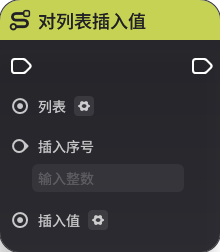 | 泛型列表 | 被修改的列表引用 |
| 入参 | 序号 | 整数 | 修改的值的序号 |
| 入参 | 值 | 泛型 | 修改的值 |

## **3.对列表移除值**

**节点功能**

移除指定列表的指定序号位置的值。这会导致该序号后的所有值向前移动一位

**节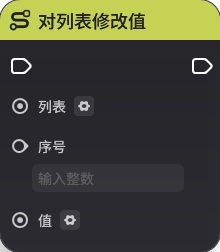

|  |  |  |  |
| --- | --- | --- | --- |
| **参数类型** | **参数名** | **类型** | **说明** |
| 入参 | 列表 | 泛型列表 | 被移除值的列表引用 |
| 入参 | 移除序号 | 整数 | 需要移除的序号 |

## **4.列表迭代循环**()

**节点功能**

按照列表顺序遍历循环指定列表

**节点参数**

|  |  |  |  |
| --- | --- | --- | --- |
| **参数类型** | **参数名** | **类型** | **说明** |
| 入参 | 迭代列表 | 泛型列表 | 被遍历循环的列表 |
| 出参 | 迭代值 | 泛型 | 列表中的每个值 |

## **5.列表排序**

**节点功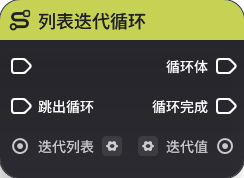将指定列表按照排序方式进行排序

**节点参数**

|  |  |  |  |
| --- | --- | --- | --- |
| **参数类型** | **参数名** | **类型** | **说明** |
| 入参 | 列表 | | 整数列表或浮点数列表 |
| 入参 | 排序方式 | 枚举 | 顺序（从小到大）或逆序（从大到小）排序 |

## **6.拼接列表**

**节点功能**

将接入列表拼接在目标列表后。例如：目标列表为[1,2,3]，接入的列表为[4,5]，在执行该节点后，目标列表会变为[1，2，3，4，5]

**节点参数**

|  |  |  |  |
| --- | --- | --- | --- |
| **参数类型**参数名** | **类型** | **说明** |
| 入参 | 目标列表 | 泛型列表 | 被接入的列表 |
| 入参 | 接入的列表 | 泛型列表 | 接入的列表会接在目标列表的尾部 |

## **7.清除列表**

**节点功能**

清空指定列表

**节点参数**

|  |  |  |  |
| --- | --- | --- | --- |
| **参数类型** | **参数名** | **类型** | **说明** |
| 入参 | 列表 | 泛型列表 | 所要清除的
# 三、自定义变量

## **1.设置节点图变量**

**节点功能**

为当前节点图内的指定节点图变量设置值

**节点参数**

|  |  |  |  |
| --- | --- | --- | --- |
| **参数类型** | **参数名** | **类型** | **说明** |
| 入参 | 变量名 | 字符串 | 节点图变量的命名，同节点图内不可重复 |
| 变量值 | 泛型 | 赋予该变量的值 |
| 入参 | 是否触发事件 | 布尔值 | 默认为是。选为否时，这次节点图变量修改不会触发节点图变量变化时事件 |

## **2.设置自定义变量**

**节点功能**

为目标实体上的指定自定义变量设置值

**节点参数**

|  |  |  |  |
| --- | ---- | --- |
| **参数类型** | **参数名** | **类型** | **说明** |
| 入参 | 目标实体 | 实体 | 该变量挂载在该实体上 |
| 入参 | 变量名 | 字符串 | 自定义变量的命名，不可重复 |
| 入参 | 变量值 | 泛型 | 赋予该变量的值 |
| 入参 | 是否触发事件 | 布尔值 | 默认为是。选为否时，这次自定义变量修改不会触发自定义变量变化时事件 |

# 四、预设状态

## **1.设置预设状态**

**节点功能**

设置指定目标实体的预设状态

**节点参数**

|  |  |  |  |
| --- | --- | --- | --- |
| **参数类型** | **参数名** | **类型** | **说明** 参 | 目标实体 | 实体 | 所要设置预设状态的实体 |
| 入参 | 预设状态索引 | 整数 | 预设状态的唯一标识 |
| 入参 | 预设状态值 | 整数 | 一般“0”为关闭，“1”为开启 |

# 五、实体相关

## **1.创建实体**

**节点功能**

根据GUID创建实体。要求预先将其布设在场景内

**节点参数**

|  |  |  |  |
| --- | --- | --- | --- |
| **参数类型** | **参数名** | **类型** | **说明** |
| 入参 | 目标GUID | GUID | 该实体的标识 |
| 入参 | 单位标签索引列表 | 整数列表 | 可决定该实体创建时携带的单位标签 |

## **2.创建元件**

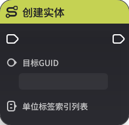

**节点功能**

根据元件ID创建一个实体

**节点参数**

|  |  |  |  |
| --- | --- | --- | --- |
| **参数类型** | **参数名** | **类型** | **说明** |
| 入参 | 元件ID | 元件ID | 该元件的标识 |
| 入参 | 位置 | 三维绝对位置 |
| 入参 | 旋转 | 三维向量 | 绝对旋转 |
| 入参 | 拥有者实体 | 实体 | 可决定该创建后实体是否归属于某个实体 |
| 入参 | 是否覆写等级 | 布尔值 | 为否时，【等级】参数不生效 |
| 入参 | 等级 | 整数 | 决定该实体创建时的等级 |
| 入参 | 单位标签索引列表 | 整数列表 | 可决定该实体创建时携带的单位标签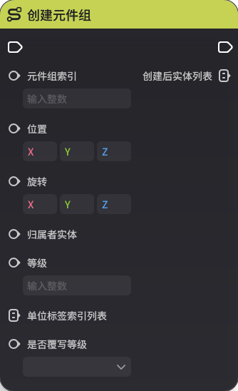出参 | 创建后实体 | 实体 | 以该方式创建的实体没有GUID |

## 3.创建元件组

**节点功能**

根据元件组索引创建该元件组内包含的实体

**节点参数**

| 参数类型 | 参数名 | 类型 | 说明 |
| --- | --- | --- | --- |
| 入参 | 元件组索引 | 整数 | 该元件组的标识 |
| 入参 | 位置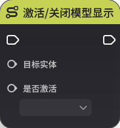向量 | 元件组中心的绝对位置 |
| 入参 | 旋转 | 三维向量 | 元件组中心的绝对旋转 |
| 入参 | 归属者实体 | 实体 | 可决定创建后实体是否归属于某个实体 |
| 入参 | 等级 | 整数 | 决定实体创建时的等级 |
| 入参 | 单位标签索引列表 | 整数列表 | 可决定实体创建时携带的单位标 入参 | 是否覆写等级 | 布尔值 | 为否时，【等级】参数不生效 |
| 出参 | 创建后实体列表 | 实体列表 | 以该方式创建的实体没有GUID |

## **4.激活/关闭模型显示**

**节点功能**

更改实体的模型可见性属性设置，从而使实体的模型可见/不可见

**节点参数**

|  |  |  |  |
|  --- | --- | --- |
| **参数类型** | **参数名** | **类型** | **说明** |
| 入参 | 目标实体 | 实体 | 所要修改的实体 |
| 入参 | 是否激活 | 布尔值 | “是”为使模型可见 |

## **5.销毁实体**

**节点功能**

销毁指定实体，会有销可以触发一些销毁后才会触发的逻辑，比如本地投射物中的生命周期结束时行为

在关卡实体上可以监听到【实体销毁时】以及【实体移除/销毁时】事件

**节点参数**

|  |  |  |  |
| --- | --- | --- | --- |
| **参数类型** | **参数名** | **类型** |** |
| 入参 | 目标实体 | 实体 | 所要销毁的实体 |

## **6.移除实体**

**节点功能**

移除指定实体，与销毁实体不同的是，不会有销毁表现，也不会触发销毁后才会触发的逻辑

移除实体不会触发【实体销毁时】事件，但可以触发【实体移除/销毁时】事件

**节点参数**

|  |  |  |  |
| --- | --- 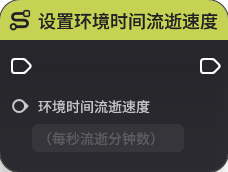 | --- |
| **参数类型** | **参数名** | **类型** | **说明** |
| 入参 | 目标实体 | 实体 | 所要移除的实体 |

# 六、关卡相关

## **1.结算关卡**

**节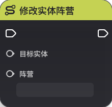

触发关卡结算流程，会按照[关卡结算](./关卡结算_mhx1du08.md)内的逻辑进行局外的逻辑结算

**节点参数**

|  |  |  |  |
| --- | --- | --- | --- |
| **参数类型** | **参数名** | **类型** | **说明** |
|  |  |  |  |

## **2.设置当前*

**节点功能**

立即切换环境时间到指定小时，参数需要是0~24之间的浮点数值

若目标小时数小于当前时间，视为天数+1

**节点参数**

|  |  |  |  |
| --- | --- | --- | --- |
| **参数类型** |名** | **类型** | **说明** |
| 入参 | 环境时间 | 浮点数 | 需要是0~24浮点数值，超出范围外时节点不生效 |

## **3.设置环境时间流逝速度**

**节点功能**

每秒流逝分钟数，会被限制在0~60之间（提瓦特速度为1）

**节点参数**

|  |  |  |  |
| ---  | --- | --- |
| **参数类型** | **参数名** | **类型** | **说明** |
| 入参 | 环境时间流逝速度 | 浮点数 | 会被限制在0~60之间，超出范围外时会按0或60生效 |

# 七、阵营相关

## **1.修改实体阵营**

**节点功能**

修改指定目标实体的阵营

***

|  |  |  |  |
| --- | --- | --- | --- |
| **参数类型** | **参数名** | **类型** | **说明** |
| 入参 | 目标实体 | 实体 | 所要修改阵营的实体 |
| 入参 | 阵营 | 阵营 | 修改后的阵营 |

# 八、玩家与角色相关

## **家**

**节点功能**

传送指定玩家实体。会根据传送距离的远近决定是否有加载界面

**节点参数**

|  |  |  |  |
| --- | --- | --- | --- |
| **参数类型** | **参数名** | **类型** | **说明** |
| 入参 | 玩家实体 | 实体 | 生效的玩家 |
| 入参 | 目标位置 | 三维向量 | 绝对位置 |
| 入参 | 目标旋转 | 三维向量 | 绝对旋转 |

## **2.复苏角色**

***

复苏指定的角色实体

**节点参数**

|  |  |  |  |
| --- | --- | --- | --- |
| **参数类型** | **参数名** | **类型** | **说明** |
| 入参 | 角色实体 | 实体 | 会被复苏的角色实体 |

## **3所有角色**

**节点功能**

复苏指定玩家的所有角色实体。在超限模式中，由于每个玩家只有一个角色，与【复苏角色】的效果相同

**节点参数**

|  |  |  |  |
| --- | --- | --- | --- |
| **参数类型** | **参数名** | **类型** | **说明** |
| 入参 | 玩家实体 | 角色归属的玩家实体 |
| 入参 | 是否扣除复苏次数 | 布尔值 | 为否时，不会扣除复苏次数 |

## **4.击倒玩家所有角色**

**节点功能**

击倒指定玩家的所有角色，会导致该玩家进入*玩家所有角色倒下状态*

**节点参数**

|  |  |  |  |
| --- | --- | --- | --- |
| **参数类型** | **参| **类型** | **说明** |
| 入参 | 玩家实体 | 实体 | 角色归属的玩家实体 |

## **5.激活复苏点**

**节点功能**

为该玩家激活指定序号的复苏点，此玩家后续触发复苏逻辑时，可以从该复苏点复苏

**节点参数**

|  |  |  |  |
| --- | --- | --- | --- |
| **参数类型**参数名** | **类型** | **说明** |
| 入参 | 玩家实体 | 实体 | 生效的玩家 |
| 入参 | 复苏点序号 | 整数 | 该复苏点的标识 |

## **6.设置玩家复苏耗时**

**节点功能**

设置指定玩家的下一次复苏的时长。如果玩家当前正，不会影响该次复苏的耗时

**节点参数**

|  |  |  |  |
| --- | --- | --- | --- |
| **参数类型** | **参数名** | **类型** | **说明** |
| 入参 | 玩家实体 | 实体 | 生效的玩家 |
| 入参 | 时长 | 整数 | 单位为秒 |

#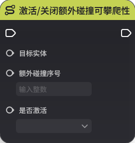.设置玩家剩余复苏次数**

**节点功能**

设置指定玩家剩余复苏次数。设置为0时，该玩家无法复苏

**节点参数**

|  |  |  |  |
| --- | --- | --- | --- |
| **参数类型** | **参数名** | **类型** | **说明** |
| 入参 | 玩家实体 | 实体 | 生效的玩家 |
| 入参 | 剩余次数 | 整数 |时，该玩家无法复苏 |

## **8.修改环境配置**

**节点功能**

使指定玩家应用指定的环境配置，运行后会立即生效

**节点参数**

|  |  |  |  |
| --- | --- | --- | --- |
| **参数类型** | **参数名** | **类型** | **说明** |
| 入参 | 环境配置索引 | 整数 | 环境配置的标识 |
| 入参 | 目标玩家列表 | 实体列表 | 只对指定玩家列表中的玩家生效 |
| 入参 | 是否启用天气配置 | 布尔值 | “是”为启用 |
| 入参 | 天气配置序号 | 整数 | 会生效该序号对应的天气配置，不存在该序号则不生效 |

## **9.允许/禁止玩家复苏**

**节点功能**

设置指定玩家是否允许复苏

**节点参数**

|  |  |  |  |
| --- | --- | --- | --- |
| **参数类型** | **参数名** | **类型** | **说明** |
| 入参 | 玩家实体 | 实体 | 生效的玩家 |
| 入参 | 是否允许 | 布尔值 | “是”则允许复苏 |

## **10.注销复苏点**

**节点功能**

为该玩家注销指定序号的复苏点。该玩家下次复苏时不会从该复苏点复苏

**节点参数**

|  |  |  |  |
| --- | --- | --- | --- |
| **参数类型** | **参数名** | **类型** | **|
| 入参 | 玩家实体 | 实体 | 生效的玩家 |
| 入参 | 复苏点序号 | 整数 | 该复苏点的标识 |

# 九、碰撞

## **1.激活/关闭额外碰撞**

**节点功能**

修改实体额外碰撞组件内的数据，使额外碰撞开启/关闭

**节点参数**

|  |  |  |  |
| --- | --- | --- | --- |
| **参数类型** | **参数名** | **类型** | **说明** |
| 入参 | 目标实体 | 实体 | 生效的实体 |
| 入参 | 额外碰撞序号 | 整数 | 该额外碰撞的标识 |
| 入参 | 是否激活 | 布尔值 | “是”为激活 |

## **2.激活/关闭额外碰撞可攀爬性**

**节点功能**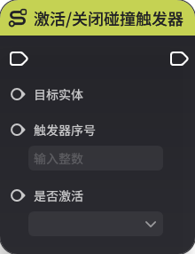体额外碰撞组件的碰撞的可攀爬性

**节点参数**

|  |  |  |  |
| --- | --- | --- | --- |
| **参数类型** | **参数名** | **类型** | **说明** |
| 入参 | 目标实体 | 实体 | 生效的实体 |
| 入参 | 额外碰撞序号 | 整数 | 该额外碰撞的标识 |
| 入参 | 是否激活 | 布尔值 | “是”为激活 |

## **3.激活/关闭原生碰撞**

**节点功能**

修改实体自带的碰撞

**节点参数**

|  |  |  |  |
| --- | --- | --- | --- |
| **参数类型** | **参数名** | **类型** | **说明** |
| 入参 | 目标实体 | 实体 | 生效的实体 |
| 入参 | 是否激活 | 布尔值 |激活 |

## **4.激活/关闭原生碰撞可攀爬性**

**节点功能**

修改实体自带的碰撞的可攀爬性

**节点参数**

|  |  |  |  |
| --- | --- | --- | --- |
| **参数类型** | **参数名** | **类型** | **说明** |
| 入参 | 目标实体 | 实体 | 生效的实体 |
| 入参 | 是否激活 | 布尔值 | “是”为激活 |

# 十、碰撞触发器

## **1.激活/关闭碰撞触发器**

**节点功能**

修改碰撞触发器组件的数据，使某一个序号的触发器激活/关闭

**节点参数**

|  |  |  |  |
| --- | --- | --- | --- |
| **参数类型** | **参数名** | **类型** | **说明** |
| 入参 | 目标实体 | 实体 | 生效的实体 |
| 入参 | 触发器序号 | 整数 | 该碰撞触发器的标识 |
| 入参 | 是否激活 | 布尔值 | 活 |

# 十一、战斗

## **1.发起攻击**

**节点功能**

使指定实体发起攻击。使用该节点的实体上需要有对应的能力单元配置。

分为两种使用方式：

当能力单元为【攻击盒攻击】时，会以目标实体的位置为基准，打出一次攻击盒攻击

当能力单元为【直接攻击】时，会直接攻击目标实体

**节点参数**

|  |  ||
| --- | --- | --- | --- |
| **参数类型** | **参数名** | **类型** | **说明** |
| 入参 | 目标实体 | 实体 | 根据能力单元不同，可以视为攻击盒位置的基准目标或攻击对象 |
| 入参 | 伤害系数 | 浮点数 | 该次攻击造成伤害的系数 |
| 入参 | 伤害增量 | 浮点数 | 该次攻击造成伤害的增量 |
| 入参 | 位置偏移 | 三维向量 | 使用【攻击盒攻击】时，决定了攻击盒的偏移 使用【直接攻击】时，决定了该次攻击的判定位置，影响受击特效等的创建位置 |
| 入参 | 旋转偏移 | 三维向量 | 使用【攻击盒攻击】时，决定了攻击盒的旋转 使用【直接攻击】时，决定了该次攻击的判定位置，影响受击特效等的旋 入参 | 能力单元 | 字符串 | 引用的能力单元，需要配置在此节点图所关联的实体上 |
| 入参 | 是否覆写能力单元配置 | 布尔值 | 为“是”时，伤害系数、伤害增量、位置偏移、旋转偏移这四个系数会覆写能力单元中的同名配置。为“否”时，则使用能力单元中的配置 |
| 入参 | 发起者实体 | 实体 | 决定了该次攻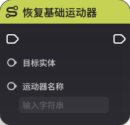实体，默认为该节点图所关联的实体。影响【攻击命中时】、【受到攻击时】等事件中判定的攻击者 |

## **2.恢复生命**

**节点功能**

通过能力单元为指定目标实体恢复生命

**节点参数**

|  |  |  |  |
| --- | --- | --- | --- |
| **参数类型** | **参数名** | **类型** | **说明** |
| 入参 | 目标实体 | 实体 | 恢复生命的目标 |
| 入参 | 恢浮点数 | 该次恢复生命的恢复量 |
| 入参 | 能力单元 | 字符串 | 引用的能力单元。需要配置在此节点图所关联的实体上 |
| 入参 | 是否覆写能力单元配置 | 布尔值 | 为“是”时，恢复量会覆盖能力单元中的同名配置。为“否”时，使用能力单元中的配置 |
| 入参 | 恢复发起者实体 | 实体 | 决定了该次恢复行为的发起者实体，默认为该节点图所关联的实体。影响【被恢复生命值时】、【发起恢复生命值时】等事件中判定的恢复者 |

##损失生命**

**节点功能**

使指定目标直接损失生命。损失生命不是攻击，因此不会触发攻击相关的事件

**节点参数**

|  |  |  |  |
| --- | --- | --- | --- |
| **参数类型** | **参数名** | **类型** | **说明** |
| 入参 | 目标实体 | 实体 | 损失生命的目标 |
| 入参 | 生命损失量 | 浮点数 | 该次损失生命值的损失量 |
| 入参 | 是否致命 | 布尔值 | 为“否”时，该次损失生命最多扣为1点 |
| 入参 | 是否可被无敌抵挡 | 布尔值 | 为“是”时，如果目标已经通过单位状态设置为了无敌，则损失生命不生效 |
| 入参 | 是否可被锁定生命值抵挡 | 布尔值 | 为“是”时，如果目标已经通过单位状态设置为了锁定生命值，则损失生命不生效 |
| 入参 | 伤害跳字类型 | 枚举 | 无跳字  普通跳字  暴击跳字 |

## **4.直接恢复生命**

**节点功能**

直接恢复指定实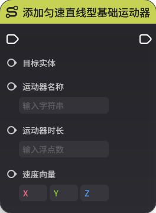命。与【恢复生命】不同的是，此节点不需要使用能力单元

**节点参数**

|  |  |  |  |
| --- | --- | --- | --- |
| **参数类型** | **参数名** | **类型** | **说明** |
| 入参 | 恢复发起实体 | 实体 | 发起恢复的实体 |
| 入参 | 恢复目标实体 | 实体 | 恢复的目标实 入参 | 恢复量 | 浮点数 | 该次恢复生命的恢复量 |
| 入参 | 是否忽略恢复量调整 | 布尔值 | 为“是”时，该次恢复量不受目标的恢复量调整类的单位状态的影响 |
| 入参 | 产生仇恨的倍率 | 浮点数 | 此次恢复产生的仇恨倍率。仅使用自定义仇恨模式时有意义 |
| 入参 | 产生仇恨的增量 | 浮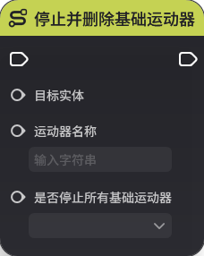此次恢复产生的仇恨增量。仅使用自定义仇恨模式时有意义 |
| 入参 | 治疗标签列表 | 字符串列表 | 此次恢复行为的标签列表。在【发起恢复生命值】时以及【被恢复生命值时】事件中可以取出，用于判定一次特定的恢复行为 |

# 十二、运动器

## **1.恢复基础运动器**

**节点功能**

使目标实体上一个处于暂停状态的基础运动器恢复运动，需要目标实体持有基础运动器组件

**节点参数**

|  |  |  |  |
| --- | --- | --- | --- |
| **参数类型** | **参数名** | **类型** | **说明** |
| 入参 | 目标实体 | 实体 | 生效的实体 |
| 入参 | 运动器名称 | 字符串 | 该运动器的标识 |

## **2.开启定点运动器

**节点功能**

在关卡运行时为目标实体动态添加一个定点运动型基础运动器

**节点参数**

|  |  |  |  |
| --- | --- | --- | --- |
| **参数类型** | **参数名** | **类型** | **说明** |
| 入参 | 目标实体 | 实体 | 生效的实体 |
| 入参 | 运动器名称 | 字符串 | 该运动器的标识 |
| 入参 | 移动方式 | 枚举 |  |
| 入参 | 移动速度 | 浮点数 |  |
| 入参 | 目标位置 | 三维向量 | 绝对位置 |
| 入参 | 目标旋转 | 三维向量 | 绝对旋转 |
| 入参 | 是否锁定旋转 | 布尔值 |  |
| 入参 | 参数类型 | 枚举 | 分为固定速度、固定时间 |
| 入参 | | 浮点数 |  |

## **3.激活基础运动器**

**节点功能**

激活一个配置在目标实体基础运动器组件上的运动器

**节点参数**

|  |  |  |  |
| --- | --- | --- | --- |
| **参数类型** | **参数名** | **类型** | **说明** |
| 入参 | 目标实体 | 实体 | 生效的实体 |
| 入参 | 运动器名称 | 字符串 | 该运动器的标识 |

## **4.添加朝向目标旋转型基础运动器**

**节点功能**

在关卡运行时为目标实体动态添加一个朝向目标旋转型基础运动器

**节点参数**

|  |  |  |  |
| --- | --- | --- | --- |
| **参数类型** | **参数名** | **类型** | **说明** |
| 入参 | 目标实体 | 实体 | 生效的实体 |
| 入参 | 运动器名称 | 字符串 | 该运动器的标识 |
| 入参 | 运动器时长 | 浮点数 | 该运动器生效的时长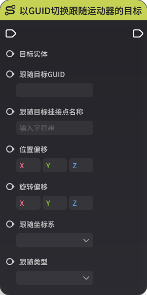入参 | 目标角度 | 三维向量 | 绝对角度 |

## **5.添加匀速直线型基础运动器**

**节点功能**

在运行时动态添加一个匀速直线型基础运动器

**节点参数**

|  |  |  |  |
| --- | --- | --- | --- |
| **参数类型** | **参数名** | **类型** | **说明** |
| 入参 | 目标实体 | 实体 | 生效的实体 |
| 入参 | 运动器名称 | 字符串 | 该运动器的标识 |
| 入参 | 运动器时长 | 浮点数 | 该运动器生效的时长 |
| 入参 | 速度向量 | 三维向量 | 决定了速度大小和方向 |

## **6.添加匀速旋转型基础运动器**

**节点功能**

在运行时动态添加一个匀速旋转型基础运动器

**节点参数**

|  |  |  |  |
| --- | --- | --- | --- |
| **参数类型** | **参数名** | **类型** | * |
| 入参 | 目标实体 | 实体 | 生效的实体 |
| 入参 | 运动器名称 | 字符串 | 该运动器的标识 |
| 入参 | 运动器时长 | 浮点数 | 该运动器生效的时长 |
| 入参 | 角速度(角度/秒) | 浮点数 | 角速度大小 |
| 入参 | 旋转轴朝向 | 三维向量 | 相对朝向 |

7.停止并删除基础运动器**

**节点功能**

停止并删除一个运行中的运动器

**节点参数**

|  |  |  |  |
| --- | --- | --- | --- |
| **参数类型** | **参数名** | **类型** | **说明** |
| 入参 | 目标实体 | 实体 | 生效的实体 |
| 入参 | 运动器名称 | 字符串 | 该运动器的标识 |
| 入参 | 是否停止所有基础运动器 | 布尔值 | “是”则停止该实体上的所有基础运动器，“否”则只停止与运动器名称对应的运动器 |

## **8.暂停基础运动器**

**节点功能**

暂停一个运行中的运动器，之后可使用恢复运动器节点使其恢复运动

**节点参数**

|  |  |  |  |
| --- | --- | --- | --- |
| **参数类型** | **参数名** | **类型** | **说明** |
| 入参 | 目标实体 | 实体 | 生效的实体 |
| 入参 | 运动器名称 | 字符串 | 该运动器的标识 |

# 十三、跟随运动器

## **1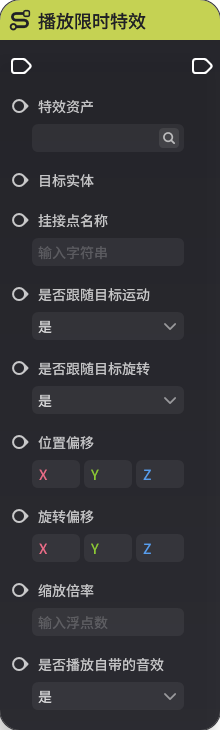闭跟随运动器**

**节点功能**

使目标实体上的跟随运动器组件逻辑激活/关闭

**节点参数**

|  |  |  |  |
| --- | --- | --- | --- |
| **参数类型** | **参数名** | **类型** | **说明** |
| 入参 | 目标实体 | 实体 | 生效的实体 |
| 入参 | 是否激活 | 布尔值 | “是”为激活 |

## **2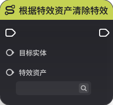D切换跟随运动器的目标**

**节点功能**

以GUID切换跟随运动器的跟随目标

**节点参数**

|  |  |  |  |
| --- | --- | --- | --- |
| **参数类型** | **参数名** | **类型** | **说明** |
| 入参 | 目标实体 | 生效的实体 |
| 入参 | 跟随目标GUID | GUID | 跟随目标的标识 |
| 入参 | 跟随目标挂接点名称 | 字符串 | 跟随的挂接点名称 |
| 入参 | 位置偏移 | 三维向量 | 以【跟随坐标系】为基准产生的位置偏移 |
| 入参 | 旋转偏移 | 三维向量 | 以【跟随坐标系】为基准产生的旋转偏移 |
| 入参 | 跟随坐标系 | 枚举 | 可选”相对坐标系“、”世界坐标系“ |
| 入参 | 跟随类型 | 枚举 | 可选”完全跟随“、”跟随位置“、”跟随旋转” |

## **3.以实体切换跟随运动器的目标**

**节点功能**

以实体切换跟随运动器的跟随目标

**节点参数**

|  |  |  |  |
| --- | --- | --- | --- |
| **参数类型** | **参数名** | **类型** | **说明** |
| 入参 | 目标实体 | 实体 | 生效的实体 |
| 入参 | 跟随目标实体 | 实体 | 跟随目标的实体 |
| 入参 | 跟随目标挂接点名称 | 字符串 | 跟随的挂接点名称 |
| 入参 | 位 三维向量 | 以【跟随坐标系】为基准产生的位置偏移 |
| 入参 | 旋转偏移 | 三维向量 | 以【跟随坐标系】为基准产生的旋转偏移 |
| 入参 | 跟随坐标系 | 枚举 | 可选”相对坐标系“、”世界坐标系“ |
| 入参 | 跟随类型 | 枚举 | 可选”完全跟随“、”跟随位置“、”跟随旋转” |

# 十四、投射物

## *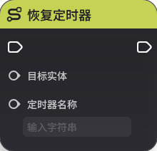投射物**

**节点功能**

根据元件ID创建一个投射物实体。与【创建元件】功能类似，但多一个【追踪目标】参数，可以为创建的投射物实体的投射运动器组件中追踪投射类型设置追踪目标

**节点参数**

|  |  |  |  |
| --- | --- | --- | --- |
| **参数类型** | ** | **类型** | **说明** |
| 入参 | 元件ID | 元件ID | 该投射物元件的标识 |
| 入参 | 位置 | 三维向量 | 绝对位置 |
| 入参 | 旋转 | 三维向量 | 绝对旋转 |
| 入参 | 拥有者实体 | 实体 | 可决定该创建后实体是否归属于某个实体 |
| 入参 | 追踪目标 | 实体 | 投射运动器组件中追踪投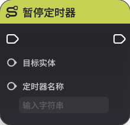的追踪目标 |
| 入参 | 是否覆写等级 | 布尔值 | 为否时，【等级】参数不生效 |
| 入参 | 等级 | 整数 | 决定该实体创建时的等级 |
| 入参 | 单位标签索引列表 | 整数列表 | 可决定该实体创建时携带的单位标签 |
| 出参 | 创建出的实体 | 实体 | 该实体继承该投射物元件的属性 |

# 十五、特效

## **1.播放限时特效**

**节点功能**

以目标实体为基准，播放一个限时特效。需要有合法的目挂接点

**节点参数**

|  |  |  |  |
| --- | --- | --- | --- |
| **参数类型** | **参数名** | **类型** | **说明** |
| 入参 | 特效资产 | 配置ID | 该特效的标识 |
| 入参 | 目标实体 | 实体 | 实体不存在会导致特效无法播放 |
| 入参 | 挂接点名称 | 字符串 | 挂接点名称不存在会导致特效无法播放 |
| 入参 | 是否跟随目标运动 | 布尔值 | “是”会跟随目标实体运动 |
| 入参 | 是否跟随目标旋转 | 布尔值 | “是”会跟随目标实体旋转 |
| 入参 | 位置偏移 | 三维向量 | 相对于目标实体指定挂接点的位置偏移 |
| 入参 | 旋转偏移 | 三维向量 | 相对于目标实体指定挂接点的旋转偏移 |
| 入参 | 缩放倍率 | 浮点数 | 该特效的缩放倍率 |
| 入参 | 是否播放自带的音效 | 布尔值 | “时播放自带的音效 |

## **2.根据特效资产清除特效**

**节点功能**

清除指定目标实体上所有使用该特效资产的特效。仅限循环特效

**节点参数**

|  |  |  |  |
| --- | --- | --- | --- |
| **参数类型** | **参数名** | **类型** | **说明** |
| 入参 | 目标实体 | 实体 | 生效的实体 |
| 入参 | | 配置ID | 该特效的标识 |

## **3.挂载循环特效**

**节点功能**

以目标实体为基准，挂载一个循环特效。需要有合法的目标实体以及挂接点

该节点会返回一个特效实例ID，可以将其存下。后续使用【清除循环特效】节点时，用这个特效实例ID来清除指定的循环特效

**节点参数**

|  |  |  |  |
| --- | ---- | --- |
| **参数类型** | **参数名** | **类型** | **说明** |
| 入参 | 特效资产 | 配置ID | 该特效的标识 |
| 入参 | 目标实体 | 实体 | 实体不存在会导致特效无法播放 |
| 入参 | 挂接点名称 | 字符串 | 挂接点名称不存在会导致特效无法播放 |
| 入参 | 是否跟随目标运尔值 | “是”会跟随目标实体运动 |
| 入参 | 是否跟随目标旋转 | 布尔值 | “是”会跟随目标实体旋转 |
| 入参 | 位置偏移 | 三维向量 | 相对于目标实体指定挂接点的位置偏移 |
| 入参 | 旋转偏移 | 三维向量 | 相对于目标实体指定挂接点的旋转偏移 |
| 入参 | 缩放倍率 | 浮点数 | 该特效的缩放倍率 |
| 出参 例ID | 整数 | 挂载该特效时自动生成的实例ID |

## **4.清除循环特效**

**节点功能**

根据特效实例ID清除目标实体上的指定循环特效。【挂载循环特效】节点在成功挂载后，会生成一个特效实例ID

**节点参数**

|  |  |  |  |
| --- | --- | --- | --- |
| **参数类型** | **参数名** | **类型** | **说明** |
| 入参 | 特效实例ID | 整数 | 【挂载循环特效】节点中自动生成的实例ID |
| 入参 | 目标实体 | 实体 | 生效的实体 |

# 十六、定时器

## **1.恢复定时器**

**节点功能**

使目标实体上一个处于暂停状态的定时器恢复运行

**节点参数**

|  |  |  |  |
| --- | --- | --- | --- |
| **参数类型** | **参数名** | **类型** | **说明** |
| 入参 | 目标实体 | 实体 | 生效的实体 |
| 入参 | 定时器名称 | 字符串 | 该定时器的标识 |

## **2.启动定时器**

点功能**

在目标实体上启动一个定时器

定时器通过定时器名称进行唯一标识

定时器由一个循环或不循环的定时器序列组成。定时器序列应是一组从小到大排列的，以秒为单位的时间点，在定时器运行到这些时间点时，会触发【定时器触发时】事件。该定时器序列最大限制为100

例如：[1,3,5,7]，如果传入这样的定时器序列，那么分别在第1、3、5、7秒，会触发【定时器触发时】事件

当是否循环为“是”时，在定时器到达最后一个时间点后，会从0秒开始进行循环计时。以[1,3,5,7]这样的定时器为例，则在运行到7秒后，再从0秒开始计时

**节点参数**

|  |  |  |  |
| --- | --- | --- | --- |
数类型** | **参数名** | **类型** | **说明** |
| 入参 | 目标实体 | 实体 | 生效的实体 |
| 入参 | 定时器名称 | 字符串 | 该定时器的标识 |
| 入参 | 是否循环 | 布尔值 | “是”则会循环执行定时器序列 |
| 入参 | 定时器序列 | 浮点数列表 | 需要传入一个从小到大排列的列表。如果传入的列表不合法（不是严格按照从小到大排列、存在负数等），定时器不会运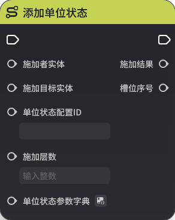## **3.暂停定时器**

**节点功能**

暂停指定目标实体上的指定定时器。之后可以使用【恢复定时器】节点恢复该定时器的计时

**节点参数**

|  |  |  |  |
| --- | --- | --- | --- |
| **参数类型** | **参数名** | **类型** | **说明** |
| 入参 | 目标实体 | 实体的实体 |
| 入参 | 定时器名称 | 字符串 | 该定时器的标识 |

## **4.终止定时器**

**节点功能**

完全终止目标实体上的指定定时器，不可恢复

**节点参数**

|  |  |  |  |
| --- | --- | --- | --- |
| **参数类型**参数名** | **类型** | **说明** |
| 入参 | 目标实体 | 实体 | 生效的实体 |
| 入参 | 定时器名称 | 字符串 | 该定时器的标识 |

# 十七、全局计时器

## **1.恢复全局计时器**

**节点功能**

使目标实体上一个处于暂停状态的计时器恢复运行

***

|  |  |  |  |
| --- | --- | --- | --- |
| **参数类型** | **参数名** | **类型** | **说明** |
| 入参 | 目标实体 | 实体 | 生效的实体 |
| 入参 | 计时器名称 | 字符串 | 该计时器的标识，只能引用在计时器管理中已经配置好的计时器名称 |

## **2计时器**

**节点功能**

在目标实体上启动一个全局计时器

目标实体上的计时器，通过计时器名称进行唯一标识

计时器根据计时器管理中的配置，会对应创生倒计时、正计时的计时器

**节点参数**

|  |  |  |  |
| --- | --- | --- | --- |
| **参数类型** | **参数名** | **类型**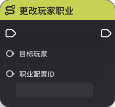说明** |
| 入参 | 目标实体 | 实体 | 生效的实体 |
| 入参 | 计时器名称 | 字符串 | 该计时器的标识，只能引用在计时器管理中已经配置好的计时器名称 |

## **3.修改全局计时器**

**节点功能**

通过节点图，可以将运行中的全局计时器时间进行调整

若计时器先暂停，后修，则修改后时间最少为0s

若为倒计时，则暂停后修改时间为0s且恢复计时器后，会触发【全局计时器触发时】事件

若计时器先暂停，后修改时间到0s，再修改增加时间，再恢复计时器，则不会触发【全局计时器触发时】事件

若有界面控件引用对应计时器，则界面控件的计时表现会同步修改

**节点参数**

|  |  |  |  |
| --- | --- | --- | --- |
| **参数类型** | **参数名** | **类型** | **说明** |
| 目标实体 | 实体 | 生效的实体 |
| 入参 | 计时器名称 | 字符串 | 该计时器的标识，只能引用在计时器管理中已经配置好的计时器名称 |
| 入参 | 变化值 | 浮点数 | 若计时器为倒计时，则正数为增加倒计时剩余时间，负数为减少剩余时间  若计时器为正计时，则正数为增加正计时累计时间，负数为减少累计时间 |

## **4.暂停全局计时器**

**节点功能**
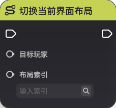图，可以暂停运行中的全局计时器

暂停时，若有界面控件引用对应计时器，则其显示时间也会暂停

**节点参数**

|  |  |  |  |
| --- | --- | --- | --- |
| **参数类型** | **参数名** | **类型** | **说明** |
| 入参 | 目标实体 | 实体 | 生效的实体 |
| 入参 | 计时器名称 | 字符串 | 该计时器的标识，只能引用在计时器管理中已经配置好的计时器名称 |

## **5.终止全局计时器**

**节点功能**

通过节点图，提前结束运行中的全局计时器

**节点参数**

|  |  |  |  |
| --- | ---- | --- |
| **参数类型** | **参数名** | **类型** | **说明** |
| 入参 | 目标实体 | 实体 | 生效的实体 |
| 入参 | 计时器名称 | 字符串 | 该计时器的标识，只能引用在计时器管理中已经配置好的计时器名称 |

# 十八、镜头

## **1.切换主镜头模板**

**节点功能**

使目标玩家列表的镜头模板切换至指定模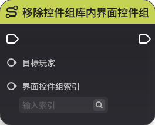节点参数**

|  |  |  |  |
| --- | --- | --- | --- |
| **参数类型** | **参数名** | **类型** | **说明** |
| 入参 | 目标玩家列表 | 实体列表 | 生效的玩家列表 |
| 入参 | 镜头模板名称 | 字符串 | 镜头模板的标识 |

# 十九、角色扰动装置

## **1.修改角色扰动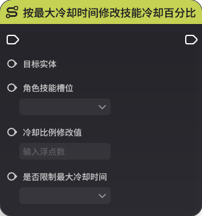

**节点功能**

通过序号修改目标实体上生效的角色扰动装置，若序号不存在则此次修改不生效

**节点参数**

|  |  |  |  |
| --- | --- | --- | --- |
| **参数类型** | **参数名** | **类型** | **说明** |
| 入参 | 目标实体 | 实体 | 生效的实体 |
| 入参 | 装置序号 | 整数 | 角色扰动装置的标识 |

# 二十、单位状态

## **1.添加单位状态**

**节点功能**

向指定目标实体添加一定层数的单位状态

**节点参数**

|  |  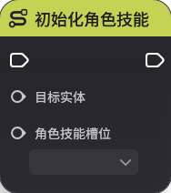 |
| --- | --- | --- | --- |
| **参数类型** | **参数名** | **类型** | **说明** |
| 入参 | 施加者实体 | 实体 | 决定了该次行为的施加者实体，默认为该节点图所关联的实体 |
| 入参 | 施加目标实体 | 实体 | 实际被添加该单位状态的实体 |
| 入参 | 单位状态配置ID | 配置ID | 该单位状态的标识 |
| 入参 | 施加层数 | 整数 | 该单位状态的层数 |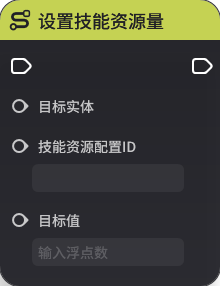 | 单位状态参数字典 | 字典 | 可以携带一组参数，用于覆写单位状态中的参数，目前仅支持对护盾中护盾模板的参数覆写 |
| 出参 | 施加结果 | 枚举 | 失败，其他异常  失败，让位于其他状态：目标上已有的单位状态与尝试施加的状态之间有让位关系  失败，超出并存上限：超出目标实体上的指定单位状态的并存上限  失败，附加叠层未成功：叠层失败  成功，施加新状态：成功附加新状态  成功，槽位叠层：目单位状态，叠层 |
| 出参 | 槽位序号 | 整数 | 如果施加成功，则返回一个该单位状态实例所在的单位状态槽位序号 |

## **2.移除单位状态**

**节点功能**

从目标实体上移除指定单位状态。可以选择全部移除，或移除其中一层

**节点参数**

|  |  |  |  |
| --- | --- | --- | --- |
| **参数类型** | **参数名** | **类型** | **说明** |
| 入参 | 移除目标实体 | 实体 | 被移除该单位状态的实体 |
| 入参 | 单位状态配置ID | 配置ID | 该单位状态的标识 |
| 入参 | 移除方式 | 枚有同名并存状态：移除以该配置ID施加的所有同名状态  最快丢失叠加层数的状态：移除最快丢失叠加层数的一层状态 |
| 入参 | 移除者实体 | 实体 | 决定了该次行为的移除者实体，默认为该节点图所关联的实体 |

# 二十一、选项卡

## **1.激活/关闭选项卡**

**节点功能**

可以修改目标实体的选项卡组件中对应序号的选项卡状态

**节点参数**|  |  |  |
| --- | --- | --- | --- |
| **参数类型** | **参数名** | **类型** | **说明** |
| 入参 | 目标实体 | 实体 | 生效的实体 |
| 入参 | 选项卡序号 | 整数 | 选项卡的标识 |
| 入参 | 是否激活 | 布尔值 | 为“是”则激活，可以被选取 |
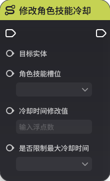二、碰撞触发源

## **1.激活/关闭碰撞触发源**

**节点功能**

可以修改目标实体的碰撞触发源组件状态

**节点参数**

|  |  |  |  |
| --- | --- | --- | --- |
| **参数类型** | **参数名**类型** | **说明** |
| 入参 | 目标实体 | 实体 | 生效的实体 |
| 入参 | 是否激活 | 布尔值 | 为“是”则激活，可以与携带碰撞触发器组件的实体产生碰撞 |

# 二十三、职业

## **1.更改玩家当前职业等级**

**节点功能**

修改玩家当前职业等级，若超出定义的等级范围则会失效

**节点参数**

|  |  |  |  |
| --- |  --- | --- |
| **参数类型** | **参数名** | **类型** | **说明** |
| 入参 | 目标玩家 | 实体 | 生效的玩家实体 |
| 入参 | 等级 | 整数 | 修改后的等级 |

## **2.更改玩家职业**

**节点功能**

修改玩家的当前职D对应的职业

**节点参数**

|  |  |  |  |
| --- | --- | --- | --- |
| **参数类型** | **参数名** | **类型** | **说明** |
| 入参 | 目标玩家 | 实体 | 生效的玩家实体 |
| 入参 | 职业配置ID | | 该职业的标识 |

## **3.提升玩家当前职业经验**

**节点功能**

提升玩家当前职业经验，超出最大等级的部分会无效

**节点参数**

|  |  |  |  |
| --- | --- | --- | --- |
| **参数类型** | **参数名** | **类型** | **说明** |
| 入参 | 目标玩家 | 实体 | 生效的玩家实体 |
| 入参 | 经验值 | 所要提升的经验值 |

# 二十四、界面控件组

## **1.激活控件组库内界面控件组**

**节点功能**

可以在目标玩家的界面布局上激活处于界面控件组库内的以自定义模板形式存在的界面控件组

**节点参数**

|  |  |  |  |
| --- | --- | --- | --- |
| **参数类型** | **参数名** | **类型** | **说明** |
| 入参 | 目标玩家 | 实体 | 生效的玩家实体 |
| 入参 | 界面控件组索引 | 整数 | 界面控件组的标识 |

## **2.切换当前界面布局**

**节点功能**

可以通过布局索引来切换目标玩家当前的界面布局

**节点参数**

|  |  |  |  |
| --- | --- | --- | --- |
| **参数类型** |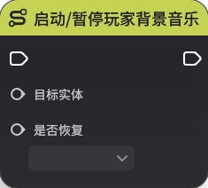名** | **类型** | **说明** |
| 入参 | 目标玩家 | 实体 | 生效的玩家实体 |
| 入参 | 布局索引 | 整数 | 界面布局的标识 |

## **3.修改界面布局内界面控件状态**

**节点功能**

通过界面控件索引来修改目标玩家界面布局内对应界面控件的状态

**节点参数**

|  |  |  |  |
|  --- | --- | --- |
| **参数类型** | **参数名** | **类型** | **说明** |
| 入参 | 目标玩家 | 实体 | 生效的玩家实体 |
| 入参 | 界面控件索引 | 整数 | 界面控件的标识 |
| 入参 | 显示状态 | 枚举 | 关闭：不可见且逻辑不运行  开启：可见+逻辑正常运行  隐藏：不可见+逻辑正常运行 |

## **4.移除控件组库内界面控件组**

**节点功能**

可以在目标玩家的界面布局上移除已通过节点【激活控件组库内界面控件组】激活的界面控件组

**节点参数**

|  |  |  |  |
| --- | --- | --- | --- |
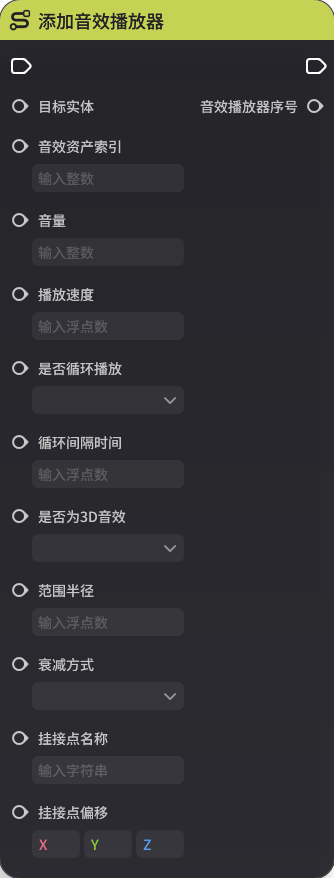数类型** | **参数名** | **类型** | **说明** |
| 入参 | 目标玩家 | 实体 | 生效的玩家实体 |
| 入参 | 界面控件组索引 | 整数 | 界面控件组的标识 |

# 二十五、技能
*1.按最大冷却时间修改技能冷却百分比**

**节点功能**

通过技能最大冷却时间的百分比来修改角色某个技能槽位内的技能

**节点参数**

|  |  |  |  |
| --- | --- | --- | --- |
| **参数类型** 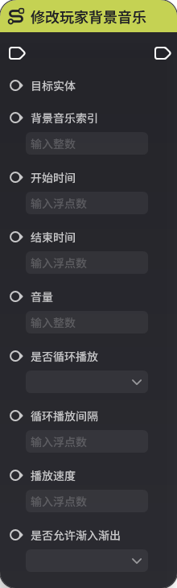数名** | **类型** | **说明** |
| 入参 | 目标实体 | 实体 | 生效的角色实体 |
| 入参 | 角色技能槽位 | 枚举 | 要修改的技能所在的槽位，分为普通攻击、技能1-E、技能2-Q、技能3-R、技能4-T和自定义技能 |
| 入参 | 冷却比例修改值  | 修改后的实际冷却时间为：原冷却时间\*冷却比例修改值 |
| 入参 | 是否限制最大冷却时间 | 布尔值 | 为“是”可以限制修改后的冷却时间不小于所限制的值 |

## **2.初始化角色技能**

**节点功能**

使目标角色的技能重置为职业模板上配置的技能

**节点参数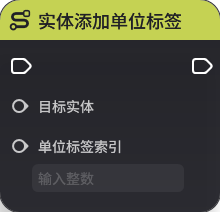  |  |  |  |
| --- | --- | --- | --- |
| **参数类型** | **参数名** | **类型** | **说明** |
| 入参 | 目标实体 | 实体 | 生效的角色实体 |
| 入参 | 角色技能槽位 | 枚举 | 要初始化的技能所在的槽位，分为普通攻击、技能1-E、技能2-Q、技能3-R、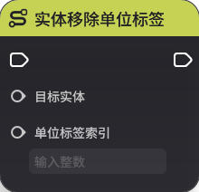和自定义技能 |

## **3.设置技能资源量**

**节点功能**

修改角色的技能资源量

**节点参数**

|  |  |  |  |
| --- | --- | --- | --- |
| **参数类型** | **参数名** | **类 **说明** |
| 入参 | 目标实体 | 实体 | 生效的角色实体 |
| 入参 | 技能资源配置ID | 配置ID | 技能资源的标识 |
| 入参 | 目标值 | 浮点数 | 修改后的值为该输入值 |

## **4.设置角色技能冷却**

**节点功能**

直接设置目标角色某个技能槽位的冷却为指定值

**节点参数**

|  |  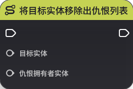 |
| --- | --- | --- | --- |
| **参数类型** | **参数名** | **类型** | **说明** |
| 入参 | 目标实体 | 实体 | 生效的角色实体 |
| 入参 | 角色技能槽位 | 枚举 | 要修改的技能所在的槽位，分为普通攻击、技能1--Q、技能3-R、技能4-T和自定义技能 |
| 入参 | 冷却剩余时间 | 浮点数 | 修改后的冷却时间为该输入值 |
| 入参 | 是否限制最大冷却时间 | 布尔值 | 为“是”可以限制修改后的冷却时间不小于所限制的值 |

## **5.添加角色技能**

**节点功能**

为指定目标角色的某个技能槽位添加技能

**节点参数**

|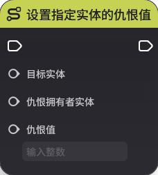|  |  |
| --- | --- | --- | --- |
| **参数类型** | **参数名** | **类型** | **说明** |
| 入参 | 目标实体 | 实体 | 生效的角色实体 |
| 入参 | 技能配置ID | 配置ID | 技能的标识 |
| 入参 | 技能槽位 | 枚举 | 要添加的技能所在的槽位，分为普通攻击、技技能2-Q、技能3-R、技能4-T和自定义技能 |

## **6.修改技能资源量**

**节点功能**

修改技能的资源量，会在当前值上加上变更值，变更值可以为负数

**节点参数**

|  |  |  |  |
| --- | --- | --- | --- |
|类型** | **参数名** | **类型** | **说明** |
| 入参 | 目标实体 | 实体 | 生效的角色实体 |
| 入参 | 技能资源配置ID | 配置ID | 技能资源的标识 |
| 入参 | 变更值 | 浮点数 | 修改后的值为：原值+变更值 |

## **7.修改角色技能冷却**

**节点功能**

修改目标角色某个技能槽位的冷却，会在当前冷却时间上加修改值，修改值可以为负数

**节点参数**

|  |  |  |  |
| --- | --- | --- | --- |
| **参数类型** | **参数名** | **类型** | **说明** |
| 入参 | 目标实体 | 实体 | 生效的角色实体 |
| 入参 | 角色技能槽位 | 枚举 | 要修改的技能所在的槽位，分为普通攻击、技能1-E、技能2-Q、技能3-R、技能4-T和自定义技能 |
| 入参 | 冷却时间修改值 | 浮点数 | 修改后的值为：原值+修改值 |
| 入参 | 是否限制最大冷却时间 | 布尔值 | 为“是”可以限制修改后的冷却时间不小于所限制的值 |

## **8.以槽位删除角色技能**

**节点功能**

删除目标角色指定槽位的技能

**节点参数**

|  |  |  |  |
| --- | --- | --- | --- |
| **参数类型** | **参数名** | **类型** | **说明** |
| 入参 | 目标实体 | 实体 | 生效的角色实体 |
| 入参 | 角色技能槽位 | 枚举 | 要删除的技能所在的槽位，分为普通攻击、技能1-E、技能2-Q、技能3-R、技能4-T和自定义技能 |

## **9.以ID删除角色技能**

**节点功能**

遍历角色的所有槽位，删除所有指定配置ID的技能

**节点参数**

|  |  ||
| --- | --- | --- | --- |
| **参数类型** | **参数名** | **类型** | **说明** |
| 入参 | 目标实体 | 实体 | 生效的角色实体 |
| 入参 | 技能配置ID | 配置ID | 技能

# 二十六、音效

## **1.调整玩家背景音乐音量**

**节点功能**

调整玩家背景音乐音量

**节点参数**

|  |  |  |  |
| --- | --- | --- | --- |
| **参数类型** | **参数名** | **类型** | **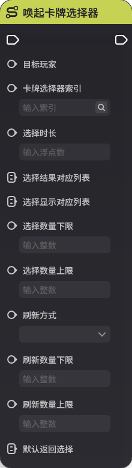|
| 入参 | 目标实体 | 实体 | 生效的玩家实体 |
| 入参 | 音量 | 整数 |  |

## **2.调整指定音效播放器**

**节点功能**

可以调整指定目标实体上的音效播放器组件对应序号的音效播放器的音量和播放速度

**节点参数**

|  |  |  |  |
| --- | --- | --- | --- |
| **参数类型** | **参数名** | **类型** | **说明** |
| 入参 | 目标实体 | 实体 |  |
| 入参 | 音效播放器序号 | 整数 |  |
| 入参 | 音量 | 整数 |  |
| 入参 | 播放速度  |  |

## **3.关闭指定音效播放器**

**节点功能**

关闭指定目标实体上的音效播放器组件对应序号的音效播放器

**节点参数**

|  |  |  |  |
| --- | --- | --- | --- |
| **参数类型** | **参数名** | **类型** | **说明** |
| 入参 | 目标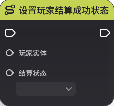实体 |  |
| 入参 | 音效播放器序号 | 整数 |  |

## **4.启动/暂停玩家背景音乐**

**节点功能**

修改对应玩家的背景音乐状态

**节点参数**

|  |  |  |  |
| --- | --- | --- | --- |
| **参数类型**参数名** | **类型** | **说明** |
| 入参 | 目标实体 | 实体 | 生效的玩家实体 |
| 入参 | 是否恢复 | 布尔值 |  |

## **5.启动/暂停指定音效播放器**

**节点功能**

可以修改指定目标实体上的音效播放器组件对应序号的音效播放器状态，仅当该音效被设置为循环播放时有效，单次播放的音效该节点不生效

**节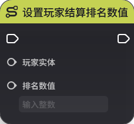

|  |  |  |  |
| --- | --- | --- | --- |
| **参数类型** | **参数名** | **类型** | **说明** |
| 入参 | 目标实体 | 实体 |  |
| 入参 | 音效播放器序号 | 整数 |  |
| 入参 | 是否恢复 | 布尔值 |  |

## **6.添加音效播放器**

***

动态添加一个音效播放器，需要单位持有音效播放器组件

**节点参数**

|  |  |  |  |
| --- | --- | --- | --- |
| **参数类型** | **参数名** | **类型** | **说明** |
| 入参 | 目标实体 | 实体 |  |
| 入参 | 音效资产索引 | 整数 |  |
| 入参 | 音量 |  |
| 入参 | 播放速度 | 浮点数 |  |
| 入参 | 是否循环播放 | 布尔值 |  |
| 入参 | 循环间隔时间 | 浮点数 |  |
| 入参 | 是否为3D音效 | 布尔值 |  |
| 入参 | 范围半径 | 浮点数 |  |
| 入参 | 衰减方式 | 枚举 |  |
| 入参 | 挂接点名称 | 字符串 |  |
| 入参 | 挂| 三维向量 |  |
| 出参 | 音效播放器序号 | 整数 |  |

## **7.玩家播放单次2D音效**

**节点功能**

玩家播放单次2D音效

**节点参数**

|  |  |  |  |
| --- | --- | --- | --- |
| *** | **参数名** | **类型** | **说明** |
| 入参 | 目标实体 | 实体 | 生效的玩家实体 |
| 入参 | 音效资产索引 | 整数 |  |
| 入参 | 音量 | 整数 |  |
|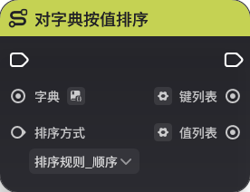 播放速度 | 浮点数 |  |

## **8.修改玩家背景音乐**

**节点功能**

修改玩家背景音乐相关参数

**节点参数**

|  |  |  |  |
| --- | --- | --- | --- |
| **参数类型** | **参数 **类型** | **说明** |
| 入参 | 目标实体 | 实体 | 生效的玩家实体 |
| 入参 | 背景音乐索引 | 整数 |  |
| 入参 | 开始时间 | 浮点数 |  |
| 入参 | 结束时间 | 浮点数 |  |
| 入参 | 整数 |  |
| 入参 | 是否循环播放 | 布尔值 |  |
| 入参 | 循环播放间隔 | 浮点数 |  |
| 入参 | 播放速度 | 浮点数 |  |
| 入参 | 是否允许渐入渐出 | 布尔值 |  |

# 二十七、单位标签

## **1.实体清空单位标签**

**节点功能**

对指定实体清空单位标签

**节点参数**

|   |  |
| --- | --- | --- | --- |
| **参数类型** | **参数名** | **类型** | **说明** |
| 入参 | 目标实体 | 实体 |  |

## **2.实体添加单位标签**

**节点功能**

对指定实体添加单位标签

**节点参数**

|  |  |  |  |
| --- | --- | ---- |
| **参数类型** | **参数名** | **类型** | **说明** |
| 入参 | 目标实体 | 实体 |  |
| 入参 | 单位标签索引 | 整数 |  |

## **3.实体移除单位标签**

**节点功能**

对指定实体移除单位标签

**节点参数**

|  |  |  |  |
| --- | 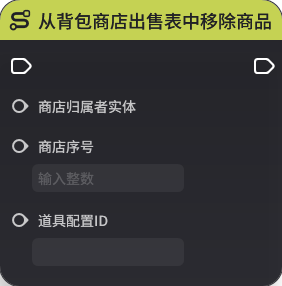 --- | --- |
| **参数类型** | **参数名** | **类型** | **说明** |
| 入参 | 目标实体 | 实体 |  |
| 入参 | 单位标签索引 | 整数 |  |

# 二十八、自定义仇恨

## **1.嘲讽目标**

**节点功能**

仅自定义仇恨模式可用

使嘲讽者实体嘲讽指定目标实体

**节点参|  |  |  |  |
| --- | --- | --- | --- |
| **参数类型** | **参数名** | **类型** | **说明** |
| 入参 | 嘲讽者实体 | 实体 |  |
| 入参 | 目标实体 | 实体 |  |

#.将目标实体移除出仇恨列表**

**节点功能**

仅自定义仇恨模式可用

将目标实体从仇恨拥有者的仇恨列表中移除，可能会导致目标实体脱战

**节点参数**

|  |  |  |  |
| --- | --- | --- | --- |
| **参数类型** | **参数名** | **类型** | **说明** |
| 入参 | 目标实体 | 实体 |  |
| 入参 | 仇恨拥有者实体 | 实体 |  |

## **3.清空指定目标的仇恨列表**

**节点功能**

仅自定义仇恨模式可用

清空仇恨拥有者的仇恨列表。可能会导致其脱战

**节点参数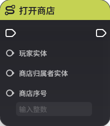  |  |  |  |
| --- | --- | --- | --- |
| **参数类型** | **参数名** | **类型** | **说明** |
| 入参 | 仇恨拥有者 | 实体 |  |

## **4.设置指定实体的仇恨值**

**节点功能**

仅自定义仇恨模式可用

设置指定目标实体在指定仇恨拥有者上的仇恨值

**节点参数**

|  |  |  |  |
| --- | --- | --- | --- |
| **参数类 **参数名** | **类型** | **说明** |
| 入参 | 目标实体 | 实体 |  |
| 入参 | 仇恨拥有者实体 | 实体 |  |
| 入参 | 仇恨值 | 整数 |  |

# 二十九、信号

## **1.发送信号**

**节点功能**

向关卡全局发送一个自定义信号，使用前需要先选择对应的信号名，然后才能正确的使用该信号的参数

**节点参数**

|  |  |  |  |
| --- | --- | --- | --- |
| **参数类型** | **参数名** | **类型** | **说明** |
|  |  |  |  |

# 三十、铭牌

## **1.设置实体生效铭牌**

**节点功能**

直接设置指定目标的生效铭牌列表，在入参列表中的铭牌配置会生效，不在列表中的会失效

**节点参数**

|  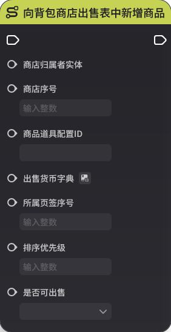 |  |
| --- | --- | --- | --- |
| **参数类型** | **参数名** | **类型** | **说明** |
| 入参 | 目标实体 | 实体 |  |
| 入参 | 铭牌配置ID列表 | 配置ID列表 |  |

# 三十一、文本气泡

## **1.切换生效的文本气泡**

**节点功能**

目标实体的文本气泡组件中，会以配置ID对应的文本气泡替换当前生效的文本气泡

**节点参数**

|  |  |  |  |
| --- | --- | --- | --- |
| **参数类型** | **参数 **类型** | **说明** |
| 入参 | 目标实体 | 实体 |  |
| 入参 | 文本气泡配置ID | 配置ID |  |

# 三十二、卡牌选择器

## **1.关闭卡牌选择器**

**节点功能**

关闭指定玩家当前生效的卡牌选择器

**节点参数**

|  |  |  |  |
| --- | --- | --- | --- |
| **参数类型** | **参数名** | **类型** | **说明** |
| 入参 | 目标玩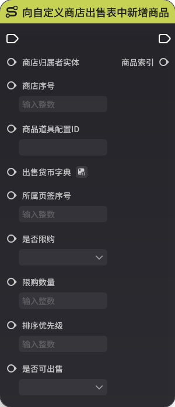体 | 生效的玩家实体 |
| 入参 | 卡牌选择器索引 | 整数 |  |

## **2.唤起卡牌选择器**

**节点功能**

对目标玩家打开提前制作好的卡牌选择器

**节点参数**

|  |  |  |  |  |
| --- | --- | --- | --- | --- |
| **参数类型** | **参数名** | **类型** | **说明** | |
| 入参 | 目标玩家 | 实体 | 指定运行时玩家，唤起卡牌选择器 | |
| 入参 | 卡牌选择器索引 | 整数 | 引用的界面控件组索引 | |
| 入参 | 选择时长 | 浮点数 | 若为空，则读取卡牌选择器默认配置；若不为空，以此处时间参数为实际生效时长  单位为秒 | |
| 入参 | 选择结果对应列表 | 整数列表 | 和显示项卡牌选择器返回的实际结果是显示项对应的结果值  推荐配置1至X | |
| 入参 | 选择显示对应列表 | 整数列表 | 卡牌库中的配置引用 | |
| 入参 | 选择数量下限 | 整数 | 选择卡牌数量下限，满足数量才可进行合法的选择交互 | |
| 入参 | 选择数量上限 | 整数 | 选择卡牌数量上限，满足数量才可进行合法的选择交互 | |
| 入参方式 | 枚举 | 不可刷新 | 刷新数量下限和刷新数量上限，两入参无效，且选择界面无刷新按键 |
|  |  |  | 部分刷新 | 刷新数量下限和刷新数量上限，两入参有效，且选择界面有刷新按键 |
|  |  |  | 全量刷新 | 刷新数量下限和刷新数量上限，两入参无效，默认返回全量结果，且选择界面有|
| 入参 | 刷新数量下限 | 整数 | 选择卡牌数量下限，满足数量才可进行合法的刷新交互 | |
| 入参 | 刷新数量上限 | 整数 | 选择卡牌数量上限，满足数量才可进行合法的刷新交互 | |
| 入参 | 默认返回选择 | 整数列表 | 如果卡牌选择器超时/未交互/卡牌选择器异常关闭等情况，支持强制赋予配置的该结果  该结果的列表长度，需要和合法选择卡牌数量一致 | |

## **3.随机卡牌选择器选择列表**

**节点功能**

将输入的列表进行随机排序

**节点参数**

|  |  | 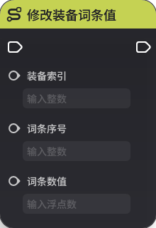
| --- | --- | --- | --- |
| **参数类型** | **参数名** | **类型** | **说明** |
| 入参 | 列表 | 整数列表 |  |

# 三十三、关卡结算

## **1.设置玩家结算成功状态**

**节点功能**

设置玩家结算成功状态

**节点参数**

|  |  |  |  |
| --- | --- | --- | --- |
| **参数类型** | **参数名** | **类型** | **说明** |
| 入参 | 玩家实体 | 实体 |  |
| 入参 | 结算状态 | 枚举 | 分为未定、胜利、失败三种 |

## **2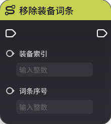结算计分板展示数据**

**节点功能**

设置玩家结算计分板展示数据，显示在关卡结算后弹出的计分板内。由于该节点涉及了局外功能的显示，故【数据值】和【数据名称】目前仅在手动输入文本的时候支持多语言翻译，若为连线输入，则不支持多语言翻译

**节点参数**

|  |  |  |  |
| --- | --- | --- | --- |
| **参数类型*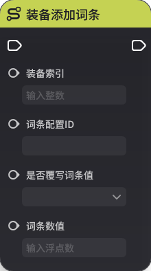*参数名** | **类型** | **说明** |
| 入参 | 设置实体 | 实体 | 生效的玩家实体 |
| 入参 | 数据顺序 | 整数 | 该数据的排序 |
| 入参 | 数据名称 | 字符串 | 该数据的名称 |
| 入参 | 数据值 | 泛型 | 该数据的值，支持整数、浮点数、字符串 |

## **3.设置玩家结算排名数值**

**节点功能**

设置玩家结算后的排按照【关卡设置】-【结算】中的【排名数值比较顺序】的设置来决定最终的排名顺序

**节点参数**

|  |  |  |  |
| --- | --- | --- | --- |
| **参数类型** | **参数名** | **类型** | **说明** |
| 入参 | 玩家实体 | 实体 |  |
| 入名数值 | 整数 |  |

## **4.设置阵营结算成功状态**

**节点功能**

设置阵营结算成功状态

**节点参数**

|  |  |  |  |
| --- | --- | --- | --- |
| **参数类型** | **参数名** | **类型** | **说
| 入参 | 阵营 | 阵营 | 生效的阵营实体 |
| 入参 | 结算状态 | 枚举 | 分为未定、胜利、失败三种 |

## **5.设置阵营结算排名数值**

**节点功能**

设置阵营结算后的排名数值，再按照【关卡设置】-【结算】中的【排名数值比较顺序】的设置来决定最终的排名顺序

**节点参数**

|  |  |  | --- | --- | --- | --- |
| **参数类型** | **参数名** | **类型** | **说明** |
| 入参 | 阵营 | 阵营 | 生效的阵营实体 |
| 入参 | 排名数值 | 整数 |  |

# 三十四、光源组件

## **1.开关实体光源**

**节点功能**

调整指定目标实体上的光源组件光源状态

**节点参数**

|  |  |  |  |
| --- | --- | --- | --- |
| **参数类型** | **参数名** | **类型** | **说明** |
| 入参 | 目标实体 | 实体 |  |
| 入参 | 光源序号 | 整数 |  |
| 入参 | 打开或关闭 | 布尔值 | “是”为打开 |

# 三十五、字典

##对字典按键排序**

**节点功能**

将指定字典按键进行顺序或逆序排序后输出

**节点参数**

|  |  |  |  |
| --- | --- | --- | --- |
| **参数类型** | **参数名** | **类型** | **说明** |
| 入参 | 字典 | 泛型 |  |
| 入参 | 排序方式 | 枚举 |  |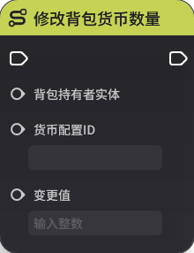 | 键列表 | 泛型 |  |
| 出参 | 值列表 | 泛型 |  |

## **2.对字典按值排序**

**节点功能**

将指定字典按值进行顺序或逆序排序后输出

**节点参数**

|  |  |  |  |
| --- | --- | --- | --- |
| **参数类型** | 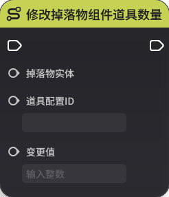** | **类型** | **说明** |
| 入参 | 字典 | 泛型 |  |
| 入参 | 排序方式 | 枚举 |  |
| 出参 | 键列表 | 泛型 |  |
| 出参 | 值列表 | 泛型 |  |

## **3.对字典设置或新增键值对**

**节点功能**

为指定字典新增一个键值对

**节点参数**

|  |  |  |  |
| --- | --- | --- | --- |
| **参数类型** | **参数名** | * | **说明** |
| 入参 | 泛型 |  |
| 入参 | 键 | 泛型 |  |
| 入参 | 值 | 泛型 |  |

## **4.清空字典**

**节点功能**

清空指定字典的键值对

**节点参数**

|  |  |  |  |
| --- | --- | --- | --- |
| **参数类型** | **参数名** | **类型** | **说明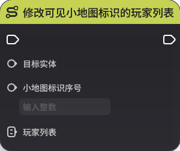| 入参 | 字典 | 泛型 |  |

## **5.以键对字典移除键值对**

**节点功能**

以键移除指定字典中的键值对

**节点参数**

|  |  |  |  |
| --- | --- | --- | --- |
| **参数类型** | **参数名** | **类型** | **说明** |
| 入参 | 字典 | 泛型 |  |
| 入参 | 键 | 泛型 |  |

# 三十六、结构体

## **1.修改结构体**

**节点功能**

在选定结构体后，可以修改该结构体的每个参数

**节点参数**

|  |  |  |  |
| ---- | --- | --- |
| **参数类型** | **参数名** | **类型** | **说明** |
|  |  |  |  |

# 三十七、商店

## **1.从背包商店出售表中移除商品**

**节点功能**

从背包商店出售表中移除商品

**节点参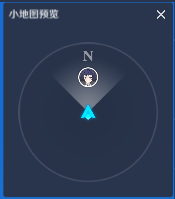|  |  |  |  |
| --- | --- | --- | --- |
| **参数类型** | **参数名** | **类型** | **说明** |
| 入参 | 商店归属者实体 | 实体 |  |
| 入参 | 商店序号 | 整数 | 商店归属者实体的商店组件对应的商店序号 |
| 入参 | 道具配置ID | 配置ID |  |

## **2.从物品收购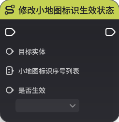品**

**节点功能**

从物品收购表中移除物品

**节点参数**

|  |  |  |  |
| --- | --- | --- | --- |
| **参数类型** | **参数名** | **类型** | **说明** |
| 入参 | 商店归属者实体 | 实体 |  |
| 入参 | 商店序号 |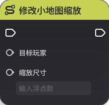 商店归属者实体的商店组件对应的商店序号 |
| 入参 | 商品道具配置ID | 配置ID |  |

## **3.从自定义商店出售表中移除商品**

**节点功能**

从自定义商店出售表中移除商品

**节点参数**

|  |  |  |  |
| --- | --- | --- | --- |
| **参数类型** | **参数名** |** | **说明** |
| 入参 | 商店归属者实体 | 实体 |  |
| 入参 | 商店序号 | 整数 | 商店归属者实体的商店组件对应的商店序号 |
| 入参 | 商品序号 | 整数 |  |

## **4.打开商店**

**节点功能**

在游戏运行过程中以玩家实体的视角打开商店

**节点参数**

|  |  |  |  |
| ---- | --- | --- |
| **参数类型** | **参数名** | **类型** | **说明** |
| 入参 | 玩家实体 | 实体 |  |
| 入参 | 商店归属者实体 | 实体 | 商店归属者实体的商店组件对应的商店序号 |
| 入参 | 商店序号 | 整数 |  |

## **5.关闭商店**

**节点功能**
行过程中以玩家实体的视角关闭所有已打开的商店

**节点参数**

|  |  |  |  |
| --- | --- | --- | --- |
| **参数类型** | **参数名** | **类型** | **说明** |
| 入参 | 玩家实体 | 实体 |  |

## **6.向背包商店出售表中新增商品**

**节点功能**

向背包商店出售表

**节点参数**

|  |  |  |  |
| --- | --- | --- | --- |
| **参数类型** | **参数名** | **类型** | **说明** |
| 入参 | 商店归属者实体 | 实体 |  |
| 入参 | 商店序号 | 整数 | 商店归属者实体的商店组件对应的商店序号 |
| 入参 具配置ID | 配置ID |  |
| 入参 | 出售货币字典 | 字典 |  |
| 入参 | 所属页签序号 | 整数 | 1装备、2消耗品、3材料、4贵重物品 |
| 入参 | 排序优先级 | 整数 |  |
| 入参 | 是否可出售 | 布尔值 |  |

## **7.向物品收购表中新增物品**

**节

向物品收购表中新增物品

**节点参数**

|  |  |  |  |
| --- | --- | --- | --- |
| **参数类型** | **参数名** | **类型** | **说明** |
| 入参 | 商店归属者实体 | 实体 |  |
| 入参 | 商店序号 | 整数 | 商店归属者实体的商店组件序号 |
| 入参 | 商品道具配置ID | 配置ID |  |
| 入参 | 收购货币字典 | 字典 |  |
| 入参 | 是否可收购 | 布尔值 |  |

## **8.向自定义商店出售表中新增商品**

**节点功能**

向自定义商店出售表中新增商品，新增成功后出参会生成一个整数型索引作为该商品的标识

**节点参数  |  |  |  |
| --- | --- | --- | --- |
| **参数类型** | **参数名** | **类型** | **说明** |
| 入参 | 商店归属者实体 | 实体 |  |
| 入参 | 商店序号 | 整数 | 商店归属者实体的商店组件对应的商店序号 |
| 商品道具配置ID | 配置ID |  |
| 入参 | 出售货币字典 | 字典 |  |
| 入参 | 所属页签序号 | 整数 | 1装备、2消耗品、3材料、4贵重物品 |
| 入参 | 是否限购 | 布尔值 |  |
| 入参 | 限购数量 | 整数 |  |
| 入参 | 排序优先级 | 整数 |  |
| 入参 | 是否可出售 | 布 |
| 出参 | 商品索引 | 整数 |  |

## **9.修改背包商店商品出售信息**

**节点功能**

修改背包商店商品出售信息

**节点参数**

|  |  |  |  |
| --- | --- | --- | --- |参数类型** | **参数名** | **类型** | **说明** |
| 入参 | 商店归属者实体 | 实体 |  |
| 入参 | 商店序号 | 整数 | 商店归属者实体的商店组件对应的商店序号 |
| 入参 | 道具配置ID | 配置ID |  |
| 入参 | 出售货币字典 | 字典 |  |
| 入参 | 所 | 整数 |  |
| 入参 | 排序优先级 | 整数 |  |
| 入参 | 是否可出售 | 布尔值 |  |

## **10.修改物品收购表中道具收购信息**

**节点功能**

修改物品收购表中道具收购信息

**节点参数**

|  |  |  |  |
| --- | --- | --- | --- |
| **参数类型**参数名** | **类型** | **说明** |
| 入参 | 商店归属者实体 | 实体 |  |
| 入参 | 商店序号 | 整数 | 商店归属者实体的商店组件对应的商店序号 |
| 入参 | 商品道具配置ID | 配置ID |  |
| 入参 | 收购货币字典 | 字典 |  |
| 入参 | 是否可收购 | 布尔值 |  |

## **11.修改自定义商店商品出售信息**

**节点功能**

修改自定义商店商品出售信息

**节点参数**

|  |  |  |  |
| --- | --- | --- | --- |
| **参数类型** | **参数名** | **类型** | **说明** |
| 入参 | 商店归属者实体 | 实体 |  |
| 入参 | 商店序号 | 整数 | 商店归属者实体的商店组件对应的商店序号 |
| 入参 | 商品序号 | 整数 |  |
| 入参 | 道具配置ID | 配置ID |  |
| 入参 | 出售货币字典 | 字典 |  |
| 入参 | 所属页签序号 | 整数 | 1装备、2消耗品、3材料、4贵重物品 |
| 入参 | 是否限购 | 布尔值 |  |
| 入参 | 限购数量 | 整数 |  |
| 入参 | 排序优先级 | 整数 |  |
| 入参 | 是否可出售 | 布尔值 |  |

# 三十八、装备

## **1.修改装备词条值**

**节点功能**

修改指定装备实例对应词条上的值

**节点参数**

|  |  |  |  |
| --- | --- | --- | --- |
| **参数类型** | **参数名** | **类型** | **说明** |
| 入参 | 装备索引 | 整数 | 【装备初始化】时生成的整数型索引来标识该装备实例 |
| 入参 | 词条序号 | 整数 |  |
| 入参 | 词条数值 | 浮点数 |  |

## **2.移除装备词条**

**节点功能**

移除指定装备实例的对应词条

**节点参数**

|  |  |  |  |
| --- | --- | --- | --- |
| **参数类型** | **参数名** | **类型** | **说明** |
| 入参 | 装备索引 | 整数 | 【装备初始化】时生成的整数型索引来标识该装备实例 |
| 入参 | 词条序号 | 整数 |  |

## **3.装备添加词条**

**节点功能**

对指定装备实例添加一条预先配置好的词条，可以覆写词条的数值

**节点参数**

|  |  |  |  |
| --- | --- | --- | --- |
| **参数类型** | **参数名** | **类型** | **说明** |
| 入参 | 装备索引 | 整数 | 【装备初始化】时生成的整数型索引来标识该装备实例 |
| 入参 | 词条配置ID | 配置ID | 装备数据管理中预先配置好的词条的对应配置ID |
| 入参 | 是否覆写词条值 | 布尔值 |  |
| 入参 | 词条数值 | 浮点数 | 可以覆写预先配置好的词条上的数值 |

## **4.装备指定序号添加词条**

**节点功能**

对指定装备实例的指定词条序号位置添加预先配置好的词条，可以覆写词条的数值

**节点参数**

|  |  |  |  |
| --- | --- | --- | --- |
| **参数类型** | **参数名** | **类型** | **说明** |
| 入参 | 装备索引 | 整数 | 【装备初始化】时生成的整数型索引来标识该装备实例 |
| 入参 | 词条配置ID | 配置ID | 装备数据管理中预先配置好的词条的对应配置ID |
| 入参 | 插入序号 | 整数 |  |
| 入参 | 是否覆写词条值 | 布尔值 |  |
| 入参 | 词条数值 | 浮点数 | 可以覆写预先配置好的词条上的数值 |

# 三十九、道具与背包

## **1.**设置背包道具掉落内容

**节点功能**

以字典形式设置背包道具掉落内容，并可以设置掉落类型

**节点参数**

|  |  |  |  |
| --- | --- | --- | --- |
| **参数类型** | **参数名** | **类型** | **说明** |
| 入参 | 背包持有者实体 | 实体 |  |
| 入参 | 道具掉落字典 | 字典 |  |
| 入参 | 掉落类型 | 枚举 | 分为全员一份、每人一份 |

## **2.**设置背包掉落道具/货币数量

**节点功能**

设置背包掉落道具/货币的类型和数量

**节点参数**

|  |  |  |  |
| --- | --- | --- | --- |
| **参数类型** | **参数名** | **类型** | **说明** |
| 入参 | 背包持有者实体 | 实体 |  |
| 入参 | 道具/货币配置ID | 配置ID |  |
| 入参 | 掉落数量 | 整数 |  |
| 入参 | 掉落类型 | 枚举 | 分为全员一份、每人一份 |

## **3.触发战利品掉落**

**节点功能**

对掉落者实体触发一次战利品掉落，可设置其掉落类型

**节点参数**

|  |  |  |  |
| --- | --- | --- | --- |
| **参数类型** | **参数名** | **类型** | **说明** |
| 入参 | 掉落者实体 | 实体 |  |
| 入参 | 掉落类型 | 枚举 | 分为全员一份、每人一份 |

## **4.设置战利品掉落内容**

**节点功能**

以字典形式设置掉落者实体上战利品组件中战利品的掉落内容

**节点参数**

|  |  |  |  |
| --- | --- | --- | --- |
| **参数类型** | **参数名** | **类型** | **说明** |
| 入参 | 掉落者实体 | 实体 |  |
| 入参 | 战利品掉落字典 | 字典 |  |

## **5.修改背包道具数量**

**节点功能**

修改背包内指定道具的数量

**节点参数**

|  |  |  |  |
| --- | --- | --- | --- |
| **参数类型** | **参数名** | **类型** | **说明** |
| 入参 | 背包持有者实体 | 实体 |  |
| 入参 | 道具配置ID | 配置ID |  |
| 入参 | 变更值 | 整数 | 变更后的值=变更前的值+变更值 |

## **6.修改背包货币数量**

**节点功能**

修改背包内指定货币的数量

**节点参数**

|  |  |  |  |
| --- | --- | --- | --- |
| **参数类型** | **参数名** | **类型** | **说明** |
| 入参 | 背包持有者实体 | 实体 |  |
| 入参 | 货币配置ID | 配置ID |  |
| 入参 | 变更值 | 整数 | 变更后的值=变更前的值+变更值 |

## **7.修改掉落物组件道具数量**

**节点功能**

修改掉落物元件上掉落物组件内指定道具的数量

**节点参数**

|  |  |  |  |
| --- | --- | --- | --- |
| **参数类型** | **参数名** | **类型** | **说明** |
| 入参 | 掉落物实体 | 实体 |  |
| 入参 | 道具配置ID | 配置ID |  |
| 入参 | 变更值 | 整数 | 变更后的值=变更前的值+变更值 |

## **8.修改掉落物组件货币数量**

**节点功能**

修改掉落物元件上掉落物组件内指定货币的数量

**节点参数**

|  |  |  |  |
| --- | --- | --- | --- |
| **参数类型** | **参数名** | **类型** | **说明** |
| 入参 | 掉落物实体 | 实体 |  |
| 入参 | 货币配置ID | 配置ID |  |
| 入参 | 变更值 | 整数 | 变更后的值=变更前的值+变更值 |

## **9.增加背包最大容量**

**节点功能**

增加指定背包持有者的背包最大容量

**节点参数**

|  |  |  |  |
| --- | --- | --- | --- |
| **参数类型** | **参数名** | **类型** | **说明** |
| 入参 | 背包持有者实体 | 实体 |  |
| 入参 | 增加容量 | 整数 |  |

# 四十、小地图标识组件

## **1.修改可见小地图标识的玩家列表**

**节点功能**

目标实体的小地图标识组件上对应序号的小地图标识对玩家列表中的玩家可见

**节点参数**

|  |  |  |  |
| --- | --- | --- | --- |
| **参数类型** | **参数名** | **类型** | **说明** |
| 入参 | 目标实体 | 实体 | 要修改的小地图标识组件归属的实体 |
| 入参 | 小地图标识序号 | 整数 | 要修改的指定小地图标识的序号 |
| 入参 | 玩家列表 | 实体列表 | 目标实体的指定小地图序号，只有输入玩家可见 |

## **2.修改小地图标识的玩家标记**

**节点功能**

若小地图标识选择了玩家标记，在节点图输入对应玩家实体后，目标实体在小地图上的显示会变成输入玩家实体的头像

**节点参数**

|  |  |  |  |
| --- | --- | --- | --- |
| **参数类型** | **参数名** | **类型** | **说明** |
| 入参 | 目标实体 | 实体 | 要修改的小地图标识组件归属的实体 |
| 入参 | 小地图标识序号 | 整数 | 要修改的指定小地图标识的序号 |
| 入参 | 对应玩家实体 | 实体 | 修改后为对应玩家实体的头像 |

## **3.修改小地图标识生效状态**

**节点功能**

通过节点输入的小地图标识序号列表，批量修改目标实体的小地图标识生效状态

**节点参数**

|  |  |  |  |
| --- | --- | --- | --- |
| **参数类型** | **参数名** | **类型** | **说明** |
| 入参 | 目标实体 | 实体 | 要修改的小地图标识组件归属的实体 |
| 入参 | 小地图标识序号列表 | 整数列表 | 需要指定状态的小地图标识序号列表  未配置的小地图标识会改为相反状态 |
| 入参 | 是否生效 | 布尔值 | 若输入为“是”，  输入序号列表指定的序号，对应小地图标识状态改为生效状态  不在序号列表中的序号，对应小地图标识状态改为不生效状态 |

## **4.修改小地图缩放**

**节点功能**

修改目标玩家的小地图界面控件的地图比例

**节点参数**

|  |  |  |  |
| --- | --- | --- | --- |
| **参数类型** | **参数名** | **类型** | **说明** |
| 入参 | 目标玩家 | 实体 |  |
| 入参 | 缩放尺寸 | 浮点数 |  |

## **5.修改追踪小地图标识的玩家列表**

**节点功能**

将目标实体的对应序号的小地图标识对入参玩家修改为追踪表现

**节点参数**

|  |  |  |  |
| --- | --- | --- | --- |
| **参数类型** | **参数名** | **类型** | **说明** |
| 入参 | 目标实体 | 实体 |  |
| 入参 | 小地图标识序号 | 整数 |  |
| 入参 | 玩家列表 | 实体列表 |  |

# 四十一、造物巡逻

## **1.切换造物巡逻模板**

**节点功能**

造物切换的巡逻模板即刻切换，并按照新的巡逻模板进行移动

**节点参数**

|  |  |  |  |
| --- | --- | --- | --- |
| **参数类型** | **参数名** | **类型** | **说明** |
| 入参 | 造物实体 | 实体 |  |
| 入参 | 巡逻模板序号 | 整数 |  |

# 四十二、排行榜

## **1.以浮点数设置玩家排行榜分数**

**节点功能**

以浮点数设置玩家排行榜分数

**节点参数**

|  |  |  |  |
| --- | --- | --- | --- |
| **参数类型** | **参数名** | **类型** | **说明** |
| 入参 | 玩家序号列表 | 整数列表 |  |
| 入参 | 排行榜分数 | 浮点数 |  |
| 入参 | 排行榜序号 | 整数 | 外围系统管理中指定排行榜对应的序号 |

## **2.以整数设置玩家排行榜分数**

**节点功能**

以整数设置玩家排行榜分数

**节点参数**

|  |  |  |  |
| --- | --- | --- | --- |
| **参数类型** | **参数名** | **类型** | **说明** |
| 入参 | 玩家序号列表 | 整数列表 |  |
| 入参 | 排行榜分数 | 整数 |  |
| 入参 | 排行榜序号 | 整数 | 外围系统管理中指定排行榜对应的序号 |

# 四十三、成就

## **1.变更成就进度计数**

**节点功能**

变更指定实体上对应成就序号的成就进度计数

**节点参数**

|  |  |  |  |
| --- | --- | --- | --- |
| **参数类型** | **参数名** | **类型** | **说明** |
| 入参 | 变更实体 | 实体 |  |
| 入参 | 成就序号 | 整数 |  |
| 入参 | 进度计数变更值 | 整数 | 变更后值=变更前值+变更值 |

## **2.设置成就进度计数**

**节点功能**

设置指定实体上对应成就序号的成就进度计数

**节点参数**

|  |  |  |  |
| --- | --- | --- | --- |
| **参数类型** | **参数名** | **类型** | **说明** |
| 入参 | 设置实体 | 实体 |  |
| 入参 | 成就序号 | 整数 |  |
| 入参 | 进度计数 | 整数 | 修改后的进度计数为输入的值 |

# 四十四、扫描标签

## **1.设置扫描标签的规则**

**节点功能**

设置扫描标签的规则，会以设置好的规则执行扫描标签的逻辑

**节点参数**

|  |  |  |  |
| --- | --- | --- | --- |
| **参数类型** | **参数名** | **类型** | **说明** |
| 入参 | 目标实体 | 实体 |  |
| 入参 | 规则类型 | 枚举 | 分为视野优先、距离优先 |

## **2.设置扫描组件的生效扫描标签序号**

**节点功能**

将目标实体的扫描标签组件中对应序号的扫描标签设置为生效

**节点参数**

|  |  |  |  |
| --- | --- | --- | --- |
| **参数类型** | **参数名** | **类型** | **说明** |
| 入参 | 目标实体 | 实体 |  |
| 入参 | 扫描标签序号 | 整数 |  |

# 四十五、段位

## **1.切换玩家竞技段位生效的计分组**

**节点功能**

以计分组的序号切换指定玩家竞技段位生效的计分组

**节点参数**

|  |  |  |  |
| --- | --- | --- | --- |
| **参数类型** | **参数名** | **类型** | **说明** |
| 入参 | 玩家实体 | 实体 |  |
| 入参 | 计分组序号 | 整数 | 外围系统管理中指定计分组对应的序号 |

## **2.设置玩家段位变化分数**

**节点功能**

根据结算状态设置玩家的段位变化分数

**节点参数**

|  |  |  |  |
| --- | --- | --- | --- |
| **参数类型** | **参数名** | **类型** | **说明** |
| 入参 | 玩家实体 | 实体 |  |
| 入参 | 结算状态 | 枚举 | 分为未定、胜利、失败、逃跑 |
| 入参 | 变化分数 | 整数 |  |

## **3.设置玩家逃跑合法性**

**节点功能**

设置指定玩家逃跑的合法性

**节点参数**

|  |  |  |  |
| --- | --- | --- | --- |
| **参数类型** | **参数名** | **类型** | **说明** |
| 入参 | 玩家实体 | 实体 |  |
| 入参 | 是否合法 | 布尔值 |  |

# 四十六、实体布设组

## **1.激活/关闭实体布设组**

**节点功能**

修改实体布设组初始创建开关的状态

**节点参数**

|  |  |  |  |
| --- | --- | --- | --- |
| **参数类型** | **参数名** | **类型** | **说明** |
| 入参 | 实体布设组索引 | 整数 |  |
| 入参 | 是否激活 | 布尔值 | “是”则该实体布设组初始创建开关状态为开启 |

# 四十七、聊天频道

## **1.设置聊天频道开关**

**节点功能**

设置聊天频道的开关

**节点参数**

|  |  |  |  |
| --- | --- | --- | --- |
| **参数类型** | **参数名** | **类型** | **说明** |
| 入参 | 频道索引 | 整数 |  |
| 入参 | 文字开关 | 布尔值 |  |

## **2.设置玩家当前频道**

**节点功能**

设置玩家当前可用的频道，在列表中的频道该玩家可用，不在的该玩家不可用

**节点参数**

|  |  |  |  |
| --- | --- | --- | --- |
| **参数类型** | **参数名** | **类型** | **说明** |
| 入参 | 玩家GUID | GUID |  |
| 入参 | 频道索引列表 | 整数列表 |  |

## **3.修改玩家频道权限**

**节点功能**

修改玩家频道权限

**节点参数**

|  |  |  |  |
| --- | --- | --- | --- |
| **参数类型** | **参数名** | **类型** | **说明** |
| 入参 | 玩家GUID | GUID |  |
| 入参 | 频道索引 | 整数 |  |
| 入参 | 是否加入 | 布尔值 | “是”则该频道指定玩家可用 |

# 四十八、奇域礼盒相关

## **1.消耗礼盒**

**节点功能**

可以消耗指定玩家的奇域礼盒

**节点参数**

|  |  |  |  |
| --- | --- | --- | --- |
| **参数类型** | **参数名** | **类型** | **说明** |
| 入参 | 玩家实体 | 实体 |  |
| 入参 | 礼盒索引 | 整数 |  |
| 入参 | 消耗数量 | 整数 |  |

## 

## 

##