# 一、技能的定义

*技能*是一种通过接收游玩时的用户输入，让角色执行某一段预设行为的封装。在经典模式中，角色的普通攻击，元素战技，元素爆发等都是一个技能。

技能主要实现三个基本功能：

* *角色动画*的调用：在技能编辑时，创作者(奇匠)可以定义技能释放后的角色动画演出效果
* 触发*客户端节点图*：通过编辑技能动画*节点图事件轨道*上的事件，可以在动画的特定阶段触发指定的客户端节点图
* 配置*技能状态*：在动画播放的过程中，可以指定特定的时间窗口附加持续性的逻辑，比如播放循环动画等等

# 二、技能的编辑

## 1.编辑入口

技能编辑的入口位于战斗预设页签的技能页签下

点击【新建技能】s/30ed04f93661a9006d69c02dc55_1818194431287328309.png)

并在弹出的窗口中选择【确认创建】即可完成新技能的添加

## 2.技能参数

一个技能的参数配置如下图：

*配置ID*：技能的唯一标识，在节点图修改对应的技能配置时，引用该ID

*技能类型*：目前分为五种

*瞬发技能*：无法编辑动输入的瞬间立即触发逻辑

*长按技能*：可以提供循环动画类型的技能，玩家长按对应的输入即可进入循环动画

*普通技能*：基础的技能类型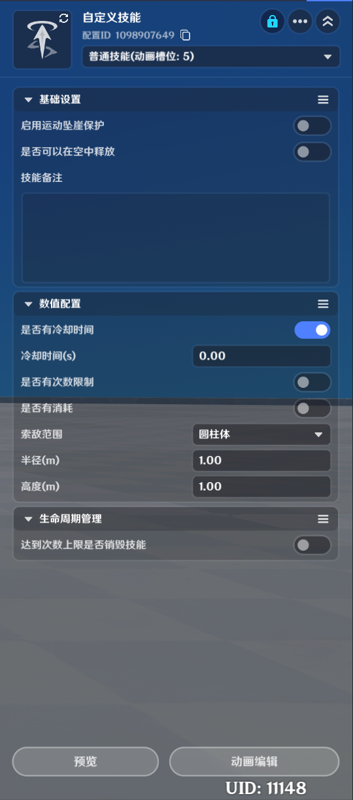技能*：可以配置一连串的连续动作，并在接受特定时点的输入后，在动作之间进行跳转

*瞄准技能*：提供成套的瞄准动作，并在施放技能时使角色进入瞄准状态

### (1)基础设置

*启用运动坠崖保护*：勾选时，角色释放该技能产生位移时不会触发坠崖

*是否可以在空中释放*：在角色处于跳跃，下落，滑翔等空中状态时能否使用该技能

*\*技能备注*：可以在编辑时描述该技能的大致作用

### (2)数值配置

*是否有冷却时间*：开启时可以配置技能冷却时间

*冷却时间(s)*：当该技能释放后需要多久才能够再次释放

*是否有次数限制*：开启时可以配置技能使用次数

*使用次数*：技能添加时的默认可使用次数，当使用次数归0时，技能无法使用，每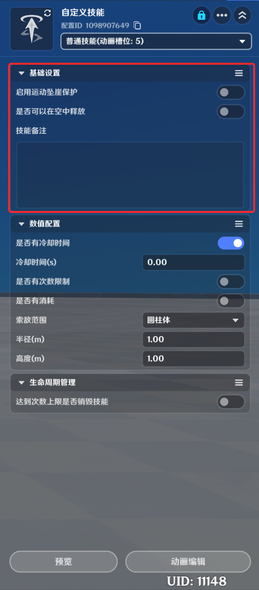却时间，-4348-aa69-223087842e52.png)次使用次数，最大恢复到默认配置的次数，就不会再增加

*是否有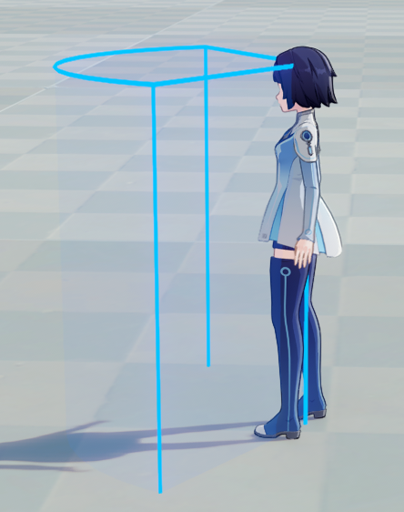启时可以配置消耗类型和消耗量

*消耗类型*：释放该技能需要消耗的*技能资源*类型，具体查看[技能资源](/ys/ugc/tutorial//detail/mh6ate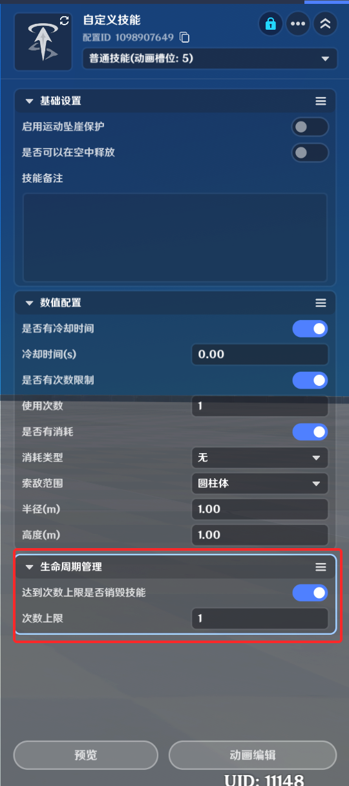6)

*消耗量*：释放该技能需要消耗的技能资源值

*索敌范围*：该技能释放时，会在多大的范围内寻找释放目标，并且在本地节点图内，可以通过查询节点获取到本次技能释放的目标单位，索敌范围目前提供了两种类型

*圆柱体*：使用*半径*和*高度*进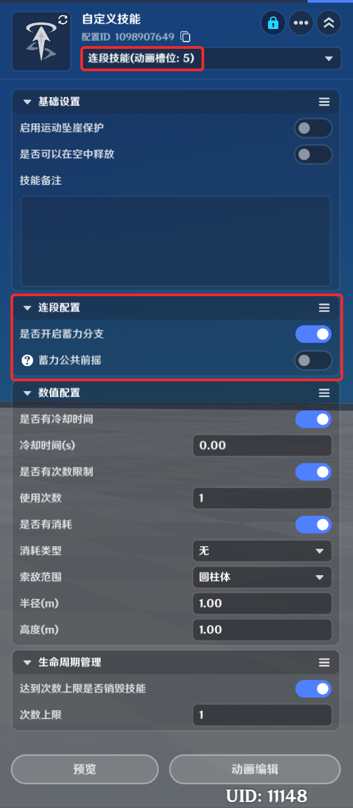

*扇形*：可以视为是圆柱的升级版本，除了*半径*和*高度*外，还可以配置筛选的*角度*，以及*旋转*

### (3)生命周期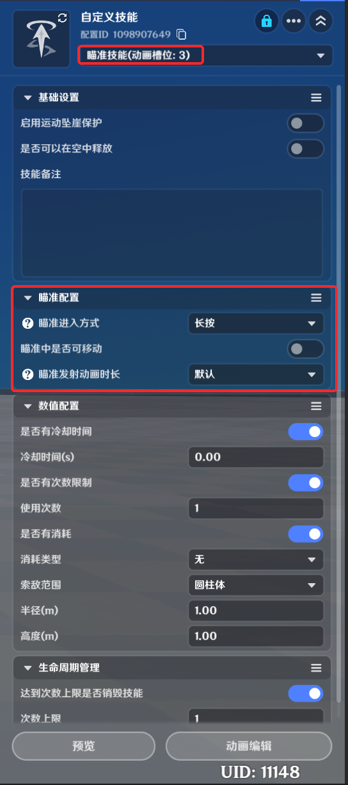

*达到次数上限是否销毁技能*：开启时可以配置次数上限

*次数上限*：该技能在整个生命周期内可以使用的次数，当技能被使用达到最大次数时，技能会被自动移除

### (4)连段配连段技能类型的专有配置：

*是否开启蓄力分支*：开启后可在动画编辑处定义连段转入蓄力动作相关逻辑

*蓄力公共前摇*：开启后，连段动画与蓄力动画将共用同一个前摇动画槽位，以及槽位内的所有配置。关闭后，运行时该槽位的动画将不会播放

### (5)瞄准配置

对于瞄准技能类型的专有配置：

*瞄准进入方式*：分为长按和点按切换两种

*长按*：长按技能进入瞄准状态，松开后退出切换*：点按技能7cb7-4838-a36b-8fb0cdc98eb4.png)态，再次点击退出

*瞄准中是否可移动*：在角色是否可以进行位移

*瞄准发射动画时长*：切换为自定义后，可修改瞄准技能的发射动画播放时长(该功能在游戏运行时生效，预览时不生效)

# 三、技能的动画编辑

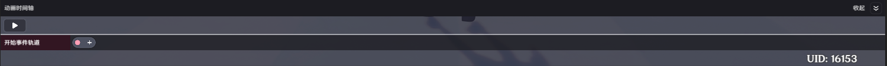

在定义完了技能的释放条件和释放逻辑后，即可点击动画编辑，来继fa2.png)释放后的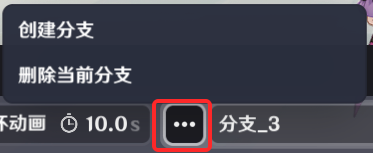不同的技能类型，配置方式也会有所区别：

## 1.普通技能

普通技能是最通用的技能类型，配置方式也最为常规，因此先以普通技能为例介绍动画编辑的大致配置方法

界面如上图，以时间轴的形式来进行配置，分为动作轴和逻辑轴。在技能释放时，从前往后按时间依次触发动作轴上的动画，以及逻辑轴上的事件，依次来实现整个技能的具体效果。

### (1)添加动作

首先我们需要添加对应的*动作*，入口在上图“A”所示位置，点击可选择目前可用的*角色动画*

动画是整个*技能轨道*的尺度，事件轴的总长度等于所有动画的时长之和，cf-bc3f-c1ff2f78a7d2.png)画时点添加事件，即可让表现和逻辑匹配

### (2)编辑事件轨道

事件轨道在上图"B"所示位置

*事件轨道*分为四种类型：

*开始事件轨道*：在技能开始释放时立即触发的时点
件轨道*：在技能的动作全部播放完成后触发的时点

*节点图事件轨道*：可以根据动作进度进行打点并添加事件的轨道，在该轨道下可选择具体的动画进度位置，并添加一个*技能节点图*，如下图。当动画进行到配置的进度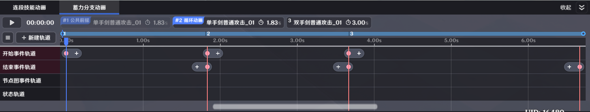节点图会被触发

*状态轨道*：用于定义非触发类型的表现，如持续播放特效等，如下图，并且可以自由配置该状态的开始时点和结束时点

## 2.瞬发技能

界面如上图，由于瞬发技能的所有逻辑都在技能释放瞬间触发，也不会调用动画。因此瞬发技能不可添加动作，且只保留开始事件轨道

## 3.长按技能

*长按技能*支持创作者(奇匠)在动画时间轴上引用循环动画

选择完循环动画栏位的动画后，可调整循环动画的*持续时长*，在实际释放技能时：

如果角色进入该动画后输入保持长按状态，则该循环动画会持续播放，最多播放到持续时长

如果角色进入该动画后未保持输入长按，则动画会立即中断，并根据*分支轨道*配置跳转到对应的分支

### (1)分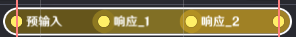下图中的按钮可添加或删除分支，每个分支代表了多个捆绑好的动画，在实际的技能释放过程中，根据技能长按的松开时机，会转入到某一个分支中

每一个分支可配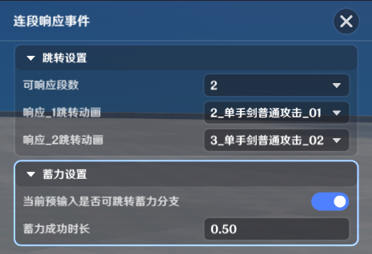环动画，在进入对应的分支后，会顺序进行播放

### 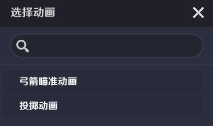轨道

分支轨道定义了如何跳转至各个分支的具体规则，点击分支轨道，会在界面右侧弹出分支事件编辑界面

*可跳转分支数*：该技能支持几种分支跳转情境，该配置会使分支轨道被划分为对应数量的段落

*响应*：支持由创作者(奇匠)配置分支轨道48b7-b6c8-2e61a6072c4a.png)c4-4d5c-89d6-a811c2abb768.png)7b7-4acf-b041-c4db59589a2b.png)落跳转到哪一个具体分支上

在分支轨道上，创作者(奇匠)可以通过调节每个段落的长度，来精细化调节分支转入的条件。在实际的运行时，当玩家停止长按时，当前的动画进度落在哪一个响应段落内，则动画会自动转入该段落所对应配置的分支

## 4.连段技能

*连段技能*支持创作者(奇匠)ed-42d6-8258-00bf800b0c0e.png)s/d769dc56-ccc3-44aa-b177-df1bc69d5037.png)s/639fd35a-ce4e-4701-adaf-384b85eb5a66.png)立的动作，并通过定义动作间的跳转规则和输入窗口期，来实现“连招”的效果。与此同时连段技能也提供了转入蓄力分支的功能，在配置上有两个页签：连段技能动画页签及蓄力分支动画页签

* **连段技能动画编辑页签**

* **蓄力分支动画编辑页签**

连段技能的配置界面如上图，与普通技能的编辑不同的是，连段技能中配置的技能槽位在技能释放时并不会顺序播放，而是依赖连段轨道上的配置和创作者(奇匠)实际的输入进行跳转

### (1)连段轨道

连段轨道是连段技能的专有轨道。在连段轨道上，创作者(奇匠)可以配置连段响应事件，一个连段响应事件由一个预输入阶段与多个响应阶段构成：

*预输入阶段*：在预输入阶段点按技能，会接受该次预输入，并在进入第一个响应阶段时直接触发响应进行相应的动画跳转。在预输入阶段长按技能，若满足*蓄力成功时长*则会立即跳转到蓄力分支动画

*响应阶段*：在响应阶段点按技能，会立即触发响应并进行相应的动画跳转

一个连段响应事件的具体编辑界面如下图：

*跳转设置*：连段动画之间的跳转规则配置

*可响应段数*：定义了该动作存在几个响应阶段

*响应跳转动画*：每一个响应阶段接受输入时转到的目标动画槽位

*蓄力设置*：在预输入阶段跳转进蓄力分支的相关逻辑配置

*当前预输入是否可跳转蓄力分支*：跳转到蓄力分支的开关

*蓄力成功时长*：在预输入阶段长按蓄力达到该配置值时，会立即转入蓄力分支

### (2)公共前摇

公共前摇是一个特殊的动画槽位：

1.角色从待机动画短按技能初次进入连段技能动画时，会优先播放公共前摇配置的动作

2.角色从待机动画长按技能直接进入蓄力分支动画时，也会优先播放公共前摇配置的动作

## 5.瞄准技能

*瞄准技能*对应了弓箭角色的蓄力瞄准动作，其特点在于：

* 瞄准技能提供了三个动画槽位，但不支持分别配置，而是采用成套动作的方式进行配置，当创作者(奇匠)选中一套动作时，会同时填充全部三个动画槽位

* 瞄准技能也提供了分支以及分支轨道，但每个分支只提供了一个动画槽位
* 不同于长按技能当循环动画时长达到循环时间时会退出动画并转入对应分支，瞄准技能的蓄力动作在到达持续时长后会保持在动作的最后时刻，即轨道的结尾处。直到玩家主动解除瞄准后，再转入对应分支

除以上特性外，瞄准技能的事件轨道和分支轨道配置和其他技能相同。在状态轨道上存在两种需要配合使用的状态事件：进入瞄准状态及开启准星：

### (1)进入瞄准状态

*镜头视野*：进入瞄准状态后的视野范围

*瞄准视角偏移*：进入瞄准状态后，镜头位置的偏移值

*俯仰角度范围*：进入瞄准状态后，玩家可调整的镜头俯仰角范围

*进入过渡时长(秒)*：从原始镜头切换至瞄准镜头的过渡时长

*退出过渡时长(秒)*：从瞄准镜头切换至原始镜头的过渡时长

对比是否应用该事件的瞄准技能表现：

* 使用瞄准状态：

* 不使用瞄准状态：

### (2)开启准星

无可配置参数，开启后的效果：

# 四、技能槽位

*技能槽位*决定了技能会被显示在UI的哪个位置，以及释放该技能对应的输入。目前开放了五个技能槽位

* *普通攻击*：对应PC端鼠标左键
* *技能1*：对应PC端键盘E键
* *技能2*：对应PC端键盘Q键
* *技能3*：对应PC端键盘R键
* *技能4*：对应PC端键盘T键

# 五、技能的添加

技能的添加主要有两种途径，一是职业的默认配置，在[职业](./职业_mhodlcrp.md)文档内有详细的使用说明

第二种是通过节点图进行添加

## 1.通过节点图修改技能

## 2.查询角色技能

