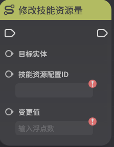

# 技能资源

**URL**: https://act.mihoyo.com/ys/ugc/tutorial/detail/mh6ate95agb6

**爬取时间**: 2026-01-04 08:27:12

---

## 技能资源

# 一、技能资源的定义

*技能资源*是特定技能释放时需要扣除的资源，例如经典模式的“元素能量”就是一种技能资源，在千星奇域中支持创作者(奇匠)自己定义技能资源的类型，并制定技能依赖的技能资源种类

# 二、技能资源的编辑

## 1.编辑入口

通过系统菜单栏的技能资源管理按钮进入

打开界面即可编辑全局可用的技能资源类型

## 2.参数介绍

* *技能资源名：技能资源的命名*
* *配置ID：技能资源的唯一标识，在节点图调用时依赖该配置ID*
* *增长类型：增长类型决定了当外部逻辑尝试增加技能资源量时，实际的增长规则，目前支持三种类型*

无条件增长：在未超过可获取最大值时，该技能资源量会无条件增长

跟随技能（保留值）：当尝试改变技能资源量时，只有当前玩家身上存在需要该技能资源释放的技能时，才能改变成功，否则不生效，当某个技能资源没有任何一个技能需要时，技能资源量会保留

跟随技能（不保留值）：规则同上，区别在于当某个技能资源没有任何一个技能需要时，技能资源量会清零

* *可获取最大值：技能资源量的最大值，角色获取的技能资源量无法超过该值*
* *引用信息：表示该技能资源被哪些技能引用*

# 三、节点图修改技能资源

