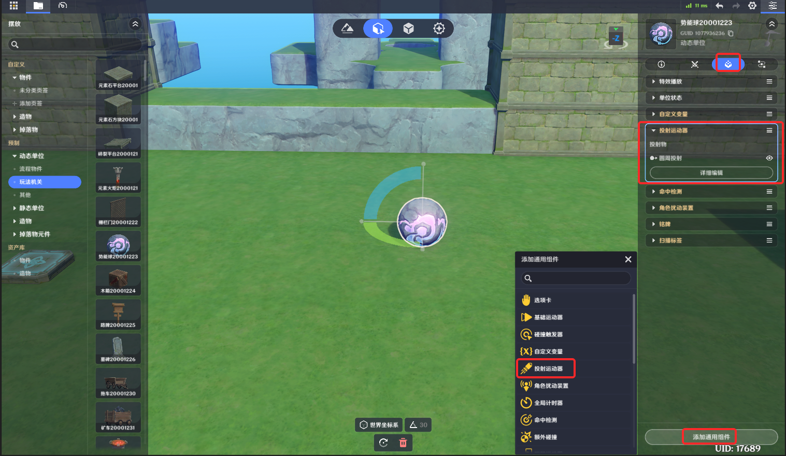
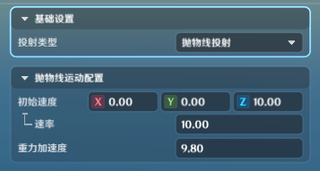
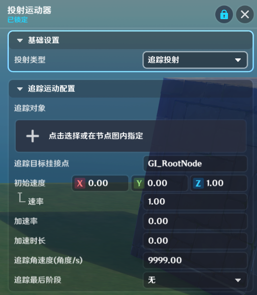

# 一、投射运动器组件的功能

投射运动器组件赋予了实体进行复杂运动的功能

投射运动器组件上同时只能生效一个投射运动器

*投射运动器*的位置在各端可能会有差异，因此被推荐用于做*投射物*，或表现性质的运动

发生断线重连时，投射运动器的位置可能会被重置

# 二、添加投射运动器

(1)在实体/元件编辑界面中，打开组件编辑页签

(2)点击下方的“添加通用组件”，选择并点击“投射运动器”，成功添加

(3)点击“详细编辑”，展开编辑页

# 三、投射运动器类型

投射运动器目前支持四种类型

## 1.直线投射

*初始速度*：组件初始化时的速度方向

*速率*：速度值率*：每秒速率的增加值

*加速时长生效的时长

*贴地运动*：是否紧贴地面进行运动

## 2.抛物线投射

*初始速度*：组件初始化时的速度方向

*速率*：速度值

*重力加速度*：垂直向下朝向，每秒速度的增加值

## 3.追踪投射

*追踪对象*：追踪的目标

*追踪目标挂接点*：追踪目标身上哪个挂接点

*初始速度*：组件初始化时的速度方向

*速率*：速度值

*加速率*：每秒速率的增加值

*加速时长*：加速率生效的时长

*追踪角速度*：投射物会以追踪角速度的速度从发射方向转向追踪目标。当该值较小时，可能因为转向速度过小无法直接命中追踪目标

*追踪最后阶段*：分为无、停止追踪、吸附追踪三种类型

* *无*：没有追踪最后阶段的设置，在追到追踪目标后，会继续尝试追踪该目标，可能会导致投射物在追踪目标附近振荡等表现
* *停止追踪*：在距离追踪目标一定范围内（由*停止追踪范围*配置）时，停止追踪功能，保持该时刻的方向直线运动。这会导致追踪投射物无法直接命中追踪目标。可以用来制作一些允许玩家通过移动躲避的投射物

*停止追踪范围*：用于配置距离追踪目标多少的范围内时，停止追踪

* *：在距离追踪目标一定范围内（由*吸附范围*配置）时，尝试在*吸附时间*内吸附到追踪目标上，之后会始终与追踪目标一起稳定运动，常见的追踪投射物可以使用这个配置

*：距离追踪目标一定范围内时，会开始吸附

*吸附时间*：投射物会经过固定的吸附时间吸附到追踪目标上，并在之后与其一起稳定运动

## 4.圆周投射

*围绕对象*：圆周运动的环绕目标

*追踪目标挂接点*：环绕目标身上哪个挂接点

*是否顺时针旋转*：开启时以顺时针旋转，关闭时以逆时针旋转

*围绕半径*：圆周运动的半径

*角速度*：圆周运动的角速度

# 四、节点图相关

* **创建投射物**

