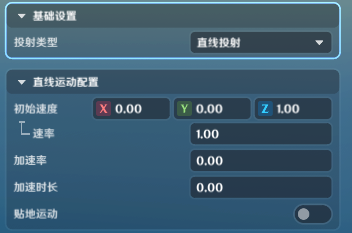
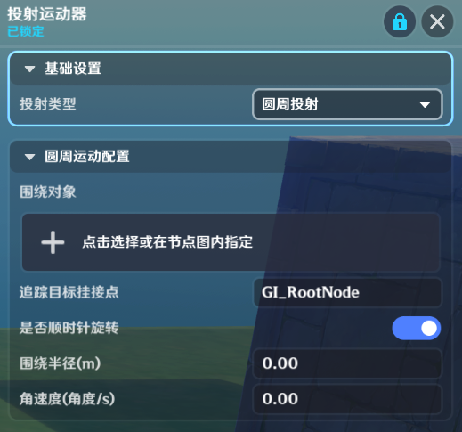

# 投射运动器

**URL**: https://act.mihoyo.com/ys/ugc/tutorial/detail/mhaqt9rgqv4u

**爬取时间**: 2026-01-04 08:12:23

---

## 投射运动器

# 一、投射运动器组件的功能

投射运动器组件赋予了实体进行复杂运动的功能

投射运动器组件上同时只能生效一个投射运动器

投射运动器的位置在各端可能会有差异，因此被推荐用于做*投射物*，或表现性质的运动

发生断线重连时，投射运动器的位置可能会被重置

# 二、添加投射运动器

(1)在实体/元件编辑界面中，打开组件编辑页签

(2)点击下方的“添加通用组件”，选择并点击“投射运动器”，成功添加

(3)点击“详细编辑”，展开编辑页

# 三、投射运动器类型

投射运动器目前支持四种类型

## 1.直线投射

初始速度：组件初始化时的速度方向

速率：速度值

加速率：每秒速率的增加值

加速时长：加速率生效的时长

贴地运动：是否紧贴地面进行运动

## 2.抛物线投射

初始速度：组件初始化时的速度方向

速率：速度值

重力加速度：垂直向下朝向，每秒速度的增加值

## 3.追踪投射

追踪对象：追踪的目标

追踪目标挂接点：追踪目标身上哪个挂接点

初始速度：组件初始化时的速度方向

速率：速度值

加速率：每秒速率的增加值

加速时长：加速率生效的时长

追踪角速度：投射物会以追踪角速度的速度从发射方向转向追踪目标。当该值较小时，可能因为转向速度过小无法直接命中追踪目标

追踪最后阶段：分为无、停止追踪、吸附追踪三种类型

* *无：没有追踪最后阶段的设置，在追到追踪目标后，会继续尝试追踪该目标，可能会导致投射物在追踪目标附近振荡等表现*
* *停止追踪：在距离追踪目标一定范围内（由停止追踪范围配置）时，停止追踪功能，保持该时刻的方向直线运动。这会导致追踪投射物无法直接命中追踪目标。可以用来制作一些允许玩家通过移动躲避的投射物*

停止追踪范围：用于配置距离追踪目标多少的范围内时，停止追踪

* *吸附追踪：在距离追踪目标一定范围内（由吸附范围配置）时，尝试在吸附时间内吸附到追踪目标上，之后会始终与追踪目标一起稳定运动，常见的追踪投射物可以使用这个配置*

吸附范围：距离追踪目标一定范围内时，会开始吸附

吸附时间：投射物会经过固定的吸附时间吸附到追踪目标上，并在之后与其一起稳定运动

## 4.圆周投射

围绕对象：圆周运动的环绕目标

追踪目标挂接点：环绕目标身上哪个挂接点

是否顺时针旋转：开启时以顺时针旋转，关闭时以逆时针旋转

围绕半径：圆周运动的半径

角速度：圆周运动的角速度

# 四、节点图相关

* **创建投射物**

