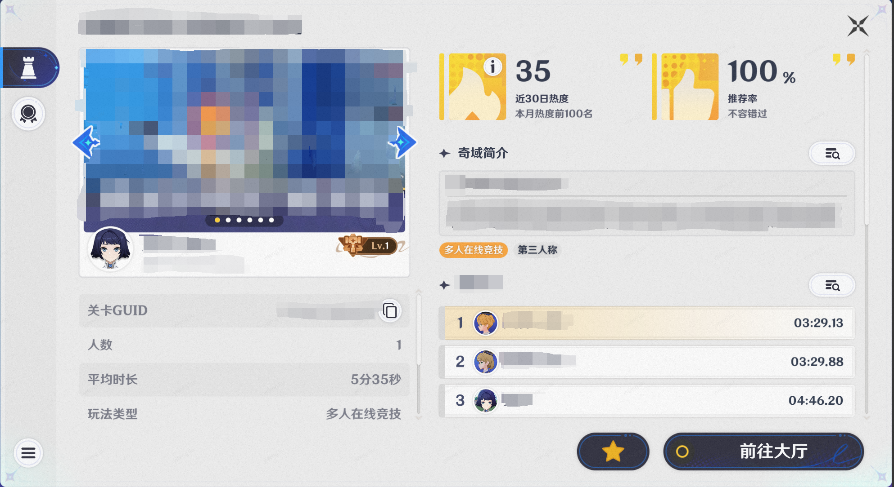

# 一、排行榜的功能

*排行榜*功能支持创作者(奇匠)将对局内的部分信息记录到外围系统，其他玩家在大厅内浏览该关卡的信息时，可以看到持久化记录的排行榜信息，展示信息如下图：

# 二、排行榜的编辑

从系统菜单点击【外围系统管理】，可进入外围系统设置界面

在外围系统设置界面的排行榜页签，即可进行排行榜相关的设置

排行榜功能与*竞技段位*功能仅可选择一项开放，一个关多个排行榜模板，在设置数据时，需要指定相应的排行榜模板序号，点击界面右下角的“新建排行榜”按钮，即可新增一个排行榜模板

*排行榜设置*：排行榜功能整体逻辑的开关和有效性设置

*是否开启排行榜*：排行榜和竞技段位功能选择一个开放

*允许房间内游玩结算排行榜*：当玩家通过房间组队而非匹配来游玩本关卡时，是否允许进行排行榜数据的设置

*排行榜*：每个排行榜的具体设置

*排行榜名称*：可自定义，用于创作者(奇匠)区分不同的排行榜

*序号*：该排行榜的标识方式，用于在节点图内修改排行榜数据时进行标识

*显示优先级*：存在多个排行榜时，优先级越高的排行榜显示越靠前

*显示格式选择*：排行榜分数以数值形式存储在服务器上，但在展示时支持转换成不同的数据样式，目前支持以下几种

*纯数值*：以数值形式显示

*时间*：转换为时长样式显示

*百分比*：转换为百分比样式显示

*榜单重置类型*：榜单的重置规则

*不重置*：榜单一直存在，不会被外部逻辑重置

*随赛季重置*：当新的赛季开始时，之前的旧数据会被重置

*成绩排序规则*：定义了数值以何种形式排列

*越小越靠前*：数值越小的b7-84bd-649fa106e914.png)榜信息越靠前

*越大越靠前*：数值越大的玩家的排行榜信息越靠前

每个排行榜仅记录排名前1000位的玩家信息

# 三、节点图节点设置排行榜信息

设置排行榜分数可以兼容浮点数或整数

* 以浮点数设置玩家排行榜分数

* 以整数设置设置玩家排行榜分数

