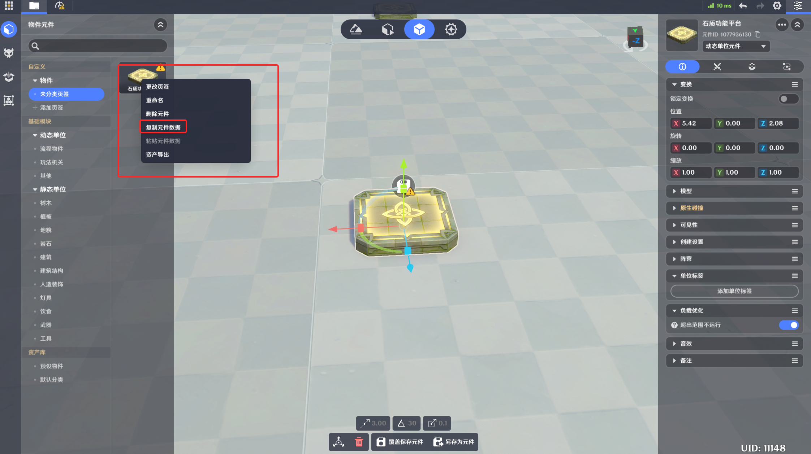

# 数据复制粘贴

**URL**: https://act.mihoyo.com/ys/ugc/tutorial/detail/mh6fj30p2cmo

**爬取时间**: 2026-01-04 08:08:42

---

## 数据复制粘贴

# 一、功能简介

该功能用于复制指定内容的数据，存于独立剪贴板内（仅最大储存一份），后续可用于粘贴并替换目标内容的数据。数据替换后标识码不发生变更，不影响节点图逻辑的引用，仅替换功能数据。

# 二、使用限制

## 1.资产类型

仅用于物件、造物。

## 2.使用对象

元件数据仅可粘贴于元件。

实体数据仅可粘贴于实体。

# 三、元件数据复制粘贴

## 1.入口

* 元件库场景中点击右键菜单

* 资产栏点击右键菜单

* 详情栏点击左键菜单

## 2.功能逻辑

复制元件内数据加入剪贴板，后续可粘贴至同类型其他元件，替换目标及附属实体的数据。

## 3.数据替换

* 除名称、元件ID（标识码）、归属页签外的所有数据。
* 所有附属实体的数据。

## 4.操作流程

* 选择希望复制的元件，点击复制元件数据。
* 选择希望粘贴的元件，点击粘贴元件数据，替换完成。

# 四、实体数据复制粘贴

## 1.入口

* 实体摆放/元件库场景中点击右键菜单

* 详情栏点击左键菜单

## 2.功能逻辑

复制实体内数据加入剪贴板，后续可粘贴至其他同类型实体，替换目标的数据。

## 3.数据替换

除名称、GUID（标识码）、归属页签外的所有数据。

## 4.操作流程

* 选择希望复制的实体，点击复制实体数据。
* 选择希望粘贴的实体，点击粘贴实体数据，替换完成。

