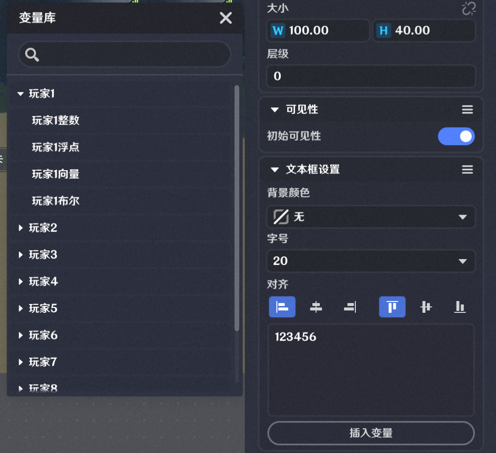

# 文本框界面控件

**URL**: https://act.mihoyo.com/ys/ugc/tutorial/detail/mhnltrr3g966

**爬取时间**: 2026-01-04 08:20:48

---

## 文本框界面控件

# 一、文本框的功能

关卡运行中，显示预先编辑的文本内容

若文本内容中，包含自定义变量，会实时更新显示。

# **二、文本框的编辑**

背景颜色 

支持配置透明、黑色半透明底色

字号 

文本显示的字号大小配置

文本内容* *

编辑文本框内显示的内容，支持编辑基础字符、文字、数字，自定义变量。

通过插入变量，可以选择预定义在关卡实体、玩家实体上的*自定义变量*

插入的自定义变量数据变化后，运行中显示的文本内容会进行更新。

插入引用的自定义变量以富文本的形式填写，格式为：

**{类型:前缀.变量名}**

类型：

引用自定义变量时，为1

前缀：

见下表

|  |  |
| --- | --- |
| **自定义变量目标** | **前缀** |
| 玩家1~8 | p1~8 |
| 关卡实体 | lv |
| 玩家自身实体 | ps |

例如：需要插入引用一个4号玩家上的名为【测试2】的自定义变量，富文本应写为：{1:p4.测试2}

对齐

可根据文本位置与内容选择合适的对齐方式

|  |  |  |
| --- | --- | --- |
| 对齐方式 | 说明 | 示意图 |
|  | 左侧对齐 |  |
|  | 水平居中 |  |
|  | 右侧对齐 |  |
|  | 顶部对齐 |  |
|  | 垂直居中 |  |
|  | 底部对齐 |  |

# 三、文本框在界面布局的调整

将鼠标放在编辑窗口内，正在编辑中的文本框边界，鼠标将会变成箭头符号，支持调整文本框的大小。

调整后，其位置、大小参数会同步进行更新。

