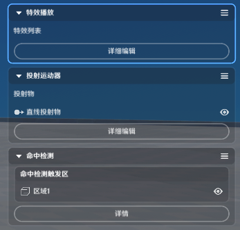

# 一、本地投射物的定义

本地投射物是由本地计算和呈现投射物效果以及命中表现效果的实体

# 二、本地投射物的特点

本地投射物需要在编辑时预先定义，才能被技能节点图引用创建。技能相关可参考[技能](./技能_mho81frl.md)

本地投射物实体运行时，依赖*投射运动器*决定其运行时的规则，依赖*命中检测*决定其碰撞触发的判定规则和效果。

本地投射物实体运行时，遵循“生命周期”的配置

# **三、本地投射物的编**辑

## 1.新建本地投射物

进入战斗预设页签后，可以选择本地投射物页签，按需管理页签，并在页签内新建对应的本地投射物

点击*确认创建*即可新建一个本地投射物

4f93661a9006d69c02dc55_94431287328309.png)

## 2.命名与s/7a5b2314-5a5d-46d2-8e54-617ba669680b.png)bd0-adbf-f39602542e4e.png)

每个预定义的本地投射物*命名*需要全局唯一，并且会自动生成全局唯一的*元件**ID*。

## **3.基础属**性

第一栏为基础属性栏

### (1)基础设置

本地投射物运行时采用的模型配置，可选模型皆来自于预先提供的投射物模型库。

支持调节x，切换模型后，缩放数值会保留

### **(2)战斗参数**

|  |  |
| --- | --- |
| 配置参数 | 说明 |
| *属性设置* | 提供2个枚举项，*继承自创建者*和*独立设置*，不同选项选择后下方对应的参数不同  默认为继承自创建者  继承自创建者：生命值、攻击力、防御力，和创建者相同  独立设置：按需配置生命值、攻击力、防御力  不同选项选择后下方对应的参数不同 |
| *后续是否受创建者影响* |s/78ebfcb8-a4bc-4db6-9529-79c6f536d560.png)303f744c0efc.png)则创建者受到的部分单位状态会同步给投射物  仅有影响生命值、攻击力、防御力的单位状态会同步 |

### **(3)生命周期设**置

|  |  |
| --- | --- |
| 配置参数 | 说明 |
| *永久持续* | 若不开启具体的*持续时长* |
| *持续时长* | 无其他件下，该本地投射物从开始运行到销毁的最长时间 |
| *X/Z轴销毁距离* | 除*能力单元*外，优先级最高的本地投射物运行时销毁判定条件  本地投射物运行时超过最大销毁距离，会自行销毁 |
| *Y轴销毁距离* |

### **(4)生命周期结束时行为设**置

本地投射物生命周期结束时，会依照配置顺序从上到下执行配置的能力单元。

此处引用的能力单元来自于该本地投射物能力单元内的编辑。

## **4.通用组件**

第二栏为通用组件栏

### **(1)特效播放**组件

详情可见[特效播放](./特效播放_mh4ppo02.md)

### **(2)投射运动**器组件

详情可见[投射运动器](./投射运动器_mhaqt9rg.md)

### **(3)命中检**测组件

详情可见[命中检测](./命中检测_mh2pir0h.md)

## 5.能力单元

第三栏为能力单元栏

本地投射物可引用能力单元，需要进行预定义编辑，详情可见[能力单元](./能力单元_mh0ucw9e.md)

通过“详细编辑”可以对能力单元进行调整

在*命中检测组件*中，可引用预定义的能力单元，在命中检测生效后执行