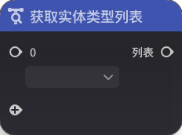
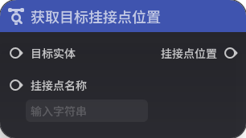
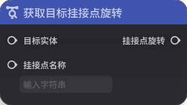
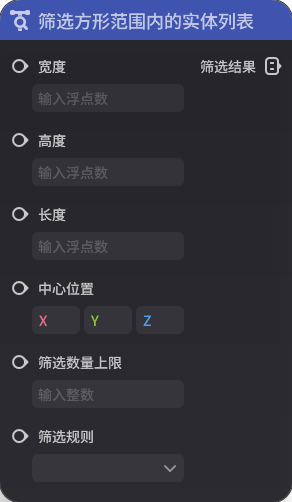
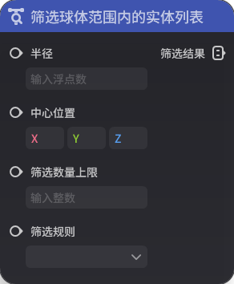
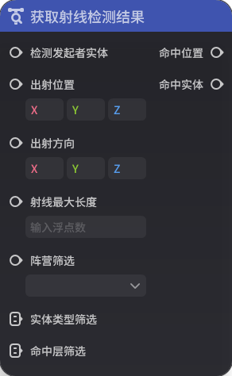

# 一、列表相关

## **1.获取列表对应值**

**节点功能**

返回列表中指定序号对应的值。列表中序号从0开始

**节点参数**

|  |  |  |  |
| --- | --- | --- | --- |
| **参数类型** | **参数名** | **类型** | **说明** |
| 入参 | 序号 | 整数 |  |
| 入参 | 数据列表 | 泛型 |  |
| 出参 | 结果 | 泛型 |  |

## **2.获取列表长度**

**节点功能**

获取列表长度（列表中的元素个数）

**节点参数**

|  |  |  |  |
| --- | --- | --- | --- |
| **参数类型** | **参数名** | **类型** | **说明** |
| 入参 | 输入列表 | 泛型 |  |
| 出参 | 长度 | 整数 |  |

## **3.获取列表最大值**

**节点功能**

仅对浮点数列表和整数列表有意义，返回列表中的最大值

**节点参数**

|  |  |  |  |
| --- | --- | --- | --- |
| **参数类型** | **参数名** | **类型** | **说
| 入参 | 列表 | 泛型 |  |
| 出参 | 最大值 | 泛型 |  |

## **4.获取列表最小值**

**节点功能**

仅对浮点数列表和整数列表有意义，返回列表中的最小值

**节点参数**

|  |  |  |  |
| --- | --- |  --- |
| **参数类型** | **参数名** | **类型** | **说明** |
| 入参 | 列表 | 泛型 |  |
| 出参 | 最小值 | 泛型 |  |

## **5.获取射线筛选类型列表**

**节点功能**

将所需的射拼装为一个列表。可筛选项有受击盒、场景、物件自身碰撞

**节点参数**

|  |  |  |  |
| --- | --- | --- | --- |
| **参数类型** | **参数名** | **类型** | **说明** |
| 出参 | 列表 | |  |

## **6.获取实体类型列表**

**节点功能**

将所需的实体类型拼装为一个列表。类型分为关卡、物件、玩家、角色、造物

**节点参数**

|  |  |  |  |
| --- | --- | --- | --- |
| **参数类型** | **参数名** | **类型**说明** |
| 出参 | 列表 | 枚举列表 |  |

## **7.列表是否包含该值**

**节点功能**

返回列表中是否包含指定值

**节点参数**

|  |  |  |  |
| --- | --- | --- | --- |
| **参数类型** | **参数名** | **类型** | **说明** |
| 入参 | 值 | 泛|
| 入参 | 列表 | 泛型 |  |
| 出参 | 结果 | 布尔值 |  |

# 二、自定义变量

## **1.获取自定义变量**

**节点功能**

获取目标实体的指定自定义变量的值

如果变量不存在，则返回类型的默认值

**节点参数**

|  |  |  |  |
| --- | --- | --- | --- |
| **参数类 **参数名** | **类型** | **说明** |
| 入参 | 目标实体 | 实体 |  |
| 入参 | 变量名 | 字符串 |  |
| 出参 | 变量值 | 泛型 |  |

# 三、预设状态

## **1.获取预设状态**

**节点功能**

获取指定实体的预设状态值。如有指定的预设状态，则返回0

**节点参数**

|  |  |  |  |
| --- | --- | --- | --- |
| **参数类型** | **参数名** | **类型** | **说明** |
| 入参 | 实体 | 实体 |  |
| 入参 | 预设状态索引 |  |
| 出参 | 预设状态值 | 整数 |  |

# 四、实体相关

## **1.查询实体是否在场**

**节点功能**

查询指定实体是否在场

注意角色实体即使处于倒下状态，仍然认为在场

**节点参数**

|  |  |  |  |
| --- | --- | --- | --- |
| **参数类型**参数名** | **类型** | **说明** |
| 入参 | 目标实体 | 实体 |  |
| 出参 | 是否在场 | 布尔值 |  |

## **2.获取单位攻击目标**

**节点功能**

获取单位实体当前正在攻击的目标实体

**节点参数**

|  |  |  |  |
| --- | --- || --- |
| **参数类型** | **参数名** | **类型** | **说明** |
| 入参 | 单位实体 | 实体 |  |
| 出参 | 攻击目标实体 | 实体 |  |

## **3.获取目标挂接点位置**

**节点功能**定目标实体上对应挂接点名称的挂接点位置

**节点参数**

|  |  |  |  |
| --- | --- | --- | --- |
| **参数类型** | **参数名** | **类型** | **说明** |
| 入参 | 目标实体 |  |
| 入参 | 挂接点名称 | 字符串 |  |
| 出参 | 挂接点位置 | 三维向量 |  |

## **4.获取目标挂接点旋转**

**节点功能**

获取指定目标实体上对应挂接点名称的挂接点旋转

**节点参数**

 |  |  |
| --- | --- | --- | --- |
| **参数类型** | **参数名** | **类型** | **说明** |
| 入参 | 目标实体 | 实体 |  |
| 入参 | 挂接点名称 | 字符串 |  |
| 出参 | 挂| 三维向量 |  |

## **5.获取目标实体**

**节点功能**

获取目标实体，根据过滤器节点图被引用的功能模块不同，其指代含义会有区别

**节点参数**

|  |  |  |  |
| ---  | --- | --- |
| **参数类型** | **参数名** | **类型** | **说明** |
| 出参 | 目标实体 | 实体 |  |

## **6.获取实体的类型**

**节点功能**

获取指定实体的类型

**节点参数**

|  |  |  |  |
| --- | --- | --- | --- |
| **参数类型** | **参数名** | **类型** | **说明** |
| 入参 | 目标实体 | 实体 |  |
| 出参 | 实体类型 | 枚举 |  |

## **7.获取实体位置**

**节点功能**
实体的位置

**节点参数**

|  |  |  |  |
| --- | --- | --- | --- |
| **参数类型** | **参数名** | **类型** | **说明** |
| 入参 | 实体 | 实体 |  |
| 出参 | 位置 | 三维向量 |  |

## **8.获取实体旋转**

**节点功能**

获取指定实体以欧拉角表示的旋转

**节点参数**

|  |  |  |  |
| --- | --- | --- | --- |
| **参数| **参数名** | **类型** | **说明** |
| 入参 | 实体 | 实体 |  |
| 出参 | 旋转 | 三维向量 |  |

## **9.获取自身实体**

**节点功能**

返回该节点图所关联的实体

**节点参数**

|  |   |
| --- | --- | --- | --- |
| **参数类型** | **参数名** | **类型** | **说明** |
| 出参 | 自身实体 | 实体 |  |

## **10.筛选方形范围内的实体列表**

***

以特定的规则和数量上限筛选在方形范围内的实体，满足条件的实体会组成实体列表输出

**节点参数**

|  |  |  |  |
| --- | --- | --- | --- |
| **参数类型** | **参数名** | **类型** | **说明** |
| 入参 | 宽度 | 浮点数 |  |
| 入参 | 高度 ||  |
| 入参 | 长度 | 浮点数 |  |
| 入参 | 中心位置 | 三维向量 |  |
| 入参 | 筛选数量上限 | 整数 |  |
| 入参 | 筛选规则 | 枚举 | 分为默认排序、随机排序、从近到远排序出参 | 筛选结果 | 实体列表 |  |

## **11.筛选球体范围内的实体列表**

**节点功能**

以特定的规则和数量上限筛选在球形范围内的实体，满足条件的实体会组成实体列表输出

**节点参数**

|   |  |
| --- | --- | --- | --- |
| **参数类型** | **参数名** | **类型** | **说明** |
| 参 | 半径 | 浮点数 |  |
| 入参 | 中心位置 | 三维向量 |  |
| 入参 | 筛选数量上限 | 整数 | 入参 | 筛选规则 | 枚举 | 分为默认排序、随机排序、从近到远排序 |
| 出参 | 筛选结果 | 实体列表 |  |

## **12.以GUID查询实体**

**节点功能**

根据GUID查询实体

**节点
|  |  |  |  |
| --- | --- | --- | --- |
| **参数类型** | **参数名** | **类型** | **说明** |
| 入参 | GUID | GUID |  |
| 出参 | 实体 | 实体 |  |

# 五、阵营# **1.查询实体阵营**

**节点功能**

查询目标实体的阵营

**节点参数**

|  |  |  |  |
| --- | --- | --- | --- |
| **参数类型** | **参数名** | **类型** | **说明** |
| 目标实体 | 实体 |  |
| 出参 | 阵营 | 阵营 |  |

## **2.查询阵营是否敌对**

**节点功能**

查询阵营1和阵营2是否敌对

**节点参数**

|  |  |  |  |
| --- | --- | --- | --- |
| **参数类型** | ** | **类型** | **说明** |
| 入参 | 阵营1 | 阵营 |  |
| 入参 | 阵营2 | 阵营 |  |
| 出参 | 是否敌对 | 布尔值 |  |

# 六、玩家与角色相关

## **1.查询自身是否已入战**

**节点功能**

查询该节点体是否入战

**节点参数**

|  |  |  |  |
| --- | --- | --- | --- |
| **参数类型** | **参数名** | **类型** | **说明** |
| 出参 | 是否入战 | 布尔值 |  |

## **2.获取当前角色**

能**

获取该玩家客户端当前控制的角色实体

**节点参数**

|  |  |  |  |
| --- | --- | --- | --- |
| **参数类型** | **参数名** | **类型** | **说明** |
| 出参 | 角色实体 | 实体 |  |

## **色归属的玩家实体**

**节点功能**

获取角色实体所归属的玩家实体

**节点参数**

|  |  |  |  |
| --- | --- | --- | --- |
| **参数类型** | **参数名** | **类型** | **说明** | | 角色实体 | 实体 |  |
| 出参 | 所属玩家实体 | 实体 |  |

## **4.获取在场玩家实体列表**

**节点功能**

获取在场所有玩家实体组成的列表

**节点参数**

|  |  |  |  |
| --- | --- || --- |
| **参数类型** | **参数名** | **类型** | **说明** |
| 出参 | 玩家实体列表 | 实体列表 |  |

## **5.获取指定玩家的角色实体**

**节点功能**

获取指定玩家实体的角色实体

**节点参数**

|   |  |
| --- | --- | --- | --- |
| **参数类型** | **参数名** | **类型** | **说明** |
| 入参 | 玩家实体 | 实体 |  |
| 出参 | 角色实体 | 实体 |  |

## **6.以实体查询GUID**

**节点功能**

查询指定实体的GUID

**节点参数**

|  |  | 
| --- | --- | --- | --- |
| **参数类型** | **参数名** | **类型** | **说明** |
| 入参 | 实体 | 实体 |  |
| 出参 | GUID | GUID |  |

## **7.获得玩家客户端输入设备类型**

**节点功能**

获得玩家的客户端输入设备类型，根据用户界面的映射方式决定

**节点参数**

|  |  |  |  |
| --- | --- | --- | --- |
| **参数类型** | **参数名** | **类型** | **说明** |
| 出参 | 输入设备类型 | 枚举 | 分为键盘鼠标、手柄、触屏 |

# 七、单位标签

## **1.获取单位标签的实体列表**

**节点功能**

获取在场所有携带该单位标签的实体列节点参数**

|  |  |  |  |
| --- | --- | --- | --- |
| **参数类型** | **参数名** | **类型** | **说明** |
| 入参 | 单位标签索引 | 整数 |  |
| 出参 | 实体列表 | 实体列表 |  |

## **2.获取实体的单位标签列表**

节点功能**

获取目标实体上携带的所有单位标签组成的列表

**节点参数**

|  |  |  |  |
| --- | --- | --- | --- |
| **参数类型** | **参数名** | **类型** | **说明** |
| 入参 | 目标实体 | 实体 |  |
| 出参 | 列表 | 整数列表

# 八、通用

## **1.获取局部变量**

**节点功能**

获取特定局部变量的变量值

**节点参数**

|  |  |  |  |
| --- | --- | --- | --- |
| **参数类型** | **参数名** | **类型** | * |
| 入参 | 变量名 | 字符串 |  |
| 出参 | 变量值 | 泛型 |  |

# 九、自定义仇恨

## **1.查询指定实体是否入战**

**节点功能**

查询指定实体是否已经入战

**节点参数**

|  |  |  |  |
| --- | --- | --- | --- |
| **参数类型** | **参数名** | **类型** | **说明** |
| 入参 | 目标实体 | 实体 |  |
| 出参 | 是否入战 | 布尔值 |  |

## **2.获取指定实体的仇恨列表**

**节点功能**

获取指定实体的仇恨列表

**节点参数**

|  |  |  |  |
| --- | --- | --- | --- |
| **参数类型** | **参数名** | **类型** | **说明** |
| 入参 | 指定实体 | 实体 |  |
| 出参 | 仇恨列表 | 实体列表 |  |

## **3.获取指定实体的仇恨目标**

**节点功能**

获取指定实体的仇恨目标

**节点参数**

|  |  |  |  |
| --- | --- | --- | --- |
| **参数类型** | **参数名** | **类型** | **说明** |
| 入参 | 指定实体 | 实体 |  |
| 出参 | 仇恨目标 | 实体 |  |

# 十、触发器

## **1.获取碰撞触发器内所有实体**

**节点功能**

获取目标实体上碰撞触发器组件中特定序号对应的碰撞触发器内的所有实体

**节点参数**

|  |  |  |  |
| --- | --- | --- | --- |
| **参数类型** | **参数名** | **类型** | **说明** |
| 入参 | 目标实体 | 实体 |  |
| 入参 | 触发器序号 | 整数 |  |
| 出参 | 实体列表 | 实体列表 |  |

# 十一、射线

## **1.获取射线检测结果**

**节点功能**

获取射线检测结果，会根据射线命中从近到远的顺序返回满足筛选条件的第一个目标或命中位置

**节点参数**

|  |  |  |  |
| --- | --- | --- | --- |
| **参数类型** | **参数名** | **类型** | **说明** |
| 入参 | 检测发起者实体 | 实体 |  |
| 入参 | 出射位置 | 三维向量 |  |
| 入参 | 出射方向 | 三维向量 |  |
| 入参 | 射线最大长度 | 浮点数 |  |
| 入参 | 阵营筛选 | 枚举 |  |
| 入参 | 实体类型筛选 | 枚举 | 分为关卡、物件、玩家、角色、造物 |
| 入参 | 命中层筛选 | 枚举 | 分为受击盒、场景、物件自身碰撞 |
| 出参 | 命中位置 | 三维向量 |  |
| 出参 | 命中实体 | 实体 |  |

# 十二、扫描

## **1.**获取扫描组件可扫描的所有合法对象

**节点功能**

获取扫描组件可扫描的所有合法对象，此处的合法对象指代所有携带扫描组件且过滤器返回为“是”的单位，与单位的可扫描状态无关

**节点参数**

|  |  |  |  |
| --- | --- | --- | --- |
| **参数类型** | **参数名** | **类型** | **说明** |
| 出参 | 对象列表 | 实体列表 |  |

## **2.**获取扫描组件当前扫描到的实体

**节点功能**

获取扫描组件当前扫描到的实体，指扫描状态为“激活状态”的实体

**节点参数**

|  |  |  |  |
| --- | --- | --- | --- |
| **参数类型** | **参数名** | **类型** | **说明** |
| 出参 | 对应实体 | 实体 |  |
| 出参 | 扫描标签配置ID | 配置ID |  |

## **3.**获取实体当前生效的扫描标签

**节点功能**

获取目标实体当前生效的扫描标签

**节点参数**

|  |  |  |  |
| --- | --- | --- | --- |
| **参数类型** | **参数名** | **类型** | **说明** |
| 入参 | 目标实体 | 实体 |  |
| 出参 | 扫描标签配置ID | 配置ID |  |

## **4.获取实体扫描状态**

**节点功能**

获取实体扫描状态

**节点参数**

|  |  |  |  |
| --- | --- | --- | --- |
| **参数类型** | **参数名** | **类型** | **说明** |
| 入参 | 目标实体 | 实体 |  |
| 出参 | 扫描状态 | 枚举 | 分为不可见、当前扫描目标、候选目标、不满足条件 |

##