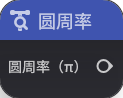
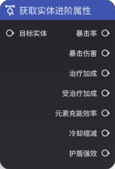
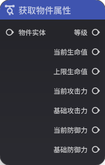
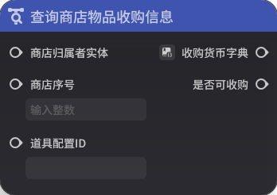
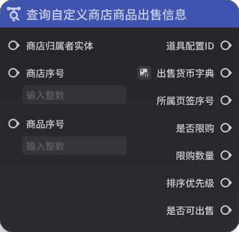
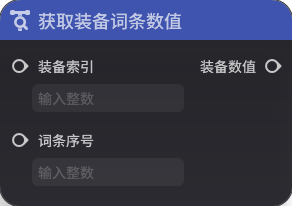
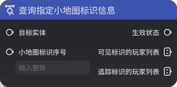
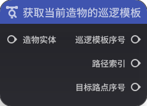

# 一、通用

## **1.查询对局游玩方式及人数**

**节点功能**

查询进入对局的理论人数，即参与匹配或开房间的人数和进入对局的方式

**节点参数**

|  |  |  |  |
| --- | --- | --- | --- |
| **参数类型** | **参数名** | **类型** | **说明** |
| 出参 | 游玩人数 | 整数 |  |
| 出参 | 游玩方式 | 枚举 | 分为试玩、房间游玩、匹配游玩 |

## **2.获取局部变量**

**节点功能**

可以获取局部变量，也可以设置该局部变量的【初始值】

设置【初始值】以后，出参的【值】输出即为输入的【初始值】

当出参【局部变量】与执行节点【设置局部变量】的入参【局部变量】连接后，执行节点【设置局部变量】的入参【值】会覆写该查询节点的出参【值】，再次使用【获取局部变量】节点时，出参【值】为覆写后的值

**节点参数**

|  |  |  |  |
| --- | --- | --- | --- |
| **参数类型** | **参数名** | **类型** | **说明** |
| 入参 | 初始值 | 泛型 | 可以设置局部变量的初始默认值 |
| 出参 | 局部变量 | 局部变量 | 存储数据的载体 |
| 出参 | 值 | 泛型 | 未被覆写时，该值等于初始值，被覆写后，该值等于被覆写后的值 |

# 二、数学

## **1.查询服务器时区**

**节点功能**

可以查询服务器的时区

**节点参数**

|  |  |  |  |
| --- | --- | --- | --- |
| **参数类型** | **参数名** 型** | **说明** |
| 出参 | 时区 | 整数 |  |

## **2.查询时间戳（UTC+0时区）**

**节点功能**

可以查询当前的时间戳

**节点参数**

|  |   |
| --- | --- | --- | --- |
| **参数类型** | **参数名** | **类型** | **说明** |
| 出参 | 时间戳 | 整数 |  |

## **3.获取随机浮点数**

**节点功能**

获取一个大于等于下限，小于等于上限的随机浮点数。注意该节点生成的随机数包含上下限

**节点参数  |  |  |  |
| --- | --- | --- | --- |
| **参数类型** | **参数名** | **类型** | **说明** |
| 入参 | 下限 | 浮点数 |  |
| 入参 | 上限 | 浮点数 |  |
| 出参 | 结果 | 浮点数 |  |

## **4.获取随机整数**

***

获取一个大于等于下限，小于等于上限的随机整数。注意该节点生成的随机数包含上下限

**节点参数**

|  |  |  |  |
| --- | --- | --- | --- |
| **参数类型** | **参数名** | **类型** | **说明** |
| 入参 | 下限 | 整数 |  |
| 入参 | 上限 | 整数 |  |
| 出参 | 结果 | 整数 |  |

## **5.权重随

**节点功能**

输入一组权重组成的权重列表，按照权重随机选择其中的一个序号

例如：权重列表为{10，20，66，4}，那么此节点分别由10%、20%、66%、4%的概率输出0、1、2、3

**节点参数**|  |  |  |
| --- | --- | --- | --- |
| **参数类型** | **参数名** | **类型** | **说明** |
| 入参 | 权重列表 | 整数列表 |  |
| 出参 | 权 整数 |  |

## **6.三维向量：后方**

**节点功能**

返回(0,0,-1)

**节点参数**

|  |  |  |  |
| --- | --- | --- | --- |
| *** | **参数名** | **类型** | **说明** |
| 出参 | (0,0,-1) | 三维向量 |  |

## **7.三维向量：零向量**

**节点功能**

返回(0,0,0)

***

|  |  |  |  |
| --- | --- | --- | --- |
| **参数类型** | **参数名** | **类型** | **说明** |
| 出参 | (0,0,0) | 三维向量 |  |

#.三维向量：前方**

**节点功能**

返回(0,0,1)

**节点参数**

|  |  |  |  |
| --- | --- | --- | --- |
| **参数类型** | **参数名** 型** | **说明** |
| 出参 | (0,0,1) | 三维向量 |  |

## **9.三维向量：上方**

**节点功能**

返回(0,1,0)

**节点参数**

|  |  |  | --- | --- | --- | --- |
| **参数类型** | **参数名** | **类型** | **说明** |
| 出参 | (0,1,0) | 三维向量 |  |

## **10.三维向量：下方**

**节点功能**

返1,0)

**节点参数**

|  |  |  |  |
| --- | --- | --- | --- |
| **参数类型** | **参数名** | **类型** | **说明** |
| 出参 | (0,-1,0) | 三维向量 |  |

## **11.三维向量：右侧**

**节点功能**

返回(1,0,0)

**节点参数**

|  |  |  |  |
| --- | --- | --- | --- |
| **参 | **参数名** | **类型** | **说明** |
| 出参 | (1,0,0) | 三维向量 |  |

## **12.三维向量：左侧**

**节点功能**

返回(-1,0,0)

**节点参数**

|  |  |  |  |
| --- | --- | --- | -| **参数类型** | **参数名** | **类型** | **说明** |
| 出参 | (-1,0,0) | 三维向量 |  |

## **13.圆周率**

**节点功能**

返回圆周率π的近似值，约为3.142

**节点参数**|  |  |  |
| --- | --- | --- | --- |
| **参数类型** | **参数名** | **类型** | **说明** |
| 出参 | 圆周率（π） | 浮点数 |  |

# 三、列表相关

## **1.查找列表并返回值的序号**

节点功能**

从列表中查找指定值，并返回列表中该值出现的序号列表

例如：目标列表为{1,2,3,2,1}，值为1，返回的序号列表为{0，4}，即1出现在目标列表的序号0和4

**节点参数**

|  |  |  |  |
| --- | --- | --- | --- |
|类型** | **参数名** | **类型** | **说明** |
| 入参 | 目标列表 | 泛型 |  |
| 入参 | 值 | 泛型 |  |
| 出参 | 序号列表 | 整数列表 | 未找到则返回空列表 |

## **2.获取列表对应值**

**节点功能**

返回列表中指定序号对应的值，序号
**节点参数**

|  |  |  |  |
| --- | --- | --- | --- |
| **参数类型** | **参数名** | **类型** | **说明** |
| 入参 | 列表 | 泛型 |  |
| 入参 | 序号 | 整数 |  |
| 出参 | 值 | 泛型 |  |

## **3.获取列表长度**

**节点功能**
长度（列表中的元素个数）

**节点参数**

|  |  |  |  |
| --- | --- | --- | --- |
| **参数类型** | **参数名** | **类型** | **说明** |
| 入参 | 列表 | 泛型 |  |
| 出参 | 长度 | 整数 |  |

## **4.大值**

**节点功能**

仅对浮点数列表和整数列表有意义，返回列表中的最大值

**节点参数**

|  |  |  |  |
| --- | --- | --- | --- |
| **参数类型** | **参数名** | **类型** | **说明** |
| 入参 | 列表 | 泛型 |  |
| 出参 | 最大值 | 泛型 |  |

5.获取列表最小值**

**节点功能**

仅对浮点数列表和整数列表有意义，返回列表中的最小值

**节点参数**

|  |  |  |  |
| --- | --- | --- | --- |
| **参数类型** | **参数名** | **类型** | **说明** |
| 入参 | 列表 | 泛型 |  |
| 出参 | 最小值 | 泛型 |  |

## **否包含该值**

**节点功能**

返回列表中是否包含指定值

**节点参数**

|  |  |  |  |
| --- | --- | --- | --- |
| **参数类型** | **参数名** | **类型** | **说明** |
| 入参 | 列表 | 泛型 |  |
| 入参 | 值 | 泛型 |  |
| 是否包含 | 布尔值 |  |

# 四、自定义变量

## **1.查询自定义变量快照**

**节点功能**

从自定义变量组件快照中，查询指定变量名的值

仅可用于【实体销毁时】事件

**节点参数**

|  |  |  |  |
| --- | --- | --- | --- |参数类型** | **参数名** | **类型** | **说明** |
| 入参 | 自定义变量组件快照 | 自定义变量快照 |  |
| 入参 | 变量名 | 字符串 |  |
| 出参 | 变量值 | 泛型 |  |

## **2.获取节点图变量*]()

**节点功能**

获取当前节点图的指定节点图变量的值

如果变量不存在，则返回类型的默认值

**节点参数**

|  |  |  |  |
| --- | --- | --- | --- |
| **参数类型** | **参数名** | **类型** | **说明** |
| 入参 | 变量名 | 字符串 |  |
| 出参  | 泛型 |  |

## **3.获取自定义变量**

**节点功能**

获取目标实体的指定自定义变量的值

如果变量不存在，则返回类型的默认值

**节点参数**

|  |  |  |  |
| --- | --- | --- | --- |
| **参数类型**参数名** | **类型** | **说明** |
| 入参 | 目标实体 | 实体 |  |
| 入参 | 变量名 | 字符串 |  |
| 出参 | 变量值 | 泛型 |  |

# 五、预设状态

## **1.获取预设状态**

**节点功能**

获取目标实体的指定预设状态的预设状态值。如果该实体没有指定的预设状态，则返回0

**节点参数**

|  |  |  |  |
| --- | --- | --- | --- |
| **参数类型** | **参数名** | **类型** | **说明** |
| 入参 | 目标实体 | 实体 |  |
| 入参 | 预设状态索引 | 整数 |  |
| 出参 | 预设状态值 | 整数 |  |

# 六、实体相 **1.查询角色当前移动速度**

**节点功能**

仅当角色拥有【监听移动速率】的单位状态效果时，才能查询

**节点参数**

|  |  |  |  |
| --- | --- | --- | --- |
| **参数类型** | **参数名** | **类型** | **说明** |
| 入参 | 角色实体 | 实体 |  |
| 出参 | 当前速度 | 浮点数 |  |
| 出参 | 速度向量 | 三维向量 |  |

## **2.查询实体是否在场**

**节点功能**

查询指定实

注意角色实体即使处于倒下状态，仍然认为在场

**节点参数**

|  |  |  |  |
| --- | --- | --- | --- |
| **参数类型** | **参数名** | **类型** | **说明** |
| 入参 | 目标实体 | 实体 |  |
| 出参 | 是否布尔值 |  |

## **3.获取场上所有实体**

**节点功能**

获取当前场上所有在场的实体，该实体列表的数量可能会较大

**节点参数**

|  |  |  |  |
| --- | --- | --- | --- |
| **参数类型** | **参数名** | **类型** | **说明** |
| 出体列表 | 实体列表 |  |

## **4.获取场上指定类型实体**

**节点功能**

获取当前场上指定类型的所有实体，该实体列表的数量可能会较大

**节点参数**

|  |  |  |  |
| --- | --- | --- | --- |
| **参数类型** | **参数 **类型** | **说明** |
| 入参 | 实体类型 | 枚举 | 分为关卡、物件、玩家、角色、造物 |
| 出参 | 实体列表 | 实体列表 |  |

## **5.获取场上指定元件ID的实体**

**节点功能**

获取当前场上通过指定元件ID创建的所有实体

**节点参数* |  |  |  |
| --- | --- | --- | --- |
| **参数类型** | **参数名** | **类型** | **说明** |
| 入参 | 元件ID | 元件ID |  |
| 出参 | 实体列表 | 实体列表 |  |

## **6.获取角色属性**

**节点
获取角色实体的基础属性

**节点参数**

|  |  |  |  |
| --- | --- | --- | --- |
| **参数类型** | **参数名** | **类型** | **说明** |
| 入参 | 目标实体 | 实体 |  |
| 出参 | 等级 | 整数 | 出参 | 当前生命值 | 浮点数 |  |
| 出参 | 上限生命值 | 浮点数 |  |
| 出参 | 当前攻击力 | 浮点数 |  |
| 出参 | 基础攻击力 | 浮点数 |  |
| 出参 | 当前防御力 | 浮点数 |  |
| 出参 | 基础防御力 | 浮点数 |  |
| 出参 | 受打断值上限 | 浮点数 |  |
| 出参 | 当前受打断值 | 浮点数 |  |
| 出参 | 当前受打断状态 | 枚举 |  |

## **7.获取实体进阶属性**

**节点功能**

获取实体的进阶属性

**节点参数**

|  |  |  |  |
| --- | --- | --- | --- |
| **参数类型** | **参数名** | **类型** | **说明** |
| 入参 | 目标实体 | 实体 |  |
| 出参 | 暴击率 | 浮点数 |  |
| 出参 | 暴击伤害 | 浮点数 |  |
| 出参 | 治疗加成 | 浮点数 |  |
| 出参 | 受治疗加成 | 浮点数 |  |
| 出参 | 元素充能效率 | 浮点数 |  |
| 出参 | 冷却缩减数 |  |
| 出参 | 护盾强效 | 浮点数 |  |

## **8.获取实体类型**

**节点功能**

获取目标实体的实体类型

**节点参数**

|  |  |  |  |
| --- | --- | --- | --- |
| **参数类型** | **参数名** | **类型** | **说明** |
| 入参 | 目标实体 | 实体 |  |
| 出参 | 实体类型 | 枚举 | 分为玩家、角色、关卡、物件、造物 |

## **9.获取实体位置与旋转**

**节点功能**

获取目标实旋转

对玩家实体和关卡实体无意义

**节点参数**

|  |  |  |  |
| --- | --- | --- | --- |
| **参数类型** | **参数名** | **类型** | **说明** |
| 入参 | 目标实体 | 实体 |  |
| 出参 | 三维向量 |  |
| 出参 | 旋转 | 三维向量 |  |

## **10.获取实体向前向量**

**节点功能**

获取指定实体的向前向量（即该实体本地坐标系下的z轴正方向朝向）

**节点参数**

|  |  |  |  |
| --- | --- | --- | --- |
| **参数类型** | **参数名** | **类型** | **说明** |
| 目标实体 | 实体 |  |
| 出参 | 向前向量 | 三维向量 |  |

## **11.获取实体向上向量**

**节点功能**

获取指定实体的向上向量（即该实体本地坐标系下的y轴正方向朝向）

**节点参数**

|  |  |  |  |
| --- | --- | --- | --- |
| **参数类型** | **参数名** | **类 **说明** |
| 入参 | 目标实体 | 实体 |  |
| 出参 | 向上向量 | 三维向量 |  |

## **12.获取实体向右向量**

**节点功能**

获取指定实体的向右向量（即该实体本地坐标系下的x轴正方向朝向）

**节点参数**

|  |  |  |  |
| --- | --- | --- | --- |
数类型** | **参数名** | **类型** | **说明** |
| 入参 | 目标实体 | 实体 |  |
| 出参 | 向右向量 | 三维向量 |  |

## **13.获取实体拥有的实体列表**

**节点功能**

获取所有以目标实体为拥有者的实体组成的列表

**节点参数**

|  |  |  | --- | --- | --- | --- |
| **参数类型** | **参数名** | **类型** | **说明** |
| 入参 | 目标实体 | 实体 |  |
| 出参 | 实体列表 | 实体列表 |  |**14.获取实体元素属性**

**节点功能**

获取目标实体的元素相关属性

**节点参数**

|  |  |  |  |
| --- | --- | --- | --- |
| **参数类型** | **参数名** | **类型** | * |
| 入参 | 目标实体 | 实体 |  |
| 出参 | 火元素伤害加成 | 浮点数 |  |
| 出参 | 火元素抗性 | 浮点数 |  |
| 出参 | 水元素伤害加成 | 浮点数 |  |
| 出参 | 水元素抗性 | 浮点数 |  |
| 出参 | 草元素伤害加成数 |  |
| 出参 | 草元素抗性 | 浮点数 |  |
| 出参 | 雷元素伤害加成 | 浮点数 |  |
| 出参 | 雷元素抗性 | 浮点数 |  |
| 出参 | 风元素伤害加成 | 浮点数 |  |
| 出参 | 风元素抗性 | 浮点数 |  |
| 出参 | 冰元素伤害加成 | 浮点数 |  |
| 出参 | 冰元素抗点数 |  |
| 出参 | 岩元素伤害加成 | 浮点数 |  |
| 出参 | 岩元素抗性 | 浮点数 |  |
| 出参 | 物理伤害加成 | 浮点数 |  |
| 出参 | 物理抗性 | 浮点数 |  |

## **15.获取物件属性**
)

**节点功能**

获取物件的相关基础属性

**节点参数**

|  |  |  |  |
| --- | --- | --- | --- |
| **参数类型** | **参数名** | **类型** | **说明** |
| 入参 | 物件实体 |  |
| 出参 | 等级 | 整数 |  |
| 出参 | 当前生命值 | 浮点数 |  |
| 出参 | 上限生命值 | 浮点数 |  |
| 出参 | 当前攻击力 | 浮点数 |  |
| 出参 | 基础攻击力 | 浮点数 |  |
| 出参 | 当前防御力 | 浮点数 |  |
| 出参 | 基础防御力 | 浮点数 
## **16.获取拥有者实体**

**节点功能**

获取指定目标实体的拥有者实体

**节点参数**

|  |  |  |  |
| --- | --- | --- | --- |
| **参数类型** | **参数名** | **类型** | **说明* 入参 | 目标实体 | 实体 |  |
| 出参 | 拥有者实体 | 实体 |  |

## **17.获取指定范围的实体列表**

**节点功能**

在目标实体列表中获取指定球形范围内的实体列表

**节点参数**

|  |  |  |  |
| --- | --- | --- | ---**参数类型** | **参数名** | **类型** | **说明** |
| 入参 | 目标实体列表 | 实体列表 |  |
| 入参 | 中心点 | 三维向量 |  |
| 入参 | 半径 | 浮点数 |  |
| 出参 | 结果列表 | 实体列表 |  |

## **18.获取指定类型的实体列表**()

**节点功能**

在目标实体列表中获取指定类型的实体列表

**节点参数**

|  |  |  |  |
| --- | --- | --- | --- |
| **参数类型** | **参数名** | **类型** | **说明** |
| 入参 | 目标实体列表 | 实体列表 |  |
| 入参 | 实体类型 | 分为玩家、角色、关卡、物件、造物 |
| 出参 | 结果列表 | 实体列表 |  |

## **19.获取指定元件ID的实体列表**

**节点功能**

在目标实体列表中获取以指定元件ID创建的实体列表

**节点参数**

|  |  |  | --- | --- | --- | --- |
| **参数类型** | **参数名** | **类型** | **说明** |
| 入参 | 目标实体列表 | 实体列表 |  |
| 入参 | 元件ID | 元件ID |  |
| 出参 | 结果列表 | 实体列|

## **20.获取指定阵营的实体列表**

**节点功能**

在目标实体列表中获取归属于某个阵营的实体列表

**节点参数**

|  |  |  |  |
| --- | --- | --- | --- |
| **参数类型** |名** | **类型** | **说明** |
| 入参 | 目标实体列表 | 实体列表 |  |
| 入参 | 阵营 | 阵营 |  |
| 出参 | 结果列表 | 实体列表 |  |

## **21.获取自身实体**

**节点功能**

返回该节点图体

**节点参数**

|  |  |  |  |
| --- | --- | --- | --- |
| **参数类型** | **参数名** | **类型** | **说明** |
| 出参 | 自身实体 | 实体 |  |

## *实体查询GUID**

**节点功能**

查询指定实体的GUID

**节点参数**

|  |  |  |  |
| --- | --- | --- | --- |
| **参数类型** | **参数名** | **类型** | **说明** |
| 入参 | 实体 | 实体 |  |
| GUID | GUID |  |

## **23.以GUID查询实体**

**节点功能**

根据GUID查询实体

**节点参数**

|  |  |  |  |
| --- | --- | --- | --- |
| **参数类型** | **参数名** | **类型** | **说明** |
| 入参 | GUID | GUID |  |
| 出参 | 实体 |  |

# 七、关卡相关

## **1.查询当前环境时间**

**节点功能**

查询当前的环境时间，范围为[0,24)

**节点参数**

|  |  |  |  |
| --- | --- | --- | --- |
| **参数类型** | **参数名** | **类型** | **说明** |
| 出参 | 当前| 浮点数 | 获取到的值范围为[0,24) |
| 出参 | 当前循环天数 | 整数 | 当前已经循环了多少天 |

## **2.查询游戏已进行时间**

**节点功能**

查询游戏已进行了多长时间，单位秒

**节点参数**

|  |  |  |  |
| --- | ---- | --- |
| **参数类型** | **参数名** | **类型** | **说明** |
| 出参 | 游戏已进行时间 | 整数 |  |

# 八、阵营相关

## **1.查询实体阵营**

**节点功能**

查询指定实体的阵营

**节点参数**

|  |  |  |  |
| --- | --- | --- | --- |
| **参数类型** | **参数名** | **类型** | **说明** |
| 目标实体 | 实体 |  |
| 出参 | 阵营 | 阵营 |  |

## **2.查询阵营是否敌对**

**节点功能**

查询两个阵营是否敌对

**节点参数**

|  |  |  |  |
| --- | --- | --- | --- |
| **参数类型** | **参数名** | **类型** | **说明** |
| 入参 | 阵营1 | 阵营
| 入参 | 阵营2 | 阵营 |  |
| 出参 | 是否敌对 | 布尔值 |  |

# 九、玩家与角色相关

## **1.查询玩家角色是否全部倒下**

**节点功能**

查询玩家的所有角色是否已全部倒下

**节点参数**

|  |  |  |  |
| --- | --- | --- | --- |
| **参数类型** | **参数名** | **类型** | **说明** |
| 入参 | 玩家实体 | 实体 |  |
| 出参 | 结果 | 布尔值 |  |

## **2.根据玩家序号获取玩家GUID**

**节点功能**

根据玩家序号获取玩家GUI号即该玩家为玩家几

**节点参数**

|  |  |  |  |
| --- | --- | --- | --- |
| **参数类型** | **参数名** | **类型** | **说明** |
| 入参 | 玩家序号 | 整数 |  |
| 出参 | 玩家GUID | GUID |  |

#.根据玩家GUID获取玩家序号**

**节点功能**

根据玩家GUID获取玩家序号，玩家序号即该玩家为玩家几

**节点参数**

|  |  |  |  |
| --- | --- | --- | --- |
| **参数类型** | **参数名** | **类型** | **说明| 入参 | 玩家GUID | GUID |  |
| 出参 | 玩家序号 | 整数 |  |

## **4.获得玩家客户端输入设备类型**

**节点功能**

获得玩家的客户端输入设备类型，根据用户界面的映射方式决定

**节点参数**

|  |  |  |  |
| --- | --- | --- | --- |
| **参数类型** | **参| **类型** | **说明** |
| 入参 | 玩家实体 | 实体 |  |
| 出参 | 输入设备类型 | 枚举 | 分为键盘鼠标、手柄、触屏 |

## **5.获取角色归属的玩家实体**

**节点功能**

获取角色实体所归属的玩家实体

**节点参数**

|  |  |  |  |
| --- | --- | --- | --- |
| 型** | **参数名** | **类型** | **说明** |
| 入参 | 角色实体 | 实体 |  |
| 出参 | 所属玩家实体 | 实体 |  |

## **6.获取玩家复苏耗时**

**节点功能**

获取指定玩家实体的复苏耗时，单位秒

**节点参数**

|  |  |  |  |
| --- | --- | ---- |
| **参数类型** | **参数名** | **类型** | **说明** |
| 入参 | 玩家实体 | 实体 |  |
| 出参 | 时长 | 整数 |  |

## **7.获取玩家昵称**

**节点功能**

获取玩家的昵称

**节点参数**

|  |  |  |  |
| --- | --- | --- | --- |
| **参数类型** | ** | **类型** | **说明** |
| 入参 | 玩家实体 | 实体 |  |
| 出参 | 玩家昵称 | 字符串 |  |

## **8.获取玩家剩余复苏次数**

**节点功能**

获取指定玩家实体的剩余复苏次数

**节点参数**

|  |  |  |  |
| --- | --- | --- | --- |
| **参数类型** | **参数名** | **类型** | **说
| 入参 | 玩家实体 | 实体 |  |
| 出参 | 剩余次数 | 整数 |  |

## **9.获取在场玩家实体列表**

**节点功能**

获取在场所有玩家实体组成的列表

**节点参数**

|  |  |  |  |
| --- | --- | ---  |
| **参数类型** | **参数名** | **类型** | **说明** |
| 出参 | 玩家实体列表 | 实体列表 |  |

## **10.获取指定玩家所有角色实体**

**节点功能**

获取指定玩家实体的所有角色实体列表

**节点参数**

|  |  |  |  |
| ---- | --- | --- |
| **参数类型** | **参数名** | **类型** | **说明** |
| 入参 | 玩家实体 | 实体 |  |
| 出参 | 角色实体列表 | 实体列表 |  |

# 十、跟随运动器

## **1.获取的目标**

**节点功能**

获取跟随运动器的目标，可以获取目标实体和实体的GUID

**节点参数**

|  |  |  |  |
| --- | --- | --- | --- |
| **参数类型** | **参数名** | **类型** 明** |
| 入参 | 目标实体 | 实体 |  |
| 出参 | 跟随目标实体 | 实体 |  |
| 出参 | 跟随目标GUID | GUID |  |

# 十一、全局计时器

## **1.获取全局计时器当前时间**

**节点功能**

获取目标实体上指定全局计时器的当前时间

**节点参数**|  |  |  |
| --- | --- | --- | --- |
| **参数类型** | **参数名** | **类型** | **说明** |
| 入参 | 目标实体 | 实体 |  |
| 入参 | 计时器名称 | 字符串 |  |
| 出参 | 当前时间 | 浮点|

# 十二、界面控件组

## **1.获取玩家当前界面布局**

**节点功能**

获取指定玩家实体上当前生效的界面布局的索引

**节点参数**

|  |  |  |  |
| --- | --- | --- | --- |
| **参数类型** | **参数名** | **| **说明** |
| 入参 | 玩家实体 | 实体 |  |
| 出参 | 布局索引 | 整数 |  |

# 十三、造物

## **1.获取造物当前目标**

**节点功能**

根据造物当前行为的不同，目标实体也不尽相同。

例如当造物在攻击敌方时，造物的目标为体。

例如当造物在对友方进行治疗时，造物的目标为友方指定实体。

**节点参数**

|  |  |  |  |
| --- | --- | --- | --- |
| **参数类型** | **参数名** | **类型** | **说明** |
| 入参 | 造物实体 | 运行时的造物实体 |
| 出参 | 目标实体 | 实体 | 造物当前的智能选取目标实体 |

## **2.获取造物的经典模式仇恨列表**

**节点功能**

获取造物的经典仇恨模式的仇恨列表，即仅仇恨配置为【默认类型】时，该节点才会有正确的输出列表

**节点
|  |  |  |  |
| --- | --- | --- | --- |
| **参数类型** | **参数名** | **类型** | **说明** |
| 入参 | 造物实体 | 实体 | 运行时的造物实体 |
| 出参 | 仇恨列表 | 实体列表 | 造物当前对哪些实体有仇恨，该列表是无序的 |

## **3.获取造物属性**

**节点功能**

获取指定造物**节点参数**

|  |  |  |  |
| --- | --- | --- | --- |
| **参数类型** | **参数名** | **类型** | **说明** |
| 入参 | 造物实体 | 实体 |  |
| 出参 | 等级 | 整数 |  |
| 出参 | 当前生命值 | 浮点数 |  |
| 出参 | 上| 浮点数 |  |
| 出参 | 当前攻击力 | 浮点数 |  |
| 出参 | 基础攻击力 | 浮点数 |  |
| 出参 | 受打断值上限 | 浮点数 |  |
| 出参 | 当前受打断值 | 浮点数 |  |
| 出参 | 当前受打断状态 | 枚举 |  |

# 十四、职业

## **1.查询玩家职业的等级**

节点功能**

查询玩家指定职业的等级

**节点参数**

|  |  |  |  |
| --- | --- | --- | --- |
| **参数类型** | **参数名** | **类型** | **说明** |
| 入参 | 玩家实体 | 实体 |  |
| 入参 | D | 配置ID |  |
| 出参 | 等级 | 整数 |  |

## **2.查询玩家职业**

**节点功能**

查询玩家当前的职业，会输出该职业的配置ID

**节点参数**

|  |  |  |  |
| --- | --- | --- | 
| **参数类型** | **参数名** | **类型** | **说明** |
| 入参 | 玩家实体 | 实体 |  |
| 出参 | 职业配置ID | 配置ID |  |

# 十五、技能

## **1.查询角色技能**

**节点功能**

查询角色指能，会输出该技能的配置ID

**节点参数**

|  |  |  |  |
| --- | --- | --- | --- |
| **参数类型** | **参数名** | **类型** | **说明** |
| 入参 | 角色实体 | 实体 |  |
| 入参 | 角色技能槽位 |  |
| 出参 | 技能配置ID | 配置ID |  |

# 十六、单位状态

## **1.查询单位状态的槽位序号列表**

**节点功能**

查询指定目标实体上特定配置ID的单位状态的所有槽位序号列表

**节点参数**

|  |  |  |  |
| --- | --- | ---- |
| **参数类型** | **参数名** | **类型** | **说明** |
| 入参 | 查询目标实体 | 实体 |  |
| 入参 | 单位状态配置ID | 配置ID |  |
| 出参 | 槽位序号列表 | 整数列表 |  |

## **2.查询实体是否具有单位状态**

!
**节点功能**

查询指定实体是否具有特定配置ID的单位状态

**节点参数**

|  |  |  |  |
| --- | --- | --- | --- |
| **参数类型** | **参数名** | **类型** | **说明** |
| 目标实体 | 实体 |  |
| 入参 | 单位状态配置ID | 配置ID |  |
| 出参 | 是否具有 | 布尔值 |  |

## **3.根据槽位序号查询单位状态层数**

**节点功能**

查询目标实体指定槽位上的特定单位状态的层数

**节点参数**

|  |  |  |  |
| ---  | --- | --- |
| **参数类型** | **参数名** | **类型** | **说明** |
| 入参 | 查询目标实体 | 实体 |  |
| 入参 | 单位状态配置ID | 配置ID |  |
| 入参 | 槽位序号 | 整数 |  |
| 出参 | 层数 | 整数 |  |

## **4.根据槽位序号查询单位状*

**节点功能**

查询目标实体指定槽位上的特定单位状态的施加者

**节点参数**

|  |  |  |  |
| --- | --- | --- | --- |
| **参数类型** | **参数名** | **类型** | **说明** |
| 入参 | 查询目标实体 | 实体 |  |
| 入参 | 单位状态配置ID | 配置I|
| 入参 | 槽位序号 | 整数 |  |
| 出参 | 施加者实体 | 实体 |  |

# 十七、单位标签

## **1.获取单位标签的实体列表**

**节点功能**

获取在场所有携带该单位标签的实体列表

**节点参数**

|  |  |  |  |
| --- | --- | --- | --- |
| **参数类型** | **参数名** | **类型** | **说明** |
| 入参 | 单位标签索引 | 整数 |  |
| 出参 | | 实体列表 |  |

## **2.获取实体单位标签列表**

**节点功能**

获取目标实体上携带的所有单位标签组成的列表

**节点参数**

|  |  |  |  |
| --- | --- | --- | --- |
| **参数类型** | **参数名** | **类型** | **说明** |
| 目标实体 | 实体 |  |
| 出参 | 单位标签列表 | 整数列表 |  |

# 十八、自定义仇恨

## **1.查询全局仇恨转移倍率**

**节点功能**

查询全局仇恨转移倍率，在【关卡设置】中可以配置

**节点参数**

|  |  |  |  |
| --- | --- | --- | -| **参数类型** | **参数名** | **类型** | **说明** |
| 出参 | 全局仇恨转移倍率 | 浮点数 |  |

## **2.查询指定实体的仇恨倍率**

**节点功能**

查询指定实体的仇恨倍率

**节点参数**

|  |  |  |  |
| --- | --- | --- | --- |
| **参数类型** | **参数名** | **类型** | **说明** |
| 查询目标 | 实体 |  |
| 出参 | 仇恨倍率 | 浮点数 |  |

## **3.查询指定实体的仇恨值**

**节点功能**

查询目标实体在仇恨拥有者上的仇恨值

**节点参数**

|  |  |  |  |
| --- | --- | --- | --- |
| **参数类型** | **参数名** | **类型** | * |
| 入参 | 查询目标 | 实体 |  |
| 入参 | 仇恨拥有者 | 实体 |  |
| 出参 | 仇恨值 | 整数 |  |

## **4.查询指定实体是否已入战**

**节点功能**

查询指定实体是否已经入战

**节点参数**

|  |  |  |  |
| --- | --- | --- | --- |
| **参数类型** | **参数名** | **类型** | **说明** |
| 入参 | 查询目标 | 实体 |  |
| 出参 | 是否入战 | 布尔值 |  |

## **5.获取目标所在仇恨列表的拥有者列表**

**节点功能**

查询指定目标实体在哪些实体的仇恨列表中

**节点参数**

||  |  |
| --- | --- | --- | --- |
| **参数类型** | **参数名** | **类型** | **说明** |
| 入参 | 查询目标 | 实体 |  |
| 出参 | 仇恨拥有者列表 | 实体列表 |  |

## **6.获取以目标为仇恨目标的拥有者

**节点功能**

查询哪些实体以目标实体为仇恨目标

**节点参数**

|  |  |  |  |
| --- | --- | --- | --- |
| **参数类型** | **参数名** | **类型** | **说明** |
| 入参 | 目标实体 | 实体 |  |
| 出参 | 仇恨拥有者实体列表 |  |

## **7.获取指定实体的仇恨列表**

**节点功能**

获取指定实体的仇恨列表

**节点参数**

|  |  |  |  |
| --- | --- | --- | --- |
| **参数类型** | **参数名** | **类型** | **说明** |
| 入参 | 目标实体 | 实体 |  |
| 出参 | 仇恨列表 | 实体列表 |  |**8.获取指定实体的仇恨目标**

**节点功能**

获取指定实体的仇恨目标

**节点参数**

|  |  |  |  |
| --- | --- | --- | --- |
| **参数类型** | **参数名** | **类型** | **说明** |
| 入参 | 仇恨拥有者 | 实体 |  |
| 出参 | | 实体 |  |

# 十九、全局路径

## **1.获取指定路径点信息**

**节点功能**

查询指定路径的特定路点信息

**节点参数**

|  |  |  |  |
| --- | --- | --- | --- |
| **参数类型** | **参数名** | **类型** | **说明** |
| 路径索引 | 整数 |  |
| 入参 | 路径路点序号 | 整数 |  |
| 出参 | 路点位置 | 三维向量 |  |
| 出参 | 路点朝向 | 三维向量 |  |

# 二十、预设点

## **1.以单位标签获取预设点位列表**

**节点功能**

根据单位标签索引查询所有携带该单位标签的预设点位列为该预设点位的索引

**节点参数**

|  |  |  |  |
| --- | --- | --- | --- |
| **参数类型** | **参数名** | **类型** | **说明** |
| 入参 | 单位标签索引 | 整数 |  |
| 出参 | 点位索引列表 | 整数列表 |  |

## **2.查询旋转**

**节点功能**

查询指定预设点的位置和旋转

**节点参数**

|  |  |  |  |
| --- | --- | --- | --- |
| **参数类型** | **参数名** | **类型** | **说明** | | 点位索引 | 整数 |  |
| 出参 | 位置 | 三维向量 |  |
| 出参 | 旋转 | 三维向量 |  |

# 二十一、关卡结算

## **1.获取玩家结算成功状态**

**节点功能**

获取玩家结算成功状态

**节点参数**

|  |  |  | --- | --- | --- | --- |
| **参数类型** | **参数名** | **类型** | **说明** |
| 入参 | 玩家实体 | 实体 |  |
| 出参 | 结算状态 | 枚举 | 分为未定、胜利、失败 |

## **2.获取玩家结算**排名数值

点功能**

获取指定玩家实体结算的排名数值

**节点参数**

|  |  |  |  |
| --- | --- | --- | --- |
| **参数类型** | **参数名** | **类型** | **说明** |
| 入参 | 玩家实体 | 实体 |  |
| 出参 | 排名数值 | 整|

## **3.获取阵营结算成功状态**

**节点功能**

获取阵营结算成功状态

**节点参数**

|  |  |  |  |
| --- | --- | --- | --- |
| **参数类型** | **参数名** | **类型** | **说明** |
| 入参 | 阵营 | 阵营 |  |
| 出参 | 结算状举 | 分为未定、胜利、失败 |

## **4.获取阵营结算**排名数值

**节点功能**

获取指定阵营结算的排名数值

**节点参数**

|  |  |  |  |
| --- | --- | --- | --- |
| **参数类型** | **参数名** | **类型** | **说明** |
| 入参 | 阵营 |  |
| 出参 | 排名数值 | 整数 |  |

# 二十二、字典

## **1.查询字典是否包含特定键**

**节点功能**

查询指定字典是否包含特定的键

**节点参数**

|  |  |  |  |
| --- | --- | --- | --- |
| **参数| **参数名** | **类型** | **说明** |
| 入参 | 字典 | 泛型 |  |
| 入参 | 键 | 泛型 |  |
| 出参 | 是否包含 | 布尔值 |  |

## **2.查询字典是否包含特定值**

**节点功能**

查询指定字典是否包含特**节点参数**

|  |  |  |  |
| --- | --- | --- | --- |
| **参数类型** | **参数名** | **类型** | **说明** |
| 入参 | 字典 | 泛型 |  |
| 入参 | 值 | 泛型 |  |
| 出参 | 是否包含 | 布尔值 |  |

##查询字典长度**

**节点功能**

查询字典中键值对的数量

**节点参数**

|  |  |  |  |
| --- | --- | --- | --- |
| **参数类型** | **参数名** | **类型** | **说明** |
| 入参 | 字典 | 泛型 |  |
| 出参 | 长度 | 整数 |  |

## **4.以键查询字典值**

点功能**

根据键查询字典中对应的值，如果键不存在，则返回类型默认值

**节点参数**

|  |  |  |  |
| --- | --- | --- | --- |
| **参数类型** | **参数名** | **类型** | **说明** |
| 入参 | 字典 | 泛型 |  |
| 入参 | 键 | 泛型 |  |
| 出参 | 值 | 泛型 |  |

## **5.获取字典中键组成的列表**

**节点功能**

获取字典中所有键组成的列表。由于字典中键值对是无序排列的，所以取出的键列表也不一定按照其插入顺序排列

**节点参数**

|  |   |
| --- | --- | --- | --- |
| **参数类型** | **参数名** | **类型** | **说明** |
| 入参 | 字典 | 泛型 |  |
| 出参 | 键列表 | 泛型 |  |

## **6.获取字典中值组成的列表**

**节点功能**

获取字典中所有值组成的列表。由于字典中键值对是无序排列的，所以取出的值列表也不一定按照其插入顺序排列

**节点参数**

|  |  |  |  |
| --- | --- | --- | --- |
| **参数类型** | **参数名** | **类型** 明** |
| 入参 | 字典 | 泛型 |  |
| 出参 | 值列表 | 泛型 |  |

# 二十三、商店

## **1.查询背包商店商品出售信息**

**节点功能**

查询背包商店种特定商品的出售信息

**节点参数**

|  |  |  |  |
| --- | --- | --- | --- |
| **参数类型** | **参数名** | **类型** | **说明** |
| 入参 | 商店归属者实体 | 实体 |  |
| 入参 | 商店序数 |  |
| 入参 | 道具配置ID | 配置ID |  |
| 出参 | 出售货币字典 | 字典 |  |
| 出参 | 排序优先级 | 整数 |  |
| 出参 | 是否可出售 | 布尔值 |  |

## **2.查询背包商店物品出售列表**

**节点功能**

查询背包商店物品出售列表

**节点参数**

|  |  |  | --- | --- | --- | --- |
| **参数类型** | **参数名** | **类型** | **说明** |
| 入参 | 商店归属者实体 | 实体 |  |
| 入参 | 商店序号 | 整数 |  |
| 出参 | 道具配置ID列表 | 配置ID列表 |  |

## **3.查询商店收购物品

**节点功能**

查询商店收购物品列表

**节点参数**

|  |  |  |  |
| --- | --- | --- | --- |
| **参数类型** | **参数名** | **类型** | **说明** |
| 入参 | 商店归属者实体 | 实体 |  |
| 入参 | 商店序号 |  |
| 出参 | 道具配置ID列表 | 配置ID列表 |  |

## **4.查询商店物品收购信息**

**节点功能**

查询商店特定物品的收购信息

**节点参数**

|  |  |  |  |
| --- | --- | --- | --- |
| **参数类型** | **参数名** | **类型** | **说明** |
| 入参 | 商店归属者实体 | 实体 |  |
| 入店序号 | 整数 |  |
| 入参 | 道具配置ID | 配置ID |  |
| 出参 | 收购货币字典 | 字典 |  |
| 出参 | 是否可收购 | 布尔值 |  |

## **5.查询自定义商店商品出售列表**

**节点功能**

查询自定义商店商品出售列表，出参为商的列表

**节点参数**

|  |  |  |  |
| --- | --- | --- | --- |
| **参数类型** | **参数名** | **类型** | **说明** |
| 入参 | 商店归属者实体 | 实体 |  |
| 入参 | 商店序号 | 整数
| 出参 | 商品序号列表 | 整数列表 |  |

## **6.查询自定义商店商品出售信息**

**节点功能**

查询自定义商店特定商品的出售信息

**节点参数**

|  |  |  |  |
| --- | --- | --- | --- |
| **参数类型** | **参数名**类型** | **说明** |
| 入参 | 商店归属者实体 | 实体 |  |
| 入参 | 商店序号 | 整数 |  |
| 入参 | 商品序号 | 整数 |  |
| 出参 | 道具配置ID | 配置ID |  |
| 出参 | 出售货币字典 | 字典 |  |
| 出参 | 所属页签序号 | 整数 |  |
| 出参 | 是否限购 | 布尔值 |  |
| 出参 | 限购数量 | 整数 |  |
| 出参 | 排序优先级 | 整数 |  |
| 出参 | 是否可出售 | 布尔值 |  |

# 二十四、装备

## **1.查询装备标签列表**

**节点功能**

查询该装备实例的所有标签组成的列表

**节点参数**

|  |  |  |  |
| --- | --- | --- | --- |
| **参数类型** | **参数名** | **类型** | **说明** |
| 入参 | 装备索引 | 整数 |  |
| 出参 | 标签列表 | 配置ID列表 |  |

## **2.根据装备索引查询装备配置ID**

**节点功能**

根据装备索引查询装备配置ID，装备实例的索引可以在【装备初始化】事件中获取到

**节点参数**

|  |  |  |  |
| --- | --- | --- | --- |
| **参数类型** | **参数名** | **类型** | **说明** |
| 入参 | 装备索引 | 整数 |  |
| 出参 | 装备配置ID | 配置ID |  |

## **3.获取装备词条列表**

**节点功能**

获取该装备实例的所有词条组成的列表

装备初始化时，词条的数值会发生随机，所以装备实例上的装备词条也会生成对应的实例，故数据类型为整数而不是配置ID

**节点参数**

|  |  |  |  |
| --- | --- | --- | --- |
| **参数类型** | **参数名** | **类型** | **说明** |
| 入参 | 装备索引 | 整数 |  |
| 出参 | 装备词条列表 | 整数列表 |  |

## **4.获取装备词条配置ID**

**节点功能**

根据装备实例上装备词条的序号获取该词条的配置ID

**节点参数**

|  |  |  |  |
| --- | --- | --- | --- |
| **参数类型** | **参数名** | **类型** | **说明** |
| 入参 | 装备索引 | 整数 |  |
| 入参 | 词条序号 | 整数 |  |
| 出参 | 词条配置ID | 配置ID |  |

## **5.获取装备词条数值**

**节点功能**

获取装备实例上对应序号词条的数值

**节点参数**

|  |  |  |  |
| --- | --- | --- | --- |
| **参数类型** | **参数名** | **类型** | **说明** |
| 入参 | 装备索引 | 整数 |  |
| 入参 | 词条序号 | 整数 |  |
| 出参 | 装备数值 | 浮点数 |  |

# 二十五、道具

## **1.获取背包道具数量**

**节点功能**

获取背包内特定配置ID的道具数量

**节点参数**

|  |  |  |  |
| --- | --- | --- | --- |
| **参数类型** | **参数名** | **类型** | **说明** |
| 入参 | 背包持有者实体 | 实体 |  |
| 入参 | 道具配置ID | 配置ID |  |
| 出参 | 道具数量 | 整数 |  |

## **2.获取背包货币数量**

**节点功能**

获取背包内特定配置ID的货币数量

**节点参数**

|  |  |  |  |
| --- | --- | --- | --- |
| **参数类型** | **参数名** | **类型** | **说明** |
| 入参 | 背包持有者实体 | 实体 |  |
| 入参 | 货币配置ID | 配置ID |  |
| 出参 | 资源数量 | 整数 |  |

## **3.获取背包容量**

**节点功能**

获取背包容量

**节点参数**

|  |  |  |  |
| --- | --- | --- | --- |
| **参数类型** | **参数名** | **类型** | **说明** |
| 入参 | 背包持有者实体 | 实体 |  |
| 出参 | 背包容量 | 整数 |  |

## **4.获取背包所有货币**

**节点功能**

获取背包所有货币，包括货币类型和对应的数量

**节点参数**

|  |  |  |  |
| --- | --- | --- | --- |
| **参数类型** | **参数名** | **类型** | **说明** |
| 入参 | 背包持有者实体 | 实体 |  |
| 出参 | 货币字典 | 字典 |  |

## **5.获取背包所有基础道具**

**节点功能**

获取背包所有基础道具，包括道具类型和对应的数量

**节点参数**

|  |  |  |  |
| --- | --- | --- | --- |
| **参数类型** | **参数名** | **类型** | **说明** |
| 入参 | 背包持有者实体 | 实体 |  |
| 出参 | 基础道具字典 | 字典 |  |

## **6.获取背包所有装备**

**节点功能**

获取背包所有装备，出参为所有装备索引组成的列表

**节点参数**

|  |  |  |  |
| --- | --- | --- | --- |
| **参数类型** | **参数名** | **类型** | **说明** |
| 入参 | 背包持有者实体 | 实体 |  |
| 出参 | 装备索引列表 | 整数列表 |  |

## **7.获取掉落物组件道具数量**

**节点功能**

获取掉落物元件上掉落物组件中特定配置ID的道具数量

**节点参数**

|  |  |  |  |
| --- | --- | --- | --- |
| **参数类型** | **参数名** | **类型** | **说明** |
| 入参 | 掉落物实体 | 实体 |  |
| 入参 | 道具配置ID | 配置ID |  |
| 出参 | 道具数量 | 整数 |  |

## **8.获取掉落物组件货币数量**

**节点功能**

获取掉落物元件上掉落物组件中特定配置ID的货币数量

**节点参数**

|  |  |  |  |
| --- | --- | --- | --- |
| **参数类型** | **参数名** | **类型** | **说明** |
| 入参 | 掉落物实体 | 实体 |  |
| 入参 | 货币配置ID | 配置ID |  |
| 出参 | 货币数量 | 整数 |  |

## **9.获取掉落物组件所有装备**

**节点功能**

获取掉落物元件上掉落物组件中的所有装备

**节点参数**

|  |  |  |  |
| --- | --- | --- | --- |
| **参数类型** | **参数名** | **类型** | **说明** |
| 入参 | 掉落物实体 | 实体 |  |
| 出参 | 装备索引列表 | 整数列表 |  |

## **10.获取掉落物组件所有道具**

**节点功能**

获取掉落物元件上掉落物组件中的所有道具

**节点参数**

|  |  |  |  |
| --- | --- | --- | --- |
| **参数类型** | **参数名** | **类型** | **说明** |
| 入参 | 掉落者实体 | 实体 |  |
| 出参 | 道具字典 | 字典 |  |

## **11.获取掉落物组件所有货币**

**节点功能**

获取掉落物元件上掉落物组件中的所有货币

**节点参数**

|  |  |  |  |
| --- | --- | --- | --- |
| **参数类型** | **参数名** | **类型** | **说明** |
| 入参 | 掉落者实体 | 实体 |  |
| 出参 | 货币字典 | 字典 |  |

# 二十六、碰撞触发器

## **1.获取碰撞触发器内所有实体**

**节点功能**

获取目标实体上碰撞触发器组件中特定序号对应的碰撞触发器内的所有实体

**节点参数**

|  |  |  |  |
| --- | --- | --- | --- |
| **参数类型** | **参数名** | **类型** | **说明** |
| 入参 | 目标实体 | 实体 |  |
| 入参 | 触发器序号 | 整数 |  |
| 出参 | 实体列表 | 实体列表 |  |

# 二十七、小地图标识组件

## **1.查询指定小地图标识信息**

**节点功能**

查询目标实体上小地图标识组件中特定序号对应的小地图标识的信息

**节点参数**

|  |  |  |  |
| --- | --- | --- | --- |
| **参数类型** | **参数名** | **类型** | **说明** |
| 入参 | 目标实体 | 实体 | 运行时的实体 |
| 入参 | 小地图标识序号 | 整数 | 要查询的指定小地图标识的序号 |
| 出参 | 生效状态 | 布尔值 | 查询的小地图标识的生效状态 |
| 出参 | 可见标识的玩家列表 | 实体列表 | 返回可见该标识的玩家列表 |
| 出参 | 追踪标识的玩家列表 | 实体列表 | 返回追踪该标识的玩家列表 |

## **2.获取实体的小地图标识状态**

**节点功能**

查询实体当前小地图标识的配置及生效情况

**节点参数**

|  |  |  |  |
| --- | --- | --- | --- |
| **参数类型** | **参数名** | **类型** | **说明** |
| 入参 | 目标实体 | 实体 | 运行时的实体 |
| 出参 | 全量小地图标识序号列表 | 整数列表 | 该实体的所有小地图标识枚举列表 |
| 出参 | 生效的小地图标识序号列表 | 整数列表 | 该实体的所有生效小地图标识枚举列表 |
| 出参 | 未生效的小地图标识序号列表 | 整数列表 | 该实体的所有未生效小地图标识枚举列表 |

# 二十八、造物巡逻

## **1.获取当前造物的巡逻模板**

**节点功能**

获取指定造物实体的巡逻模板信息

**节点参数**

|  |  |  |  |
| --- | --- | --- | --- |
| **参数类型** | **参数名** | **类型** | **说明** |
| 入参 | 造物实体 | 实体 | 运行时的造物实体 |
| 出参 | 巡逻模板序号 | 整数 | 造物当前生效的巡逻模板序号 |
| 出参 | 路径索引 | 整数 | 造物当前生效的巡逻模板引用的路径索引 |
| 出参 | 目标路点序号 | 整数 | 造物即将前往的路点序号 |

# 二十九、成就

## **1.查询成就是否完成**

**节点功能**

查询目标实体上特定序号对应的成就是否完成

**节点参数**

|  |  |  |  |
| --- | --- | --- | --- |
| **参数类型** | **参数名** | **类型** | **说明** |
| 入参 | 目标实体 | 实体 |  |
| 入参 | 成就序号 | 整数 |  |
| 出参 | 是否完成 | 布尔值 |  |

# 三十、扫描标签

## **1.获取当前生效的扫描标签配置ID**

**节点功能**

获取目标实体上当前生效的扫描标签的配置ID

**节点参数**

|  |  |  |  |
| --- | --- | --- | --- |
| **参数类型** | **参数名** | **类型** | **说明** |
| 入参 | 目标实体 | 实体 |  |
| 出参 | 扫描标签配置ID | 配置ID |  |

# 三十一、段位

## **1.获取玩家段位变化分数**

**节点功能**

获取玩家实体在不同结算状态下段位的变化分数

**节点参数**

|  |  |  |  |
| --- | --- | --- | --- |
| **参数类型** | **参数名** | **类型** | **说明** |
| 入参 | 玩家实体 | 实体 |  |
| 入参 | 结算状态 | 枚举 |  |
| 出参 | 分数 | 整数 |  |

## **2.获取玩家段位信息**

**节点功能**

获取玩家段位相关信息

**节点参数**

|  |  |  |  |
| --- | --- | --- | --- |
| **参数类型** | **参数名** | **类型** | **说明** |
| 入参 | 玩家实体 | 实体 |  |
| 出参 | 玩家段位总分 | 整数 |  |
| 出参 | 玩家连胜次数 | 整数 |  |
| 出参 | 玩家连败次数 | 整数 |  |
| 出参 | 玩家连续逃跑次数 | 整数 |  |

## **3.获取玩家逃跑合法性**

**节点功能**

获取玩家逃跑合法性

**节点参数**

|  |  |  |  |
| --- | --- | --- | --- |
| **参数类型** | **参数名** | **类型** | **说明** |
| 入参 | 玩家实体 | 实体 |  |
| 出参 | 是否合法 | 布尔值 |  |

# 三十二、实体布设组

## **1.查询当前激活的实体布设组列表**

**节点功能**

查询当前关卡激活的实体布设组组成的列表

**节点参数**

|  |  |  |  |
| --- | --- | --- | --- |
| **参数类型** | **参数名** | **类型** | **说明** |
| 出参 | 实体布设组索引列表 | 整数列表 |  |

# 三十二、奇域礼盒相关

## **1.查询对应礼盒数量**

**节点功能**

查询玩家实体上指定礼盒的数量

**节点参数**

|  |  |  |  |
| --- | --- | --- | --- |
| **参数类型** | **参数名** | **类型** | **说明** |
| 出参 | 玩家实体 | 实体 |  |
| 出参 | 礼盒索引 | 整数 |  |
| 入参 | 数量 | 整数 |  |

## **2.查询对应礼盒消耗数量**

**节点功能**

查询玩家实体上指定礼盒的消耗数量

**节点参数**

|  |  |  |  |
| --- | --- | --- | --- |
| **参数类型** | **参数名** | **类型** | **说明** |
| 出参 | 玩家实体 | 实体 |  |
| 出参 | 礼盒索引 | 整数 |  |
| 入参 | 数量 | 整数 |  |

# 

# 

#