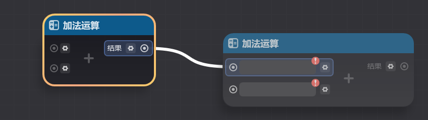
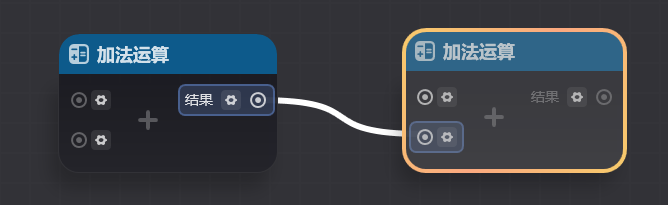

# 一、泛型引脚是什么

在节点图使用的过程中，你应该已经遇到了带有这样泛型选择按钮的节点（参数引脚前的小齿轮）

带有这样操作按钮的引脚我们称为*泛型引脚*，带有泛型引脚的节点我们称为*泛型节点*

泛型引脚代表**该引脚允许连接多种不同类型的数据**。每个泛型参数引脚可连接的参数类型可以通过点击泛型选择按钮查看

以上图【加法运算】节点为例，该节点的两个入参均支持【*整数*】和【*浮点数*】两种输入

需要注意的是，如[基础概念](./基础概念_mhk23ora.md)中所述，虽然节点图中存在泛型节点和泛型引脚，但节点图仍然是*强类型*的。

因此在上传节点图数据时，所有泛型引脚和泛型节点需要进行一次***泛型类型确定***

泛型类型确定指的是**确定节点的各个泛型引脚的数据类型**。当节点的所有引脚均有了确定的类型后，该节点就完成了泛型类型确定，是一个合法可用的节点

节点保持泛型状态进入试玩会导致节点不合法，在运行时不会正常执行。

泛型确定可能会导致之前合法的连线断开（例如将整数类型改为字符串类型，那么原先与整数类型引脚的连线就会断开）

仍然以上图【加法运算】节点为例

加法运算在被添加到节点图上时，默认处于泛型状态。该状态下不是一个运行时合法可用的节点

通过动确定泛型后，将该节点确定为特定类型的加法运算节点后（下图确定为了整数类型的加法运算），该节点才变为一个合法的可用节]()

# 二、泛型引脚的类型确定

有两种方式进行泛型类型确定，分别是手动确定泛型类型和连线确定泛型类型

## **1.手动型**

点击泛型选择按钮（参数引脚前，可以选择该引脚对应的泛型类型

## **2.连线确定泛型类型**

更常用的方式是通过直接连线来确定泛型类型。

将泛型引脚连向另一个参数引脚，只要被连接的引脚类型存在于该节点支持的泛型类型中即可连接

完成连接后，泛型引脚会被确定为与其相连的引脚类型

泛型引脚同样可以连向泛型引脚。此时会使两个引脚都会个默认的参数类型

以下图两个加法运，两者会被确定为整数类型

# 三、泛型引脚的使用要点

## **1.多个泛型引脚的类型联动**

在使用泛程中，你应该发现了一些节点存在超过一个泛型引脚（上述加法运算就是一个例子）

实际上，对于每个泛型节点的各个泛型引脚来说，它们可型是存在联动的

当某个引脚被确定类型时，会缩小其他引脚可用的类型范围。

以【数据类型转换】节点为例。它有两个泛型引脚（分别为输入和输出这两个引脚）

当输入引脚被确定为三维向量类型时（如下图所示）

输出引脚可用的泛型类型会被缩小为仅可选字符串类型（因为对于该节点来说，只存在入参为三维向量，出参为字符串的参数类型组合的可能性）

对于多数节点来说，确定了一个泛型引脚的类型后，会导致其他引脚的类型同时被确定。因此只需要对其中一个引脚进行泛型确定即可确定其他引脚的类型

以加法运算为例。当确定了输入1为整数类型后，输入2和结果引脚都会变为整数类型

## **2.检查事件节点的泛型引脚**

多数情况下，运算、查询和执行节点的入参引脚和出参引脚是存在手填值或连线的，因此少见上传时泛型未被确定的情况

但事件节点有时并不会用到所有的出参。以【自定义变量变化时】节点为例

该节点默认状态下是泛型状态，需要对【变化后值】和【变化前值】参数引脚确定类型后，才能正常生效。

但在一些情况下并不会对【变化后值】和【变化前值】引脚进行连线，这会导致该节点以泛型状态被上传，这可能导致该节点无法被正常触发